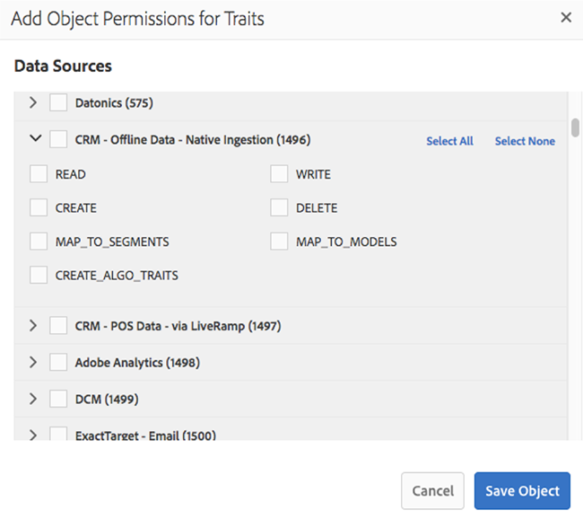

# [!UICONTROL Administration] (RBAC-controles) {#administration}

>[!IMPORTANT]
>
> Gebruikersaccountbeheer gaat over op de [Admin Console](https://helpx.adobe.com/nl/enterprise/using/admin-console.html). Om gebruikersmigratie te starten, moeten alle klanten van de Audience Manager onmiddellijk de noodzakelijke maatregelen nemen die in dit artikel worden beschreven: [Audience Manager gebruiker migratie naar Admin Console](admin-console-migration.md).
> 
> Nadat alle klanten zijn gemigreerd, gaan de gebruikersbeheersecties van dit document weg.

>[!IMPORTANT]
>
> Voordat u [!DNL RBAC], moet deze functie door Adobe zijn ingeschakeld voor uw organisatie. Vraag uw accountteam om [!DNL RBAC] activering of neem contact op met de klantenservice.

De opties onder de [!UICONTROL Administration] kunt u gebruikers van Audience Managers maken en deze aan groepen toewijzen. U kunt ook limieten (kenmerken, segmenten, doelen en modellen) weergeven.

Enterprise-klanten die [!DNL Audience Manager] één platform voor gegevensbeheer nodig hebben voor al hun gegevens, maar de zichtbaarheid van de verschillende gegevenselementen voor specifieke bedrijfseenheden moeten kunnen controleren. U kunt dit verwezenlijken gebruikend groepstoestemmingen, die ook als worden bedoeld [!UICONTROL Role-Based Access Control] ([!UICONTROL RBAC]).

[!DNL Audience Manager] gebruikt groepen om machtigingen toe te wijzen. Machtigingen worden niet op gebruikersniveau toegewezen. Groepmachtigingen zijn gekoppeld aan objecten ([!UICONTROL traits], segmenten, enz.) en op handelingen die u op die objecten kunt uitvoeren (bewerken, weergeven, enz.). Deze besturingselementen zijn ook beschikbaar via de Audience Manager REST API&#39;s. Zie [Gebruikersbeheer](/help/using/api/rest-api-main/aam-api-user-group-permission/aam-api-user.md), [Groepsbeheer](/help/using/api/rest-api-main/aam-api-user-group-permission/aam-api-group.md), en [Machtigingenbeheer](/help/using/api/rest-api-main/aam-api-user-group-permission/aam-api-permissions.md) API-methoden.

## Gebruikers maken {#create-users}

<!-- t_create_users.xml -->

>[!IMPORTANT]
>
> Gebruikersaccountbeheer gaat over op de [Admin Console](https://helpx.adobe.com/nl/enterprise/using/admin-console.html). Om gebruikersmigratie te starten, moeten alle klanten van de Audience Manager onmiddellijk de noodzakelijke maatregelen nemen die in dit artikel worden beschreven: [Audience Manager gebruiker migratie naar Admin Console](admin-console-migration.md).
> 
> Nadat alle klanten zijn gemigreerd, gaat de sectie voor gebruikersbeheer van dit document weg.
> 
>Gebruikers maken in [!DNL Audience Manager] en geef gebruikersgegevens, aanmeldingsstatus en wijs gebruikers toe aan groepen.

1. Klik op **[!UICONTROL Administration]** > **[!UICONTROL Users]**.
1. Klikken  om de [!UICONTROL Create New User] pagina.
1. Onder **[!UICONTROL User Details]**, vult de velden in:
   * **[!UICONTROL Username]:** Geef een unieke gebruikersnaam voor de Audience Manager op.
   * **[!UICONTROL First Name]:** Geef de voornaam van de gebruiker op.
   * **[!UICONTROL Last Name]:** Geef de achternaam van de gebruiker op.
   * **[!UICONTROL Email Address]:** Geef het e-mailadres van de gebruiker op. [!DNL Audience Manager] verzendt geen regelmatig bericht naar gebruikers. [!DNL Audience Manager] beheerders hebben toegang tot de e-mailadressen van gebruikers en kunnen gebruikers indien nodig handmatig e-mailen. Als een gebruiker bijvoorbeeld zijn wachtwoord vergeet, wordt het in dit veld opgegeven e-mailadres gebruikt om een tijdelijk wachtwoord en instructies te verzenden waarmee het wachtwoord opnieuw kan worden ingesteld.
   * **[!UICONTROL Phone Number]:** Geef het telefoonnummer van de gebruiker op.
   * **[!UICONTROL Is Admin]:** Opgeven of deze gebruiker een [!DNL Audience Manager] beheerder. Gebruikers met beheerdersrechten kunnen gebruikers beheren (maken, bewerken, enz.) en groepen (maken, toewijzen van machtigingen enz.). Gebruikers die geen beheerder zijn, kunnen alleen hun eigen gebruikersprofielen beheren, zoals het bewerken van hun e-mailadressen en het opnieuw instellen van hun eigen wachtwoorden. Zie voor meer informatie [Uw accountinstellingen bewerken](../../features/administration/edit-account-settings.md).
1. Onder **[!UICONTROL Login]** selecteert u de gewenste status:
   * **[!UICONTROL Active]:**  Actieve gebruikers hebben toegang tot [!DNL Audience Manager] en beschikken over de machtigingen die door het groepslidmaatschap zijn verleend.
   * **[!UICONTROL Deactivated]:**  Gedgedeactiveerde gebruikers hebben geen toegang tot [!DNL Audience Manager] en hebben geen machtigingen. Als u gebruikers deactiveert, blijven hun gebruikersgegevens in [!DNL Audience Manager] en u kunt ze eenvoudig opnieuw activeren, indien nodig. Als u gebruikers verwijdert, moet u hen opnieuw creëren als zij moeten gebruiken [!DNL Audience Manager] in de toekomst opnieuw.
   * **[!UICONTROL Expired]:** Het wachtwoord van een gebruiker is ouder dan 90 dagen.
   * **[!UICONTROL Pending]:** De gebruiker heeft een tijdelijk wachtwoord, hetzij na het opnieuw instellen van het wachtwoord of als een gloednieuwe account, en zij hebben nog geen permanent wachtwoord ingesteld.
   * **[!UICONTROL Locked Out]:** 5 onjuiste aanmeldpogingen zullen een gebruiker uitsluiten.
1. Onder **[!UICONTROL Assigned Groups]**&#x200B;Selecteer in de vervolgkeuzelijst de gewenste groepen waaraan u deze gebruiker wilt toewijzen.
Voor meer informatie over groepen en toestemmingen, zie [Een groep maken](../../features/administration/administration-overview.md#create-group).
1. Klik op **[!UICONTROL Save]**.

## Een [!UICONTROL Group] {#create-group}

>[!IMPORTANT]
>
> Gebruikersaccountbeheer gaat over op de [Admin Console](https://helpx.adobe.com/nl/enterprise/using/admin-console.html). Om gebruikersmigratie te starten raden we alle klanten van de Audience Manager aan onmiddellijk de noodzakelijke maatregelen te nemen die in dit artikel worden beschreven: [Audience Manager gebruiker migratie naar Admin Console](admin-console-migration.md).
> 
> Nadat alle klanten zijn gemigreerd, gaat deze sectie weg.

A *groep* is een inzameling van gebruikers die toegangsrechten tot delen [!UICONTROL destination], [!UICONTROL segment], en [!UICONTROL trait] objecten. U kunt groepen beperken tot alleen enkele objecten of ze brede toegang geven tot combinaties van verschillende objecten.

<!-- t_create_groups.xml -->

Een groep maken:

1. Klik op **[!UICONTROL Administration]** > **[!UICONTROL Groups]**.
2. Klikken   om de [!UICONTROL Group Settings] pagina.
3. In [!UICONTROL Group Details]:
   * Geef de groep een naam.
   * Geef een korte beschrijving van de groep op.
4. In [!UICONTROL Group Members], klikt u op een gebruiker van **[!UICONTROL Add Users]** opties om deze aan de groep toe te voegen.
5. In [!UICONTROL Group Permissions]selecteert u een [eigenschap](../../features/traits/trait-details-page.md), [segment](../../features/segments/segments-purpose.md), of [doel](../../features/destinations/destinations.md) van **[!UICONTROL Add Object]**.
Hiermee opent u een venster met machtigingen voor het geselecteerde object.
6. Schakel het selectievakje in voor de machtigingen die groepsleden moeten hebben.
7. *(Optioneel)* Toewijzen [Rechten voor jokertekens](../../features/administration/administration-overview.md#wild-card-permissions) aan de groep.
8. Klik op **[!UICONTROL Save Group]**.

## Begrijpen [!UICONTROL Wild Card Permissions] {#wild-card-permissions}

>[!IMPORTANT]
>
> Gebruikersaccountbeheer gaat over op de [Admin Console](https://helpx.adobe.com/nl/enterprise/using/admin-console.html). Om gebruikersmigratie te starten raden we alle klanten van de Audience Manager aan onmiddellijk de noodzakelijke maatregelen te nemen die in dit artikel worden beschreven: [Audience Manager gebruiker migratie naar Admin Console](admin-console-migration.md).
> 
> Nadat alle klanten zijn gemigreerd, gaat deze sectie weg.

Groepsrechtenbeheer vereenvoudigen met [!UICONTROL Wild Card Permissions].

<!-- c_wildcard_permissions.xml -->

[!UICONTROL Wild Card Permissions] groepsleden automatisch toegang geven tot elke gegevensbron die is gekoppeld aan een [!UICONTROL segment], [!UICONTROL destination], of [!UICONTROL trait]. Door vergelijking, laten de regelmatige toestemmingen slechts u specifieke toewijzen [!UICONTROL data sources] op een van deze objecten. En wanneer u nieuwe [!UICONTROL data sources], krijgen groepsleden geen toegang tot deze nieuwe bronnen.

U moet de groepsmachtigingen openen en deze nieuwe machtigingen toewijzen [!UICONTROL data sources] aan de groep. [!UICONTROL Wild Card Permissions] laat u deze handleiding vermijden [!UICONTROL data source] updateproces. Groepen met [!UICONTROL Wild Card Permissions] krijgt toegang tot nieuwe [!UICONTROL data sources] zonder uitdrukkelijke toestemming.

Lees hieronder voor een beschrijving van wat elk [!UICONTROL wildcard permission] betekent:

**[!UICONTROL Trait]**

* `MAP_ALL_TRAITS_TO_MODELS` - Gebruikers kunnen [!UICONTROL traits] als basislijn voor [!UICONTROL models].
* `EDIT_ALL_TRAITS` - Gebruikers kunnen alles bewerken [!UICONTROL traits] op hun bedrijfsrekening worden ingesteld.
* `VIEW_ALL_TRAITS` - Gebruikers kunnen alles weergeven [!UICONTROL traits] op hun bedrijfsrekening worden ingesteld.
* `DELETE_ALL_TRAITS` - Gebruikers kunnen alles verwijderen [!UICONTROL traits] op hun bedrijfsrekening worden ingesteld.
* `CREATE_ALL_ALGO_TRAITS` - Gebruikers kunnen [!UICONTROL algorithmic traits].
* `MAP_ALL_TO_SEGMENTS` - Gebruikers kunnen [!UICONTROL traits] die deel uitmaken van hun onderneming [!UICONTROL segments].
* `CREATE_ALL_TRAITS` - Gebruikers kunnen [!UICONTROL traits].

**[!UICONTROL Models]**

* `VIEW_MODELS` - Gebruikers hebben machtigingen om te bekijken [!UICONTROL models] die deel uitmaken van hun bedrijf.

**[!UICONTROL Derived Signals]**

* `VIEW_DERIVED_SIGNALS` - Gebruikers kunnen alle [!UICONTROL derived signals] die deel uitmaken van hun bedrijf.
* `CREATE_DERIVED_SIGNALS` - Gebruikers kunnen [!UICONTROL derived signals].
* `EDIT_DERIVED_SIGNALS` - Gebruikers kunnen alle [!UICONTROL derived signals] die deel uitmaken van hun bedrijf.
* `DELETE_DERIVED_SIGNALS` - Gebruikers kunnen alle [!UICONTROL derived signals] die deel uitmaken van hun bedrijf.

**[!UICONTROL Destination]**

* `EDIT_ALL_DESTINATIONS` - Gebruikers kunnen alle [!UICONTROL destinations] op hun bedrijfsrekening worden ingesteld.
* `CREATE_DESTINATIONS` - Gebruikers kunnen [!UICONTROL destinations].
* `VIEW_ALL_DESTINATIONS` - Gebruikers kunnen alle [!UICONTROL destinations] op hun bedrijfsrekening worden ingesteld.
* `DELETE_ALL_DESTINATIONS` - Gebruikers kunnen alle [!UICONTROL destinations] op hun bedrijfsrekening worden ingesteld.

**[!UICONTROL Tags]**

* `VIEW_TAGS` - Gebruikers kunnen alles doen (weergeven, maken, bewerken, verwijderen) op hun [!UICONTROL Tag Containers].

**[!UICONTROL Audience Lab]**

* `MANAGE_SEGMENT_TEST_GROUPS` - Gebruikers kunnen alles doen (weergeven, maken, bewerken, verwijderen) op hun [!UICONTROL Audience Lab] testgroepen.

**[!UICONTROL Segment]**

* `CREATE_ALL_SEGMENTS` - Gebruikers kunnen segmenten maken.
* `DELETE_ALL_SEGMENTS` - Gebruikers kunnen alle segmenten verwijderen die in hun bedrijfsaccount zijn ingesteld.
* `MAP_ALL_TO_DESTINATIONS` - De gebruikers kunnen om het even welke segmenten in kaart brengen die tot hun bedrijf behoren aan bestemmingen.
* `EDIT_ALL_SEGMENTS` - Gebruikers kunnen alle segmenten bewerken die in hun bedrijfsaccount zijn ingesteld.
* `MAP_ALL_SEGMENTS_TO_MODELS` - Gebruikers kunnen segmenten selecteren als basislijn voor modellen.
* `VIEW_ALL_SEGMENTS` - Gebruikers kunnen alle segmenten weergeven die in hun bedrijfsaccount zijn ingesteld.

**[!UICONTROL Signals]**

* `VIEW_ALL_SIGNALS` - Gebruikers kunnen alle signalen weergeven die zijn vastgelegd in [Data Explorer](/help/using/features/data-explorer/data-explorer-overview.md).

## Gevallen gebruiken {#use-cases}

### Gebruikerstoegang controleren {#monitoring-user-access}

[!UICONTROL Role-Based Access Control] kan u helpen de status van uw gebruikerslogin controleren, die u een duidelijk beeld van geeft wie tot uw instantie van de Audience Manager kan toegang hebben.

Afhankelijk van uw bedrijfsvereisten, kunt u gebruikersrekeningen toelaten en onbruikbaar maken zoals nodig.

### Zorg voor toegangsbeveiliging voor Gevoelig [!UICONTROL Data Sources] {#protect-sensitive-data-sources}

U kunt configureren [!UICONTROL Role-Based Access Control] om [!UICONTROL trait], segment, en [!UICONTROL destination] niveau, voor elke gebruikersgroep.

Met deze functie kunt u beheren hoe uw gebruikers specifieke gegevenssets weergeven, maken, lezen, schrijven en bewerken en kunt u zelfs voorkomen dat gebruikers toegang krijgen tot gegevenssets die niet voor hen beschikbaar zouden moeten zijn.

