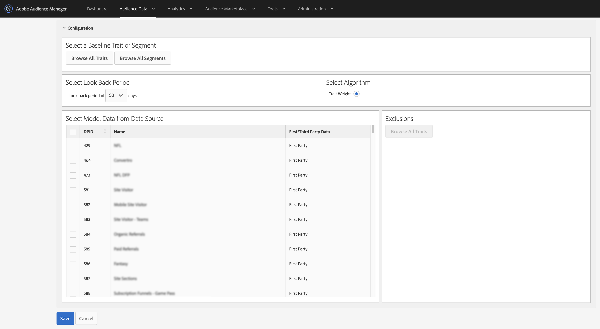

# Een model maken dat lijkt op het uiterlijk {#create-an-algorithmic-model}

Beschrijft de vereiste en facultatieve stappen die u een [!UICONTROL Look-Alike Model]laten tot stand brengen.

## Sectie Modelbouwer

[!UICONTROL Model Builder] bestaat uit de [!UICONTROL Basic Information] en de [!UICONTROL Configuration] secties. Als u een model wilt maken, vult u de vereiste velden in deze twee secties in. Sla het model op om het algoritme te starten. [!DNL Audience Manager] verzendt u een geautomatiseerd bericht nadat de eerste gegevenslooppas voltooit. Nadat u de e-mail hebt ontvangen, kunt u naar [Trait Builder](../../features/traits/about-trait-builder.md) gaan en algoritmische kenmerken maken.

>[!NOTE]
>
>* Het modelleringsproces wordt slechts eenmaal uitgevoerd als u een model maakt en er geen eigenschappen mee bouwt.
>* Bouw modellen van gegevensbronnen die een zinvolle hoeveelheid informatie bevatten. Modellen met onvoldoende gegevens worden uitgevoerd, maar er worden geen resultaten geretourneerd.
>* *Maak geen* modellen met andere algoritmische kenmerken of segmenten.
>* Het geautomatiseerde e-mailbericht wordt slechts één keer verzonden (na de eerste gegevensuitvoering).

## Het model samenstellen

Voer de onderstaande stappen uit om een [!UICONTROL Look-Alike Model]:

1. Ga naar **[!UICONTROL Audience Data]** > **[!UICONTROL Models]** en klik **[!UICONTROL Add New]** in de [!UICONTROL Look-Alike Modeling] sectie.
   
1. In de sectie [Basisinformatie](../../features/algorithmic-models/create-model.md#basic-information)
   * Geef het model een naam.
   * *(Optioneel)* Geef een korte beschrijving van het model.
   * Stel de status voor het model in op **[!UICONTROL Active]** of **[!UICONTROL Inactive]**. Inactieve modellen worden niet uitgevoerd en produceren geen gegevens.
      
1. In de sectie [Configuratie](../../features/algorithmic-models/create-model.md#configuration) :
   * Klik **[!UICONTROL Browse All Traits]** of **[!UICONTROL Browse All Segments]** om een eigenschap of segment te selecteren u tegen wilt modelleren. Zoek naar eigenschappen door naam, identiteitskaart, beschrijving of gegevensbron. Klik tijdens het zoeken op een map om de resultaten te beperken tot die map en de bijbehorende submappen. U kunt ook kenmerken filteren op type ([!UICONTROL Folder Trait], [!UICONTROL Rule-based], [!UICONTROL Onboarded]en [!UICONTROL Algorithmic]) of type populatie ([apparaat-id](../../reference/ids-in-aam.md) en [apparaat-id](../../reference/ids-in-aam.md)).
      
   * Kies een terugblik periode van 30, 60, of 90 dagen. Hiermee stelt u een tijdbereik in voor het model.
   * Het [!UICONTROL TraitWeight] algoritme is standaard geselecteerd.
   * Selecteer een gegevensbron in de [!UICONTROL Available Data] lijst.
   * Klik **[!UICONTROL Save]** wanneer gereed.
      

## Basisinformatie voor algoritmische modellen {#basic-information}

<!-- r_model_basic.xml -->

Met [!UICONTROL Model Builder]de [!UICONTROL Basic Information] instellingen kunt u nieuwe modellen maken of bestaande modellen bewerken. Geef een naam op en ga door naar de [!UICONTROL Configuration] instellingen om een nieuw model te maken. Het beschrijvingsveld is optioneel.

| Veld | Beschrijving |
|---|---|
| **[!UICONTROL Name]** | Geef uw model een korte, logische naam die de functie of het doel ervan beschrijft. Vermijd afkortingen, speciale tekens en accenttekens. |
| **[!UICONTROL Description]** | Een veld voor aanvullende beschrijvende informatie over het model. |
| **[!UICONTROL Status]** | Hiermee activeert of deactiveert u het model (standaard geactiveerd). |

## Configuratie {#configuration}

In [!UICONTROL Model Builder], laat de [!UICONTROL Configuration] sectie u eigenschappen of segmenten aan het model toevoegen. Selecteer in deze sectie een basislijnkenmerk of -segment, een terugkijkperiode en gegevens uit uw eerste en derde gegevensbronnen.

<!-- r_model_configuration.xml -->

### Vereisten

Vul de vereiste velden eerst in de [!UICONTROL Basic Information] sectie in.

<table id="table_7A6BE5E5498D4776A30323B743954150"> 
 <thead> 
  <tr> 
   <th colname="col1" class="entry"> Veld </th> 
   <th colname="col2" class="entry"> Beschrijving </th> 
  </tr> 
 </thead>
 <tbody> 
  <tr> 
   <td colname="col1"> 
<b>Selecteer een basislijntrack of -segment (1)</b> 
 </td> 
   <td colname="col2"> 
Klik op het kenmerk of de segmentknop om een lijst met al uw kenmerken of segmenten weer te geven. Uw geselecteerde segment of kenmerk wordt de basislijn die de systeemalgoritmen gebruiken voor modellering. 
 
 
<b>Opmerking</b>:  Selecteer een merkteken, een op regel gebaseerd kenmerk of een segment als basislijn. Anders worden de modellen niet uitgevoerd. 
 
 </td> 
  </tr> 
  <tr> 
   <td colname="col1"> 
<b>Selecteer terugkijkperiode (2)</b> 
 </td> 
   <td colname="col2"> 
Hiermee stelt u een tijdbereik in voor het model. Gebaseerd op uw selectie, omvat het algoritme en evalueert gegevens van de vorige 30, 60, of 90 dagen. 
 </td> 
  </tr> 
  <tr> 
   <td colname="col1"> 
<b>Algoritme selecteren (3)</b> 
 </td> 
   <td colname="col2"> 
Op dit moment werkt de Modelbouwer alleen met ons eigen algoritme voor  handelsgewicht .  Audience Manager kan andere algoritmische functies toevoegen aan volgende releases. 
 </td>
  </tr>
  <tr> 
   <td colname="col1"> 
<b>Modelgegevens selecteren uit gegevensbron (4)</b> 
 </td> 
   <td colname="col2"> 
Hiermee kunt u de eerste en derde gegevensbronnen selecteren die u in het model wilt gebruiken. 
 </td>
  </tr> 
  <tr> 
   <td colname="col1"> 
<b>Uitsluitingen (5)</b> 
 </td> 
   <td colname="col2"> 
U kunt eigenschappen uitsluiten van de gegevensbronnen die u voor modellering hebt geselecteerd. Gebruik de lijst  Uitsluitingen en lees <a href="../../features/algorithmic-models/trait-exclusion-algo-models.md"> Algorithmic Models: Trait Exclusion</a> voor meer informatie. 
 </td>
  </tr> 
 </tbody>
</table>

Bekijk de onderstaande video om te leren hoe u een model maakt voor de eerste look-alike, zodat u meer van uw eigen bezoekers kunt vinden die er uitzien als uw converters.

>[!VIDEO](https://video.tv.adobe.com/v/23504/)

>[!MORELIKETHIS]
>
>* [TraitWeight begrijpen](../../features/algorithmic-models/understanding-models.md#understanding-traitweight)

