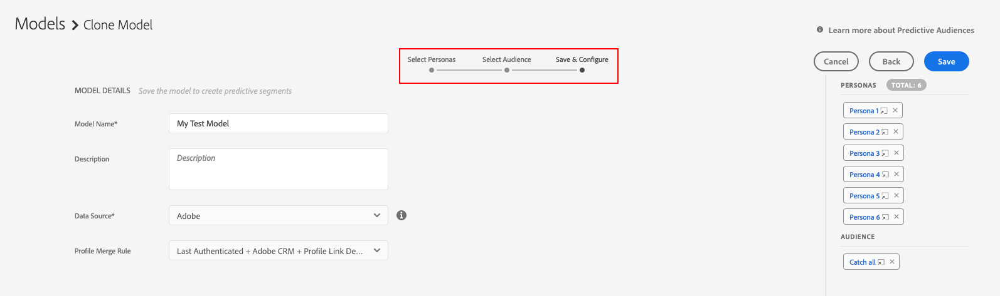

# Aan de slag met voorspellend publiek {#predictive-audiences-getting-started}

>[!IMPORTANT]
>Dit artikel bevat productdocumentatie die u door de opstelling en het gebruik van deze eigenschap moet begeleiden. Niets in dit document is juridisch advies. Raadpleeg uw eigen juridisch adviseur voor juridische begeleiding.

## Een voorspellend model voor soorten publiek maken {#create-predictive-audiences}

Voordat u een [!UICONTROL Predictive Audiences] -model maakt, moet u bepalen aan welke gegevensbron van de eerste partij u de [!UICONTROL Predictive Audiences] -kenmerken en -segmenten wilt toewijzen. U kunt een bestaande bron van eerste-partijgegevens gebruiken, of nieuwe creëren. Zie [ Gegevensbronnen beheren ](https://experienceleague.adobe.com/docs/audience-manager/user-guide/features/data-sources/manage-datasources.html?lang=nl-NL) voor details op hoe te om een nieuwe bron van eerste-partijgegevens tot stand te brengen.

Volg de onderstaande stappen als u weet welke gegevensbron u wilt gebruiken.

1. Ga naar **[!UICONTROL Audience Data]** > **[!UICONTROL Models]** .
1. Klik in de sectie [!UICONTROL Predictive Audiences] op **[!UICONTROL Add New]** .

    toe

1. Definieer vervolgens de personen waarop u de doelgroep wilt classificeren. U kunt dit doen door of eigenschappen of segmenten te kiezen om persona&#39;s van te bouwen. Gebruik de tabbladen [!UICONTROL Traits] en [!UICONTROL Segments] in de linkerbovenhoek van het scherm om te schakelen tussen de catalogus met kenmerken en segmenten. Nadat u de kenmerken of segmenten hebt geïdentificeerd die u als personen wilt gebruiken, klikt u op het bijbehorende pictogram **[!UICONTROL Add]** in de kolom [!UICONTROL Action] .
   
   >[!NOTE]
   >U moet een minimum van of twee eigenschappen of twee segmenten voor uw basislijnpersona&#39;s kiezen. U kunt geen combinatie van zowel kenmerken als segmenten gebruiken.
1. Klik op **[!UICONTROL Next]** nadat u uw persona&#39;s hebt gedefinieerd.
1. Selecteer vervolgens het publiek van de eerste partij dat u wilt classificeren door een eersteklas kenmerk of segment voor dit publiek te kiezen. Gebruik de tabbladen [!UICONTROL Traits] en [!UICONTROL Segments] in de linkerbovenhoek van het scherm om te schakelen tussen de catalogus met kenmerken en segmenten. Selecteer de eigenschap of het segment van de eerste partij die u als uw publiek wilt gebruiken, om het aan het model toe te voegen.
   
1. Klik op **[!UICONTROL Next]** nadat u het publiek hebt gekozen.
1. Vul de modelgegevens in:
   * **[!UICONTROL Model Name]**: voer een beschrijvende naam in voor het model, zodat u het later kunt herkennen. De namen van de segmenten die door het model worden gegenereerd, beginnen met de naam van het model.
   * **[!UICONTROL Description]**: voer een beschrijving in van het model aan de hand waarvan u het gebruikte hoofdlettergebruik kunt herkennen.
   * **[!UICONTROL Data Source]**: selecteer de eerste gegevensbron waaraan u de [!UICONTROL Predictive Audiences] -segmenten van dit model wilt toewijzen.
   * **[!UICONTROL Profile Merge Rule]**: Selecteer de [!UICONTROL Profile Merge Rule] die moet worden toegewezen voor alle voorspellende [!UICONTROL segments] elementen die door dit model worden gemaakt. Als het geselecteerde doelpubliek een [!UICONTROL segment] is, raden we u aan om dezelfde [!UICONTROL Profile Merge Rule] van het doelpubliek te selecteren.
     
1. Klik op **[!UICONTROL Save]**.

## Predictive Audience Models klonen en bewerken {#clone-predictive-audiences}

Audience Manager biedt geen ondersteuning voor het bewerken van bestaande [!UICONTROL Predictive Audiences] -modellen. Als u de configuratie van een model wilt wijzigen, kunt u een kloon van een bestaand model maken en bewerken. Zo kunt u dit doen:

1. Ga naar **[!UICONTROL Audience Data]** > **[!UICONTROL Models]** .
2. Klik op de naam van het [!UICONTROL Predictive Audiences] -model dat u wilt klonen.
3. Klik op de knop **[!UICONTROL Clone]** linksboven in het scherm.
   
4. Nadat u het model hebt gekloond, gaat u naar de pagina [!DNL Save & Configure] van het gekloonde model. In deze pagina, kunt u [!UICONTROL data source] en toegewezen [!UICONTROL Profile Merge Rule] van het model veranderen. Als u de personen en het doelpubliek van het gekloonde model wilt bewerken, gebruikt u de knoppen [!UICONTROL Back] en [!UICONTROL Next] om tussen de drie tabbladen te navigeren of klikt u op de drie tabnamen

   

5. Klik op **[!UICONTROL Save]** als u klaar bent met het bewerken van een model.

## Voorspelend publiek verwijderen {#delete-predictive-audiences}

Als u een [!UICONTROL Predictive Audiences] -model wilt verwijderen, gaat u naar **[!UICONTROL Audience Data]** > **[!UICONTROL Models]** , zoekt u het model dat u wilt verwijderen en klikt u op het pictogram **[!UICONTROL Delete]** .
