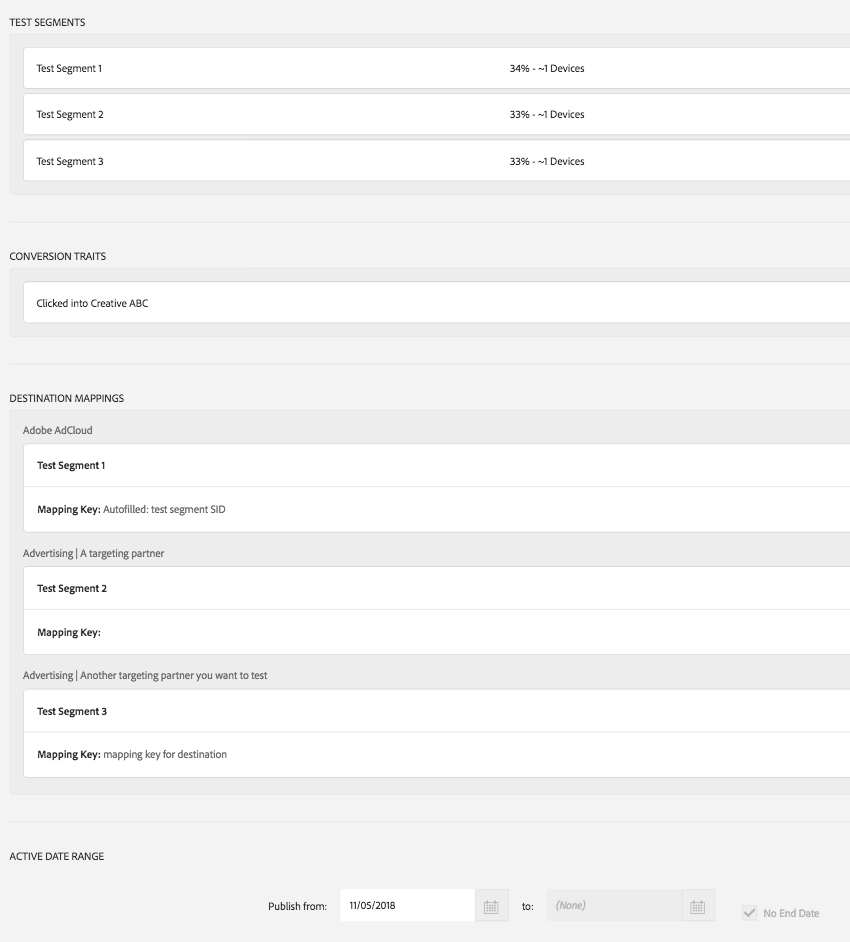

# [!DNL Audience Lab] Geavanceerde functionaliteit {#audience-lab-advanced-functionality}

In dit artikel worden twee functies beschreven die geavanceerde functionaliteit bieden voor [!DNL Audience Lab]: [!DNL Duplicate Allocation Template] en [!DNL Segment Holdout].

## Toewijzingssjabloon dupliceren {#duplicate-allocation-template}

<!-- 

The <b>Allocation Template</b> represents how you split a test group into test segments and the way the test segments are mapped to destinations. 

 -->

In [!DNL Audience Lab], [!DNL Allocation Template] vertegenwoordigt de diverse selecties u wanneer het creëren van een testgroep maakt:

* de verdeling van de voorzieningen tussen de testsegmenten;
* het in kaart brengen van testsegmenten naar bestemmingen;
* De omzettingskenmerken die u voor een testgroep gebruikt;
* De datumwaaier waarin de testgroep aan uw geselecteerde bestemmingen publiceert.

Door een toewijzingsmalplaatje te dupliceren, kunt u de zelfde distributie van testsegmenten en bestemmingen voor een verschillend basissegment, in een nieuwe testgroep opnieuw gebruiken. Een voorbeeld van een toewijzingssjabloon wordt hieronder weergegeven. De afbeelding wordt overgenomen uit de [!UICONTROL Summary & Finalize] stap in de workflow Testgroep **** maken.

<!--
With the option to duplicate allocation templates, you can increase your productivity when running multivariate tests as part of multivariate campaigns.
-->

### Dubbele toewijzingssjabloon gebruiken

Maak een eerste testgroep en selecteer vervolgens **[!UICONTROL Duplicate Allocation Template]** om dezelfde instellingen te gebruiken voor meerdere testgroepen. Bijvoorbeeld, kunt u deze eigenschap gebruiken als u een test in werking stelt waar u de doeltreffendheid van verscheidene bestemmingen voor veelvoudige segmenten wilt bepalen.

1. Zoek in de hoofdweergave van het laboratorium van het publiek naar de testgroep waarvan u de toewijzingssjabloon wilt weergeven in een nieuwe testgroep. In the drop-down box, select **[!UICONTROL Duplicate Allocation Template]**.

   

2. In de [!UICONTROL Create Test Group] tovenaar, kunt u een basissegment specificeren en uw testsegmenten anders noemen, als u wenst.
3. U *kunt het volgende niet* wijzigen:

   * de verdeling van de voorzieningen tussen de testsegmenten;
   * de omzettingskenmerken;
   * De toewijzing van testsegmenten aan bestemmingen. U kunt de toewijzingssleutel alleen invullen voor de doelen die deze vereisen.
   * De datumwaaier waarin uw testgroep aan uw geselecteerde bestemmingen zal publiceren.

4. Controleer de gegevens die u in de vorige stappen hebt toegevoegd en selecteer **[!UICONTROL Finalize Group]**.

## Uitsluiting testsegment {#test-segment-holdout}

>[!NOTE]
>
>[!UICONTROL Test Segment Holdout] is een geavanceerde functionaliteit, geactiveerd op verzoek van de klant. Neem contact op [!DNL Customer Care] of activeer deze functie [!DNL Adobe Consulting] .

Gebruik deze functie om te voorkomen dat een deel van het publiek wordt opgenomen in de test. Het percentage dat u selecteert, blijft buiten de test. Op deze manier kunt u het aantal conversies van doelgroepen (geactiveerd op doelen) en niet-doelgroepen (holdout groep) meten en vergelijken.

<!--

Note that this option is different to the control segment because it subtracts the percentage ................. You can withhold an audience group and still use a control segment. 

-->

### Testsegmentvastlegging gebruiken

1. Maak een nieuwe testgroep met de [!UICONTROL Create Test Group] wizard.
1. In de **[!UICONTROL Allocate Test Segment]** stap kunt u een deel van het publiek selecteren dat u niet wilt testen.

   

1. Gebruik de schuifregelaar om aan te passen hoeveel apparaten u niet wilt testen. Merk op dat testsegment 1 en testsegment 2 nu slechts 70% van de totale apparaten uitmaken.

   

1. Doorloop de overige stappen in de **[!UICONTROL Create Test Group]** workflow en selecteer **[!UICONTROL Finalize Group]** wanneer u tevreden bent met de selectie. U hebt nu een testgroep waarvan een deel van het publiek niet meer kan testen.
