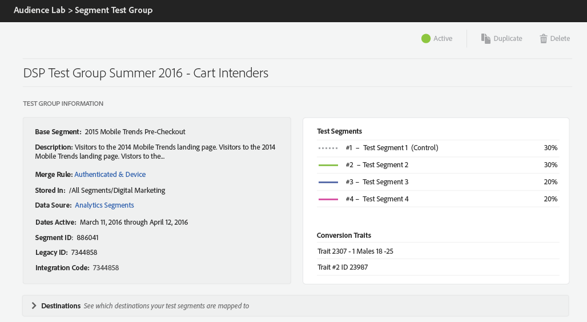

# Testgroepgegevens {#test-group-information}

Deze sectie bevat algemene informatie over de testgroep en de testsegmenten waarin deze is verdeeld, de geselecteerde omzettingskenmerken en toegewezen bestemmingen. De sectie verstrekt ook controles voor het dupliceren of het schrappen van de testgroep.

U kunt ook informatie zien over het basislijnsegment dat u voor de testgroep hebt gebruikt en hoe de testsegmenten zijn verdeeld.

**[!UICONTROL Test Segments]** worden willekeurig bevolkt met gebruikers van het basislijnsegment u voor de testgroep gebruikte. Het overzicht toont de percentages gebruikers u aan elk testsegment toewees.

De **[!UICONTROL Conversion Traits]** drijft de rapportering voor de testgroepen. Om een eigenschap als omzetting aan te wijzen, wanneer het creëren van of het uitgeven van eigenschappen in [!UICONTROL Trait Builder], selecteer **Omzetting** als **[Type van Gebeurtenis](../../features/traits/create-onboarded-rule-based-traits.md).**

De **[!UICONTROL Destinations]**-kaart kan worden samengevouwen. Druk de pijlen om individuele bestemmingen te openen of te sluiten en de volgende informatie voor testsegmenten te verkrijgen, die door de bestemmingen worden gegroepeerd deze in kaart worden gebracht:

* het aantal hulpmiddelen van de totale bevolking van het basissegment dat aan elke bestemming wordt toegewezen.
* kaartsleutel;
* toewijzingswaarde;
* [!DNL URL] en veilig  [!DNL URL] voor  [!DNL URL] bestemmingen.

>[!NOTE]
>
>Vergeet niet dat u de testgroepen niet kunt bewerken nadat u ze hebt voltooid. U kunt ze alleen pauzeren, verwijderen of dupliceren.

