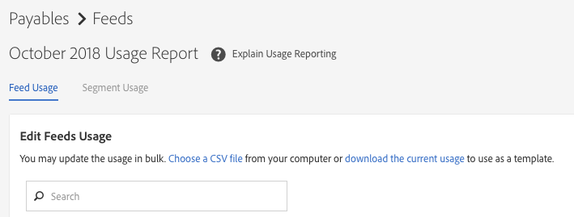
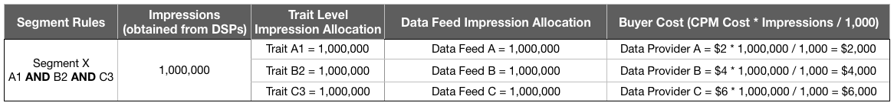

# Facturering voor datafeedkopers {#billing-for-data-feed-buyers}

Kopers van gegevens van Audience Marketplace komen overeen alle advertenties te melden die zijn gediend met gebruik van de kenmerken in de gegevensinvoer die is geprijsd op basis van een kostprijs per duizend en indrukkingen ([!DNL CPM]). [!DNL CPM] het gebruik is verschuldigd op de vijfde dag van elke kalendermaand en omvat gegevens voor de vorige maand. Abonnees met vaste kosten hoeven het gebruik niet te melden.

 

## CPM-gebruik {#report-cpm-usage} rapporteren

<!-- t_marketplace_report_cpm_usage.xml -->

[!UICONTROL Audience Marketplace] kopers van gegevens komen overeen alle aangebrachte en gepreste indrukken te melden aan de hand van de kenmerken in de gegevenstoevoer tegen een prijs per duizend en op basis van indrukken ( [!DNL CPM] ) . [!DNL CPM] het gebruik is verschuldigd op de 5 dagen van elke kalendermaand en omvat gegevens voor de vorige maand. Abonnees met vaste kosten hoeven het gebruik niet te melden.

[!UICONTROL Audience Marketplace] biedt twee manieren om  [!DNL CPM] gebruik te melden:

* **Rapportage** op segmentniveau: Dit is de aanbevolen methode voor  [!DNL CPM] gebruiksrapportage. Wanneer u [!DNL CPM] gebruik op segmentniveau rapporteert, wordt de gegevens input-vlakke rapporteringssectie automatisch ingevuld met de overeenkomstige gebruiksbedragen, die op de algoritmen worden gebaseerd die in [Kostentoerekening voor de Diefsen van Gegevens CPM worden beschreven ](#cost-attribution).
* **Rapportage** op het niveau van gegevenstoevoer: deze methode vereist u om het  [!DNL CPM] gebruik voor elke gegevensvoer individueel te melden, die op de algoritmen wordt gebaseerd die in de Attributie van de  [Kosten voor de Dichtheid](#cost-attribution) van CPM- Gegevens worden beschreven. Deze methode is echter lastiger en vatbaarder voor fouten dan rapportage op segmentniveau.

  

## CPM-gebruik rapporteren op segmentniveau {#segment-level-report}

Het [!UICONTROL Segment Usage] lusje staat u toe om segment-vlakke gebruik te melden, terwijl het tonen van de segmenten die door de bestemmingen worden gegroepeerd zij aan in kaart worden gebracht.

Na het melden van [!DNL CPM] gebruik op segmentniveau, [!UICONTROL Audience Marketplace] wijst automatisch de overeenkomstige gegevensvoer het correcte gebruik toe, dat op [Kostenattributie voor de Diefsen van Gegevens CPM](#cost-attribution) wordt gebaseerd.

[!DNL CPM] gebruik op segmentniveau rapporteren:

1. Ga naar **[!UICONTROL Audience Marketplace > Payables]**.
1. Selecteer het tabblad **[!UICONTROL Segment Usage]**.
1. Vul het gebruik voor uw segmenten in. U kunt de [!UICONTROL Search] doos gebruiken om de segmenten te filtreren als u slechts gebruik voor sommige van hen moet melden.
1. Klik op **[!UICONTROL Edit Segments Usage]**.
1. Voer de [!DNL CPM] gebruikshoeveelheid in de [!UICONTROL Usage] kolom in.
1. Klik **[!UICONTROL Save]** wanneer u wordt gedaan en herzie de bevestigingsdialoog.

   

1. Klik op **[!UICONTROL Confirm]**.

Zie ook onze videodemonstratie van hoe u segment-vlakke gebruik kunt melden:

>[!VIDEO](https://video.tv.adobe.com/v/25522/)

 

## CPM-gebruik op gegevensdoorvoerniveau rapporteren {#feed-level-report}

Rapportage op het niveau van gegevenstoevoer is lastiger en vatbaarder voor fouten, omdat u het [!DNL CPM]-gebruik voor elke gegevensfeed afzonderlijk moet berekenen. Wij adviseren dat u [CPM Gebruik op het Niveau van het Segment ](#segment-level-report) in plaats daarvan meldt.

[!DNL CPM] gebruik op segmentniveau rapporteren:

1. Ga naar **[!UICONTROL Audience Marketplace > Payables]**.
2. Selecteer het tabblad **[!UICONTROL Feed Usage]**.
3. Gebruik de doos [!UICONTROL Search] om de gegevensvoer te filtreren en degenen te identificeren die u gebruik voor moet melden.
4. Klik op **[!UICONTROL Edit Feeds Usage]**.
5. Bereken het [!DNL CPM] gebruik voor elke gegevensvoer die op [KostenAttributie voor de Dichtheid van Gegevens CPM ](#cost-attribution) wordt gebaseerd, en ga het in [!UICONTROL Usage] kolom in.
6. Klik **[!UICONTROL Save]** wanneer u wordt gedaan en herzie de bevestigingsdialoog.

   

7. Klik op **[!UICONTROL Confirm]**.

  

## Bulkrapportage

Als u fouten en overhead tijdens de rapportage van [!DNL CPM]-gebruik wilt verminderen, kunt u de optie voor bulkrapportage gebruiken om een [!DNL CSV]-bestand met de gegevensfeeds en -segmenten te downloaden, het gebruik in te vullen en het bestand weer te uploaden naar [!DNL Audience Manager]. U kunt bulkrapportering gebruiken om zowel voer als segmentgebruik te melden.

Het gebruik van [!DNL CPM] bulksgewijs bijwerken:

1. Ga naar **[!UICONTROL Audience Marketplace > Payables]**.
1. Selecteer het tabblad **[!UICONTROL Feed Usage]** of **[!UICONTROL Segment Usage]**, afhankelijk van het type rapportage dat u wilt bijwerken.
1. Klik op **[!UICONTROL Edit Feeds Usage]** of **[!UICONTROL Edit Segments Usage]**.
1. Klik **[!UICONTROL download the current usage]** om ervoor te zorgen u een geldig Csv- dossier gebruikt.
1. Open het bestand op uw computer en vul het gebruiksrapport in.
1. Klik **[!UICONTROL Choose a CSV file]** om het bijgewerkte gebruiksrapport te uploaden.

   

1. [!DNL Audience Manager] valideert het bestand zodra u het uploadt en vraagt u of het fouten in het bestand detecteert.

  

### Fouten bij validatie van bulkrapportage

| Foutbericht | Beschrijving | Repareren |
| ------------- | -------------| -----|
| Ongeldige invoer | [!DNL Audience Manager] heeft een wijziging in het  [!DNL CSV] bestandsschema gedetecteerd, zoals ontbrekende kolommen of wijzigingen in kolomtitels. | Wijzig de tabelstructuur niet. |
| Niet gevonden | Voor [!UICONTROL Segment Level Reporting] kon [!DNL Audience Manager] niet de combinatie [!UICONTROL Segment ID] en [!UICONTROL Destination ID] identificeren. Voor [!UICONTROL Feed Level Reporting] kon [!DNL Audience Manager] niet de combinatie [!UICONTROL Data Provider Name], [!UICONTROL Feed Name], en [!UICONTROL Use Case] identificeren. | Controleer voor [!UICONTROL Segment Level Reporting] de geldigheid van de combinatie [!UICONTROL Segment ID] en [!UICONTROL Destination ID]. Controleer voor [!UICONTROL Feed Level Reporting] de geldigheid van de combinatie [!UICONTROL Data Provider Name], [!UICONTROL Feed Name] en [!UICONTROL Use Case]. |
| Dubbele records gevonden | [!DNL Audience Manager] dubbele records met verschillende afbeeldingswaarden gedetecteerd. | Herzie het rapport en zorg ervoor u niet verschillende gebruikswaarden voor het zelfde gegeven of segment meldt. |
| Waarden niet ondersteund | [!DNL Audience Manager] gedetecteerde niet-numerieke waarden in de  [!DNL Audience Manager] kolom. | Controleer het rapport en zorg ervoor u numerieke waarden in [!DNL Audience Manager] kolom slechts ingaat. |
| Kopteksten voor verplichte velden ontbreken | [!DNL Audience Manager] ontbrekende tabelkoppen voor verplichte velden gevonden. Voor [!UICONTROL Segment Level Reporting] zijn de verplichte velden: [!UICONTROL Segment ID], [!UICONTROL Destination ID]. Voor [!UICONTROL Feed Level Reporting] zijn de verplichte velden: [!UICONTROL Data Provider Name], [!UICONTROL Data Feed Name], [!UICONTROL Use Case] | Controleer het rapport en zorg ervoor dat er niet met de tabelkoppen is geknoeid. |

>[!NOTE]
>Het verwijderen van rijen uit het [!DNL CSV] gebruiksrapport heeft geen effect op het bestaande gebruiksrapport. [!DNL Audience Manager] alleen de velden verwerkt die in het rapport zijn opgenomen.

  

## [!DNL CPM] Beste praktijken melden

<table id="table_E68FA2130D1C495FAB8982DFB6A31FD9"> 
 <thead> 
  <tr> 
   <th colname="col1" class="entry"> Recommendations </th> 
   <th colname="col2" class="entry"> Beschrijving </th> 
  </tr>
 </thead>
 <tbody> 
  <tr> 
   <td colname="col1"> 
<b>Het totale aantal afdrukken altijd rapporteren</b> 
 </td> 
   <td colname="col2"> 
Voor CPM-schoktotalen: 

   
 Rapporteer het totale aantal indrukken, zonder decimalen te gebruiken. De Audience Manager berekent automatisch CPM dat op het totale aantal wordt gebaseerd u rapporteert.

Als u 1.234.567 beelden moet melden, rapporteer het precies zo. U te hoeven niet om het totale aantal beelden door 1.000 te verdelen om CPM te berekenen.

De reizen die worden gebruikt om uw Web of toepassingsinhoud (de Optimalisering van de Inhoud) te optimaliseren gebruikend hulpmiddelen zoals Adobe Target of een bestemming van de Analyse bijdragen niet tot de totalen van het Gebruik voor CPM plannen. Gegevensleveranciers worden doorgaans gecompenseerd voor de optimalisatie van inhoud met behulp van platte vergoedingsplannen.

Zie <a href="#cost-attribution">Kostentoerekening voor CPM Gegevensvoer</a> voor meer informatie. 
 </td>
  </tr>
  <tr> 
   <td colname="col1"> 
<b>Aankruisen aan het maandelijkse rapporteringsinterval</b> 
 </td> 
   <td colname="col2"> 
Het rapportsysteem wordt na de 5e van elke maand gesloten. Als u er niet in slaagt om CPM gebruik tegen dan te melden, moet u dat bedrag aan het rapport voor de volgende maand toevoegen. Stel bijvoorbeeld dat u in oktober 1000 afbeeldingen gebruikt, de rapportdeadline van oktober mist en in november 1000 afbeeldingen gebruikt. In dit geval rapporteert u het totaal voor oktober en november (2000) in december, tussen de eerste en de vijfde.

<b>Tip</b>: U zou altijd moeten proberen om CPM gebruik voor de vorige maand tussen de 1e en 5e dagen van de volgende maand te melden.

U kunt CPM gebruik zo laat zoals de 5e van de nieuwe kalendermaand melden, maar dit wordt niet geadviseerd. Het melden van CPM gebruik vóór de 5e van elke maand geeft de Audience Manager tijd om de gegevens te controleren en te verwerken.
 </td>
  </tr> 
 </tbody> 
</table>

  

## Kostentoerekeningswaarde voor CPM-gegevensfeeds {#cost-attribution}

In [!UICONTROL Audience Marketplace] moet u zelf-rapportbedragen elke maand, voor elk van uw segmenten. Wij adviseren rapporterend [!DNL CPM] gebruik op segmentniveau, zodat de kostentoerekening automatisch wordt gedaan.

<!-- marketplace_cpm_billing.xml -->

### Factureringsoverzicht {#billing-summary}

U moet [!DNL CPM] gegevens indienen voer tussen de 1e en 5e dagen van elke kalendermaand. Om dit correct te doen, adviseren wij dat u [Gebruik CPM op het Niveau van het Segment ](#segment-level-report) rapporteert.

>[!TIP]
>Wanneer u [!DNL CPM] gebruik op segmentniveau rapporteert, wordt de rapportsectie op het niveau van het gegevensvoer automatisch ingevuld met de overeenkomstige gebruiksbedragen.

Als u [!UICONTROL Report CPM Usage at Data Feed Level] nodig hebt, moet u alle indrukken individueel compileren die voor elk voer in de vorige kalendermaand worden geleverd, en hen melden volgens de factureringstoewijzing die in dit artikel wordt beschreven.

Nadat u [!DNL CPM] aantal voor de vorige kalendermaand meldt, [!DNL Adobe] zal het volgende doen:

* Maak een factuur en factureer u op basis van de [!DNL CPM]-snelheid voor elke geabonneerde gegevensfeed.
* Betaal verschuldigde kosten voor gegevensleveranciers (verkopers) op basis van uw gerapporteerde gebruik van [!DNL CPM].

>[!IMPORTANT]
>
>Als koper moeten alle gerapporteerde totalen van de indruk waar en nauwkeurig zijn. Als u op de vijfde dag van elke maand geen schattingstotalen rapporteert, moet u totalen voor de niet-aangegeven maand in de volgende maand opnemen.

  

## Afbeeldingen toewijzen op voederniveau op basis van de regels voor de kwalificatie van het spoor {#assign-impressions}

Met het [!UICONTROL Activation]-gebruiksgeval kunt u kenmerken gebruiken in de corresponderende gegevensfeed om segmenten te maken in [Segment Builder](../../../features/segments/segment-builder.md) en die segmenten toe te wijzen aan een doel. Met de Booleaanse operatoren [!UICONTROL AND], [!UICONTROL OR] en [!UICONTROL NOT] kunt u de voorwaarden voor kenmerk en segmentkwalificatie instellen.

Wanneer u [CPM Gebruik op het Niveau van de Invoer van Gegevens ](#feed-level-report) rapporteert, moet u beelden proportioneel voor elke gegevensvoer toewijzen, volgens [!DNL Boolean] exploitanten die in de regels van de de vakkwalificatie worden gebruikt. In de volgende tabel wordt aangegeven hoe u afbeeldingen op de juiste wijze kunt toewijzen door de Booleaanse regel of het type kenmerk.

>[!TIP]
>[Het Gebruik van CPM van het rapport op het Niveau van het Segment](#segment-level-report) om het niveau van de gegevensvoer te hebben rapportering automatisch door Audience Manager wordt gedaan.

<table id="table_BF00FE6740D2459DAFA62F2478492586"> 
 <thead> 
  <tr> 
   <th colname="col1" class="entry"> Regelkwalificatielogica of -type </th> 
   <th colname="col2" class="entry"> Factureringsverdeling </th> 
  </tr> 
 </thead>
 <tbody> 
  <tr> 
   <td colname="col1"> 
 AND 
 </td> 
   <td colname="col2"> 
Pas 100% van de geleverde beeldtotalen op alle leverancierstkenmerken in een op regels gebaseerd segment toe dat een Booleaanse voorwaarde  EN gebruikt. 
 </td> 
  </tr> 
  <tr> 
   <td colname="col1"> 
 OF 
 </td> 
   <td colname="col2"> 
Pas een gewogen toewijzing van de geleverde beeldtotalen toe op alle leverancierstkenmerken in een op regels gebaseerd segment dat een Booleaanse OF-voorwaarde gebruikt. Gewogen toerekening wordt berekend aan de hand van de volgende formule:

<code>(Trait Population / Segment Population) * Number of Impressions * Cost of CPM</code>
 </td> 
  </tr>
  <tr> 
   <td colname="col1"> 
 NOT 
 </td> 
   <td colname="col2"> 
Pas 100% van de geleverde impressietotalen toe op alle providereigenschappen in een op regels gebaseerd segment dat een Booleaanse voorwaarde  NOT gebruikt. 
 </td> 
  </tr> 
  <tr> 
   <td colname="col1"> 
Algoritmische segmenten 
 </td> 
   <td colname="col2"> 
Pas 100% van de geleverde impressietotalen toe op alle providerfeeds in een segment met algoritmische eigenschappen. 
 </td> 
  </tr>
 </tbody>
</table>

  

## Factureringsvoorbeelden {#billing-examples}

In de onderstaande voorbeelden wordt geïllustreerd hoe [!DNL CPM] de gebruikstoewijzing op datafeed-niveau wordt uitgevoerd.

>[!IMPORTANT]
>Wij adviseren dat u [CPM-verbruik op Segmentniveau](#segment-level-report) in plaats daarvan rapporteren, om dit proces automatisch te laten uitvoeren.

Laten we het volgende scenario overwegen:

  

### Zaak 1: Segmenten met en kwalificatieregels

Dit segment bevat 3 eigenschappen van afzonderlijke dataproviders. Aangezien de segmentkwalificatie is gebaseerd op een [!UICONTROL AND] voorwaarde, moeten bezoekers de eigenschappen van alle drie feeds realiseren om in aanmerking te komen voor het segment.

Met een [!UICONTROL AND] voorwaarde, moet u 100% van de impressies toewijzen die tijdens de maand aan alle drie gegevensleveranciers worden ontvangen. In de sectie [!UICONTROL Audience Marketplace > Payables] krijgt elke provider 1000.000 impressies.

Dit voorbeeld is van toepassing op segmenten die [!DNL Boolean] [!UICONTROL NOT] operatoren gebruiken of voor segmenten die algoritmische eigenschappen bevatten.

  

### Zaak 2: Segmenten met OF kwalificatieregels

Dit segment bevat 3 eigenschappen van afzonderlijke dataproviders. Aangezien de segmentkwalificatie is gebaseerd op een [!UICONTROL OR] voorwaarde, moeten bezoekers minstens één van de drie eigenschappen realiseren om in aanmerking te komen voor het segment.

We kunnen niet zien welke eigenschap verantwoordelijk is voor een impressie, omdat de kwalificatie gebaseerd is op een [!UICONTROL OR] voorwaarde. Als gevolg hiervan crediteert u in de sectie [!UICONTROL Audience Marketplace > Payables] elke provider een gewogen toewijzing van de totale impressies, op basis van de populatie van eigenschappen.

  

### Zaak 3: Segmenten met gebruiksscenario’s voor modellering en activering

In dit voorbeeld wordt attributie beschreven op basis van twee gebruiksscenario&#39;s voor datafeed: Modellering en Activering. In het voorbeeld kijken we naar twee dataproviders, met de volgende informatie:

In de onderstaande tabel bevat segment X twee eigenschappen, T1 en T2, met de segmentregel T1 OF T2, waarbij:

* T1 is een eigenschap van gegevensfeed A;
* T2 is een algoritmische eigenschap gemodelleerd naar eigenschappen van derden van Data Feed A en Data Feed B.

Het segment wordt in kaart gebracht aan een bestemming en 1.000.000 impressies zijn ingegaan voor dit segment in een maand, gebruikend [Segment-Vlakke Rapportering](#segment-level-report).

Van deze 1.000.000 impressies:

* T1 vertegenwoordigt 40% van de segmentpopulatie, wat overeenkomt met 400.000 impressies voor Feed A.
* T2 is goed voor 60% van de segmentpopulatie, wat overeenkomt met 600.000 impressies voor Feed A en Feed B.

Op datafeed-niveau wordt de manier waarop de impressies worden toegewezen bepaald door:

* Gegevensfeed A ontvangt 600.000 impressies van eigenschap T2 (gemodelleerd op eigenschappen van Data Feed A en Data Feed B, beide ontvangen de impressies) en 400.000 impressies van eigenschap T1 (een eigenschap van Data Feed A), in totaal 1.000.000 pressies.
* Gegevensfeed B ontvangt 600.000 impressies van eigenschap T2 (zie toelichting hierboven) en 0 impressies van eigenschap T1.

De uitsplitsing naar gegevenstoevoer en gebruikscase is als volgt:

>[!NOTE]
>
>Voor het modelleringsgebruiksgeval, zou u slechts CPM gebruik na activering moeten melden. Als u alleen een model uitvoert, maar niet activeert, is er geen gebruiksrapportage vereist.

  

## Facturering en impressie-toewijzing voor Platte feeds Data {#billing-flat-fee}

Bij een vaste vergoeding voor de gegevensinvoer wordt elke maand een vast bedrag in rekening gebracht, ongeacht wanneer het abonnement wordt gestart of hoeveel impressies u gebruikt. Tarieven worden niet pro rata berekend voor maandgebruik of intervallen. Net als bij CPM-facturering zal Adobe een factuur genereren en u factureren tegen het maandelijkse, forfaitaire tarief voor uw geabonneerde datafeeds.

Stel dat je bepaalde eigenschappen in een voer hebt ingeschakeld midden in de maand. U krijgt nog steeds het volledige maandelijkse tarief, ongeacht wanneer u het abonnement of geactiveerde specifieke eigenschappen hebt gestart.
