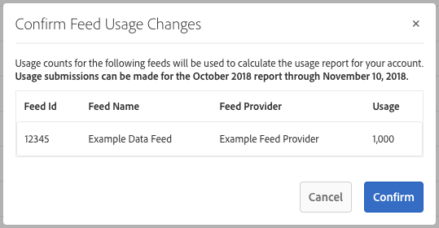

# Facturering voor kopers van gegevensfeed {#billing-for-data-feed-buyers}

Kopers van Audience Marketplace-gegevens komen overeen alle advertenties te melden die zijn gediend met gebruik van kenmerken in de gegevenstoevoer die is geprijsd op basis van kosten per duizend en indrukkingen ([!DNL CPM]). Het gebruik van [!DNL CPM] is verschuldigd op de vijfde dag van elke kalendermaand en bevat gegevens voor de vorige maand. Abonnees met vaste kosten hoeven het gebruik niet te melden.

 

## CPM-gebruik rapporteren {#report-cpm-usage}

<!-- t_marketplace_report_cpm_usage.xml -->

[!UICONTROL Audience Marketplace] gegevens die kopers accepteren om alle advertenties te melden die zijn gediend met gebruik van kenmerken in de gegevensinvoer die is geprijsd op basis van kosten per duizend advertenties ([!DNL CPM] ). Het gebruik van [!DNL CPM] is verschuldigd op de 5 dagen van elke kalendermaand en bevat gegevens voor de vorige maand. Abonnees met vaste kosten hoeven het gebruik niet te melden.

[!UICONTROL Audience Marketplace] biedt twee manieren om [!DNL CPM] usage te melden:

* **segment-niveau rapporterend**: dit is de geadviseerde [!DNL CPM] gebruik rapporteringsmethode. Wanneer u [!DNL CPM] gebruik op segmentniveau rapporteert, wordt de gegevens voer-niveau rapporterend sectie automatisch gevuld in met de overeenkomstige gebruiksbedragen, die op de algoritmen worden gebaseerd die in [ worden beschreven Attributie van Kosten voor de Eigen Gegevens van CPM ](#cost-attribution).
* **gegevens voer-niveau rapporterend**: deze methode vereist u om het [!DNL CPM] gebruik voor elke gegevensvoer individueel te melden, die op de algoritmen wordt gebaseerd die in [ worden beschreven Attributie van Kosten voor de Eigen Gegevens van CPM ](#cost-attribution). Deze methode is echter lastiger en vatbaarder voor fouten dan rapportage op segmentniveau.

 

## CPM-verbruik rapporteren op segmentniveau {#segment-level-report}

Op het tabblad [!UICONTROL Segment Usage] kunt u gebruik op segmentniveau rapporteren, terwijl u de segmenten weergeeft die zijn gegroepeerd op de doelen waaraan ze zijn toegewezen.

Na het melden van [!DNL CPM] gebruik op segmentniveau, [!UICONTROL Audience Marketplace] wijst automatisch de overeenkomstige gegevensvoer het correcte gebruik toe, dat op de [ Attributie van Kosten voor de Eigen Gegevens van CPM ](#cost-attribution) wordt gebaseerd.

Om [!DNL CPM] gebruik op segmentniveau te melden:

1. Ga naar **[!UICONTROL Audience Marketplace > Payables]** .
1. Selecteer de tab **[!UICONTROL Segment Usage]** .
1. Vul het gebruik voor uw segmenten in. U kunt de doos [!UICONTROL Search] gebruiken om de segmenten te filtreren als u slechts gebruik voor sommige van hen hoeft te melden.
1. Klik op **[!UICONTROL Edit Segments Usage]**.
1. Voer de hoeveelheid [!DNL CPM] gebruik in de kolom [!UICONTROL Usage] in.
1. Klik op **[!UICONTROL Save]** wanneer u klaar bent en bekijk het bevestigingsvenster.

   

1. Klik op **[!UICONTROL Confirm]**.

Zie ook onze videodemonstratie van hoe u segment-vlakke gebruik kunt melden:

>[!VIDEO](https://video.tv.adobe.com/v/25522/)

 

## CPM-verbruik rapporteren op gegevensvoederniveau {#feed-level-report}

Rapportage op het niveau van gegevenstoevoer is lastiger en vatbaarder voor fouten, aangezien u het gebruik [!DNL CPM] voor elke gegevenstoevoer afzonderlijk moet berekenen. Wij adviseren dat u [ het Gebruik van CPM van het Rapport op het Niveau van het Segment ](#segment-level-report) in plaats daarvan.

Om [!DNL CPM] gebruik op segmentniveau te melden:

1. Ga naar **[!UICONTROL Audience Marketplace > Payables]** .
2. Selecteer de tab **[!UICONTROL Feed Usage]** .
3. Gebruik het vak [!UICONTROL Search] om de gegevensfeeds te filteren en om de feeds te identificeren waarvoor u gebruik moet melden.
4. Klik op **[!UICONTROL Edit Feeds Usage]**.
5. Bereken het [!DNL CPM] gebruik voor elke gegevensvoer die op de [ Attributie van Kosten voor de Eigen Gegevens van CPM ](#cost-attribution) wordt gebaseerd, en ga het in de [!UICONTROL Usage] kolom in.
6. Klik op **[!UICONTROL Save]** wanneer u klaar bent en bekijk het bevestigingsvenster.

   

7. Klik op **[!UICONTROL Confirm]**.

 

## Bulkrapportage

Als u fouten en overhead tijdens de rapportage van het [!DNL CPM] -gebruik wilt verminderen, kunt u de optie voor bulkrapportage gebruiken om een [!DNL CSV] -bestand met de gegevensfeeds en -segmenten te downloaden, het gebruik in te vullen en weer te uploaden naar [!DNL Audience Manager] . U kunt bulkrapportering gebruiken om zowel voer als segmentgebruik te melden.

U kunt als volgt het bulkgebruik van [!DNL CPM] bijwerken:

1. Ga naar **[!UICONTROL Audience Marketplace > Payables]** .
1. Selecteer de tab **[!UICONTROL Feed Usage]** of **[!UICONTROL Segment Usage]** , afhankelijk van het type rapportage dat u wilt bijwerken.
1. Klik op **[!UICONTROL Edit Feeds Usage]** of **[!UICONTROL Edit Segments Usage]** .
1. Klik op **[!UICONTROL download the current usage]** om een geldig CSV-bestand te gebruiken.
1. Open het bestand op uw computer en vul het gebruiksrapport in.
1. Klik op **[!UICONTROL Choose a CSV file]** om het bijgewerkte gebruiksrapport te uploaden.

   

1. [!DNL Audience Manager] valideert het bestand zodra u het uploadt en geeft een melding als er fouten in het bestand worden aangetroffen.

 

### Fouten bij validatie van bulkrapportage

| Foutbericht | Beschrijving | Repareren |
| ------------- | -------------| -----|
| Ongeldige invoer | [!DNL Audience Manager] heeft een wijziging in het bestandsschema van [!DNL CSV] gedetecteerd, zoals ontbrekende kolommen of wijzigingen in kolomtitels. | Wijzig de tabelstructuur niet. |
| Niet gevonden | [!UICONTROL Segment Level Reporting] kan [!DNL Audience Manager] bijvoorbeeld de combinatie [!UICONTROL Segment ID] en [!UICONTROL Destination ID] niet identificeren. [!UICONTROL Feed Level Reporting] kan [!DNL Audience Manager] bijvoorbeeld de combinatie [!UICONTROL Data Provider Name] , [!UICONTROL Feed Name] en [!UICONTROL Use Case] niet identificeren. | Controleer voor [!UICONTROL Segment Level Reporting] de geldigheid van de combinatie [!UICONTROL Segment ID] en [!UICONTROL Destination ID] . Controleer voor [!UICONTROL Feed Level Reporting] de geldigheid van de combinatie [!UICONTROL Data Provider Name] , [!UICONTROL Feed Name] en [!UICONTROL Use Case] . |
| Dubbele records gevonden | [!DNL Audience Manager] heeft dubbele records met verschillende afbeeldingswaarden gedetecteerd. | Herzie het rapport en zorg ervoor u niet verschillende gebruikswaarden voor het zelfde gegeven of segment meldt. |
| Waarden niet ondersteund | [!DNL Audience Manager] heeft niet-numerieke waarden gedetecteerd in de kolom [!DNL Audience Manager] . | Controleer het rapport en zorg ervoor u slechts numerieke waarden in de [!DNL Audience Manager] kolom ingaat. |
| Kopteksten voor verplichte velden ontbreken | [!DNL Audience Manager] heeft ontbrekende tabelkoppen voor verplichte velden gedetecteerd. Voor [!UICONTROL Segment Level Reporting] zijn de verplichte velden: [!UICONTROL Segment ID], [!UICONTROL Destination ID] . Voor [!UICONTROL Feed Level Reporting] zijn de verplichte velden: [!UICONTROL Data Provider Name] , [!UICONTROL Data Feed Name] , [!UICONTROL Use Case] | Controleer het rapport en zorg ervoor dat er niet met de tabelkoppen is geknoeid. |

>[!NOTE]
>Het verwijderen van rijen uit het [!DNL CSV] gebruiksrapport heeft geen invloed op het bestaande gebruiksrapport. [!DNL Audience Manager] verwerkt alleen de velden die in het rapport zijn opgenomen.

 

## [!DNL CPM] Beste werkwijzen rapporteren

<table id="table_E68FA2130D1C495FAB8982DFB6A31FD9"> 
 <thead> 
  <tr> 
   <th colname="col1" class="entry"> Aanbevelingen </th> 
   <th colname="col2" class="entry"> Beschrijving </th> 
  </tr>
 </thead>
 <tbody> 
  <tr> 
   <td colname="col1"> 
<b> altijd het totale aantal beelden </b> melden 
 </td> 
   <td colname="col2"> 
Voor CPM-afbeeldingen: 

   
 Rapporteer het totale aantal afbeeldingen zonder decimalen te gebruiken. Audience Manager berekent automatisch de CPM op basis van het totale aantal dat je rapporteert.

Als u 1.234.567 beelden moet melden, rapporteer het precies zo. U hoeft het totale aantal indrukken niet te delen door 1000 om de CPM te berekenen.

Traits die worden gebruikt om uw web- of app-inhoud te optimaliseren (Content Optimization) met gereedschappen zoals Adobe Target of een analysedoel, dragen niet bij aan de verbruikstotalen voor CPM-plannen. Gegevensleveranciers worden doorgaans gecompenseerd voor de optimalisatie van inhoud met behulp van platte vergoedingsplannen.

Zie <a href="#cost-attribution"> Attributie van Kosten voor de Eigen Gegevens van CPM </a> voor meer informatie. 
 </td>
  </tr>
  <tr> 
   <td colname="col1"> 
<b> Tik aan het maandelijkse rapporteringsinterval </b> 
 </td> 
   <td colname="col2"> 
Het rapportsysteem wordt na de 5e van elke maand gesloten. Als je tegen die tijd geen CPM-gebruik rapporteert, moet je dat bedrag toevoegen aan het rapport voor de volgende maand. Stel bijvoorbeeld dat u in oktober 1000 afbeeldingen gebruikt, de rapportdeadline van oktober mist en in november 1000 afbeeldingen gebruikt. In dit geval rapporteert u het totaal voor oktober en november (2000) in december, tussen de eerste en de vijfde.

<b> Uiteinde </b>: U zou altijd moeten proberen om het gebruik van CPM voor de vorige maand tussen de 1e en 5e dagen van de volgende maand te melden.

Je kunt CPM-gebruik zo laat melden als de 5e van de nieuwe kalendermaand, maar dit wordt niet aanbevolen. Het melden van CPM-gebruik vóór de 5e van elke maand geeft Audience Manager de tijd om de gegevens te controleren en te verwerken.
 </td>
  </tr> 
 </tbody> 
</table>

 

## Kostentoewijzing voor CPM-gegevensfeeds {#cost-attribution}

In [!UICONTROL Audience Marketplace] moet u per maand voor elk van uw segmenten een aantal impressies zelf rapporteren. We raden u aan [!DNL CPM] -gebruik op segmentniveau te melden, zodat kostentoerekening automatisch plaatsvindt.

<!-- marketplace_cpm_billing.xml -->

### Overzicht van facturering {#billing-summary}

U moet [!DNL CPM] gegevens doorgeven die de hoeveelheden tussen de eerste en de vijfde dag van elke kalendermaand vertegenwoordigen. Om dit correct te doen, adviseren wij dat u [ het Gebruik van CPM op het Niveau van het Segment ](#segment-level-report) meldt.

>[!TIP]
>Wanneer u [!DNL CPM] gebruik op segmentniveau rapporteert, wordt de rapportsectie op het niveau van de gegevenstoevoer automatisch ingevuld met de bijbehorende gebruiksbedragen.

Als u [!UICONTROL Report CPM Usage at Data Feed Level] nodig hebt, moet u alle indrukken individueel compileren die in de voorafgaande kalendermaand voor elk voer zijn geleverd, en hen melden volgens de factureringstoewijzing die in dit artikel wordt beschreven.

Nadat u het [!DNL CPM] -nummer voor de vorige kalendermaand hebt gerapporteerd, doet [!DNL Adobe] het volgende:

* Maak een factuur en factureer op basis van de [!DNL CPM] -snelheid voor elke geabonneerde gegevensinvoer.
* Betaal verschuldigde kosten voor gegevensaanbieders (verkopers) op basis van het gerapporteerde gebruik van [!DNL CPM] .

>[!IMPORTANT]
>
>Als koper moeten alle gerapporteerde totalen van de indruk waar en nauwkeurig zijn. Als u op de vijfde dag van elke maand geen schattingstotalen rapporteert, moet u totalen voor de niet-aangegeven maand in de volgende maand opnemen.

 

## Afbeeldingen toewijzen op voederniveau op basis van de regels voor de handelskwalificatie {#assign-impressions}

Het [!UICONTROL Activation] gebruiksgeval laat u eigenschappen in het overeenkomstige gegevensvoer gebruiken om segmenten in [ de Bouwer van het Segment ](../../../features/segments/segment-builder.md) tot stand te brengen en die segmenten in kaart te brengen aan een bestemming. Met de Booleaanse operatoren [!UICONTROL AND] , [!UICONTROL OR] en [!UICONTROL NOT] kunt u de voorwaarden instellen voor kenmerk en segmentkwalificatie.

Wanneer u [ het Gebruik van CPM van het Rapport op het Niveau van de Invoer van Gegevens ](#feed-level-report), moet u beelden proportioneel voor elke gegevensvoer toewijzen, volgens de [!DNL Boolean] exploitanten die in de regels van de de eigenschapkwalificatie worden gebruikt. In de volgende tabel wordt aangegeven hoe u afbeeldingen op de juiste wijze kunt toewijzen door de Booleaanse regel of het type kenmerk.

>[!TIP]
>[ het Gebruik van CPM van het Rapport op het Niveau van het Segment ](#segment-level-report) om het niveau van de gegevensvoer te hebben die automatisch door Audience Manager wordt gedaan.

<table id="table_BF00FE6740D2459DAFA62F2478492586"> 
 <thead> 
  <tr> 
   <th colname="col1" class="entry"> Regelkwalificatielogica of -type </th> 
   <th colname="col2" class="entry"> Factureringsverdeling </th> 
  </tr> 
 </thead>
 <tbody> 
  <tr> 
   <td colname="col1"> 
 AND  
 </td> 
   <td colname="col2"> 
Pas 100% van de geleverde beeldtotalen op alle leverancierseigenschappen in een op regels gebaseerd segment toe dat een Booleaanse voorwaarde  EN  gebruikt. 
 </td> 
  </tr> 
  <tr> 
   <td colname="col1"> 
 OR  
 </td> 
   <td colname="col2"> 
Pas een gewogen toewijzing van de geleverde beeldtotalen toe op alle leverancierstkenmerken in een op regels gebaseerd segment dat een Booleaanse OF-voorwaarde gebruikt. Gewogen toerekening wordt berekend aan de hand van de volgende formule:

<code>(Trait Population / Segment Population) * Number of Impressions * Cost of CPM</code>
 </td> 
  </tr>
  <tr> 
   <td colname="col1"> 
 NOT  
 </td> 
   <td colname="col2"> 
Pas 100% van de geleverde beeldtotalen op alle leverancierseigenschappen in een op regels gebaseerd segment toe dat een  NIET  voorwaarde Van Boole gebruikt. 
 </td> 
  </tr> 
  <tr> 
   <td colname="col1"> 
Algoritmische segmenten 
 </td> 
   <td colname="col2"> 
Pas 100% van de geleverde opmaaktotalen toe op alle providerfeeds in een segment met algoritmische kenmerken. 
 </td> 
  </tr>
 </tbody>
</table>

 

## Factureringsvoorbeelden {#billing-examples}

In de onderstaande voorbeelden wordt geïllustreerd hoe [!DNL CPM] -gebruik wordt toegewezen op het niveau van de gegevenstoevoer.

>[!IMPORTANT]
>Wij adviseren dat u [ het Gebruik van CPM van het Rapport op het Niveau van het Segment ](#segment-level-report) in plaats daarvan, om dit proces automatisch te hebben gedaan.

Denk aan het volgende scenario:

 

### Zaak 1: Segmenten met en kwalificatieregels

Dit segment bevat 3 eigenschappen van afzonderlijke gegevensleveranciers. Aangezien segmentkwalificatie is gebaseerd op een [!UICONTROL AND] -voorwaarde, moeten bezoekers de kenmerken van alle drie feeds realiseren om in aanmerking te komen voor het segment.

Met een voorwaarde [!UICONTROL AND] moet u 100% van de tijdens de maand ontvangen indrukken toewijzen aan alle drie gegevensproviders. In de sectie [!UICONTROL Audience Marketplace > Payables] crediteert u elke provider 1.000.000 afbeeldingen.

Dit voorbeeld is van toepassing op segmenten die gebruikmaken van [!DNL Boolean] [!UICONTROL NOT] -operatoren of voor segmenten die algoritmische kenmerken bevatten.

 

### Geval 2: Segmenten met OF kwalificatieregels

Dit segment bevat 3 eigenschappen van afzonderlijke gegevensleveranciers. Aangezien segmentkwalificatie is gebaseerd op een [!UICONTROL OR] -voorwaarde, moeten bezoekers ten minste een van de drie kenmerken realiseren om in aanmerking te komen voor het segment.

We kunnen niet zien welk kenmerk de oorzaak is van een indruk, omdat kwalificatie is gebaseerd op een voorwaarde [!UICONTROL OR] . Dientengevolge, in de [!UICONTROL Audience Marketplace > Payables] sectie crediteert u elke leverancier met een gewogen toewijzing van de totale indrukkingen, die op trekkenpopulatie wordt gebaseerd.

 

### Geval 3: Segmenten met Gebruiksscenario&#39;s voor modellering en activering

In dit voorbeeld wordt de attributie beschreven op basis van twee Data Feed-gebruiksgevallen - Modellering en activering. In het voorbeeld bekijken we twee gegevensleveranciers, met de volgende informatie:

In de onderstaande tabel bevat segment X twee kenmerken, T1 en T2, met segmentregel T1 OF T2, waarbij:

* T1 een kenmerk is van gegevensfeed A;
* T2 is een algoritmische eigenschap die is gemodelleerd na derderdekenmerken van Data Feed A en Data Feed B.

Het segment wordt in kaart gebracht aan een bestemming en 1.000.000 impressies zijn ingegaan voor dit segment in een maand, gebruikend [ segment-Niveau dat ](#segment-level-report) meldt.

Van deze 1.000.000 beelden:

* T1 vertegenwoordigt 40% van de segmentpopulatie, wat neerkomt op 400.000 indrukkingen voor Feed A.
* T2 is goed voor 60% van de segmentpopulatie, wat overeenkomt met 600.000 indrukkingen voor Feed A en Feed B.

Op het niveau van de gegevensvoer, is de manier de indrukkingen worden toegewezen:

* Gegevensfeed A ontvangt 600.000 impressies van kenmerk T2 (dat is gebaseerd op kenmerken van gegevens Feed A en gegevensfeed B, zodat beide de indrukken ontvangen) en 400.000 impressies van kenmerk T1 (dat een kenmerk is van gegevensfeed A), in totaal 1.000.000 impressies pressies.
* Gegevensfeed B ontvangt 600.000 impressies van kenmerk T2 (zie bovenstaande toelichting) en 0 impressies van kenmerk T1.

De uitsplitsing in één oogopslag per gegevenstoevoer en gebruikscase is als volgt:

>[!NOTE]
>
>Voor het modelleringsgebruik moet u het gebruik van CPM alleen melden na activering. Als u alleen een model uitvoert maar dit niet activeert, is er geen gebruiksrapportage vereist.

 

## Facturerings- en impressietoewijzing voor gegevens met vaste kosten {#billing-flat-fee}

Bij een vaste vergoeding voor de gegevens in de feed wordt u elke maand een vast bedrag aangerekend, ongeacht wanneer het abonnement wordt gestart of hoeveel indrukken u gebruikt. De kosten worden niet geprorgeerd voor gedeeltelijk maandgebruik of intervallen. Net als bij CPM-facturering genereert Adobe een factuur en factureert het je tegen het maandelijkse, vaste tarief voor je geabonneerde gegevensfeeds.

Stel bijvoorbeeld dat je bepaalde eigenschappen in een voer in het midden van de maand wilde inschakelen. Je krijgt nog steeds de volledige, maandelijkse factuur, ongeacht wanneer je het abonnement hebt gestart of specifieke aanbiedingen hebt geactiveerd.
