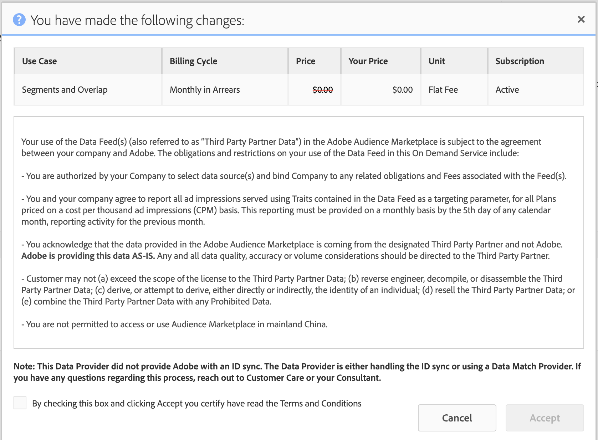

# Abonnementen gegevensfeed beheren {#manage-data-feed-subscriptions}

In [!UICONTROL Marketplace] gaan gegevenskopers naar onderzoek en abonneren ze op openbare en particuliere gegevensfeeds. Voer de volgende stappen uit om u te abonneren op een openbare gegevensfeed.

## Abonneren op een openbare gegevensfeed {#subscript-public-data-feed}

In [!UICONTROL Marketplace] gaan gegevenskopers naar onderzoek en abonneren ze op openbare en particuliere gegevensfeeds. Voer de volgende stappen uit om u te abonneren op een openbare gegevensfeed.

<!-- t_subscribe_feed.xml -->

Abonneren op een openbare gegevensfeed:

1. Ga naar **[!UICONTROL Audience Marketplace > Marketplace]** . Gebruik de zoekfunctie of blader door de lijst om een gegevenstoevoer te zoeken.

   

1. Klik op de naam van de gegevensfeed die u wilt gebruiken. Dit opent de [&#x200B; pagina van de plandetails &#x200B;](../../../features/audience-marketplace/marketplace-data-buyers/marketplace-manage-subscriptions.md#marketplace-buyer-details) voor het geselecteerde voer.

   

1. Kies een gebruiksscenario in de tabel met abonnementen en:
   * Verplaats de schuifregelaar **[!UICONTROL Subscription]** naar **[!UICONTROL On]** .
   * Klik op **[!UICONTROL Review & Subscribe]**. Hierdoor wordt het venster van [!UICONTROL Terms and Conditions] geopend.

   

1. In het [!UICONTROL Terms and Conditions] -venster:

   * **Belangrijk:** laat het **[!UICONTROL ID sync]** controlevakje gecontroleerd. Met deze instelling kunt u de gegevensaanbieder een betere overeenkomst bieden.
   * Controleer de voorwaarden en condities en klik op **[!UICONTROL Accept]** om het abonnementsproces te voltooien.

   

### Volgende stappen

Nadat u zich hebt geabonneerd op een gegevensfeed:

* Verifieer het abonnement door uw [!UICONTROL Traits] map te controleren. Zie [&#x200B; Opslag voor Geabonneerde Evoer van Gegevens &#x200B;](../../../features/audience-marketplace/marketplace-data-buyers/marketplace-manage-subscriptions.md#find-subscribed-data-fee).

* Controleer de facturerings- en betalingsdocumentatie. Zie de verwante koppelingen hieronder.

### Aanbevolen procedures {#best-practices}

Hier volgt een reeks aanbevolen procedures voor het werken met [!UICONTROL Audience Marketplace] :

Wanneer we nieuwe gegevenssets van derden en van derden doorzoeken via [!UICONTROL Audience Marketplace] , raden we u aan om gegevensfeeds in te schakelen voor [!UICONTROL Segments & Overlap] . Dit staat gebruikers toe om gegevens te onderzoeken door segmenten te bouwen om publieksgrootte te evalueren, en lopende overlappende rapporten om aanvankelijke publieksinzichten te bereiken. De meeste gegevensleveranciers bieden dit gebruiksgeval gratis aan, zodat u deze analyse zonder extra kosten kunt uitvoeren.

Wanneer het runnen van overlappende rapporten, volg deze beste praktijken om ervoor te zorgen u nuttige resultaten krijgt.

1. Zorg ervoor dat uw overlappende gegevenssets qua gegevenstype en verzamelingsmethodologieën vergelijkbaar zijn, zoals:
   * geografie van bezoekers
   * Koekje versus mobiele id&#39;s
   * Venster Opzoeken
   * Offline versus online activiteit
   * De frequentie waarmee de gegevensaanbieder de gegevens vernieuwt

1. Overlap kan iets toenemen in de loop van de tijd, dus zorg ervoor dat u tot 30 dagen toestaat om over te gaan alvorens overlappende rapporten in werking te stellen om voor de gegevens aan synchronisatie toe te staan.
1. De overlapping kan toenemen als u gegevens van een gegevensleverancier in veelvoudige marketing campagnes gebruikt.
en initiatieven. Hierdoor kunnen gebruikers van de twee gegevenssets meer mogelijkheden krijgen om te synchroniseren.
1. Er is geen garantie dat de gegevenssets elkaar overlappen. Een overlapping is alleen geldig als een gebruiker van de gegevensset van de klant is gekoppeld aan de gegevens
gegevensset van de provider tijdens het rapportagetijdkader. Als de mediagegevens van de klant niet zijn doorgegeven aan de gebruikers in de gegevensset van de gegevensaanbieder, is er nooit sprake van overlapping.
1. Denk niet aan een lage overlapping als een slechte zaak. Profiteer van een lage overlapping om nieuwe gebruikers aan te trekken.

## Abonneren op een privégegevensfeed {#subscript-private-data-feed}

Kopers abonneren zich op persoonlijke gegevensfeeds en -plannen in **[!UICONTROL Audience Marketplace > Marketplace]** .

<!-- t_private_feed.xml -->

>[!TIP]
>
>Soms kunnen gegevensleveranciers een korting op een privégegevensfeed aanbieden. Mogelijk wilt u vragen naar een mogelijke korting bij het indienen van uw abonnementsaanvraag.

Abonneren op een persoonlijke gegevensfeed:

1. Klik op de naam van de gegevensfeed in de [!UICONTROL Marketplace] .
1. Klik op **[!UICONTROL Request Access]**. Hiermee wordt het dialoogvenster Verzoek geopend.
1. Schrijf in het dialoogvenster Verzoek een notitie die uw interesse in de gegevensinvoer uitdrukt en klik op **[!UICONTROL Send]** . De verkoper zal je bericht bekijken en je aanvraag goedkeuren of afwijzen. Tijdens het wachten op goedkeuring wordt &#39;&#39;Gevraagd&#39;&#39; weergegeven in de lijst [!UICONTROL Marketplace] voor die gegevensinvoer.

   * **[!UICONTROL Request approved]**: De status in de lijst [!UICONTROL Marketplace] verandert in &quot;Toegang verleend&quot; en u ontvangt een geautomatiseerde melding. Op dit punt kunt u zich abonneren op de feed. Zie [&#x200B; aan een Openbare Diervoed van Gegevens &#x200B;](../../../features/audience-marketplace/marketplace-data-buyers/marketplace-manage-subscriptions.md#subscript-public-data-feed) voor instructies intekenen.
   * **[!UICONTROL Request denied]**: De tekst &quot;Gevraagd&quot; wordt verwijderd uit de lijst [!UICONTROL Marketplace] voor de feed. U kunt proberen opnieuw te abonneren of een andere feed kiezen.

## Kortingen gegevensfeed voor kopers {#buyer-discount}

In [!UICONTROL Audience Marketplace] kunnen providers kopers een korting bieden op de gepubliceerde prijs van een [!DNL CPM] -gegevensfeed of op basis van een vaste rentevoet. Koperskortingen zijn echter niet zichtbaar voor kopers in de lijst met [!DNL Marketplace] feed. Maar u kunt ook om een korting vragen wanneer u zich abonneert op een persoonlijke gegevensfeed of wanneer u meer informatie over een bepaalde feed aanvraagt.

## Een korting aanvragen {#request-discount}

<!-- marketplace-buyer-discounts.xml -->

<table id="table_3C6E58F593BA48EC89ACBD9A26E4E74F"> 
 <thead> 
  <tr> 
   <th colname="col1" class="entry"> Status koper </th> 
   <th colname="col2" class="entry"> Beschrijving </th> 
  </tr> 
 </thead>
 <tbody> 
  <tr> 
   <td colname="col1"> 
 <b> Huidige Abonnees </b> 
 </td> 
   <td colname="col2"> 
Als u al bent geabonneerd op een persoonlijke gegevensfeed en een korting wilt aanvragen: 
 
    <ol id="ol_A58D419EBB9349E9B1225202535130F6"> 
     <li id="li_D0DDC8AC6E9C4675AA4630D63FE8F071"> <a href="../../../features/audience-marketplace/marketplace-data-buyers/marketplace-manage-subscriptions.md#unsubscribe"> Abonnement opzeggen </a> uit de gegevensinvoer. </li> 
     <li id="li_05A5379F2A944FB28AB39C196DDE3A1D">Neem contact op met de gegevensaanbieder en vraag om een korting. </li> 
     <li id="li_B1B5AA6F6CC64512A02D5E8861A5F266">Als de leverancier u een korting geeft, herabonneer aan het voer op de 1  plaats  dag van de volgende maand. </li> 
    </ol> </td> 
  </tr> 
  <tr> 
   <td colname="col1"> 
 <b> Nieuwe Privé Abonnees van het voer van Gegevens </b> 
 </td> 
   <td colname="col2"> 
Vraag om een korting in uw abonnementsaanvraag. Zie <a href="../../../features/audience-marketplace/marketplace-data-buyers/marketplace-manage-subscriptions.md#subscript-private-data-feed"> Abonneren op een privégegevensfeed </a> . 
 </td>
  </tr> 
  <tr> 
   <td colname="col1"> 
 <b> Potentiële Abonnees </b> 
 </td> 
   <td colname="col2"> 
Een <a href="../../../features/audience-marketplace/marketplace-private-feeds.md"> potentiële abonnee </a> is een gegevenskoper die om toegang tot een privé gegevensvoer heeft verzocht, goedkeuring van de verkoper heeft ontvangen, maar niet op het voer heeft geabonneerd. Om een korting als potentiële abonnee aan te vragen: 
 
    <ol id="ol_9CECDA92E7894B20AC8A777D78962188"> 
     <li id="li_618B64160CF24549AFCA73E006DCA35A">Ga naar <b> Audience Marketplace &gt; Marketplace </b> . </li> 
     <li id="li_FE52A06B30FC4858B48AF81954365FE9">Klik op de naam van de feed waarvoor u bent goedgekeurd. </li> 
     <li id="li_763C050AC9464BE380D00F6085B6E540">Klik op <b> Meer informatie aanvragen </b> . Vraag de verkoper om korting in je verzoek om details. </li> 
    </ol> </td> 
  </tr> 
 </tbody> 
</table>

## Korte feeds controleren {#review-discounted-feeds}

Je kunt je gedisconteerde feeds bekijken:

1. Ga naar **[!UICONTROL Audience Marketplace > Marketplace]** .
1. Klik op de naam van een feed waarop u zich al hebt geabonneerd.
1. Bekijk de kolommen [!UICONTROL Price] en [!UICONTROL Your Price] in de tabel [!UICONTROL Plan Details] . Als het diervoeder wordt gedisconteerd:

   * De oorspronkelijke prijs wordt met een rode lijn gemarkeerd.
   * De kosten in de kolom [!UICONTROL Your Price] zijn lager dan de kosten in de kolom [!UICONTROL Price] .

In het voorbeeld krijgt de koper een korting van 10% op het [!UICONTROL Segments and Overlap] -abonnement in **[!UICONTROL Software Audience Feed]** .

## Geabonneerde Feed-gegevens zoeken {#find-subscribed-data-fee}

De gegevens (kenmerken) voor uw gegevensfeeds worden weergegeven in hun eigen opslagmappen voor de eigenschap. Ga naar **[!UICONTROL Audience Data > Traits]** en vouw de **[!UICONTROL 3rd-Party Data]** omslag uit om de eigenschappen in uw geabonneerde voer te bekijken en te werken. Zoek de submap die naar de gegevensaanbieder is genoemd. Die bevatten mappen die worden genoemd naar de afzonderlijke gegevensfeed en lijstkenmerken die door de feed worden verschaft.

<!-- marketplace-feed-storage.xml -->

## Abonnement op een gegevensfeed opzeggen {#unsubscribe}

Gegevenskopers nemen hun abonnement op gegevensfeeds en -plannen op in **[!UICONTROL Audience Marketplace > Marketplace]** .

<!-- t_unsubscribe_feed.xml -->

Abonnement op een gegevensfeed opzeggen:

1. Klik op de naam van de gegevensfeed in de [!UICONTROL Marketplace] .
1. Zoek in de sectie [!UICONTROL Use Case] het plan dat u wilt gebruiken en verplaats de schuifregelaar **[!UICONTROL Subscription]** naar **[!UICONTROL Off]** .

## Deactivering van gegevensfeed: Waarom gebeurt het en hoe reageert het? {#data-feed-deactivation-reasons}

In [!UICONTROL Audience Marketplace] kunnen gegevensproviders de toegang tot uw geabonneerde gegevensfeeds intrekken. Wees niet verontrust als dit met je gebeurt. We hebben je bedekt. Herzie deze sectie voor processen en procedures met betrekking tot de deactivering van gegevensvoer.

## Algemene redenen voor deactivering van gegevensfeed {#reasons-for-deactivation}

<!-- marketplace-subscriber-deactivated.xml -->

Het kan raadselachtig of zelfs verontrustend zijn als een voer u zich aan intekent wordt gesloten. Gegevensleveranciers kunnen een gegevensfeed echter om verschillende redenen deactiveren. Enkele algemene redenen zijn:

* **Facturering:** De leveranciers van gegevens zullen een voer deactiveren als u constant laat met vergoedingsbetalingen bent of als u er niet in slaagt om uw kosten te betalen.
* **de Updates van het voer:** de leveranciers van gegevens moeten voer deactiveren wanneer zij hun voedertaxonomie of kostenstructuren bijwerken.
* **Inactieve Kopers:** De leveranciers van gegevens behouden zich het recht voor om voer te deactiveren als de abonnees geen uitgaven over een langere periode tonen.
* **Inactieve Verkopers:** De leveranciers van Gegevens die [!UICONTROL Audience Marketplace] verlaten zullen al hun gegevensvoer deactiveren en schrappen.

>[!TIP]
>
>Neem rechtstreeks contact op met uw gegevensaanbieder als u denkt dat een gegevensfeed per ongeluk is gedeactiveerd. Uw [!DNL Adobe] -consultant kan u helpen met contactgegevens of aanvullende ondersteuning.

## Deactivering van e-mail {#deactivation-email}

Wanneer een gegevensaanbieder een van uw gegevensfeeds deactiveert, stuurt [!DNL Audience Manager] een e-mail naar de gebruikers in uw bedrijf die [!UICONTROL Administrator] -machtigingen hebben. Soms wordt dit bericht door e-mailfilters geclassificeerd als spam. Dit kan ertoe leiden dat u deze belangrijke melding mist. Om u te helpen het deactiveringsbericht identificeren, bevat dit e-mailbericht de volgende elementen:

* **van:** De deactiveringse-mail komt uit `aam-noreply@adobe.com`. Pro-tip: reageer niet op deze e-mail.

* **Onderwerpregel:** Abonnement aan *naam van gegevensvoer hier* wordt geannuleerd.

* **Gehechtheid:** e-mail omvat een gehechtheid genoemd, &quot; `list-of-affected-entities-by-feed-revocation.csv`&quot;. Dat is een geconvolueerde manier om te zeggen dat de bijlage alle kenmerken vermeldt die in de geannuleerde feed zijn opgenomen. Als koper van gegevens kun je deze bijlage bekijken. Het zal u helpen gedesactiveerde eigenschappen van uw segmenten en [&#x200B; algoritmische modellen &#x200B;](../../../features/algorithmic-models/understanding-models.md) vinden en verwijderen.

## Lijst met gedeactiveerde tracks {#deactivation-trait-list}

De lijst die bij een deactivering-e-mail hoort, bevat de velden zoals hieronder wordt weergegeven.

<table id="table_5C3800F9D8AA43EFAB4690959A721F63"> 
 <thead> 
  <tr> 
   <th colname="col1" class="entry"> Veld </th> 
   <th colname="col2" class="entry"> Beschrijving </th> 
  </tr> 
 </thead>
 <tbody> 
  <tr> 
   <td colname="col1"> 
<b> ID gegevensfeed </b> 
 </td> 
   <td colname="col2"> 
ID van de gedeactiveerde gegevensinvoer. 
 </td> 
  </tr> 
  <tr> 
   <td colname="col1"> 
<b> Naam gegevensfeed </b> 
 </td> 
   <td colname="col2"> 
Naam van de gedeactiveerde gegevensinvoer. 
 </td> 
  </tr> 
  <tr> 
   <td colname="col1"> 
<b> Trait SID </b> 
 </td> 
   <td colname="col2"> 
gedeactiveerde standaard-id's. 
 </td> 
  </tr> 
  <tr> 
   <td colname="col1"> 
<b> Naam dienblad </b> 
 </td> 
   <td colname="col2"> 
Gedetactiveerde namen van kenmerken. 
 </td> 
  </tr> 
  <tr> 
   <td colname="col1"> 
<b> Segment SID </b> 
 </td> 
   <td colname="col2"> 
Id van het segment dat gedeactiveerde kenmerken bevat. 
 </td> 
  </tr> 
  <tr> 
   <td colname="col1"> 
<b> Segmentnaam </b> 
 </td> 
   <td colname="col2"> 
Naam van het segment dat gedeactiveerde kenmerken bevat. 
 </td> 
  </tr> 
  <tr> 
   <td colname="col1"> 
<b> Algo Model ID </b> 
 </td> 
   <td colname="col2"> 
De id van het algoritmische model dat gedeactiveerde kenmerken bevat. 
 </td> 
  </tr> 
  <tr> 
   <td colname="col1"> 
<b> Naam van algo-model </b> 
 </td> 
   <td colname="col2"> 
De namen van algoritmische modellen die gedeactiveerde eigenschappen bevatten. 
 </td> 
  </tr> 
 </tbody> 
</table>

## Gedetailleerde trajecten verwijderen {#remove-deactivated-traits}

Als gegevenskoper ben je verantwoordelijk voor het verwijderen van de kenmerken in een geannuleerde feed uit al je actieve/in-gebruik of inactieve segmenten. Tot de verwijderingsopties behoren:

* De bulkverwijdering met [&#x200B; REST APIs &#x200B;](../../../api/rest-api-main/rest-api-main.md) of [&#x200B; Bulk de Hulpmiddelen van het Beheer &#x200B;](../../../reference/bulk-management-tools/bulk-management-intro.md).

* Zoek handmatig naar betrokken segmenten en verwijder gedeactiveerde kenmerken met [!UICONTROL Segment Builder] . Zie [&#x200B; Tanden van een Segment &#x200B;](../../../features/segments/segment-builder.md#segment-builder-controls-traits) verwijderen.

>[!NOTE]
>
>Het verwijderen van kenmerken uit actieve algoritmische modellen of bestemmingen heeft invloed op schaal en doelnauwkeurigheid. Probeer ingetrokken kenmerken indien mogelijk te vervangen door nieuwe, actieve kenmerken.

[&#x200B; Unsubscribe van de gedeactiveerde gegevensvoer &#x200B;](../../../features/audience-marketplace/marketplace-data-buyers/marketplace-manage-subscriptions.md#unsubscribe) nadat u alle ingetrokken eigenschappen uit uw rekening verwijdert. Als dit een tijdelijke deactivering is, kunt u zich opnieuw abonneren nadat de gegevensaanbieder de vereiste wijzigingen heeft aangebracht en de feed opnieuw heeft geactiveerd. Zoals bij de meeste zaken, kan goede communicatie met uw partners (de gegevensleverancier en [!DNL Adobe]) u helpen door dit proces werken.

## De pagina met abonnementsdetails in Audience Marketplace {#marketplace-buyer-details}

Wanneer u in [!UICONTROL Marketplace] op de naam van een gegevensabonnement klikt, verschaft [!DNL Audience Manager] informatie die u kan helpen geïnformeerde keuzes te maken over het abonneren op een gegevensfeed.

<!-- marketplace-buyer-details.xml -->

Op deze pagina vindt u de volgende informatie:

1. **Basisinformatie van het Plan**. Dit omvat voederinformatie zoals:
   * Naam gegevensfeed. De naam van deze feed is bijvoorbeeld, zoals hierboven is weergegeven, &quot;Voorbeeldgegevensfeed&quot;.
   * de naam van de gegevensaanbieder;
   * ID gegevensvoer;
   * Beschrijving;
   * aantal eigenschappen van het diervoeder;

1. De knoppen Informatie plannen.
   * Klik op **[!UICONTROL Explore All Traits]** om details over alle kenmerken in de geselecteerde gegevensfeed weer te geven.
   * Klik op **[!UICONTROL Request More Details]** om de gegevensaanbieder vragen te stellen over de geselecteerde gegevensfeed of om een korting aan te vragen. Met deze functie worden uw opmerkingen en vragen rechtstreeks naar de gegevensaanbieder verzonden.

1. Gegevensinvoer rapporteert statistieken. In het Venn-diagram (en de bijbehorende maatstaven) ziet u overlappende gegevens voor de laatste 30 dagen. Zie [&#x200B; de Marketplace: Ongeveer &#x200B;](marketplace-data-buyers.md#about-marketplace) voor details.
   * **[!UICONTROL 30 Day Overlapped Uniques]**: Het aantal unieke gebruikers in uw account dat de gebruikers in de account van de provider overlapt. Voor een definitie van unieke gebruikers, zie AAM UUID in de [&#x200B; Index van IDs in Audience Manager &#x200B;](/help/using/reference/ids-in-aam.md).
   * **[!UICONTROL 30 Day Provider Unique Users]**: Het aantal unieke gebruikers dat afkomstig is van het account van de provider.
   * **[!UICONTROL Your Unique Users]**: Het aantal unieke gebruikers dat van uw account komt.

1. **[!UICONTROL Plan Details]** Tabel. Deze lijst toont u de gebruiksgevallen die u aan het gegeven voor, evenals zijn het tariferen model kunt intekenen. Zie [&#x200B; Begrijpend de Gevallen van het Gebruik van het voer van Gegevens &#x200B;](#use-cases).

1. Knoppen voor het uitvoeren van acties plannen.
   * Klik op **[!UICONTROL Cancel]** om de pagina te verlaten zonder wijzigingen aan te brengen.
   * Klik op **[!UICONTROL Review & Subscribe]** om u te abonneren op een gegevensfeed. Deze knop wordt grijs weergegeven totdat u een [!UICONTROL Subscription] -schakeloptie instelt op [!UICONTROL On] . Zie ook [&#x200B; aan een Openbare Diervoed van Gegevens &#x200B;](#subscript-public-data-feed) abonneren en [&#x200B; aan een Privé Diervoed van Gegevens &#x200B;](#subscript-private-data-feed) abonneren.

## Gevallen van gebruik van gegevensfeed {#use-cases}

Als [!UICONTROL Audience Marketplace] gegevenskoper kunt u gegevens aanschaffen voor het gebruik van overlappingen, modellering en activering. Elk gebruiksgeval wordt ontworpen voor een specifiek doel en beperkt wat u met de gegevens kunt doen. Deze gebruiksgevalbeschrijvingen kunnen u helpen het juiste besluit nemen over welk type van gegevensplan te kopen.

## Vergelijkingen maken met segmenten en overlappende plannen {#comparisons}

<!-- c_use_cases_for_buyers.xml -->

### Segmenten en overlappen

Dit gebruiksgeval laat u uw eigenschappen met leverancierseigenschappen in a [&#x200B; eigenschap-aan-lijn overlappend rapport vergelijken.](../../../reporting/dynamic-reports/trait-trait-overlap-report.md#trait-to-trait-overlap-report) Ook, kunt u leverancierseigenschappen tot stand brengen of toevoegen aan een segment en extra vergelijkingen maken met [&#x200B; segment-aan-lijn &#x200B;](../../../reporting/dynamic-reports/segment-trait-overlap-report.md) en [&#x200B; segment-aan-segment &#x200B;](../../../reporting/dynamic-reports/segment-segment-overlap-report.md) rapporten. Met behulp van overlap-vergelijkingen kunt u:

* **breidt publieksbereik uit:** de Lage overlapping stelt uw eigenschappen voor bevatten gebruikers u niet eerder hebt gezien. U kunt deze kenmerken gebruiken om nieuwe gebruikers te proberen te bereiken.
* **verbeter bestaand publiek:** de Hoge overlapping stelt uw sporen voor gelijkaardig zijn aan die bezeten door de gegevensleverancier. U wilt deze kenmerken wellicht gebruiken om een doelgericht, stapsgewijs verbeterd publiek te helpen maken.

### Algorithmic Models

Dit gebruiksgeval laat u leverancierseigenschappen tegen uw eigenschappen met [&#x200B; algoritmische modellering &#x200B;](../../../features/algorithmic-models/understanding-models.md#understanding-models) evalueren. Ons algoritmisch modelleringssysteem gebruikt bijvoorbeeld een van uw kenmerken als basis voor vergelijking met een leverancierstaak. Wanneer het model wordt uitgevoerd, kan worden getoond of het publiek in leverancierssporen gelijkaardige omzettingsattributen aan uw eigenschappen deelt.

### Activering

Dit gebruiksgeval laat u gegevens naar a [&#x200B; bestemming &#x200B;](../../../features/destinations/destinations.md) verzenden. In [!DNL Audience Manager] is een doel een systeem van derden (advertentieserver, [!DNL DSP], [!DNL DMP], Exchange, enzovoort) waarmee u gegevens wilt delen. Met een [!UICONTROL Activation] -use-case kunt u echter geen overlappende rapporten uitvoeren of de gegevens in een algoritmisch model testen.

>[!MORELIKETHIS]
>
>* [&#x200B; Facturerings en de Toewijzing van de Indruk voor de Eigen Gegevens van CPM &#x200B;](../../../features/audience-marketplace/marketplace-data-buyers/marketplace-buyer-billing.md#cost-attribution)
>* [&#x200B; Facturerings en Toewijzing van de Indrukking voor de Diefstal van de Gegevens van het Vlaming &#x200B;](../../../features/audience-marketplace/marketplace-data-buyers/marketplace-buyer-billing.md)
>* [&#x200B; hoe te om het Gebruik van CPM te melden &#x200B;](../../../features/audience-marketplace/marketplace-data-buyers/marketplace-buyer-billing.md#report-cpm-usage)
>* [&#x200B; abonneert aan een Openbare Diervoed van Gegevens &#x200B;](../../../features/audience-marketplace/marketplace-data-buyers/marketplace-manage-subscriptions.md#subscript-public-data-feed)
>* [&#x200B; Kortingen voor de Kopers van Gegevens &#x200B;](../../../features/audience-marketplace/marketplace-data-buyers/marketplace-manage-subscriptions.md#buyer-discount)
>* [&#x200B; Marketplace: Ongeveer &#x200B;](../../../features/audience-marketplace/marketplace-data-buyers/marketplace-data-buyers.md#about-marketplace)
