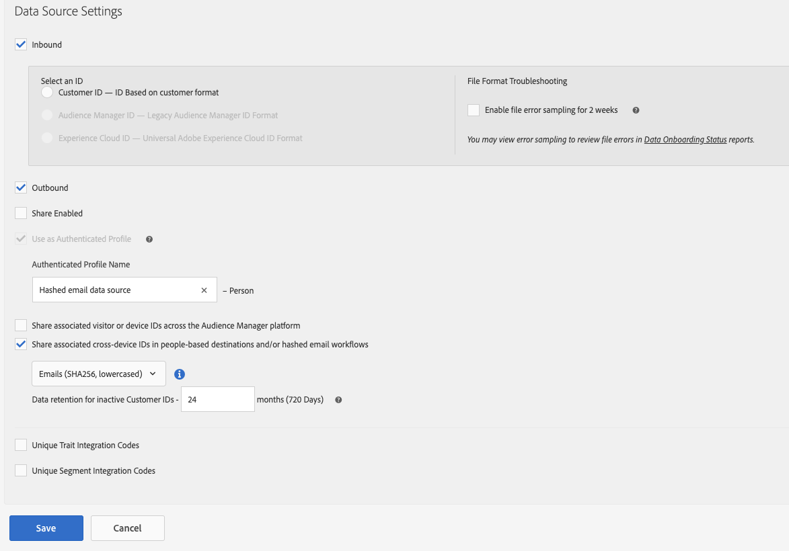

# Een gegevensbron configureren voor gehashte e-mailworkflows

Voor workflows met onderbroken e-mail, zoals Op personen gebaseerde doelen, moet u een gegevensbron maken om de gehashte e-mailadressen op te slaan.

Voer de onderstaande stappen uit om een gegevensbron voor gehashte e-mails te maken en te configureren.

1. Meld u aan bij uw Audience Manager-account en ga naar **[!UICONTROL Audience Data]** -> **[!UICONTROL Data Sources]** en klik op **[!UICONTROL Add New]**.
1. Voer een **[!UICONTROL Name]** en **[!UICONTROL Description]** voor uw nieuwe gegevensbron.
1. In de **[!UICONTROL ID Type]** vervolgkeuzelijst, selecteert u **[!UICONTROL Cross Device]**.
   
1. In de **[!UICONTROL Data Source Settings]** selecteert u beide **[!UICONTROL Inbound]** en **[!UICONTROL Outbound]** en inschakelen **[!UICONTROL Share associated cross-device IDs in people-based destinations]** -optie.
1. Selecteer in het keuzemenu de optie **[!UICONTROL Emails(SHA256, lowercased)]** label voor deze gegevensbron.

   >[!IMPORTANT]
   >
   >Met deze optie wordt alleen de gegevensbron gelabeld met gegevens die zijn gehasht met dat specifieke algoritme. De Audience Manager hash de gegevens bij deze stap niet. Zorg ervoor dat de e-mailadressen die u wilt opslaan in deze gegevensbron al zijn gehasht met de [!DNL SHA256] algoritme. Anders kunt u deze niet gebruiken voor gehashte e-mailworkflows.

   

