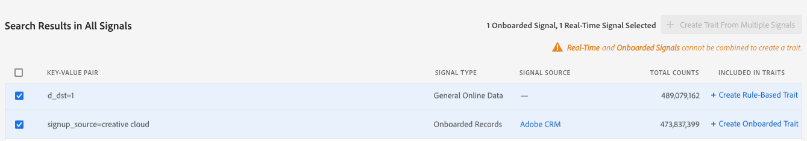
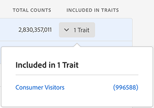

# Eigenschappen maken van signalen

Maak nieuwe kenmerken van alle signalen, inclusief de signalen die al worden gebruikt in kenmerken, en leg toekomstige doelgroepen vast die in aanmerking komen na het maken van sporen. Bekijk de video voor een snelle demonstratie of lees de video voor gedetailleerde informatie:

>[!VIDEO](https://video.tv.adobe.com/v/25169/?quality=12)

## Traits maken van het dashboard voor signalen {#create-traits-from-signal-dashboard}

Met [!UICONTROL Signal Dashboard] kunt u nieuwe kenmerken maken van de [!UICONTROL Top Unused Signals], [!UICONTROL New Unused Signals] en opgeslagen zoekopdrachten.

Wanneer u een nieuw bezit creeert, is het trektype vooraf ingesteld gebaseerd op het signaaltype:

* **[!UICONTROL Rule-based]** karakteristieken voor realtime signalen, actioneerbare logbestanden en  [!DNL Adobe Analytics] signalen;

* **[!UICONTROL Onboarded]** kenmerken voor aan boord genomen signalen.

Om nieuwe eigenschappen van **[!UICONTROL Signal Dashboard]** tot stand te brengen, identificeer het signaal dat u in het bezit wilt gebruiken, dan klik de overeenkomstige **[!UICONTROL Create Rule-Based Trait]** of **[!UICONTROL Create Onboarded Trait]** verbinding.

U wordt omgeleid naar **[Trait Builder](../../features/traits/about-trait-builder.md)** om uw nieuwe eigenschap(pen) te maken.

## Traits maken van signaalzoekopdracht {#create-traits-from-signal-search}

Creeer eigenschappen die op gebruikte of ongebruikte signalen worden gebaseerd die niet in [!UICONTROL Signal Dashboard] worden getoond.

Zoek naar specifieke signalen en creeer op regel-gebaseerde of ongebogen eigenschappen die op de resultaten worden gebaseerd. Dit doet u als volgt:

1. Ga naar **[!UICONTROL Audience Data > Signals > Search]** en stel een onderzoek in dat op de zeer belangrijk-waardeparen wordt gebaseerd die u zoekt, of klik **[!UICONTROL Search]** zonder enige zeer belangrijk-waardepaar in te gaan om alle resultaten te tonen.
2. Identificeer de signalen die u in het bezit, in de resultatenlijst wilt gebruiken.
   * Als u een kenmerk wilt maken van één signaal, klikt u op de bijbehorende **[!UICONTROL Create Rule-Based Trait]**- of **[!UICONTROL Create Onboarded Trait]**-koppeling.
   * Als u een kenmerk wilt maken van meerdere signalen, klikt u op het bijbehorende selectievakje van elk signaal en vervolgens op **[!UICONTROL Create Trait from Multiple Signals]**.

   >[!NOTE]
   >U kunt eigenschappen van signalen van het zelfde type slechts tot stand brengen. U kunt geen eigenschap tot stand brengen die op een combinatie van een signaal in real time en aan boord wordt gebaseerd.
   >
   > 
   >U kunt ook eigenschappen maken van gebruikte signalen. Signalen die reeds in eigenschappen worden gebruikt hebben het aantal eigenschappen getoond in **[!UICONTROL Included in Traits]** kolom. Klik op de pijl om de kenmerken weer te geven die het signaal bevatten.
   >
   >

3. Gebruik **[Trait Builder](../../features/traits/about-trait-builder.md)** om uw nieuwe eigenschappen tot stand te brengen.
