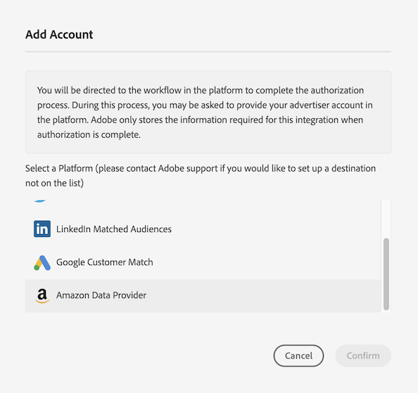

# [!DNL Amazon Advertising] configureren als op apparaat gebaseerde zelfbediening {#configure-amazon}

Dit artikel verklaart hoe te om een integratie met [ Amazon Advertising ](https://advertising.amazon.com/API/docs/en-us) te vormen.

## Vereisten {#prerequisites}

Voordat u de [!DNL Amazon Advertising] -bestemming configureert, moet u controleren of aan de volgende voorwaarden is voldaan.

* Uw [!DNL Amazon] -account moet in aanmerking komen voor advertenties.
* Wanneer u de eerste [!DNL Amazon Advertising] -bestemming in uw Audience Manager-exemplaar maakt, neemt u contact op met Adobe Consulting of de klantenservice om de [!DNL Amazon] ID-synchronisatie (Data Source ID = 139200) voor uw account in te schakelen. Dit is vereist voor de juiste synchronisatie tussen Audience Manager en [!DNL Amazon] .
* Nadat het nieuwe publiek van de gegevensleverancier wordt gecreeerd, zou u hun meta-gegevens [ moeten bijwerken en ](https://advertising.amazon.com/API/docs/en-us/data-provider/openapi#tag/Metadata/paths/~1v2~1dp~1audiencemetadata~1%7BaudienceId%7D/put) toevoegen. **[!DNL audience fees]** Voor deze verrichting kunt u [ Amazon Adds API ](https://advertising.amazon.com/API/docs/en-us/guides/onboarding/apply-for-access) of [ Advertising UI van Amazon gebruiken ](https://advertising.amazon.com/).

## Een nieuw doel toevoegen [!DNL Amazon Advertising] {#add-new-amazon-destination}

In deze sectie worden de stappen beschreven die u moet volgen bij het configureren van een nieuwe, op apparaten gebaseerde bestemming voor [!DNL Amazon Advertising] . In dit scenario wordt ervan uitgegaan dat u geen bestaande [!DNL Amazon Advertising] bestemming hebt geconfigureerd via uw Adobe-consultant of klantenservice.

### Stap 1. Verifiëren met [!DNL Amazon Advertising] {#step1-authenticate-with-amazon}

Voordat u de op een apparaat gebaseerde bestemming kunt toevoegen, moet u Audience Manager en uw [!DNL Amazon Advertising] -account koppelen. Dit doet u als volgt:

1. Meld u aan bij uw Audience Manager-account en ga naar **[!UICONTROL Administration > Integrated Accounts]** . Als u een eerder gevormde integratie met een bestemmingsplatform hebt, zou u het in deze pagina moeten zien die. Anders is de pagina leeg.
1. Selecteer **[!UICONTROL Add Account]** .
1. Selecteer [!UICONTROL Amazon Data Provider] .

   

1. Selecteer een van de **[!UICONTROL Amazon Data Provider]** -opties, afhankelijk van het gebied waar uw [!DNL Amazon Ads] -account is gemaakt (Noord-Amerika, Europa of Verre Oosten) en klik op **[!DNL Confirm]** om deze om te zetten naar de verificatiepagina.

   

1. Nadat je je hebt geverifieerd, word je doorgestuurd naar Audience Manager waar je de bijbehorende adverteerderaccounts kunt bekijken. Selecteer het adverteerderaccount dat u wilt gebruiken en klik op **[!UICONTROL Confirm]** . Op deze manier hebt u Audience Manager toegang verleend om updates voor uw publiek te verzenden.

### Stap 2. Een nieuwe op apparaten gebaseerde bestemming maken {#step2-create-new-destination}

Nadat u Audience Manager en uw [!DNL Amazon Advertising] -account hebt gekoppeld, kunt u de nieuwe bestemming maken. Dit doet u als volgt:

>[!NOTE]
>
>U kunt de naam van een bestaand op apparaat gebaseerd doel niet wijzigen. Zorg ervoor om een naam te verstrekken die u zal helpen de bestemming correct identificeren.

1. Meld u aan bij uw Audience Manager-account, ga naar **[!UICONTROL Audience Data > Destinations]** en selecteer **[!UICONTROL Create Destination]** .
1. Voer in de sectie **[!UICONTROL Basic Information]** een **[!UICONTROL Name]** en **[!UICONTROL Description]** in voor uw nieuwe doel en gebruik de onderstaande instellingen:

   

1. Selecteer **[!UICONTROL Next]** .
1. Kies de [ Etiketten van de Uitvoer van Gegevens ](/help/using/features/data-export-controls.md#controls-labels) die u voor deze bestemming wilt plaatsen.
1. Selecteer **[!UICONTROL Save]** .
1. Selecteer in de sectie **[!UICONTROL Segment Mappings]** de publiekssegmenten die u naar deze bestemming wilt verzenden.
1. Sla het doel op.

## Aandachtspunten {#match-rates-considerations}

De integratie tussen Audience Manager en [!DNL Amazon Advertising] ondersteunt historische publieksbackfills. Alle segmentkwalificaties worden naar [!DNL Amazon] verzonden wanneer u het doel maakt.

## Problemen oplossen {#troubleshooting}

Bij het configureren of verzenden van gegevens naar de [!DNL Amazon Advertising] -bestemming, kunnen de hieronder beschreven fouten optreden. In deze sectie wordt uitgelegd wat de fouten kan veroorzaken en hoe u deze kunt corrigeren.

| Foutbericht | Voorval/Reden | Resolutie |
|---|---|---|
| `Internal server error` | Dit foutbericht wordt weergegeven in de gebruikersinterface van Audience Manager wanneer u probeert een nieuwe [!DNL Amazon] -account toe te voegen met een verouderde versie van de Amazon API. | Neem contact op met de klantenservice van Adobe. |
| `Amazon Error: Account XXXXXXXXX was not found` | Dit foutbericht wordt weergegeven in de gebruikersinterface van Audience Manager wanneer de aanmeldingsgegevens die voor de bestemming zijn geconfigureerd, niet zijn geautoriseerd voor toegang tot de overeenkomstige Amazon Ads-account. | <ul><li>Zorg de rekeningsgeloofsbrieven ervoor dat u gebruikt aan de [ eerste vereisten ](#prerequisites) voldoen.</li><li>Navigeer naar de gebruikersinterface voor Amazon Ads met dezelfde referenties en controleer of het juiste publiek wordt weergegeven onder het corresponderende account. </li></ul> |
