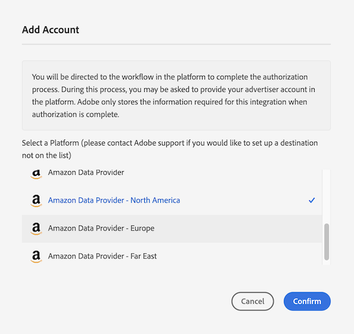

# Configureren [!DNL Amazon Advertising] als Zelfbediening op apparaat gebaseerde bestemming {#configure-amazon}

Dit artikel verklaart hoe te om een integratie te vormen met [Amazon Advertising](https://advertising.amazon.com/API/docs/en-us).

## Vereisten {#prerequisites}

Voordat u uw [!DNL Amazon Advertising] doel, zorg ervoor u aan de volgende voorwaarden voldoet.

* Uw [!DNL Amazon] account moet in aanmerking komen voor reclame.
* Bij het maken van de eerste [!DNL Amazon Advertising] doel in uw Audience Manager-instantie, neemt u contact op met de Adobe Consulting of de klantenservice om de [!DNL Amazon] ID-synchronisatie (gegevensbron-id = 139200) voor uw account. Dit is vereist voor de juiste synchronisatie tussen Audience Manager en [!DNL Amazon].
* Nadat het nieuwe publiek van de gegevensleverancier wordt gecreeerd, zou u moeten [hun metagegevens bijwerken](https://advertising.amazon.com/API/docs/en-us/data-provider/openapi#tag/Metadata/paths/~1v2~1dp~1audiencemetadata~1%7BaudienceId%7D/put) en voeg de **[!DNL audience fees]**. Voor deze bewerking kunt u de opdracht [Amazon Ads API](https://advertising.amazon.com/API/docs/en-us/guides/onboarding/apply-for-access) of de [Gebruikersinterface voor Amazon-advertenties](https://advertising.amazon.com/).

## Een nieuwe toevoegen [!DNL Amazon Advertising] Doel {#add-new-amazon-destination}

Deze sectie beschrijft de stappen u moet volgen wanneer het vormen van een nieuwe op apparaat-gebaseerde bestemming voor [!DNL Amazon Advertising]. In dit scenario wordt ervan uitgegaan dat u geen bestaand scenario hebt [!DNL Amazon Advertising] bestemming geconfigureerd via uw Adobe consultant of klantenservice.

### Stap 1. Verifiëren met [!DNL Amazon Advertising] {#step1-authenticate-with-amazon}

Voordat u de op een apparaat gebaseerde bestemming kunt toevoegen, moet u de Audience Manager en uw [!DNL Amazon Advertising] account. Dit doet u als volgt:

1. Meld u aan bij uw Audience Manager-account en ga naar **[!UICONTROL Administration > Integrated Accounts]**. Als u een eerder gevormde integratie met een bestemmingsplatform hebt, zou u het in deze pagina moeten zien die. Anders is de pagina leeg.
1. Selecteren **[!UICONTROL Add Account]**.
1. Selecteren [!UICONTROL Amazon Data Provider].

   

1. Selecteer een van de **[!UICONTROL Amazon Data Provider]** afhankelijk van het gebied waar uw [!DNL Amazon Ads] account is aangemaakt (Noord-Amerika, Europa of Verre Oosten) en klik op **[!DNL Confirm]** om te worden omgeleid naar de authentificatiepagina.

   

1. Nadat u de verificatie hebt voltooid, wordt u doorgestuurd naar de Audience Manager waar u de bijbehorende adverteerderaccounts kunt bekijken. Selecteer het adverteerderaccount dat u wilt gebruiken en klik op **[!UICONTROL Confirm]**. Op deze manier hebt u de Audience Manager toegang verleend om updates voor uw publiek te verzenden.

### Stap 2. Een nieuwe op apparaten gebaseerde bestemming maken {#step2-create-new-destination}

Nadat u Audience Manager en uw [!DNL Amazon Advertising] -account, kunt u de nieuwe bestemming maken. Dit doet u als volgt:

>[!NOTE]
>
>U kunt de naam van een bestaand op apparaat gebaseerd doel niet wijzigen. Zorg ervoor om een naam te verstrekken die u zal helpen de bestemming correct identificeren.

1. Meld u aan bij uw Audience Manager-account, ga naar **[!UICONTROL Audience Data > Destinations]** en selecteert u **[!UICONTROL Create Destination]**.
1. In de **[!UICONTROL Basic Information]** in, voert u een **[!UICONTROL Name]** en **[!UICONTROL Description]** voor uw nieuwe bestemming, en gebruik de montages hieronder:

   

1. Selecteren **[!UICONTROL Next]**.
1. Kies de optie [Labels voor gegevensexport](/help/using/features/data-export-controls.md#controls-labels) die u voor dit doel wilt instellen.
1. Selecteren **[!UICONTROL Save]**.
1. In de **[!UICONTROL Segment Mappings]** selecteert u de publiekssegmenten die u naar deze bestemming wilt verzenden.
1. Sla het doel op.

## Aandachtspunten {#match-rates-considerations}

De integratie tussen Audience Manager en [!DNL Amazon Advertising] biedt ondersteuning voor historische publieksbackfills. Alle segmentkwalificaties worden verzonden naar [!DNL Amazon] wanneer u de bestemming maakt.

## Problemen oplossen {#troubleshooting}

Wanneer het vormen van of het verzenden van gegevens naar [!DNL Amazon Advertising] doel, zou u op de hieronder beschreven fouten kunnen lopen. In deze sectie wordt uitgelegd wat de fouten kan veroorzaken en hoe u deze kunt corrigeren.

| Foutbericht | Voorval/Reden | Resolutie |
|---|---|---|
| `Internal server error` | Dit foutbericht wordt weergegeven in de gebruikersinterface van de Audience Manager wanneer u een nieuwe toepassing probeert toe te voegen [!DNL Amazon] een verouderde versie van de Amazon API gebruiken. | Neem contact op met de klantenservice van de Adobe. |
| `Amazon Error: Account XXXXXXXXX was not found` | Dit foutenbericht wordt getoond in de Audience Manager UI wanneer de geloofsbrieven die voor de bestemming worden gevormd niet worden gemachtigd om tot de overeenkomstige rekening van Amazon te toegang te hebben Adds. | <ul><li>Zorg ervoor dat de accountgegevens die u gebruikt, voldoen aan de [voorwaarden](#prerequisites).</li><li>Navigeer naar de gebruikersinterface voor Amazon Ads met dezelfde referenties en controleer of het juiste publiek wordt weergegeven onder het corresponderende account. </li></ul> |
