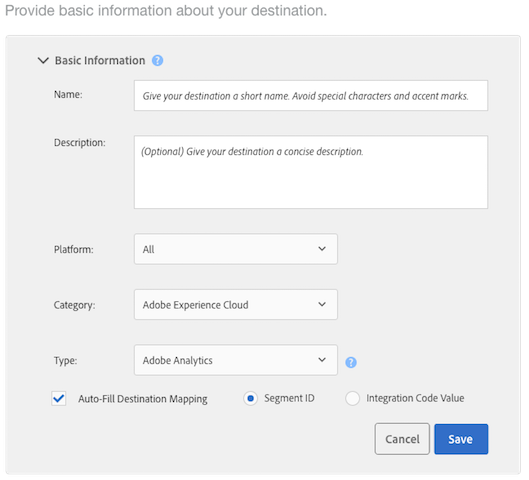

# Een Analytics-bestemming configureren

## Vereisten {#requirements}

Om een bestemming van Analytics te vormen, moet uw gebruiker van de Audience Manager Admin toestemmingen hebben. Zie Gebruikers  maken in de handleiding voor beheer. Merk op dat het hebben van de `CREATE_DESTINATIONS` vervangingstoestemming  niet volstaat om de bestemmingen van Analytics tot stand te brengen.
Voor verdere vereisten, zie Eerste vereisten in de Analytics [van het](https://docs.adobe.com/content/help/en/analytics/integration/audience-analytics/mc-audiences-aam.html)Publiek.

## Uw standaard Analytics-bestemming en nieuwe Analytics-doelen

| Analytics-doeltype | Beschrijving |
|---|---|
| Standaard | De naam van dit standaarddoel is &quot;Adobe Analytics&quot;, dat u kunt bewerken. Toegewezen rapportsuite-id&#39;s worden weergegeven in de mapopslag voor de kenmerken en segmenten van de Audience Manager.    Audience Manager maakt automatisch één doel als uw account:    <ul><li>Voldeed aan de vereisten die zijn beschreven in de documentatie van [Audience Analytics](https://docs.adobe.com/content/help/en/analytics/integration/audience-analytics/mc-audiences-aam.html) .</li><li>Een [rapportsuite](https://docs.adobe.com/content/help/en/analytics/admin/manage-report-suites/report-suites-admin.html) in Analytics.</li><li>[Wijst een rapportsuite toe aan een organisatie](https://docs.adobe.com/content/help/en/core-services/interface/about-core-services/report-suite-mapping.html).</li></ul> |
| Nieuw | Als u nieuwe Analytics-doelen wilt maken, gaat u naar Poortgegevens > Doelen > Nieuwe bestemming maken en volgt u de stappen voor elke hieronder beschreven sectie. |

## Stap 1: Basisinformatie opgeven

Deze sectie bevat velden en opties waarmee het Analytics-proces voor het maken van doelen wordt gestart. Deze sectie voltooien:

1. Klik op **Basisinformatie** om de besturingselementen beschikbaar te maken.
2. Geef het doel een naam. Vermijd afkortingen en speciale tekens.
3. *(Optioneel)* Beschrijf de bestemming. Een beknopte beschrijving is een effectieve manier om meer informatie over een bestemming te definiëren of te verstrekken.
4. *(Optioneel)* Laat in de lijst **Platform** de standaardwaarde **Alles** staan. Op dit moment doen deze opties niets. Ze zijn ontworpen om functies te ondersteunen die op een latere datum kunnen worden toegevoegd.
5. Selecteer in de lijst **Categorie** de optie **Adobe Experience Cloud**.
6. Selecteer **Adobe Analytics** in de lijst **Type**.
7. Klik **sparen** om naar de montages van de Configuratie te gaan of de Etiketten **van de Uitvoer van** Gegevens te klikken om de uitvoercontroles op de bestemming toe te passen.

>[!NOTE]
>
>Voor een Analytics-bestemming zijn het selectievakje Toewijzing bestemming **automatisch vullen** en de optie **Segment-id** standaard ingeschakeld. U kunt deze instellingen niet wijzigen.

## Stap 2: Besturingselementen voor gegevensexport configureren

Deze sectie bevat opties die de Controles [van de Uitvoer van](/help/using/features/data-export-controls.md) Gegevens op een bestemming van Analytics toepassen. Sla deze stap over als u geen besturingselementen voor het exporteren van gegevens gebruikt. Deze sectie voltooien:

1. Klik de Controles **van de Uitvoer van** Gegevens om de controles bloot te stellen.
1. Selecteer een label dat overeenkomt met het besturingselement voor gegevensexport dat op de bestemming wordt toegepast (zie Labels voor gegevensexport [toevoegen aan een doel](/help/using/features/destinations/add-data-export-labels.md) ). Voor Analytics-doelen is het selectievakje PII standaard ingeschakeld.
1. Klik op **Opslaan**.

## Stap 3: Kaartrapportsets

De sectie van de Configuratie maakt een lijst van uw Suites van het Rapport van Analytics die voor server-kant het door:sturen zijn toegelaten. Als u veelvoudige bestemmingen van Analytics hebt, zullen de rapportreeksen die aan deze bestemmingen worden toegewezen wederzijds exclusief zijn en door Audience Manager worden afgedwongen. Deze sectie voltooien:

1. Klik **Configuratie** om de controles bloot te stellen.
1. Selecteer een (of meer) rapportsuites waarnaar u segmenten wilt verzenden.
1. Klik op **Opslaan**.

## Stap 4: Segmenttoewijzingen

Deze sectie biedt opties waarmee u segmenten automatisch of handmatig kunt toewijzen.

| Toewijzingsoptie | Beschrijving |
|---|---|
| Automatisch alle huidige en toekomstige segmenten toewijzen | Deze functie is standaard geselecteerd en verzendt alle segmenten waarvoor een bezoeker per hit in aanmerking komt naar Analytics.    Als een bezoeker tot meer dan 150 Audience Manager segmenten op één enkele klap behoort, slechts worden 150 onlangs gekwalificeerde segmenten verzonden naar Analytics, terwijl de resterende lijst wordt beknot. Er wordt een extra markering verzonden naar Analytics die aangeeft dat de segmentlijst is afgekapt. Deze actie wordt weergegeven als &quot;Audience limit Rebbe&quot; in de dimensie Soorten publiek en &quot;1&quot; in de dimensie Soorten publiek-id. Raadpleeg de [veelgestelde vragen](https://docs.adobe.com/content/help/en/analytics/integration/audience-analytics/audience-analytics-workflow/mc-audiences-faqs.html) voor meer informatie.    Ook, beïnvloedt deze optie bestemmingsbeschikbaarheid in de Bouwer van het [Segment](/help/using/features/segments/segment-builder.md). Bijvoorbeeld, als een segment automatisch aan een bestemming van Analytics in kaart wordt gebracht, is die bestemming niet beschikbaar voor selectie in de sectie van [bestemmingstoewijzingen](/help/using/features/segments/segment-builder.md#segment-builder-controls-destinations) van de Bouwer van het Segment. De bestemming van Analytics verschijnt grijs-uit en toont &quot;Analytics&quot;in de kolom van het Type van browser van de Bestemming. |
| Segmenten handmatig toewijzen | Deze optie stelt onderzoek en doorbladercontroles bloot die u laten kiezen welke segmenten u naar Analytics wilt verzenden.    Een segment zoeken:    <ol><li>Typ de segmentnaam of id in het zoekveld.</li><li>Klik op <b>Toevoegen.</b></li><li>Ga door met zoeken en voeg segmenten toe of klik op <b>Gereed</b>.</li></ol>   Een segment zoeken: <ol><li>Klik op <b>Bladeren in alle segmenten</b>. Hiermee wordt een lijst met beschikbare segmenten weergegeven.</li><li>Selecteer in de lijst het selectievakje van het segment dat u wilt gebruiken en klik op Geselecteerde segmenten <b></b>toevoegen.</li><li>Klik op <b>Opslaan</b> in het venster Toewijzingen toevoegen. U kunt de toewijzingen, begin- of einddatum niet wijzigen tijdens de bètaversie.</li><li>Ga door en voeg segmenten toe of klik op <b>Gereed</b>.</li></ol>  |

## Volgende stappen

Nadat u een doel hebt gemaakt en opgeslagen, kunt u in Analytics met die gegevens werken. Het kan echter een paar uur duren voordat gegevens beschikbaar zijn in de geselecteerde rapportensuites. Zie [De gegevens van het publiek in Analytics](https://docs.adobe.com/content/help/en/analytics/integration/audience-analytics/audience-analytics-workflow/use-audience-data-analytics.html)gebruiken.
