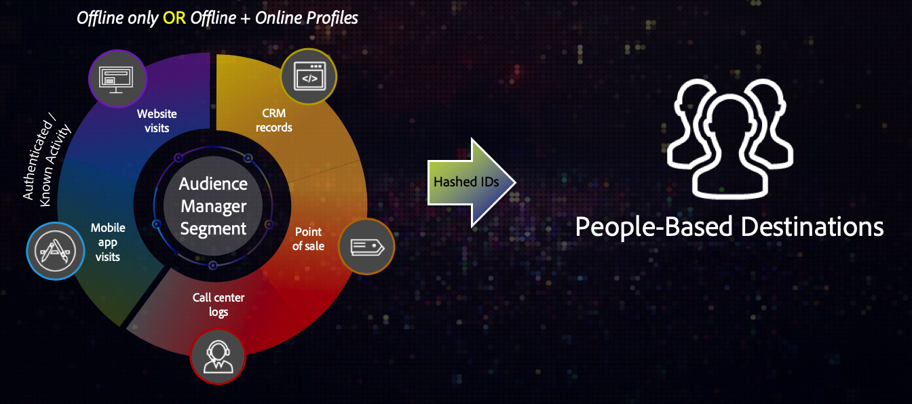
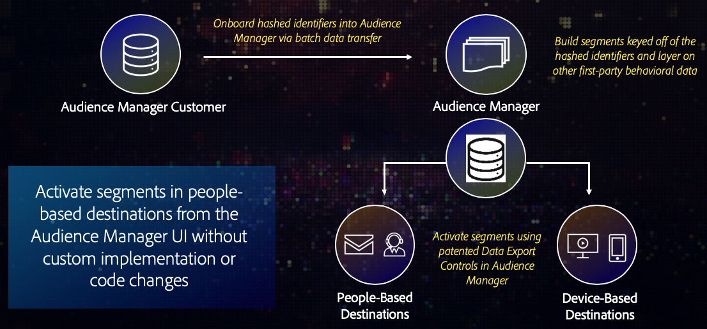

# Overzicht en gebruiksscenario’s {#overview-use-cases}

Gebruik [!DNL People-Based Destinations] om de segmenten van het eerste publiek naar op mens-gebaseerde milieu&#39;s te verzenden. Deze omgevingen zijn gesloten ecosystemen die behoren tot één entiteit die de inhoud beheert die erin wordt weergegeven. Hieronder vallen sociale platforms zoals [!DNL Facebook], en andere platforms die afhankelijk zijn van klantenaccounts om de weergegeven inhoud aan te passen.

>[!IMPORTANT]
>Dit artikel bevat productdocumentatie die u door de opstelling en het gebruik van deze eigenschap moet begeleiden. Niets in dit document is juridisch advies. Raadpleeg uw eigen juridisch adviseur voor juridische begeleiding.

## Overzicht {#overview}

[!DNL People-Based Destinations] laat u toe om segmentatie op online en off-line gegevens toe te passen om publiekssegmenten tot stand te brengen die op  [gehakte herkenningstekens](people-based-destinations-prerequisites.md#hashing-requirements), zoals e-mailadressen of telefoonaantallen worden gebaseerd. Vervolgens kunt u deze segmenten naar zogenaamde tuinen sturen, zoals [!DNL Facebook], waar u uw doelgroep kunt richten op de sociale platforms. [!DNL People-Based Destinations] kan u helpen:

* offline- en onlinedoelpubliek op platforms zoals [!DNL Facebook], gebaseerd op gehashte e-mailadressen;
* bestaande apparaat- en cookie-doelmogelijkheden van Audience Manager aanvullen;
* kosten wegnemen die verband houden met gegevens van derden over instapoplossingen;
* Elimineer kosten verbonden aan het ontwikkelen van douanegegevens op instapwerkschema&#39;s;
* doelpubliek in omgevingen zonder cookie;
* Doelpubliek door gehashte e-mailadressen te dedupliceren die overeenkomen met klant-id&#39;s.

U kunt [!DNL People-Based Destinations] gebruiken om klanten met een hoge waarde te segmenteren en te richten die uw website mogelijk niet bezoeken, of ophouden doelend hen te richten die reeds off-line hebben omgezet. Daarnaast kunt u [!DNL Profile Merge Rules] gebruiken om uw offline gegevens van de eerste partij te combineren met uw online gegevens van de eerste partij, waaronder klantgegevens van andere Adobe Experience Cloud-oplossingen, om uw advertentieinspanningen op het gebied van sociale media te optimaliseren.

## Beschikbaarheid {#availability}

[!DNL People-Based Destinations] is een eersteklas integratie van Audience Managers. Neem contact op met uw Adobe-vertegenwoordiger om gebruik te maken van deze premiumfunctie.

## Waarom moet u [!UICONTROL People-Based Destinations] {#why-use} gebruiken?

**Verstrek uw klanten verenigbare dwars-kanaalervaringen door uw volledige publiekssegmentatie van binnen Audience Manager te beheren.**

Als u uw publiekssegmenten niet via Audience Manager in op mensen gebaseerde kanalen activeert, ontstaat een onsamenhangende ervaring tussen wat uw klanten zien bij het bezoeken van uw website en wat ze bijvoorbeeld zien in hun [!DNL Facebook]-feeds. Als u een consistente keuze hebt gemaakt tussen verschillende kanalen, kunt u uw advertentie-inkomsten verhogen en uw advertentiepatronen optimaliseren.

**Bereik publiek in mensen-gebaseerde kanalen zonder de behoefte van een specifieke gegevens op instapoplossing of douanegelaars om publiek te verzenden.**

De meer &quot;traditionele&quot;manier om publiek over op mensen-gebaseerde kanalen te richten impliceert u het moeten uw klantengegevens in een formaat uitvoeren dat door het platform wordt goedgekeurd dat u wilt adverteren, en dan het gebruiken van de specifieke gegevens van het platform op instapmethode om uw klantengegevens aan uw adverteerderrekening te brengen. Dit is al handwerk dat u moet doen voor elk platform waarop u wilt adverteren. Bovendien kunnen verschillende platforms verschillende gegevensindelingsvereisten hebben, waardoor het proces nog vervelender wordt.

Via [!DNL People-Based Destinations] helpt Audience Manager u uw klantgegevens te centraliseren, publiekssegmenten op te bouwen en deze via meerdere op personen gebaseerde kanalen te activeren. U kunt dit allemaal doen vanuit de gebruikersinterface van de Audience Manager, zodat u geen extra werkzaamheden hoeft uit te voeren om handmatig gegevens naar elk platform te uploaden, zodat u kostbare tijd bespaart in het proces.

**Maak en activeer publiekssegmenten vanuit zuiver offline profielen.**

[!DNL People-Based Destinations] los de kwestie op die eerder, u publiekssegmenten kon slechts activeren die op apparatenactiviteit wordt gebaseerd. Met [!DNL People-Based Destinations], kunt u segmenten van puur off-line gegevens van uw eigen [!DNL CRM] tot stand brengen, en hen activeren op mensen-gebaseerde platforms. Bovendien kunt u uw offlinegegevens correleren met apparaatgegevens die u al in Audience Manager hebt.

**Gebruik gegevensbeheer en privacycontroles van Audience Managers om klantgegevens veilig te verwerken.**

[!DNL People-Based Destinations] vereist dat u onomkeerbaar gehashte herkenningstekens slechts gebruikt. Dit vermindert het risico verbonden aan manueel het uploaden van klantengegevens in elk bestemmingsplatform.

Bekijk de onderstaande video voor een overzicht van de gegevensstroom bij gebruik van [!UICONTROL People-Based Destinations].

>[!VIDEO](https://video.tv.adobe.com/v/28968/)

## Gevallen {#use-cases} gebruiken

Om u beter te helpen begrijpen hoe en wanneer u [!DNL People-Based Destinations] zou moeten gebruiken, zijn hier twee voorbeelden van gebruiksgevallen die de klanten van de Audience Manager door deze eigenschap kunnen oplossen.

### Hoofdlettergebruik 1 {#use-case-1}

Een online detailhandelaar wil bestaande klanten door sociale platforms bereiken en hen gepersonaliseerde aanbiedingen tonen die op hun vorige orden worden gebaseerd. Met [!DNL People-Based Destinations] kan de online detailhandelaar gehakte e-mailadressen van hun eigen [!DNL CRM] aan Audience Manager opnemen, segmenten van hun eigen off-line gegevens bouwen, en deze segmenten verzenden naar de sociale platforms zij willen adverteren op, optimaliserend hun reclame uitgaven.

### Hoofdlettergebruik 2 {#use-case-2}

Een luchtvaartmaatschappij heeft verschillende klantniveaus (Bronze, Silver en Gold) en wil elk niveau via sociale platforms voorzien van persoonlijke aanbiedingen. Het bedrijf gebruikt Audience Manager om klantenactiviteit op de website te analyseren. Niet alle klanten gebruiken echter de mobiele app van de luchtvaartmaatschappij en sommige van hen hebben zich niet aangemeld bij de website van het bedrijf. De enige id&#39;s die het bedrijf over deze klanten heeft, zijn id&#39;s voor lidmaatschap en e-mailadressen.

Als ze zich op sociale media en vergelijkbare, op mensen gebaseerde kanalen willen richten, kunnen ze de klantgegevens van hun [!DNL CRM] in de Audience Manager opnemen met behulp van de gehashte e-mailadressen als id&#39;s.

Vervolgens kunnen ze hun offlinegegevens combineren met hun bestaande online activiteitskenmerken om nieuwe publiekssegmenten te maken die ze via [!DNL People-Based Destinations] kunnen gebruiken.
