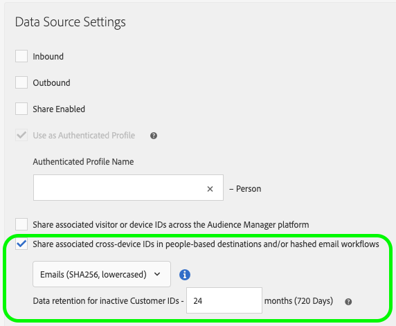

# Vereisten en overwegingen {#prerequisites-considerations}

>[!IMPORTANT]
>Dit artikel bevat productdocumentatie die u door de opstelling en het gebruik van deze eigenschap moet begeleiden. Niets in dit document is juridisch advies. Raadpleeg uw eigen juridisch adviseur voor juridische begeleiding.

Hieronder vindt u een overzicht van de behoeften van klanten waaraan u moet voldoen voordat u zich aanmeldt voor [!UICONTROL People-Based Destinations] .

>[!IMPORTANT]
> Lees dit artikel zorgvuldig door voordat u verdergaat met de implementatiefase.

## Aanmelden voor [!UICONTROL People-Based Destinations] {#signing-up}

[!UICONTROL People-Based Destinations] is een premiumfunctie waarmee u uw Audience Manager-ervaring kunt verbeteren door uw doelgroepen van de eerste partij te activeren in omgevingen die op mensen zijn gebaseerd, door uw doelgroep te richten op aangepaste aanbiedingen op sociale netwerken of via e-mailmarketing.

Neem contact op met uw Adobe-vertegenwoordiger om gebruik te maken van deze premiumfunctie.

## Partner-specifieke vereisten {#partner-prerequisites}

### [!DNL Facebook] {#facebook}

Voordat u [!UICONTROL People-Based Destinations] kunt gebruiken om een publiek van een eerste partij [!UICONTROL segments] naar [!DNL Facebook] te sturen, moet u controleren of aan de volgende vereisten is voldaan:

1. Uw [!DNL Facebook] gebruikersrekening moet **hebben campagnes** toestemming leiden die voor de Advertentierekening wordt toegelaten die u van plan bent te gebruiken.
2. Voeg de **Adobe Experience Cloud** bedrijfsrekening als advertentiepartner in uw [!DNL Facebook Ad Account] toe. Gebruik `business ID=206617933627973`. Zie [&#x200B; Partners aan Uw BedrijfsManager &#x200B;](https://www.facebook.com/business/help/1717412048538897) voor details toevoegen.

   >[!IMPORTANT]
   >Wanneer het vormen van de toestemmingen voor Adobe Experience Cloud, moet u **toelaten leidt campagnes** toestemming. Dit is nodig voor de [!UICONTROL People-Based Destinations]-integratie.

3. Lees en onderteken de [!DNL Facebook Custom Audiences] Servicevoorwaarden. Ga daarvoor naar `https://business.facebook.com/ads/manage/customaudiences/tos/?act=[accountID]`, waarbij `accountID` uw [!DNL Facebook Ad Account ID] is.

### [!DNL LinkedIn] {#linkedin}

Voordat u [!UICONTROL People-Based Destinations] kunt gebruiken om doelsegmenten van de eerste partij naar [!DNL LinkedIn] te verzenden, moet u ervoor zorgen dat uw [!DNL LinkedIn Campaign Manager] -account het machtigingsniveau [!DNL Creative Manager] of hoger heeft.

Leren hoe te om uw [!DNL LinkedIn Campaign Manager] gebruikerstoestemmingen uit te geven, zie [&#x200B; toevoegen, uitgeven, en verwijderen de Toestemmingen van de Gebruiker op de Rekeningen van Advertising &#x200B;](https://www.linkedin.com/help/lms/answer/5753) in de documentatie LinkedIn.

Zie [&#x200B; Begrijpend en Vormend LinkedIn op mensen-Gebaseerde Doel &#x200B;](https://experienceleague.adobe.com/docs/audience-manager-learn/tutorials/data-activation/people-based-destinations/understanding-and-configuring-the-linkedin-pbd.html?lang=nl-NL) voor videoinstructies.

### [!DNL Google Customer Match] {#gcm}

Alvorens u [!UICONTROL People-Based Destinations] kunt gebruiken om uw eerste-partijpubliekssegmenten naar een [!DNL Google Customer Match] bestemming te verzenden, zorg ervoor u leest en aan het beleid van Google voor het gebruiken van [!DNL Customer Match] aanhoudt, die in de [&#x200B; de steundocumentatie van Google &#x200B;](https://support.google.com/google-ads/answer/6299717) wordt geschetst.

Controleer vervolgens of uw [!DNL Google] -account is geconfigureerd voor een [!DNL Standard] of hoger machtigingsniveau. Zie de [&#x200B; documentatie van Ads van Google &#x200B;](https://support.google.com/google-ads/answer/9978556?visit_id=637611563637058259-4176462731&rd=1) voor details.

Klanten met compatibele accounts worden automatisch door Google aangeboden.

## Gegevens aan boord {#data-onboarding}

>[!IMPORTANT]
>
>Alle Audience Manager-klanten kunnen gehashte e-mailberichten ontvangen zonder zich aan te melden voor [!UICONTROL People-Based Destinations] .

Gegevensinvoer voor [!UICONTROL People-Based Destinations] ondersteunt momenteel maximaal 10 gehashte e-mailadressen die zijn gekoppeld aan één klant-id ([!DNL CRM ID] ) per batchoverdracht.

Door meer dan 10 gehashte e-mailadressen te uploaden die aan één klant-id zijn gekoppeld in meerdere batchoverdrachten, behoudt Audience Manager de meest recente 10 toegevoegde e-mailadressen.

Om gehakte herkenningstekens in te nemen, [&#x200B; creeer een dwars-apparatengegevensbron voor gehakte herkenningstekens &#x200B;](../create-data-source-hashed-emails.md) en laat de **[!UICONTROL Share associated cross-device IDs in people-based destinations and/or hashed email workflows]** optie toe.

## Gegevensprivacy {#data-privacy}

Hoewel u in [!UICONTROL People-Based Destinations] doelgroepen kunt kiezen op basis van hashed-e-mailadressen die door u zijn geüpload, kunt u nog steeds geen rechtstreeks identificeerbare bezoekersgegevens uploaden naar Audience Manager. In de gegevensinstapfase moet u ervoor zorgen dat de e-mailadressen die u wilt gebruiken, worden gehasht met het algoritme [!DNL SHA256] . Anders kunt u ze niet gebruiken in [!UICONTROL People-Based Destinations] .

## Gegevenshashing versus codering {#data-hashing-encryption}

Codering is een bidirectionele functie. Gecodeerde informatie kan ook worden gedecodeerd met de juiste decoderingssleutel. Het versleutelen van gegevens in het kader van Audience Manager brengt ernstige risico&#39;s met zich mee, aangezien gecodeerde vormen van persoonlijk identificeerbare informatie ook kunnen worden gedecodeerd. In tegenstelling tot versleuteling is [!UICONTROL People-Based Destinations] ontworpen om te werken met gehashte gegevens.

Hashing is een eenrichtingsfunctie die de invoer roteert om een uniek resultaat te produceren. Door het gebruiken van juiste het hakken algoritmen, zoals [!DNL SHA256], is er geen manier om de het hakken functie om te keren en de onbezoedelde informatie te openbaren. De e-mailadressen die u aan boord van Audience Manager wilt plaatsen, moeten met het algoritme [!DNL SHA256] worden gehasht. Op deze manier weet u zeker dat Audience Manager geen ononderbroken e-mailadressen ontvangt.

## Hashing-vereisten {#hashing-requirements}

Wanneer het hashen van de e-mailadressen, zorg ervoor om aan de volgende vereisten te voldoen:

* Alle spaties aan het begin en aan het einde van de e-mailtekenreeks bijsnijden, bijvoorbeeld: `johndoe@example.com` , niet `<space>johndoe@example.com<space>` ;
* Wanneer u de e-mailtekenreeksen hasht, moet u ervoor zorgen dat de kleine-lettertekenreeks wordt gehaseerd.
   * Voorbeeld: `example@email.com` , not `EXAMPLE@EMAIL.COM` ;
* Controleer of de hashtekenreeks in kleine letters staat
   * Voorbeeld: `55e79200c1635b37ad31a378c39feb12f120f116625093a19bc32fff15041149` , not `55E79200C1635B37AD31A378C39FEB12F120F116625093A19bC32FFF15041149` ;
* Zilp de tekenreeks niet.

Bekijk de onderstaande video om te zien wat de hashingvereisten van [!UICONTROL People-Based Destinations] zijn.

>[!VIDEO](https://video.tv.adobe.com/v/29003/)

Adobe Experience Cloud biedt u de mogelijkheid om de id&#39;s van de klant via de [!DNL Adobe Experience Platform Identity Service (ECID)] te verbergen. Zie [&#x200B; SHA256 het Hashing Steun voor setCustomerIDs &#x200B;](https://experienceleague.adobe.com/docs/id-service/using/reference/hashing-support.html?lang=nl-NL) voor gedetailleerde informatie over hoe te om ECID te gebruiken om klant IDs te hakken.

## Gebruikersmachtiging verkrijgen {#obtaining-user-permission}

Aangezien [!UICONTROL People-Based Destinations] u helpt om de gegevens van het eerste publiek in mensen-gebaseerde kanalen te activeren, is het uw verantwoordelijkheid om om het even welke noodzakelijke toestemmingen van uw klanten te informeren en te verkrijgen over hoe u hun gegevens voor reclame of andere doeleinden zult gebruiken.

Voordat u zich aanmeldt voor [!UICONTROL People-Based Destinations] , moet u ervoor zorgen dat uw klanten hiervoor toestemming krijgen voordat u hun gegevens voor reclamedoeleinden gebruikt.

In het geval dat uw klanten om van reclamecampagnes willen opteren, zie [&#x200B; uit Beheer &#x200B;](../../overview/data-security-and-privacy/data-privacy-requests.md) voor details over hoe te om Audience Manager te verhinderen om gegevens verder te verzamelen.

## Het afdwingen van de Activering van Gegevens van de Eerste Partij {#enforcing-first-party-activation}

Wanneer u [!UICONTROL People-Based Destinations] gebruikt, kunt u alleen gegevens van de eerste partij gebruiken om publiekssegmenten in op personen gebaseerde kanalen te activeren. U kunt geen gegevens van derden of derden gebruiken voor activering van het publiek in op personen gebaseerde kanalen.

Wanneer het gebruiken van [!UICONTROL People-Based Destinations], gebruik [&#x200B; de Controles van de Uitvoer van Gegevens &#x200B;](../data-export-controls.md) om uw [!UICONTROL data sources] en [!UICONTROL destinations] volgens de richtlijnen en de vereisten van bestemmingsplatforms en gegevensleveranciers te etiketteren.

## Aan boord voor authentiek verklaarde Hashed IDs door Verklaarde identiteitskaart richtend {#onboard-authenticated-declared-id}

Er zijn twee manieren waarop u offline data in Audience Manager kunt opnemen voor [!UICONTROL People-Based Destinations].

* [&#x200B; verzendt partijgegevens &#x200B;](../../integration/sending-audience-data/batch-data-transfer-explained/batch-data-transfer-overview.md) naar Audience Manager om gehakt e-mailadressen in te voeren. Met deze methode kunt u desgewenst de gehashte e-mailadressen uit uw [!DNL CRM] -database in [!UICONTROL People-Based Destinations] gebruiken. Bovendien, wanneer het gebruiken van deze methode, kunt u de gehakte e-mailadressen voor [&#x200B; ook kwalificeren onboded traits &#x200B;](../traits/trait-and-segment-qualification-reference.md).
* Het gebruik [&#x200B; verklaarde IDs &#x200B;](../declared-ids.md) om gehakt e-mailadressen te verklaren wanneer het overgaan in voor authentiek verklaarde klant IDs. Als u deze methode gebruikt, verzendt Audience Manager namens u alleen de gehashte e-mailadressen van gebruikers die online zijn geverifieerd naar [!UICONTROL People-Based Destinations] . De e-mailadressen die via op personen gebaseerde kanalen worden geactiveerd, zijn alleen de adressen in de gedeclareerde id-gebeurtenisaanroepen. Andere e-mailadressen die aan de klant-id zijn gekoppeld, worden niet in realtime verzonden.
