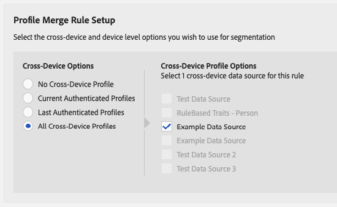

# Workflow B - Personalisatie gebaseerd op data die alleen offline beschikbaar zijn {#workflow-b}

>[!IMPORTANT]
>Dit artikel bevat productdocumentatie die u door de opstelling en het gebruik van deze eigenschap moet begeleiden. Niets in dit document is juridisch advies. Raadpleeg uw eigen juridisch adviseur voor juridische begeleiding.

Deze pagina omvat geleidelijke begeleiding op hoe te om publiekssegmenten van off-line-enige klantengegevens te bouwen, en hen te verzenden naar op mensen-Gebaseerde Doelen.

## Stap 1 - Offline treinreizen {#step-1-onboard-traits}

De eerste stap die tot publiekssegmenten in dit scenario leidt is uw off-line klantengegevens in Audience Manager te brengen.

>[!IMPORTANT]
>
> Voordat u verdergaat, moet u ervoor zorgen dat de klantactiviteit die u op het punt staat aan boord al is gedefinieerd in Audience Manager met de bijbehorende [ongebogen eigenschappen](../traits/trait-and-segment-qualification-reference.md).

Ongeacht of uw bestaande klant-id&#39;s van de Audience Manager ([DPUUID&#39;s](../../reference/ids-in-aam.md)) gehashte e-mails zijn of niet, moet u de eigenschap aan boord uitvoeren tegen de gegevensbron die uw [DPUUID&#39;s](../../reference/ids-in-aam.md).

### Voorbeeld

U wilt de klant-id&#39;s uit de onderstaande tabel kwalificeren voor de bijbehorende onbeheerde handels-id&#39;s. Laten we in overweging nemen dat uw [DPUUID&#39;s](../../reference/ids-in-aam.md) worden opgeslagen in een gegevensbron met identiteitskaart 999999, en uw Audience Manager gegevensbron identiteitskaart is 123.

| Klant-id (DPUUID) | Aan boord genomen Trait ID |
| -------------------------------------- | ------------------- |
| 68079982765673198504052656074456196039 | 12345, 23456 |
| 67412682083411995725538770443620307584 | 45678 |
| 89159024796760343733111707646026765593 | 11223, 93342, 27341 |

<br />

Als u de klant-id&#39;s in het bovenstaande voorbeeld wilt kwalificeren voor de overeenkomende ongeregistreerde kenmerken, moet u een [binnenkomend gegevensbestand](../../integration/sending-audience-data/batch-data-transfer-explained/inbound-file-contents.md) met de volgende inhoud:

```
68079982765673198504052656074456196039<TAB>d_sid=12345,d_sid=23456
67412682083411995725538770443620307584<TAB>d_sid=45678
89159024796760343733111707646026765593<TAB>d_sid=11223,d_sid=93342,d_sid=27341
```

De bestandsnaam zou er als volgt uitzien: `ftp_dpm_999999_123_TIMESTAMP.sync.gz`.
Zie [Amazon S3-vereisten voor naam en bestandsgrootte voor binnenkomende gegevensbestanden](../../integration/sending-audience-data/batch-data-transfer-explained/inbound-s3-filenames.md) voor meer informatie over de structuur van de bestandsnaam.

## Stap 2 - de Montages van de Gegevensbron vormen {#configure-data-source-settings}

Afhankelijk van of uw [DPUUID&#39;s](../../reference/ids-in-aam.md) Als het om kleine letters gaat, kan het zijn dat u de gegevensbron moet vormen die de gehakte e-mailadressen zal opslaan.

 

**Scenario 1: uw [DPUUID&#39;s](../../reference/ids-in-aam.md) zijn al kleine, gehashte e-mailadressen.**

In dit geval moet u de overeenkomstige gegevensbron als dusdanig etiketteren:

1. Ga naar **[!UICONTROL Audience Data]** -> **[!UICONTROL Data Sources]**.
1. Zoek de gegevensbron die uw [DPUUID&#39;s](../../reference/ids-in-aam.md)en klik erop.
1. Controleer of de optie **[!UICONTROL Cannot be tied to personally identifiable information]** is uitgeschakeld.
1. Sla de gegevensbroninstellingen op.

 

**Scenario 2: uw [DPUUID&#39;s](../../reference/ids-in-aam.md) zijn geen kleine, gehashte e-mailadressen.**

In dit geval moet u een nieuwe gegevensbron voor meerdere apparaten maken waarin uw gehashte e-mailadressen worden opgeslagen. Dit doet u als volgt:

1. Meld u aan bij uw Audience Manager-account en ga naar **[!UICONTROL Audience Data]** -> **[!UICONTROL Data Sources]** en klik op **[!UICONTROL Add New]**.
1. Voer een **[!UICONTROL Name]** en **[!UICONTROL Description]** voor uw nieuwe gegevensbron.
1. In de **[!UICONTROL ID Type]** vervolgkeuzelijst, selecteert u **[!UICONTROL Cross Device]**.
1. In de **[!UICONTROL Data Source Settings]** selecteert u beide **[!UICONTROL Inbound]** en **[!UICONTROL Outbound]** en schakelt u de **[!UICONTROL Share associated cross-device IDs in people-based destinations]** optie.
1. Selecteer in het keuzemenu de optie **[!UICONTROL Emails(SHA256, lowercased)]** label voor deze gegevensbron.
   >[!IMPORTANT]
   >
   >Met deze optie wordt alleen de gegevensbron gelabeld met gegevens die zijn gehasht met dat specifieke algoritme. De Audience Manager hash de gegevens bij deze stap niet. Zorg ervoor dat de e-mailadressen die u wilt opslaan in deze gegevensbron al zijn gehasht met de [!DNL SHA256] algoritme. Anders kunt u deze niet gebruiken [!DNL People-Based Destinations].

   

   >[!NOTE]
   >
   > Zie [Gegevens aan boord](people-based-destinations-prerequisites.md#data-onboarding) voor vaak gestelde vragen over hoe u uw off-line gegevens in Audience Manager voor Op mensen-Gebaseerde Doelen zou moeten brengen.

Bekijk de onderstaande video voor een videozelfstudie over het maken van een gegevensbron voor [!UICONTROL People-Based Destinations].

>[!VIDEO](https://video.tv.adobe.com/v/29006/)

## Stap 3 - Identiteitskaart van de Gelijke aan Onderbroken E-mailadressen via dossier-Gebaseerde Synchronisatie van identiteitskaart {#match-ids-emails}

>[!IMPORTANT]
>
> Deze stap is alleen van toepassing op [Scenario 2](people-based-destinations-workflow-offline.md#configure-data-source-settings) hierboven beschreven. Als uw bestaande [DPUUID&#39;s](../../reference/ids-in-aam.md) zijn al gehashte e-mailadressen, sla aan over [Stap 4 - creeer een Regel van de Fusie van het Profiel voor Segmentatie](#create-profile-merge-rule).

Stel dat u uw bestaande [DPUUID&#39;s](../../reference/ids-in-aam.md) van het voorbeeld bij Stap 1 aan de gehakte e-mailadressen van de lijst hieronder (juiste kolom), en sla de gehakte e-mailadressen in de nieuwe gegevensbron op die u bij creeerde [Stap 2 - de Montages van de Gegevensbron vormen](#configure-data-source-settings).

Ter herinnering: u hebt nu twee gegevensbronnen:

| Gegevensbron-id | Inhoud gegevensbron |
| -------------- | -------------------------- |
| 999999 | Bestaande DPUUID&#39;s (CRM-ID&#39;s) |
| 987654 | Onderbroken e-mailadressen |

| DPUUID&#39;s (CRM-ID&#39;s) | E-mailadres | Onderbroken e-mailadres |
| -------------------------------------- | --------------------- | ---------------------------------------------------------------- |
| 68079982765673198504052656074456196039 | `johndoe@example.com` | 55e79200c1635b37ad31a378c39feb12f120f116625093a19bc32fff15041149 |
| 67412682083411995725538770443620307584 | `janedoe@email.com` | 16d72e3edbeb089b299e0d12fc09522fdc5ece2d11dcb1304ecdd6fab4f7193a |
| 89159024796760343733111707646026765593 | `name@mydomain.com` | feec5debcea411f54462a345a0d90c9975415d2d4862745ff8af00c49b6b4ae6 |

 

In ons voorbeeld [ID-synchronisatiebestand](../../integration/sending-audience-data/batch-data-transfer-explained/id-sync-file-based.md) zou de volgende inhoud hebben:

```
68079982765673198504052656074456196039<TAB>55e79200c1635b37ad31a378c39feb12f120f116625093a19bc32fff15041149
67412682083411995725538770443620307584<TAB>16d72e3edbeb089b299e0d12fc09522fdc5ece2d11dcb1304ecdd6fab4f7193a
89159024796760343733111707646026765593<TAB>feec5debcea411f54462a345a0d90c9975415d2d4862745ff8af00c49b6b4ae6
```

 

De [ID-synchronisatiebestand](../../integration/sending-audience-data/batch-data-transfer-explained/id-sync-file-based.md) moet de volgende naamgevingsstructuur volgen:

`c2c_id_<DPUUID_DATA_SOURCE_ID>_<HASHED_EMAIL_DATA_SOURCE_ID>_TIMESTAMP.sync`

 

In het bovenstaande voorbeeld ziet de bestandsnaam er als volgt uit:
`c2c_id_999999_987654_1560431657.sync`

[Voorbeeldbestand hier downloaden](assets/c2c_id_999999_987654_1560431657.sync).

Nadat u het bestand voor id-synchronisatie hebt gemaakt, moet u het uploaden naar een [!DNL Amazon S3] emmertje. Ga voor meer informatie over het uploaden van ID-synchronisatiebestanden naar [Batchgegevens naar Audience Manager verzenden](../../integration/sending-audience-data/batch-data-transfer-explained/batch-data-transfer-overview.md).

## Stap 4 - creeer een Regel van de Fusie van het Profiel voor Segmentatie {#create-profile-merge-rule}

De volgende stap is het creëren van een nieuwe fusieregel die u zal helpen de publiekssegmenten tot stand brengen om naar uw te verzenden [!DNL People-Based Destinations].

1. Meld u aan bij uw Audience Manager-account en ga naar **[!UICONTROL Audience Data]** -> **[!UICONTROL Profile Merge Rules]**.
2. Klik op [!UICONTROL Add New Rule].
3. Een regel voor het samenvoegen van profielen invoeren **[!UICONTROL Name]** en **[!UICONTROL Description]**.
4. In de **[!UICONTROL Profile Merge Rule Setup]** selecteert u de **[!UICONTROL All Cross-Device Profiles]** van de **[!UICONTROL Cross-Device Options]** lijst.
5. In de **[!UICONTROL Cross-Device Profile Options]** selecteert u de gegevensbron waarop uw eigenschappen betrekking hebben.
   

## Stap 5 - Audience-segmenten maken {#create-audience-segments}

Als u nieuwe segmenten wilt maken op basis van alleen-offline gegevens, gebruikt u de opdracht [Segment Builder](../segments/segment-builder.md) en zorg ervoor u de nieuwe lijn van de profielfusie gebruikt die u in de vorige stap creeerde toen het creëren van het segment.

## Stap 6 - Vorm Op mensen-Gebaseerde Authentificatie van het Platform {#configure-authentication}

1. Meld u aan bij uw Audience Manager-account en ga naar **[!UICONTROL Administration]** > **[!UICONTROL Integrated Accounts]**. Als u een eerder geconfigureerde integratie met een sociaal platform hebt, wordt deze in deze pagina weergegeven. Anders is de pagina leeg.
   
1. Klik op **[!UICONTROL Add Account]**.
1. Gebruik de **[!UICONTROL People-Based Platform]** vervolgkeuzelijst om het platform te selecteren waarmee u de integratie wilt configureren.
   
1. Klikken **[!UICONTROL Confirm]** om te worden omgeleid naar de authentificatiepagina van het geselecteerde platform.
1. Nadat u zich hebt geverifieerd op uw account voor het sociale platform, wordt u omgeleid naar de Audience Manager waar de accounts van uw adverteerders moeten worden weergegeven. Selecteer het adverteerderaccount dat u wilt gebruiken en klik op **[!UICONTROL Confirm]**.
1. Audience Manager geeft boven aan de pagina een melding weer om te laten weten of de account is toegevoegd. Met de melding kunt u ook een contact-e-mailadres toevoegen om meldingen te ontvangen wanneer de verificatie van het sociale platform bijna verlopen is.

>[!IMPORTANT]
>
>De Audience Manager behandelt de integratie met sociale platforms door authentificatietokens die na een bepaalde hoeveelheid tijd verlopen. Zie Verificatietokens vernieuwen voor meer informatie over het vernieuwen van de verlopen tokens.

## Stap 7 - creeer een op mensen-gebaseerde Bestemming {#create-destination}

1. Meld u aan bij uw Audience Manager-account, ga naar **[!UICONTROL Audience Data]** > **[!UICONTROL Destinations]** en klik op **[!UICONTROL Create Destination]**.
1. In de **[!UICONTROL Basic Information]** in, voert u een **[!UICONTROL Name]** en **[!UICONTROL Description]** voor uw nieuwe gegevensbron, en gebruik de volgende montages:
   * **[!UICONTROL Category]**: geïntegreerde Platforms;
   * **[!UICONTROL Type]**: personen;
   * **[!UICONTROL Platform]**: selecteer het op mensen-gebaseerde platform dat u publiekssegmenten naar wilt verzenden;
   * **[!UICONTROL Account]**: Selecteer het gewenste adverteerderaccount dat aan het geselecteerde platform is gekoppeld.
      
1. Klik op **[!UICONTROL Next]**.
1. Kies de optie **[!UICONTROL Data Export Labels]** die u voor dit doel wilt instellen.
1. In de **[!UICONTROL Configuration]** selecteert u de gegevensbron die uw gehashte gegevensbronnen bevat.
1. In de **[!UICONTROL Segment Mappings]** selecteert u de segmenten die u naar dit doel wilt verzenden. Dit zouden de segmenten zijn die u bij creeerde [Stap 5 - Audience-segmenten maken](people-based-destinations-workflow-offline.md#create-audience-segments).
1. Sla het doel op.
