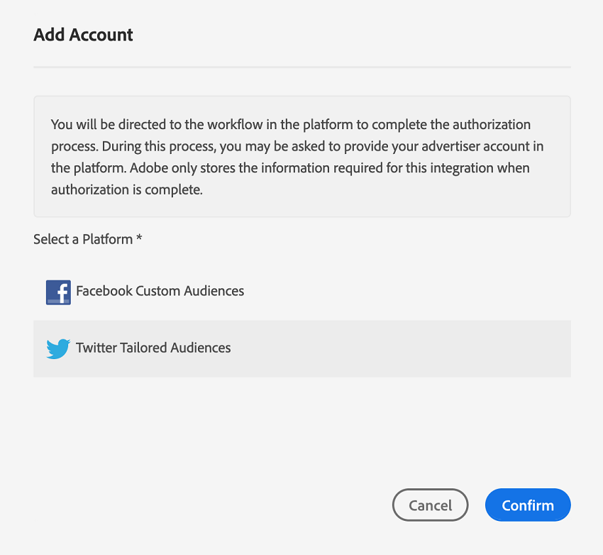
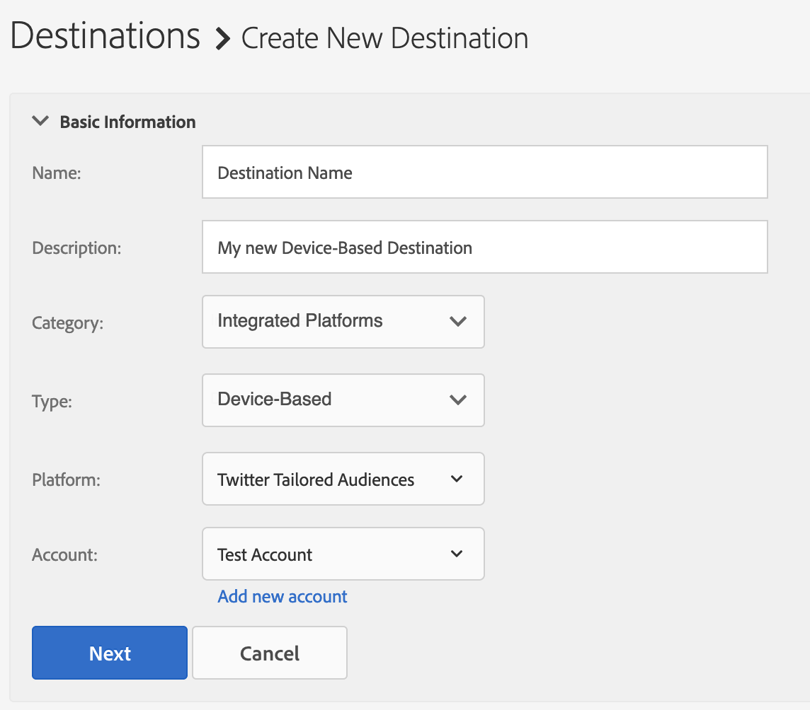

# [!DNL Twitter Custom Audiences] configureren als op apparaat gebaseerde zelfbediening {#configure-twitter}

Dit artikel verklaart hoe te om een integratie met [ te vormenAangepast publiek Twitter ](https://business.twitter.com/en/help/campaign-setup/campaign-targeting/custom-audiences.html).

## Vereisten {#prerequisites}

Voordat u de [!DNL Twitter Custom Audiences] -bestemming configureert, moet u controleren of aan de volgende voorwaarden is voldaan.

* Uw [!DNL Twitter Ads] -account moet in aanmerking komen voor advertenties. Nieuwe [!DNL Twitter Ads] -accounts komen de eerste twee weken na het maken niet in aanmerking voor reclame.
* Uw [!DNL Twitter] gebruikersrekening die u toegang voor in Audience Manager verleende moet de [ toegelaten toestemming van de het publieksmanager van de Partner hebben ](https://business.twitter.com/en/help/troubleshooting/multi-user-login-faq.html#accesslevels).
* Wanneer u de eerste [!DNL Twitter Custom Audiences] -bestemming in uw Audience Manager-exemplaar maakt, neemt u contact op met Adobe Consulting of de klantenservice om de [!DNL Twitter] ID-synchronisatie (Data Source ID = 1123) voor uw account in te schakelen. Dit is vereist voor de juiste synchronisatie tussen Audience Manager en [!DNL Twitter] .

## Een nieuw doel toevoegen [!DNL Twitter Custom Audiences] {#add-new-twitter-destination}

In deze sectie worden de stappen beschreven die u moet volgen bij het configureren van een nieuwe, op apparaten gebaseerde bestemming voor [!DNL Twitter Custom Audiences] . In dit scenario wordt ervan uitgegaan dat u geen bestaande [!DNL Twitter Custom Audiences] bestemming hebt geconfigureerd via uw Adobe-consultant of klantenservice.

### Stap 1. Verifiëren met [!DNL Twitter Custom Audiences] {#step1-authenticate-with-twitter}

Voordat u de op een apparaat gebaseerde bestemming kunt toevoegen, moet u Audience Manager en uw [!DNL Twitter Custom Audiences] -account koppelen. Dit doet u als volgt:

1. Meld u aan bij uw Audience Manager-account en ga naar **[!DNL Administration > Integrated Accounts]** . Als u een eerder gevormde integratie met een bestemmingsplatform hebt, zou u het in deze pagina moeten zien die. Anders is de pagina leeg.
1. Klik op **[!DNL Add Account]**.
1. Selecteer [!DNL Twitter Custom Audiences] en klik op **[!DNL Confirm]** om te worden omgeleid naar de verificatiepagina.

   

1. Nadat je je hebt geverifieerd, word je doorgestuurd naar Audience Manager waar je de bijbehorende adverteerderaccounts kunt bekijken. Selecteer het adverteerderaccount dat u wilt gebruiken en klik op **[!DNL Confirm]** .

### Stap 2. Een nieuwe op apparaten gebaseerde bestemming maken {#step2-create-new-destination}

Nadat u Audience Manager en uw [!DNL Twitter Custom Audiences] hebt gekoppeld, kunt u de nieuwe bestemming maken. Dit doet u als volgt:

>[!NOTE]
>
>U kunt de naam van een bestaand op apparaat gebaseerd doel niet wijzigen. Zorg ervoor om een naam te verstrekken die u zal helpen de bestemming correct identificeren.

1. Meld u aan bij uw Audience Manager-account, ga naar **[!DNL Audience Data > Destinations]** en klik op **[!DNL Create Destination]** .
1. In de **[!DNL Basic Information]** sectie, ga a **[!DNL Name]** en **[!DNL Description]** voor uw nieuwe bestemming in, en gebruik hieronder de montages: 
1. Klik op **[!DNL Next]**.
1. Kies de [ Etiketten van de Uitvoer van Gegevens ](/help/using/features/data-export-controls.md#controls-labels) die u voor deze bestemming wilt plaatsen.
1. Klik op **[!DNL Save]**.
1. Selecteer in de sectie **[!DNL Segment Mappings]** de publiekssegmenten die u naar deze bestemming wilt verzenden.
1. Sla het doel op.

## Overwegingen bij het toewijzen van segmenten {#segment-mapping-considerations}

Wanneer u publiekssegmenten aan [!UICONTROL Twitter] toewijst, moet u ervoor zorgen dat aan de volgende vereisten voor segmentnaamgeving wordt voldaan:

* Verstrek de mens-leesbare namen van de segmentafbeelding. We raden u aan dezelfde naam te gebruiken als voor de Audience Manager-segmenten.
* Gebruik geen speciale tekens (`+` `&` `,` `%` `:` `;` `@` `/` `=` `?` `$` ) in segment- en segmenttoewijzingsnamen. Als uw Audience Manager-segmentnaam deze tekens bevat, verwijdert u deze voordat u het segment toewijst aan een [!UICONTROL Twitter] -doel.

### Voorbeeld

* Correcte segmentnaam of karteringsnaam: &quot;Amerikaanse en Europese kopers&quot;;
* Onjuiste segment- of toewijzingsnaam: &quot;US, European 5h0pP3rs&quot;.

>[!IMPORTANT]
>
>U kunt de namen van al toegewezen segmenten niet wijzigen. Audience Manager gebruikt de segmentnamen om de segmenten in de integratie correct te identificeren.

## Aandachtspunten {#match-rates-considerations}

* De integratie tussen Audience Manager en [!UICONTROL Twitter Custom Audiences] ondersteunt historische publieksbackfills. Alle segmentkwalificaties worden naar [!UICONTROL Twitter] verzonden wanneer u het doel maakt.

## Problemen oplossen {#troubleshooting}

Bij het configureren of verzenden van gegevens naar de bestemming Aangepast publiek van Twitter, kunnen de hieronder beschreven fouten optreden. In deze sectie wordt uitgelegd wat de fouten kan veroorzaken en hoe u deze kunt corrigeren.

| Foutbericht | Voorval/Reden | Resolutie |
|---|---|---|
| `Internal server error` | Dit foutbericht wordt weergegeven in de gebruikersinterface van Audience Manager wanneer u probeert een nieuwe [!DNL Twitter] -account toe te voegen met een verouderde versie van de Twitter-API. | Neem contact op met de klantenservice van Adobe. |
| `Twitter Error: This request is not properly authenticated` | Dit foutbericht wordt weergegeven in de gebruikersinterface van Audience Manager wanneer wordt geprobeerd segmenten met niet-ondersteunde segmentnamen toe te wijzen aan de bestemming. | Controleer de toegewezen segmentnamen en zorg ervoor dat deze geen niet-ondersteunde tekens bevatten. Zie [ overwegingen van de segmentafbeelding ](#segment-mapping-considerations) voor de lijst van niet gestaafde karakters. |
| `Twitter Error: Account XXXXXXXXX was not found` | Dit foutbericht wordt weergegeven in de gebruikersinterface van Audience Manager wanneer de aanmeldingsgegevens die voor de bestemming zijn geconfigureerd, niet zijn geautoriseerd voor toegang tot het overeenkomstige Twitter Ads-account. | <ul><li>Zorg de rekeningsgeloofsbrieven ervoor dat u gebruikt aan de [ eerste vereisten ](#prerequisites) voldoen.</li><li>Navigeer naar de interface Twitter Ads met dezelfde referenties en controleer of het juiste publiek wordt weergegeven onder het corresponderende account van `XXXXXXXXX` . </li></ul> |