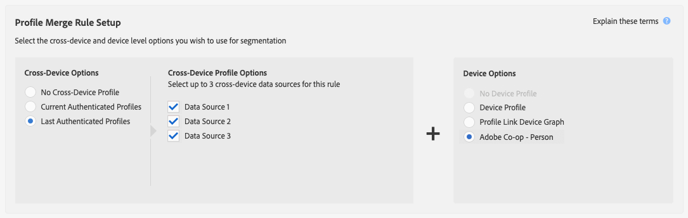

# Gebruiksscenario&#39;s voor grafiek van externe apparaten {#external-device-graph-use-cases}

Aanbevelingen en gebruiksgevallen voor het doorzoeken, opnieuw richten en personaliseren van onbekende gebruikers met een externe apparaatgrafiek. Een externe apparaatgrafiek wordt gedefinieerd als een apparaatgrafiek die los staat van de Audience Manager. Dit omvat de [!DNL Adobe Experience Cloud Device Co-op] en andere integratie die Adobe heeft met externe deterministische of probabilistische bedrijven voor apparaatgrafieken.

## Aanbevelingen {#recommendations}

Houd rekening met de grafiekopties voor apparaten [!DNL Experience Cloud Device Co-op] en apparaten van derden voor campagnes die:

* Een laag verificatieniveau hebben voor alle digitale eigenschappen. Gebruik de optie [!UICONTROL Profile Link Device Graph option] als u een groot aantal geverifieerde gebruikers hebt.
* Target, groot publiek. Apparaatgrafieken [!DNL Experience Cloud Device Co-op] en apparaatgrafieken van derden bevatten geverifieerde en niet-geverifieerde gegevens.
* Segment geauthenticeerde en/of ongeautoriseerde bezoekers op individueel en huishoudelijk niveau.

<!-- 
## Prospecting/Branding Use Case {#prospecting-branding-use-cases}

A branding campaign is designed to reach as many people as possible. It places few limits on segment qualification. But, these campaigns can waste budget and impressions by constantly targeting people who see your content multiple times and don't convert. A [!UICONTROL Profile Merge] rule that uses the [!DNL Device Co-op] or third-party option can help you create an efficient branding campaign. For example, you can add these unknown users to a "not in-market" segment after seeing them across multiple devices for your set frequency cap.

<table id="table_00F6EED172574E80A38CADA8A92A23B1"> 
 <thead> 
  <tr> 
   <th colname="col1" class="entry"> Use Case </th> 
   <th colname="col2" class="entry"> Description </th> 
  </tr> 
 </thead>
 <tbody> 
  <tr> 
   <td colname="col1"> 
 <b>Conditions</b> 
 </td> 
   <td colname="col2">This use case assumes these conditions: 
 
     <ul id="ul_F5CA7EE525774F7EBA5FBB5F94E4EDC8"> 
      <li id="li_81AE304924724146A24FAB5B6533AD8E">You want to deliver a maximum of 10 impressions to an anonymous user for a specific ad campaign. </li> 
      <li id="li_E371F989735245B0B82433DE240D56D0">A user has 4 devices and may or may not have authenticated on your site. </li> 
      <li id="li_9231ABE15CA249E6B79D8BF0E511FD33">An anonymous user sees the ad a total of 10 times while browsing in an unauthenticated state on their current device and 3 devices linked to the current device by an external device graph. </li> 
      <li id="li_8C276C07019C49EFA3A0D0D54CF73C31">You have defined an  Audience Manager segment to qualify anonymous users after they have seen 10 impressions. </li> 
     </ul> 
 </td> 
  </tr> 
  <tr> 
   <td colname="col1"> 
 <b>Results</b> 
 </td> 
   <td colname="col2"> 
Given these conditions,  Audience Manager: 
 
 
     <ul id="ul_8E988B1005324526BC6DC6637BBACCFB"> 
      <li id="li_C9DD546754914BACB8F4C92C7D4ED70E">Merges the anonymous, unauthenticated activity collected from the current device and the 3 devices linked by the external device graph (the ad impressions from each device). </li> 
      <li id="li_FB55CB9116074525BA30FF062D1136AE">Evaluates the unauthenticated user for segment qualification based on a combination of anonymous activity across all 3 devices linked by the external device graph and the current device. </li> 
      <li id="li_B28EB32F718145A7ABBDAC0AF75E2AFC">Sends the segment to any real-time destination for use as a suppression segment on the current device and all 3 devices linked by the external device graph. </li> 
     </ul> 
 </td> 
  </tr> 
 </tbody> 
</table>

## Retargeting or Site Personalization Use Case {#retargeting-use-case}

These strategies are designed to bring an unauthenticated or unknown user back to your site or personalize their browsing experience while they're on-site.

<table id="table_0EE2052AA3E744B3B76036FC06B5A453"> 
 <thead> 
  <tr> 
   <th colname="col1" class="entry"> Use Case </th> 
   <th colname="col2" class="entry"> Description </th> 
  </tr> 
 </thead>
 <tbody> 
  <tr> 
   <td colname="col1"> 
 <b>Conditions</b> 
 </td> 
   <td colname="col2">This use case assumes these conditions: 
 
     <ul id="ul_FD0B869B4AF3453FAEC9BA3A45ABF039"> 
      <li id="li_8E30BAED42E94AB3B81FCB1C7464E5FC">You want to deliver a personalized on-site and/or off-site experience to an anonymous user based on their activity on your site while in an unauthenticated state. </li> 
      <li id="li_3DBE53BA94324F1BA1C52A37AD4E426C">A user has multiple devices and may or may not have authenticated to your site. </li> 
      <li id="li_F867AFBDC1A54CD6A68AB0EC196E27C9">A user views multiple pages on your site while browsing in an unauthenticated state on their current device and 3 other devices linked by an external device graph. </li> 
      <li id="li_7E35D77949CE4E69BD51655AA4C40BEE">You have defined an  Audience Manager segment to qualify users after they have viewed multiple pages on your site while browsing in an unauthenticated state.</li>
     </ul> 
 </td> 
  </tr> 
  <tr> 
   <td colname="col1"> 
 <b>Results</b> 
 </td> 
   <td colname="col2"> 
Given these conditions,  Audience Manager: 
 
 
     <ul id="ul_301339426B0643B295DC5B17E1939CFB"> 
      <li id="li_7E8BC3B179804F4A929497DE81E76911">Merges the anonymous, unauthenticated activity collected from the current devices and the 3 devices linked by the external device graph (the multiple page views from each device). </li> 
      <li id="li_803EFD58AA124A5BBC8279C4DC695544">Evaluates the unauthenticated user for segment qualification based on a combination of anonymous activity across all 3 devices linked by the external device graph and the current device. </li> 
      <li id="li_98D749268CC5456CBC9CF3BF5EB91BA8">Sends the segment to any real-time destination to deliver a personalized on-site and/or off-site experience across the current device and all 3 devices linked by the external device graph. </li>
     </ul> 
 </td>
  </tr>
 </tbody>
</table> -->

## Uitgebreide doelapparaten {#audience-expansion}

Dit gebruiksgeval illustreert hoe u de grootte van uw adresseerbare publiek met nauwkeurige dwars-apparatenverpersoonlijking kunt uitbreiden, door [!DNL Adobe Co-Op Device Graph] of andere [!DNL External Device Graphs].

Laten we zeggen dat Jane drie apparaten bezit die ze regelmatig gebruikt om te zoeken naar vakantiepakketten: haar laptop ([!DNL Device 1]), haar smartphone ([!DNL Device 2]) en haar tablet ([!DNL Device 3]). Jane heeft tijdens het gebruik van de laptop gezocht naar vluchten, hotels en geleide tours. Terwijl ze de smartphone en tablet gebruikt, bezocht ze alleen de homepage van het reisbureau.

Met de [!UICONTROL No Cross-Device Profile] +- [!UICONTROL Adobe Co-op Device Graph] regel kan het reisbureau alle drie apparaatprofielen samenvoegen, aangezien deze via de [!UICONTROL Adobe Co-op Device Graph]regel aan dezelfde eigenaar zijn gekoppeld.

In ons voorbeeld zijn alle kenmerken verzameld die nodig zijn om voor het segment in aanmerking te komen [!DNL Device 1]. Aangezien Audience Manager elk apparaatprofiel kwalificeert dat deelnam aan de profielsamenvoeging voor een segment, worden alle drie apparaatprofielen van Jane nu gesegmenteerd.

Door deze regel, heeft de apparatengrafiek het aantal apparatenprofielen uitgebreid die voor het segment van één tot drie kwalificeren en het reisagentschap toegelaten om een verenigbaar bericht aan alle drie apparaten te leveren die door Jane worden bezeten.

## Geavanceerde interDevice-doelen {#advanced-graph-expansion}

Dit gebruiksgeval toont hoe u publiek het richten voor voor authentiek verklaarde bezoekers met apparaten van een externe apparatengrafiek of van [!DNL Adobe Co-Op Device Graph], kunt uitbreiden door **[!UICONTROL Last Authenticated Profiles]** + **[!UICONTROL Adobe Co-Op Device Graph]** regel te gebruiken.

In het onderstaande voorbeeld wil het bedrijf Acme Inc. zich richten op alle huishoudens met inkomen van meer dan $100.000/jaar, die [!DNL Acme Inc.] abonnees op hebben [!DNL Data Plan A], die een [!DNL iPhone 7] apparaat gebruiken.

John gebruikt zijn iPhone 7 op Plan A van Gegevens om op de website van Acme Inc. voor authentiek te verklaren. Tegelijkertijd bevat de [!DNL Co-Op Device Graph] cluster van John twee extra apparaten die hij regelmatig gebruikt: zijn laptop ([!DNL Device 1]) en zijn secundaire smartphone, [!DNL Device 2] (a [!DNL Samsung S7] on [!DNL Data Plan B]).

Door **[!UICONTROL Last Authenticated Profiles]** + **[!UICONTROL Adobe Co-Op Device Graph]** te gebruiken, [!DNL Acme Inc.] kan gepersonaliseerde berichten aan alle drie apparaten van de cluster van de apparatengrafiek van John leveren, alhoewel slechts één van hen aanvankelijk voor het segment kwalificeert.

>[!MORELIKETHIS]
>
>* [Gebruiksscenario&#39;s voor grafiekgebruik van profielkoppeling](profile-link-use-case.md)
>* [Algemene gebruiksscenario&#39;s voor regels voor het samenvoegen van profielen](merge-rule-targeting-options.md)
>* [Veelgestelde vragen over regels voor samenvoegen van profielen](../../faq/faq-profile-merge.md)

