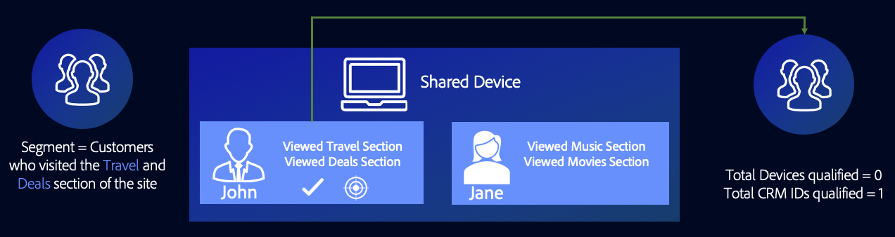
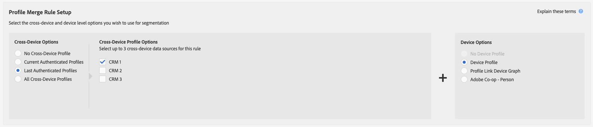

# Algemene gebruiksscenario&#39;s voor regels voor het samenvoegen van profielen {#general-use-cases-for-profile-merge-rules}

Met de opties van [!UICONTROL Profile Merge Rules] kunt u de focus van het publiek op specifieke doelgroepen uitbreiden of versterken op basis van zakelijke behoeften of doelen. Deze algemene gebruiksgevallen onderzoeken hoe u beschikbare opties kunt gebruiken en fusieregels kunt maken voor individuele, huishoudelijke en apparaatspecifieke toepassingen. [!UICONTROL Profile Merge Rules] werkt met realtime- en batchdoelen.

>[!TIP]
>
>Voor definities en beschrijvingen van deze [!UICONTROL Merge Rule] montages, zie [ Gedefinieerde de Opties van de Regel van de Fusie van het Profiel ](merge-rule-definitions.md).

## Apparaatgericht {#device-personalization}

Dit scenario is op marketers van toepassing die één enkel apparatenprofiel voor een publiekssegment willen evalueren dat in Audience Manager wordt bepaald, om een verenigbare ervaring aan het apparaat te leveren die het richten van platforms gebruikt die apparaat IDs (DSPs, op-plaats verpersoonlijkingsplatforms en andere op apparaat-gebaseerde het richten platforms) steunen, die geen rekening houden met gebruikersauthentificatie.

Selecteer **[!UICONTROL No Cross-Device Profile]** + **[!UICONTROL Device Profile]** om een regel te maken die alleen apparaatprofielen als doel instelt.

Laten we zeggen dat John drie smartphones heeft. Twee ervan zijn iPhone 7s op Data Plan A, en één daarvan is een Samsung op Data Plan B. Zonder rekening te houden met zijn voor authentiek verklaarde staat op om het even welk van de drie apparaten, wil de mobiele drager van John hem een verbetering van het gegevensplan, maar slechts voor iPhone 7 apparaten aanbieden die op Plan A van Gegevens lopen.

Door de **[!UICONTROL No Cross-Device Profile]** + **[!UICONTROL Device Profile]** -regel [!DNL Device 1] en [!DNL Device 3] te gebruiken, komen beide in aanmerking voor het segment, terwijl Device 2 wordt genegeerd.

## Gedeelde apparaatdoelen {#target-shared-devices}

Laten we zeggen dat John en zijn vrouw, Jane, dezelfde laptop gebruiken om een online winkel te bezoeken en verschillende artikelen te bestellen.

John gebruikt zijn eigen account om reistickets en speciale deals te boeken, terwijl Jane haar eigen account gebruikt om muziek en films te kopen.

Het marketingteam van de winkel kan de regel **[!UICONTROL Current Authenticated Profiles]** + **[!UICONTROL No Device Profile]** gebruiken om John en Jane te richten op specifieke deals, op basis van hun geverifieerde activiteiten.

Door deze regel te gebruiken, negeert Audience Manager volledig het apparatenprofiel, kwalificerend identiteitskaart van CRM van John voor het segment, en niet kwalificerend identiteitskaart van CRM van Jane.

## Online/offline gericht {#device-household-targeting}

Dit gebruiksgeval heeft betrekking op identiteitsbeheer van huishoudens. Een bedrijf kan één apparaatprofiel samenvoegen met het laatste profiel dat op dat apparaat is geverifieerd, met de regel **[!UICONTROL Last Authenticated Profiles]** + **[!UICONTROL Device Profile]** .

Laten we eens kijken naar een segment van huishoudens met een inkomen van meer dan $100.000/jaar, dat ten minste één apparaat bevat dat een [!DNL iPhone 7] on [!DNL Data Plan B] is. We hebben twee huishoudelijke profielen (profielen voor verschillende apparaten), die elk zijn aangesloten op twee verschillende apparaatprofielen. De kenmerken die nodig zijn om voor het segment in aanmerking te komen, worden verdeeld over het apparaat en de profielen voor alle apparaten.

Audience Manager voegt elk apparaat en elk apparaatprofielpaar samen om te zien of komt de samengevoegde set kenmerken in aanmerking voor het segment. Aangezien Audience Manager elk profiel evalueert dat in de samenvoeging is opgenomen, kunnen zowel een apparaatprofiel als een huishoudelijk profiel worden gesegmenteerd.

Dankzij de koppeling tussen het apparaat en het profiel van het huishouden kan Audience Manager wel [!DNL Household 2] voor het segment kwalificeren, maar niet [!DNL Household 1] . Vanaf [!DNL Household 2] komt alleen [!DNL Device 3] in aanmerking voor het segment. Dit [!UICONTROL Profile Merge Rule] heeft de teller toegelaten om een verenigbaar marketing bericht aan een individueel apparaat ([!DNL Device 3]) en breder huishouden ([!DNL Household 2]) te leveren.

## Doelen voor op mensen gebaseerde bestemmingen {#all-cross-device}

>[!IMPORTANT]
>
>Dit artikel bevat productdocumentatie die u door de opstelling en het gebruik van deze eigenschap moet begeleiden. Niets in dit document is juridisch advies. Raadpleeg uw eigen juridisch adviseur voor juridische begeleiding.

Dit scenario is alleen beschikbaar voor klanten die de [!DNL People-Based Destinations] add-on hebben aangeschaft. Deze regel staat marketers toe om klanten te bereiken die op hun eigen, voor authentiek verklaarde gegevens worden gebaseerd.

Laten we zeggen dat een online retailer bestaande klanten wil bereiken via sociale platforms en hun persoonlijke aanbiedingen wil laten zien op basis van hun eerdere bestellingen. Met [!UICONTROL People-Based Destinations] kunnen ze hashed-e-mailadressen van hun eigen [!DNL CRM] in Audience Manager opnemen, segmenten van de offlinegegevens maken en deze segmenten naar de sociale platforms sturen waarop ze willen adverteren, met behulp van die hashed-id en hun advertentie-uitgaven optimaliseren.

Meer over deze optie leren, zie [ Op mensen-Gebaseerde Doelen ](../destinations/people-based-destinations-overview.md).

## Grafiekopties apparaat {#device-graph-options}

Het kiezen van een [!UICONTROL device graph] optie voor een [!UICONTROL Profile Merge] regel hangt van voorwaarden af uniek aan uw digitale eigenschappen en bedrijfsdoelstellingen. Deze algemene richtlijnen kunnen u helpen begrijpen wanneer om één type van grafiek tegenover een andere te gebruiken. Opmerking: als u deze opties wilt gebruiken, moet u een contractuele relatie hebben met een externe apparaatgrafiek. Raadpleeg de onderstaande tabel voor algemene informatie over de keuze van een grafiekoptie voor apparaten. Voor specifieke gebruiksgevallen, zie [ Gevallen van het Gebruik van de Grafiek van de Verbinding van het Profiel ](profile-link-use-case.md) en [ Externe Gevallen van het Gebruik van de Grafiek van het Apparaat ](external-graph-use-cases.md).

<table id="table_66D9152D4FF040A186003272D456625D"> 
 <thead> 
  <tr> 
   <th colname="col1" class="entry"> Type apparaatgrafiek </th> 
   <th colname="col2" class="entry"> Beschrijving </th> 
  </tr>
 </thead>
 <tbody> 
  <tr> 
   <td colname="col1"> 
 Apparaatgrafiek voor profielkoppeling  
 </td> 
   <td colname="col2"> 
 De regels van de Fusie van het Profiel  die met de  optie van de Verbinding van het Profiel  worden gebouwd zijn ideaal voor: 
 
 
     <ul id="ul_FF44FA894BB2448887C8EDA9C8407EF9"> 
      <li id="li_E22505210C664FE6A9AA7C61244B36DA">Digitale eigenschappen die een hoog niveau van klantenauthentificatie hebben. </li> 
      <li id="li_BE7112EE611E4DEB95B5C0A2852BFA97">Gerichte, weinig bereikbare campagnes. De  het apparatengrafiek van de Verbinding van het Profiel  wordt voortgebouwd op deterministische slechts gegevens. Deze groep apparaatprofielen is altijd kleiner dan de groep niet-geverifieerde gebruikers en apparaten. </li> 
      <li id="li_5FD9E936A72A4EFE80E694FA2E08E385">Gebruik gevallen waarin klanten zich in een geverifieerde status moeten bevinden om in aanmerking te komen voor segmentatie. </li> 
     </ul> 
 </td> 
  </tr> 
  <tr> 
   <td colname="col1"> 
Opties externe apparaatgrafiek 
 </td> 
   <td colname="col2"> 
 De regels van de Fusie van het Profiel  die met om het even welke externe apparatengrafiek worden gebouwd die met  Audience Manager  wordt geïntegreerd zijn ideaal voor: 
 
 
     <ul id="ul_D76D773988604A619FA4A3BF37F910F0"> 
      <li id="li_969A0755A9E34CBEB2F7331C137B9A26">Digitale eigenschappen die een laag niveau van klantenauthentificatie hebben. </li> 
      <li id="li_AC78C8B4AD5340FFAC44FE851096C6A6">Brede, geavanceerde merkcampagnes. </li> 
      <li id="li_14AEC54CE34440889A3A36324EC6F497">Gebruik gevallen waarin klanten zich niet in een geverifieerde staat hoeven te bevinden om in aanmerking te komen voor segmentatie. </li> 
     </ul> 
 </td> 
  </tr> 
 </tbody> 
</table>

Bekijk de onderstaande video voor een overzicht van mogelijke gebruiksgevallen voor [!UICONTROL Profile Merge Rules] .

>[!VIDEO](https://video.tv.adobe.com/v/28975/)

>[!MORELIKETHIS]
>
>* [Gebruiksscenario’s voor apparaatgrafieken van profielkoppelingen](profile-link-use-case.md)
>* [Gebruiksscenario’s voor grafiek van externe apparaten](external-graph-use-cases.md)
>* [ Veelgestelde vragen van de Regels van de Fusie van het Profiel ](../../faq/faq-profile-merge.md)
