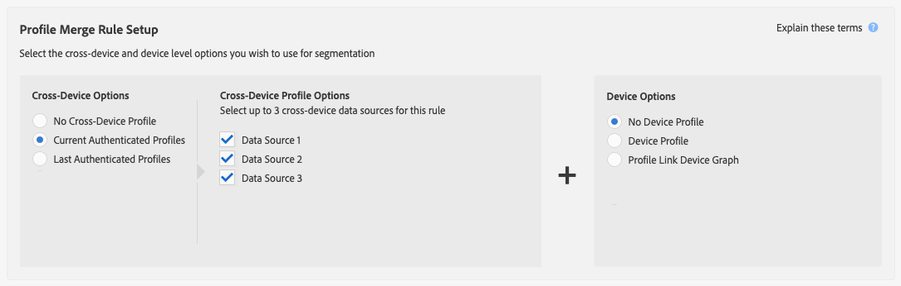

# Regels voor profielsamenvoeging en processen voor apparaatdesegmentatie {#profile-merge-rules-and-device-un-segmentation-processes}

Unsegmentation beschrijft processen die apparatenprofielen van segmenten onbruikbaar maken en verwijderen. De mogelijkheid om een apparaatprofiel uit een segment te verwijderen, is afhankelijk van de apparaatoptie die wordt gebruikt om een [!UICONTROL Profile Merge Rule].

## Beschikbare apparaatopties {#device-options}

Ter herinnering: [!UICONTROL Device Options] zijn beschikbaar in [!UICONTROL Profile Merge Rules Setup] wanneer u een [!UICONTROL Profile Merge Rule].

## Optie voor huidige apparaatprofiel en segmentatie van apparaat {#current-device-profile-options}

**[!UICONTROL Device Profile]** is de standaard apparaatprofieloptie voor een [!UICONTROL Profile Merge Rule]. [!DNL Audience Manager] kan een apparaatprofiel uit een segment verwijderen wanneer uw [!UICONTROL Profile Merge Rule] gebruikt de **[!UICONTROL Device Profile]** optie. Onder deze omstandigheden vindt ontsegmentatie plaats wanneer:

* Het apparaatprofiel is 120 dagen inactief. Tijdens het wekelijkse opschonen van gegevens worden inactieve apparaatprofielen uit de segmenten verwijderd.
* Het apparaat komt niet meer in aanmerking voor een segment omdat het door updates of wijzigingen in het apparaatprofiel wordt uitgesloten. Dit gebeurt wanneer de criteria van de segmentkwalificatie veranderen, of u past een [!DNL AND NOT] aan een segmentregel, of specificeer [recentie en frequentie](../segments/recency-and-frequency.md) voorwaarden die de instellingen kleiner dan of gelijk aan deze gebruiken. Gebruiksscenario&#39;s worden beschreven in het dialoogvenster [Onmiddellijke ondersteuning voor apparaten](instant-cross-device-suppression.md) documentatie.

## Geen apparaatoptie en apparaatontsegmentatie {#no-device-option}

[!DNL Audience Manager] kan een apparaat-id uit een segment verwijderen wanneer uw [!UICONTROL Profile Merge Rule] gebruikt de **[!UICONTROL Current Authenticated Profiles]** + **[!UICONTROL No Device Profile]** optie. Onder deze omstandigheden vindt desegmentatie plaats wanneer de apparaat-id niet langer in aanmerking komt voor een segment omdat dit door updates of wijzigingen in het profiel voor alle apparaten wordt uitgesloten. Dit gebeurt wanneer de criteria van de segmentkwalificatie veranderen, of u past een [!UICONTROL AND NOT] aan een segmentregel, of specificeer [recentie en frequentie](../segments/recency-and-frequency.md) voorwaarden die de instellingen kleiner dan of gelijk aan deze gebruiken. Gebruiksscenario&#39;s worden beschreven in het dialoogvenster [Onmiddellijke ondersteuning voor apparaten](instant-cross-device-suppression.md) documentatie.

## Grafiekopties apparaat en segmentatie apparaat {#device-graph-options-unsegmentation}

[!DNL Audience Manager] u kunt meerdere apparaatprofielen verwijderen uit een segment wanneer uw [!UICONTROL Profile Merge Rule] gebruikt een optie voor apparaatgrafieken. De segmentatie gebeurt wanneer het samengevoegde profiel van het apparaat van de apparatengrafiek niet meer voor het segment kwalificeert omdat de updates of de veranderingen in dit samengevoegde profiel het van het segment diskwalificeren. Dit gebeurt wanneer de criteria van de segmentkwalificatie veranderen, of u past een [!UICONTROL AND NOT] aan een segmentregel, of specificeer [recentie en frequentie](../segments/recency-and-frequency.md) voorwaarden die de instellingen kleiner dan of gelijk aan deze gebruiken. Gebruiksscenario&#39;s worden beschreven in het dialoogvenster [Onmiddellijke ondersteuning voor apparaten](instant-cross-device-suppression.md) documentatie.

>[!NOTE]
>
>**100 apparatengrens voor segmentbeoordeling en ontzetting**.
>Audience Manager voegt maximaal 100 apparaten samen bij het evalueren van segmenten met een profielsamenvoegregel die een apparaatgrafiek gebruikt. Audience Manager evalueert het huidige apparaat en tot 99 apparaten verbonden aan het huidige apparaat door [geverifieerd profiel](../../reference/visitor-authentication-states.md) (apparaat-id). Als het unsegment signaal wordt uitgegeven, zullen het huidige apparaat en de extra apparaten uit het segment in de bestemming worden verwijderd.

>[!MORELIKETHIS]
>
>* [Veelgestelde vragen over regels voor profielsamenvoeging en apparaatgrafieken](../../faq/faq-profile-merge.md)
>* [Onmiddellijke cross-device ondersteuning](instant-cross-device-suppression.md)

