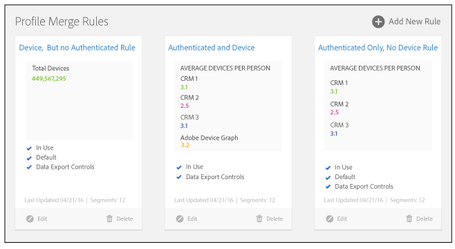

# Dashboard voor de regels voor profielsamenvoeging {#profile-merge-rules-dashboard}

Maak en beheer al uw samenvoegingsregels op het dashboard. U kunt maximaal 4 [!UICONTROL Profile Merge Rules].

De vierde regel voor profielsamenvoeging ([!UICONTROL All Cross-Device Profiles]) is alleen beschikbaar voor klanten die de invoegtoepassing [!UICONTROL People-Based Destinations] aanschaffen.

De [!UICONTROL Profile Merge Rules] dashboard biedt een geïntegreerde werkruimte waarmee u uw [!UICONTROL Profile Merge Rules]. Het dashboard bevindt zich op **[!UICONTROL Audience Data]** > **[!UICONTROL Profile Merge Rules]**. Het dashboard met regels kan er ongeveer zo uitzien als hieronder wordt weergegeven.

Wanneer u werkt met [!UICONTROL Profile Merge Rules]kunt u:

* Maximaal 4 maken [!UICONTROL Profile Merge Rules] uit uw apparaatgegevensbronnen. Zie [Een apparaatgegevensbron maken](merge-rules-start.md#create-data-source).
* Wijs een standaardsamenvoegregel aan. [Segment Builder](../segments/segment-builder.md) past automatisch de standaardregel op om het even welke nieuwe segmenten toe u creeert.
* Toepassen [Besturingselementen voor gegevensexport](../data-export-controls.md) op een samenvoegregel. [!UICONTROL Data Export Controls] verhindert u gegevens naar bestemmingen te verzenden wanneer dat gegevensprivacy zou schenden of overeenkomsten zou gebruiken.
* Houd het gemiddelde aantal apparaten voor elke gebruiker bij.
* Het werk met basiscontroles om, regels tot stand te brengen uit te geven en te schrappen. Alleen beheerders kunnen regels beheren, maar andere gebruikers kunnen deze weergeven en toepassen op segmenten. Zie [Opties voor regel voor samenvoegen van profiel gedefinieerd](merge-rule-definitions.md) en [Kwesties gebruiken voor regels voor samenvoegen](merge-rule-targeting-options.md).

>[!MORELIKETHIS]
>
>* [Veelgestelde vragen over regels voor samenvoegen van profielen](../../faq/faq-profile-merge.md)

