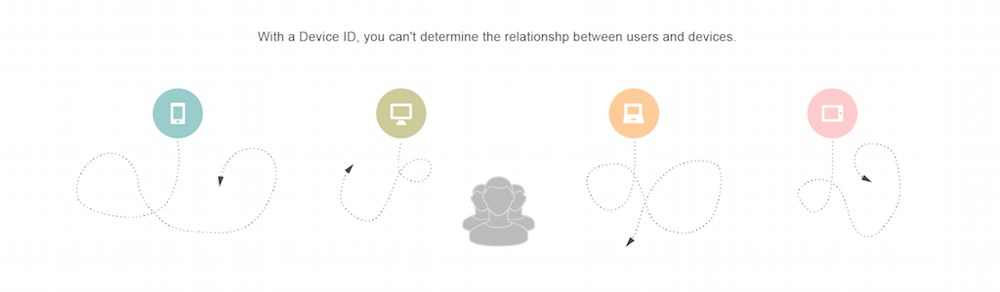

# [!UICONTROL Profile Merge Rules] Overzicht {#profile-merge-rules-overview}

Met [!UICONTROL Profile Merge Rules] kunt u bepalen welke gegevenssets worden gebruikt voor segmentatie en kunt u nauwkeurig gebruikers op meerdere apparaten als doel instellen.

>[!VIDEO](https://video.tv.adobe.com/v/28974)

## Gegevensverzameling en focus met anonieme en geverifieerde profielen {#data-collection-targeting}

Doorgaans is segmentering van het publiek en doelgericht afhankelijk van gegevens die zijn verzameld bij alle gebruikers op een apparaat. Gegevensverzameling en -gerichtheid op basis van apparaatgegevens heeft enkele nadelen. U kunt bijvoorbeeld geen onderscheid maken tussen meerdere gebruikers die een apparaat delen of gebruikers op meerdere apparaten nauwkeurig als doel instellen. Apparaatgecentreerde gegevensverzameling is niet langer voldoende voor digitale marketingcampagnes of het maken van apparaatspecifieke doelgroepen.

[!UICONTROL Profile Merge Rules] verandert fundamenteel hoe gegevens en segmenten gebruikers voor het richten  [!DNL Audience Manager] verzamelen. Hiermee kunt u werken met twee verschillende typen profielen, een apparaatprofiel en een [geverifieerd profiel](../../reference/visitor-authentication-states.md).

| Profieltype | Beschrijving |
|---|---|
| [!UICONTROL Device Profile] | Een [!UICONTROL device profile] is gekoppeld aan een id voor een bepaald apparaat, zoals een [!UICONTROL cookie]-id of een mobiele apparaat-id.   Het omvat:<ul><li>[!UICONTROL Rule-based traits] wordt gerealiseerd wanneer een gebruiker niet voor authentiek wordt verklaard.</li><li>[!UICONTROL Onboarded traits] gekoppeld aan een apparaat-id, zoals gegevens van  [!UICONTROL cookie-based]derden.</li></ul> |
| [!UICONTROL Authenticated Profile] | De [!UICONTROL authenticated profile] is gekoppeld aan een gebruikers-id die wordt doorgegeven wanneer een persoon zich aanmeldt bij uw site.  Het omvat:<ul><li>[!UICONTROL Rule-based traits] verzameld over apparaten wanneer een gebruiker voor authentiek wordt verklaard.</li><li>[!UICONTROL Onboarded traits] in een offlinebestand dat aan dezelfde gebruiker-id is gekoppeld.</li></ul> |

Deze verschillende profielen bepalen de gegevens die u voor segmentatie kunt gebruiken. Met een [geverifieerd profiel](../../reference/visitor-authentication-states.md) kunt u bijvoorbeeld nauwkeurige [!UICONTROL segments] maken op basis van gegevens van meerdere apparaten voor één gebruiker. Dit betekent dat u klanten op meerdere apparaten een consistente merkervaring kunt bieden. [!DNL Audience Manager] Dit wordt bereikt door de toewijzing van de verschillende apparaten die een persoon voor zijn online activiteiten gebruikt, op te slaan in zijn  [geverifieerde profiel](../../reference/visitor-authentication-states.md). Deze toewijzingen worden de [!UICONTROL Profile Link Device Graph] genoemd.

## Voordelen {#advantages}

Met [!UICONTROL Profile Merge Rules] kunt u:

* Doelgebruikers gebaseerd op [geverifieerd profiel](../../reference/visitor-authentication-states.md), anonieme profielen of combinaties van beide.
* Richt een specifieke klant over hun apparaten.
* Bouw een apparatengrafiek die op deterministische gegevens wordt gebaseerd.
* Stel de gegevens in uw [!UICONTROL segments] nauwkeurig in op basis van verschillende profielen.
* Verbeter extra inzicht in uw publiek.
