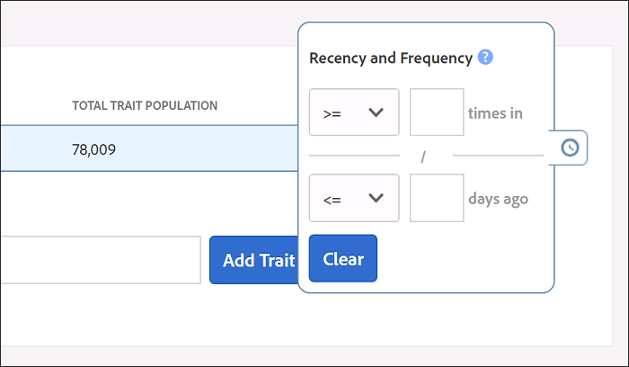

# Recentheid en frequentie {#recency-and-frequency}

Met [!UICONTROL Segment Builder]de frequentie en de frequentie kunt u bezoekers segmenteren op basis van acties die plaatsvinden of herhalen gedurende een ingesteld dagelijks interval.

Audience Manager definieert [!DNL recency] en [!DNL frequency] :

* **[!UICONTROL Recency]:**Hoe recent een gebruiker voor één (of meerdere) bekeken of gekwalificeerd[!UICONTROL traits].
* **[!UICONTROL Frequency]:**De snelheid waarmee een gebruiker een (of meer) persoon heeft bekeken of in aanmerking heeft genomen[!UICONTROL traits].

[!UICONTROL Recency] en [!UICONTROL Frequency] instellingen helpen u bezoekers te segmenteren op basis van hun werkelijke (of waargenomen) interesse voor een site, sectie of bepaalde creatieve instellingen. Gebruikers die bijvoorbeeld in aanmerking komen voor een segment met hoge eisen inzake recentie/frequentie, hebben wellicht meer belangstelling voor een site of een product dan gebruikers die minder vaak of minder vaak een bezoek brengen.

## Locatie van [!UICONTROL Recency and Frequency] instellingen {#location}

In [!UICONTROL Segment Builder], [!UICONTROL Recency] en de [!UICONTROL Frequency] montages worden gevestigd in de [!UICONTROL Basic View] sectie van het [!UICONTROL Traits] paneel. Klik het klokpictogram om deze controles bloot te stellen.

## Beperkingen en regels {#limitations-rules}

U kunt deze limieten en regels controleren en begrijpen wanneer u de frequentie en frequentie wilt toepassen op kenmerken in uw segmenten.

### [!UICONTROL Recency] {#recency}

<table id="table_026064124C694D75B7A960457D50170B"> 
 <thead> 
  <tr> 
   <th colname="col1" class="entry"> Limiet of regel </th> 
   <th colname="col2" class="entry"> Beschrijving </th> 
  </tr> 
 </thead>
 <tbody> 
  <tr> 
   <td colname="col1"> 
 <b>Minimumwaarde</b> 
 </td> 
   <td colname="col2"> 
De frequentie moet groter zijn dan 0. 
 </td> 
  </tr>
  <tr> 
   <td colname="col1"> 
 <b>Typen sporen</b> 
 </td> 
   <td colname="col2"> 
U kunt recentiecontroles op regel-gebaseerde en omslageigenschappen slechts toepassen. 
 </td> 
  </tr> 
  <tr> 
   <td colname="col1"> 
 <b>Treinen van derden</b> 
 </td> 
   <td colname="col2"> 
U kunt geen recentieregels op individuele derdeattributen of handelsgroepen plaatsen die derdetrekken bevatten. De frequentie en de frequentie zijn alleen van toepassing op uw eigen kenmerken. 
 </td> 
  </tr> 
 </tbody> 
</table>

### [!UICONTROL Frequency] {#frequency}

<table id="table_EBD621D26C8B4D03933E8C0753C892A7"> 
 <thead> 
  <tr> 
   <th colname="col1" class="entry"> Limiet of regel </th> 
   <th colname="col2" class="entry"> Beschrijving </th> 
  </tr> 
 </thead>
 <tbody> 
  <tr> 
   <td colname="col1"> 
 <b>Treinen van derden</b> 
 </td> 
   <td colname="col2"> 
U kunt geen frequentieregels instellen voor individuele eigenschappen van derden of groepen van handelsmerken die eigenschappen van derden bevatten. De frequentie en de frequentie zijn alleen van toepassing op uw eigen kenmerken. 
 </td> 
  </tr> 
  <tr> 
   <td colname="col1"> 
 <b>Typen sporen</b> 
 </td> 
   <td colname="col2"> 
U kunt frequentiecontroles op regel-gebaseerde en omslageigenschappen slechts toepassen. 
 </td> 
  </tr> 
  <tr> 
   <td colname="col1"> 
 <b>Recente vereisten</b> 
 </td> 
   <td colname="col2"> 
U kunt frequentievereisten configureren <i>zonder</i> de noodvereisten te configureren. Stel gewoon een frequentiewaarde in en laat het veld voor recentie leeg. 
 </td> 
  </tr> 
  <tr> 
   <td colname="col1"> 
<b>Regels voor profielsamenvoeging</b> 
 </td> 
   <td colname="col2"> 
See <a href="../../faq/faq-profile-merge.md#trait-freq-device-rules"> Trait Frequency, External Device Graphs, and Profile Merge Rules</a>. 
 </td> 
  </tr> 
 </tbody> 
</table>

## Voorbeelden van recentie {#recency-examples}

Hieronder volgen twee voorbeelden van de werking van recentiepunten, afhankelijk van uw selectie in de gebruikersinterface:

### Een operator gebruiken die kleiner is dan of gelijk is aan (&lt;=)

In dit voorbeeld selecteert u de operator &lt;=, zoals wordt weergegeven in de schermafbeelding. Dit komt in aanmerking voor de gebruiker [!UICONTROL segment] als deze in aanmerking komt voor een van de drie [!UICONTROL traits] minimaal drie keer in de afgelopen vijf dagen. In de onderstaande tijdlijn ziet u de [!UICONTROL segment] kwalificatie op het moment dat de [!UICONTROL segment] kwalificatie wordt gemaakt, op 1 oktober en tien dagen later.

### Een operator (=>) gebruiken die groter is dan of gelijk is aan

In dit voorbeeld selecteert u de operator =>, zoals in de schermafbeelding wordt getoond. Dit kwalificeert uw gebruiker voor [!UICONTROL segment] als zij voor om het even welke drie [!UICONTROL traits] minimaal drie keer om het even welk ogenblik tussen hun eerste kwalificatie op het platform van de Audience Manager en de besnoeiingstijd vijf dagen geleden in aanmerking komen. In de onderstaande tijdlijn ziet u de [!UICONTROL segment] kwalificatie op het moment dat de [!UICONTROL segment] kwalificatie wordt gemaakt, op 1 oktober en tien dagen later.

## Voorbeelden van frequentiecortering {#frequency-capping}

De frequentie-begrenzende uitdrukkingen omvatten alle gebruikers het waarvan aantal [!UICONTROL trait] realisaties onder een gewenste waarde is. Hier volgen enkele voorbeelden van Rechts en Verkeerd:

* Verkeerd - De uitdrukking `frequency([1000T]) <= 5` omvat alle gebruikers die [!UICONTROL trait] met identiteitskaart &quot;1000&quot;een maximum van vijf keer hebben gerealiseerd maar omvat ook gebruikers die niet de [!UICONTROL trait]. Daarom valideert Audience Manager deze expressie niet vanwege de prestaties, omdat er te veel gebruikers voor zijn [!UICONTROL segment].

* Rechts - Als u alle gebruikers wilt omvatten die het [!UICONTROL trait] met identiteitskaart &quot;1000&quot;een maximum van vijf keer hebben gerealiseerd, voeg een andere voorwaarde aan de uitdrukking toe, om ervoor te zorgen de gebruikers voor [!UICONTROL trait] minstens eens hebben gekwalificeerd:  `frequency([1000T]) >= 1  AND  frequency([1000T]) <= 5`

* Rechts - Als u eisen voor recentie/frequentie wilt hebben die lager zijn dan een bepaald aantal tijden of dagen, sluit u die [!UICONTROL trait] aan bij een andere `AND` operator. Met behulp van het voorbeeld in het eerste opsommingsteken wordt deze expressie geldig wanneer deze wordt gecombineerd met een andere expressie, [!UICONTROL trait] zoals hier wordt getoond: `frequency([1000T]) <= 5 AND isSiteVisitorTrait`.

* Rechts - Voor gebruiksgevallen waarin de frequentie wordt beperkt, kunt u een soortgelijke [!UICONTROL segment] regel maken: `(frequency([1000T] <= 2D) >= 5)`. Deze expressie omvat alle gebruikers die de id &#39;1000&#39; in de afgelopen 2 dagen ten minste vijf keer hebben gebruikt. [!UICONTROL trait] Stel de frequentiekoppeling in door deze [!UICONTROL segment] naar de advertentieserver te verzenden met een `NOT` set op de [!UICONTROL segment] advertentieserver. Deze benadering bereikt betere prestaties [!DNL Audience Manager] terwijl het dienen van het zelfde doel voor frequentiecontrole.

>[!MORELIKETHIS]
>
>* [Besturingselementen voor Segment Builder: Sectie Traits](../../features/segments/segment-builder.md#segment-builder-controls-traits)
>* [Gebruikte codesyntaxis in de Segment Expression Editor](../../features/segments/segment-code-syntax.md)

