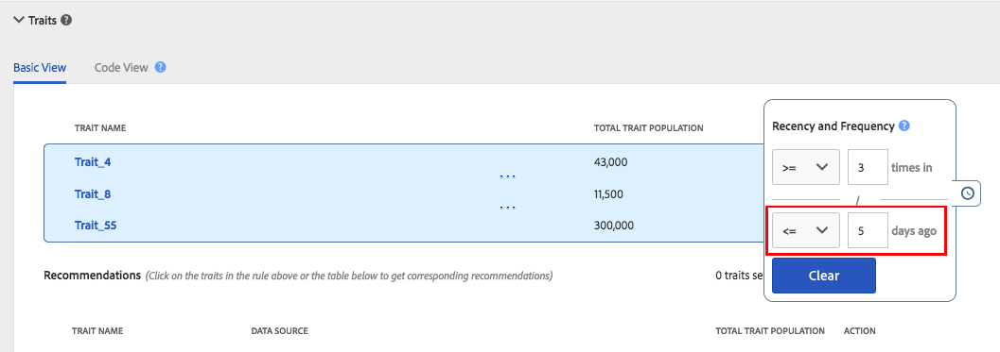

# Recente en frequente {#recency-and-frequency}

In [!UICONTROL Segment Builder] kunt u met de frequentie en de frequentie bezoekers segmenteren op basis van acties die plaatsvinden of die gedurende een ingesteld dagelijks interval worden herhaald.

Audience Manager definieert [!DNL recency] en [!DNL frequency] als volgt:

* **[!UICONTROL Recency]:** Hoe recent een gebruiker voor één (of meerdere) bekeken of gekwalificeerd [!UICONTROL traits].
* **[!UICONTROL Frequency]:** De frequentie waarmee een gebruiker een (of meer) gebruiker heeft bekeken of gekwalificeerd [!UICONTROL traits].

Met de instellingen [!UICONTROL Recency] en [!UICONTROL Frequency] kunt u bezoekers segmenteren op basis van hun werkelijke (of waargenomen) interesse voor een site, sectie of bepaalde creatieve instellingen. Gebruikers die bijvoorbeeld in aanmerking komen voor een segment met hoge eisen inzake recentie/frequentie, hebben wellicht meer belangstelling voor een site of een product dan gebruikers die minder vaak of minder vaak een bezoek brengen.

## Locatie van [!UICONTROL Recency and Frequency] -instellingen {#location}

In [!UICONTROL Segment Builder] bevinden de instellingen [!UICONTROL Recency] en [!UICONTROL Frequency] zich in de sectie [!UICONTROL Basic View] van het deelvenster [!UICONTROL Traits] . Klik het klokpictogram om deze controles bloot te stellen.

## Beperkingen en regels {#limitations-rules}

U kunt deze limieten en regels controleren en begrijpen wanneer u de frequentie en frequentie wilt toepassen op kenmerken in uw segmenten.

### [!UICONTROL Recency] {#recency}

<table id="table_026064124C694D75B7A960457D50170B"> 
 <thead> 
  <tr> 
   <th colname="col1" class="entry"> Limiet of regel </th> 
   <th colname="col2" class="entry"> Beschrijving </th> 
  </tr> 
 </thead>
 <tbody> 
  <tr> 
   <td colname="col1"> 
 <b> Minimale Waarde </b> 
 </td> 
   <td colname="col2"> 
De frequentie moet groter zijn dan 0. 
 </td> 
  </tr>
  <tr> 
   <td colname="col1"> 
 <b> Types van Trait </b> 
 </td> 
   <td colname="col2"> 
U kunt recentiecontroles op regel-gebaseerde en omslageigenschappen slechts toepassen. 
 </td> 
  </tr> 
  <tr> 
   <td colname="col1"> 
 <b> De Tanden van de Derde </b> 
 </td> 
   <td colname="col2"> 
U kunt geen recentieregels op individuele derdeattributen of handelsgroepen plaatsen die derdetrekken bevatten. De frequentie en de frequentie zijn alleen van toepassing op uw eigen kenmerken. 
 </td> 
  </tr> 
 </tbody> 
</table>

### [!UICONTROL Frequency] {#frequency}

<table id="table_EBD621D26C8B4D03933E8C0753C892A7"> 
 <thead> 
  <tr> 
   <th colname="col1" class="entry"> Limiet of regel </th> 
   <th colname="col2" class="entry"> Beschrijving </th> 
  </tr> 
 </thead>
 <tbody> 
  <tr> 
   <td colname="col1"> 
 <b> De Tanden van de Derde </b> 
 </td> 
   <td colname="col2"> 
U kunt geen frequentieregels instellen voor individuele eigenschappen van derden of groepen van handelsmerken die eigenschappen van derden bevatten. De frequentie en de frequentie zijn alleen van toepassing op uw eigen kenmerken. 
 </td> 
  </tr> 
  <tr> 
   <td colname="col1"> 
 <b> Types van Trait </b> 
 </td> 
   <td colname="col2"> 
U kunt frequentiecontroles op regel-gebaseerde en omslageigenschappen slechts toepassen. 
 </td> 
  </tr> 
  <tr> 
   <td colname="col1"> 
 <b> Vereisten van de Recentie </b> 
 </td> 
   <td colname="col2"> 
U kunt frequentievereisten <i> vormen zonder </i> vormende recentievereisten. Stel gewoon een frequentiewaarde in en laat het veld voor recentie leeg. 
 </td> 
  </tr> 
  <tr> 
   <td colname="col1"> 
<b>Regels voor profielsamenvoeging</b> 
 </td> 
   <td colname="col2"> 
Zie <a href="../../faq/faq-profile-merge.md#trait-freq-device-rules"> de Frequentie van de Bediening, Externe Grafieken van het Apparaat, en de Regels van de Fusie van het Profiel </a>. 
 </td> 
  </tr> 
 </tbody> 
</table>

## Recente voorbeelden {#recency-examples}

Hieronder volgen twee voorbeelden van de werking van recentiepunten, afhankelijk van uw selectie in de gebruikersinterface:

### Een operator gebruiken die kleiner is dan of gelijk is aan (&lt;=)

In dit voorbeeld selecteert u de operator &lt;=, zoals wordt weergegeven in de schermafbeelding. Dit kwalificeert de gebruiker voor [!UICONTROL segment] als deze in aanmerking komt voor een van de drie [!UICONTROL traits] minimaal drie keer in de laatste vijf dagen. In de onderstaande tijdlijn ziet u de [!UICONTROL segment] -kwalificatie op het moment dat [!UICONTROL segment] wordt gemaakt, op 1 oktober en tien dagen later.

### Een operator (=>) gebruiken die groter is dan of gelijk is aan

In dit voorbeeld selecteert u de operator =>, zoals in de schermafbeelding wordt getoond. Dit kwalificeert uw gebruiker voor [!UICONTROL segment] als zij voor om het even welke drie [!UICONTROL traits] minstens drie keer in aanmerking komen tussen hun eerste kwalificatie op het platform van Audience Manager en de besnoeiingstijd vijf dagen geleden. In de onderstaande tijdlijn ziet u de [!UICONTROL segment] -kwalificatie op het moment dat [!UICONTROL segment] wordt gemaakt, op 1 oktober en tien dagen later.

## Voorbeelden van frequentiecortering {#frequency-capping}

Tot expressies met een frequentiecijfer behoren alle gebruikers voor wie het aantal [!UICONTROL trait] realisaties onder een gewenste waarde ligt. Hier volgen enkele voorbeelden van Rechts en Verkeerd:

* Verkeerd - De expressie `frequency([1000T]) <= 5` omvat alle gebruikers die de [!UICONTROL trait] met de id &quot;1000&quot; maximaal vijf keer hebben gerealiseerd, maar ook gebruikers die de [!UICONTROL trait] niet hebben gerealiseerd. Daarom valideert Audience Manager deze expressie niet vanwege de prestaties, omdat er te veel gebruikers voor de [!UICONTROL segment] in aanmerking zouden komen.

* Rechts - Als u alle gebruikers wilt opnemen die de [!UICONTROL trait] hebben gerealiseerd met de id &#39;1000&#39;, voegt u een andere voorwaarde toe aan de expressie, zodat de gebruikers minstens één keer voor de [!UICONTROL trait] gekwalificeerd zijn: `frequency([1000T]) >= 1  AND  frequency([1000T]) <= 5`

* Rechts - Als u wilt dat de eisen voor frequentie en frequentie minder zijn dan een bepaald aantal keren of dagen, voegt u die [!UICONTROL trait] toe aan een andere operator met een `AND` . Met behulp van het voorbeeld in het eerste opsommingsteken wordt deze expressie geldig wanneer deze wordt gecombineerd met een andere [!UICONTROL trait] , zoals hier wordt getoond: `frequency([1000T]) <= 5 AND isSiteVisitorTrait` .

* Rechts - Voor gebruiksgevallen waarin gebruik wordt gemaakt van frequentiecorrectie kunt u een [!UICONTROL segment] -regel maken die hierop lijkt: `(frequency([1000T] <= 2D) >= 5)` . Deze expressie omvat alle gebruikers die de [!UICONTROL trait] met de id &quot;1000&quot; in de afgelopen 2 dagen ten minste vijf keer hebben gerealiseerd. Stel de frequentiegrenzen in door deze [!UICONTROL segment] naar de advertentieserver te verzenden met een `NOT` ingesteld op de [!UICONTROL segment] in de advertentieserver. Deze methode levert betere prestaties in [!DNL Audience Manager] terwijl het bedienen van het zelfde doel voor het aftappen van frequenties.

>[!MORELIKETHIS]
>
>* [ de Controles van de Bouwer van het Segment: De Sectie van de Treits ](../../features/segments/segment-builder.md#segment-builder-controls-traits)
>* [Gebruikte codesyntaxis in de Segment Expression Editor](../../features/segments/segment-code-syntax.md)
