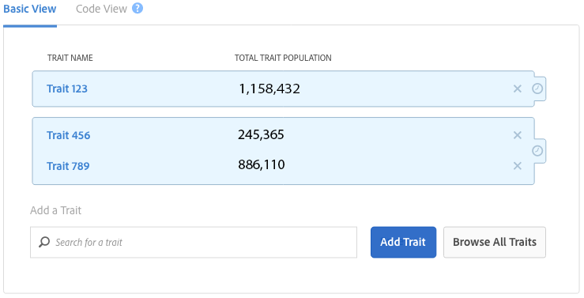

# [!UICONTROL Trait] en [!UICONTROL Segment] Bevolkingsgegevens in [!UICONTROL Segment Builder] {#trait-and-segment-population-data-in-segment-builder}

Voeg [!UICONTROL traits] toe aan [!UICONTROL Segment Builder] en verwijder deze om de werkelijke [!UICONTROL trait] populaties weer te geven, samen met de werkelijke en geschatte segmentpopulatiegegevens. De geschatte gegevens van de bevolkingsgrootte helpen u het juiste segment voor uw campagne bouwen.

## [!UICONTROL Trait] Bevolkingsgegevens {#trait-population-data}

[!UICONTROL Segment Builder] geeft u [!UICONTROL Total Trait Population] weer voor de laatste dag waarop u een [!UICONTROL trait] element toevoegt aan een segment. Deze gegevens worden weergegeven in het blauwe veld rondom de geselecteerde [!UICONTROL trait] in de sectie [!UICONTROL Basic View] .

In de volgende tabel worden de maatstaven voor de doelpopulatie gedefinieerd:

| Metrisch | Beschrijving |
|---------|----------|
| [!UICONTROL Total Trait Population] | Het aantal unieke id&#39;s met de geselecteerde eigenschap in hun profiel. |

## Bereken van reële en geschatte segmentpopulaties {#calculating-real-estimated-populations}

Wanneer u een nieuw segment maakt of een bestaand segment wijzigt, duurt het maximaal 24 uur voordat de resultaten voor werkelijke populaties in real-time en totale segmenten worden weergegeven.

Audience Manager kan echter onmiddellijk de omvang van uw segment in realtime en de totale populatie inschatten. Deze schattingen zijn gebaseerd op gesamplede historische gegevens en retourresultaten met een betrouwbaarheidsinterval van 95%.

In [!UICONTROL Segment Builder] geeft een blauwe balk op de geschatte bevolkingsgrafieken het mogelijke bovenste en onderste bereik voor de segmentgrootte aan. Hoewel de prestaties in het verleden geen garantie bieden voor toekomstige resultaten, kunnen de geschatte gegevens u helpen de potentiële grootte van een nieuw of bewerkt segment te begrijpen.

## Overzicht van segmentpopulatiegegevens {#segment-populations}

In [!UICONTROL Segment Builder] kunt u bevolkingsgegevens segmenteren terwijl u segmenten maakt en bewerkt.

* Voor geschatte segmentpopulatiegegevens (real-time en totaal) werkt [!UICONTROL Segment Builder] de grafieken niet automatisch bij terwijl u kenmerken in een segment toevoegt of verwijdert. Klik op **[!UICONTROL Calculate Estimates]** om de geschatte bevolkingsaantallen te zien (of te vernieuwen).

* Voor werkelijke (werkelijke) segmentpopulatiegegevens (real-time en totaal) werkt [!UICONTROL Segment Builder] de segmentgrafiek automatisch bij wanneer u een bestaand segment laadt. Voor nieuwe segmenten, of wanneer u nieuwe eigenschappen aan een bestaand segment toevoegt, worden de daadwerkelijke populatiegegevens niet bijgewerkt tot 24 uur nadat het segment wordt gecreeerd.

Zie de definities hieronder voor meer informatie over geschatte en werkelijke gegevens over de segmentpopulatie.

## Geschatte populatiegegevens van segmenten gedefinieerd {#estimated-segment-population}

In de volgende tabel worden de geschatte bevolkingscijfers weergegeven.

<table id="table_B24503F372E34B6BBDF5204181701A59"> 
 <thead> 
  <tr> 
   <th colname="col1" class="entry"> Metrisch </th> 
   <th colname="col2" class="entry"> Beschrijving </th> 
  </tr>
 </thead>
 <tbody> 
  <tr> 
   <td colname="col1"> 
  Geschatte real-time populatie (mogelijk)  
 </td> 
   <td colname="col2"> 
Het geschatte aantal unieke bezoekers dat in real-time werd gezien voor het opgegeven tijdbereik en dat in aanmerking kwam voor het segment op het moment dat ze door Audience Manager werden gezien. 
 
In  Bouwer van het Segment , kunnen de laatste 30 dagpopulaties voor eigenschappen ( Totale Bevolgingen van het Beetje ), voor eigenschappen en segmenten verschillend zijn die in real time worden geëvalueerd. 
 

     <ul id="ul_CAE803D09913462CAD413A665D85C1A2"> 
      <li id="li_3E64330D6F5B4D2F8F3456730A86894F">Voor eigenschappen, de laatste metrische tellingen van 30 dagen het aantal unieke gebruikers die voor dat bezit tijdens de laatste 30 dagen kwalificeerden. </li>
      <li id="li_FF3CACD0B6C742CDB94D66200D77CE06">Voor segmenten die in real time worden geëvalueerd, tellen de laatste metrische tellingen van 30 dagen het aantal gebruikers die voor een eigenschap (in dat segment) op wat punt in het verleden hebben gekwalificeerd en opnieuw door Audience Manager binnen de laatste 30 dagen gezien. Stel dat u een gebruiker hebt die 60 dagen geleden voor een eigenschap in aanmerking kwam en tien dagen geleden opnieuw werd gezien. In de gegevens wordt deze gebruiker niet toegevoegd aan de telling van het kenmerk omdat hij meer dan 30 dagen geleden voor het eerst in aanmerking kwam voor de eigenschap. Nochtans, zullen zij in het laatste aantal van 30 dagen voor de segmenten worden omvat die in real time worden geëvalueerd. Dit is omdat zij voor het segment binnen het tijdinterval van 30 dagen gekwalificeerd hebben. </li>
     </ul> 
 
 
Nota: De  Geschatte metrische Bevolking in real time  omvat geen apparaten die voor een segment gekwalificeerd hebben dat op verbindingen wordt gebaseerd die door een  Regel van de Fusie van het Profiel  worden verstrekt die een <a href="../../features/profile-merge-rules/merge-rule-definitions.md#device-options"> optie van de apparatengrafiek </a> gebruikt. 
 
 </td> 
  </tr> 
  <tr> 
   <td colname="col1"> 
  Geschatte totale populatie (potentieel)  
 </td> 
   <td colname="col2"> 
Het geschatte aantal unieke bezoekers dat zich in uw nieuwe of gewijzigde segment zou kunnen bevinden. Net als bij bijna elke schatting garanderen de prestaties uit het verleden geen toekomstige resultaten, maar u kunt het geschatte totaal gebruiken voor: 
 
 
     <ul id="ul_0490DD08C7C8493DADFB11B5872A73BC"> 
      <li id="li_AE38C8C8A4B24021BAC724B51A4799E2">Zie hoeveel mensen een nieuw of herzien segment zou kunnen bereiken aangezien u een segment bouwt. </li> 
      <li id="li_E830EC2B12DC46D4B0A4DD807A8936F6">Tune het segment afhankelijk van uw doelstellingen. Grote segmenten zijn bijvoorbeeld handig voor bewustmakingscampagnes en kleinere segmenten zijn handig voor doelgerichte of heroriënterende campagnes. </li> 
     </ul> 
 
 
Nota:  Geschatte Totale Bevolking  metrisch omvat geen apparaten die voor een segment gekwalificeerd hebben dat op verbindingen wordt gebaseerd die door een  Regel van de Fusie van het Profiel  worden verstrekt die een <a href="../../features/profile-merge-rules/merge-rule-definitions.md#device-options"> optie van de apparatengrafiek </a> gebruikt. 
 
 </td> 
  </tr> 
 </tbody> 
</table>

## Bestaande (werkelijke) segmentpopulatiegegevens gedefinieerd {#existing-segment-population}

[!UICONTROL Profile Merge Rules] heeft invloed op de werkelijke aantallen in real time en de totale bevolking. Deze totalen zijn afhankelijk van het feit of het segment in [!UICONTROL Profile Merge Rule] behoort tot een apparaatgrafiekoptie of niet. Zie ook, {de Opties van de Regel van de Samenvoeging van het 0} Gedefinieerde Profiel [.](../../features/profile-merge-rules/merge-rule-definitions.md)

### Bevolkingsgegevens van segment voor [!UICONTROL Merge Rules] zonder een [!UICONTROL Device Graph Option]

In de volgende tabel worden de werkelijke cijfers voor de real-time en de totale bevolking gedefinieerd wanneer uw segmenten worden gebruikt door een [!UICONTROL Profile Merge Rule] -segment dat zonder [!UICONTROL device graph] -optie is gemaakt. Dit zijn de instellingen voor apparaatopties **[!UICONTROL No Device Options]** en **[!UICONTROL Current Device Proflie]** .

<table id="table_A18C973855DB46A0B39B81F32E0E7540"> 
 <thead> 
  <tr> 
   <th colname="col1" class="entry"> Metrisch </th> 
   <th colname="col2" class="entry"> Beschrijving </th> 
  </tr> 
 </thead>
 <tbody> 
  <tr> 
   <td colname="col1"> 
  Real-Time Population (Bestaand)  
 </td> 
   <td colname="col2"> 
Het werkelijke aantal unieke bezoekers dat in real-time werd gezien voor het opgegeven tijdbereik en dat in aanmerking kwam voor het segment op het moment dat ze door Audience Manager werden gezien. 
 
In  Bouwer van het Segment , kunnen de laatste 30 dagpopulaties voor eigenschappen ( Totale Bevolgingen van het Beetje ), voor eigenschappen en segmenten verschillend zijn die in real time worden geëvalueerd. 
 
 
     <ul id="ul_50D1528DDDF347858F17DA3C033B0E3F"> 
      <li id="li_ABA2BFE68FF4430DBB425C4661E1836A">Voor eigenschappen, de laatste metrische tellingen van 30 dagen het aantal unieke gebruikers die voor dat bezit tijdens de laatste 30 dagen kwalificeerden. </li> 
      <li id="li_1519068CBB1445E893657D12E8FE42AC">Voor segmenten die in real time worden geëvalueerd, tellen de laatste metrische tellingen van 30 dagen het aantal gebruikers die voor een eigenschap (in dat segment) op wat punt in het verleden hebben gekwalificeerd en opnieuw door Audience Manager binnen de laatste 30 dagen gezien. Stel dat u een gebruiker hebt die 60 dagen geleden voor een eigenschap in aanmerking kwam en tien dagen geleden opnieuw werd gezien. In de gegevens wordt deze gebruiker niet toegevoegd aan de telling van het kenmerk omdat hij meer dan 30 dagen geleden voor het eerst in aanmerking kwam voor de eigenschap. Nochtans, zullen zij in het laatste aantal van 30 dagen voor de segmenten worden omvat die in real time worden geëvalueerd. Dit is omdat zij voor het segment binnen het tijdinterval van 30 dagen gekwalificeerd hebben. </li> 
     </ul> 
 </td> 
  </tr> 
  <tr> 
   <td colname="col1"> 
  Totale populatie (bestaand)  
 </td> 
   <td colname="col2"> 
Het aantal unieke bezoekers dat vanaf gisteren voor het segment in aanmerking kwam. 
 </td> 
  </tr> 
 </tbody> 
</table>

### Bevolkingsgegevens segmenteren voor [!UICONTROL Merge Rules] met een [!UICONTROL Device Graph] -optie

In de volgende tabel worden de werkelijke cijfers voor de real-time en de totale populatie gedefinieerd wanneer uw segmenten worden gebruikt door een [!UICONTROL Profile Merge Rule] die met een [!DNL device graph] -optie is gemaakt. Dit zijn de apparaatopties voor de opties [!UICONTROL Profile Link Device Graph] , [!DNL Adobe] [!DNL device graph] en [!DNL device graph] die beschikbaar zijn voor u.

| Kolom A | Kolom B |
|---------|----------|
| [!UICONTROL Real-Time Population (Existing)] | Het werkelijke aantal apparaten dat in real-time wordt gezien met huidige profielen die, wanneer samengevoegd met maximaal 100 andere apparaatprofielen die door de apparaatgrafiek worden aangesloten, de kenmerken bevatten om in aanmerking te komen voor het segment op het moment dat het door Audience Manager werd gezien. |
| [!UICONTROL Total Population (Existing)] | Het totale aantal apparaten met profielen dat, wanneer samengevoegd met maximaal 100 andere apparaatprofielen die door de apparaatgrafiek worden aangesloten, allemaal in aanmerking kwamen voor het segment. |

### Beperkingen als gevolg van recentie- en frequentieredsies bij het schatten van segmentpopulaties

[!UICONTROL Segment Builder] ondersteunt een schatting van de segmentgrootte voor segmentregels die maximaal 4 recentie- en frequentiereferenties bevatten. Als u bij het samenstellen van een segmentregel meer dan vier recentie- en frequentie-expressies kiest, wordt een fout weergegeven bij het schatten van de populatie.

### Beperkingen vanwege [!UICONTROL Merge Rules] bij schatting van segmentpopulaties

Er is momenteel een bekende beperking, omdat onze schatting van de segmentgrootte geen rekening houdt met [!UICONTROL profile merge rules] . Bijvoorbeeld, bekijk segmenten met **[!UICONTROL No Authenticated Profile + Current Device Profile]** [&#x200B; fusieregel &#x200B;](../../features/profile-merge-rules/merge-rule-definitions.md). Wegens de manier wij momenteel de aantallen van de segmentraming berekenen, zullen de geschatte populaties voor authentiek verklaarde profielen omvatten. De bestaande segmentpopulaties negeren geverifieerde profielen echter op de juiste wijze.

>[!MORELIKETHIS]
>
>* [Veelgestelde vragen over regels voor profielsamenvoeging en apparaatgrafieken](../../faq/faq-profile-merge.md)
>* [Profielkoppeling](../profile-merge-rules/merge-rules-overview.md)
