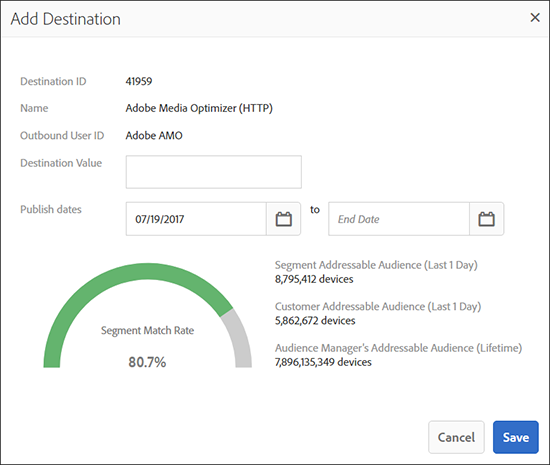

# [!UICONTROL Segment Builder] {#segment-builder}

Beschrijft de vereiste en facultatieve stappen die een segment binnen creëren [!UICONTROL Segment Builder].

## Videodemonstratie

Begin door de Create Segments in de video van de Audience Manager te bekijken. De video bespreekt u het proces van de segmentverwezenlijking. Lees de onderstaande secties voor meer informatie.

## Een [!UICONTROL Segment] {#create-segment}

### Sectie Segment Builder

<!-- t_create_segment.xml -->

[!UICONTROL Segment Builder] bestaat uit drie afzonderlijke delen: [!UICONTROL Basic Information], [!UICONTROL Traits]en [!UICONTROL Destinations Mapping]. Als u een [!UICONTROL segment]subformulier wilt maken, vult u de vereiste velden in de [!UICONTROL Basic Information] secties en [!UICONTROL Traits] secties in. [!UICONTROL Destinations Mapping] instellingen zijn optioneel. Raadpleeg de onderstaande instructies voor meer hulp.

1. In het gedeelte [Basisinformatie](../../features/segments/segment-builder.md#segment-builder-controls-basics) :

   

   * Geef de naam [!UICONTROL segment]. De maximale lengte van een [!UICONTROL segment] naam is 255 tekens.
   * Stel de [!UICONTROL segment] status in (actief is standaard).
   * Kies een [!UICONTROL data source]. Gebruik het eerste vervolgkeuzemenu om te filteren tussen Audience Manager [!UICONTROL data sources], Adobe Analytics-rapportreeksen of beide. Kies vervolgens het tweede vervolgkeuzemenu [!UICONTROL data source]. Als u geen Adobe Analytics-rapportreeksen gebruikt, is de [!UICONTROL data source] typekiezer uitgeschakeld en wordt deze standaard alleen ingesteld op Audience Manager-gegevensbronnen.
   * Selecteer een [!UICONTROL profile merge rule] voor [!UICONTROL segment] kwalificatie.
   * Wijs de map toe [!UICONTROL segment] aan een opslagmap.

1. In de sectie [Traits](../../features/segments/segment-builder.md#segment-builder-controls-traits) :
   
   * Zoek naar [!UICONTROL trait] u aan een segment wilt toevoegen en klik **[!UICONTROL Add Trait]**. Voeg een andere waarde toe [!UICONTROL trait] om een [!UICONTROL trait] groep te maken.
   * U kunt het [!UICONTROL Advanced Search] modale model weergeven door op **[!UICONTROL Browse All Traits]** te klikken. Zoeken naar [!UICONTROL traits] naam, id, beschrijving of [!UICONTROL data source]. Klik tijdens het zoeken op een map om de resultaten te beperken tot die map en de bijbehorende submappen. U kunt ook filteren [!UICONTROL traits] op [!UICONTROL trait type] ([!UICONTROL Folder Trait], [!UICONTROL Rule-based], [!UICONTROL Onboarded]en [!UICONTROL Algorithmic]) of type populatie ([apparaat-id](../../reference/ids-in-aam.md) en [apparaat-id](../../reference/ids-in-aam.md)).
      
   * Volg de bouw van uw [proefversie voor live](trait-recommendations.md) traitaanbevelingen [!UICONTROL segment].
   * Klik en sleep [!UICONTROL traits] om aparte groepen te maken.
   * Houd de muisaanwijzer tussen groepen om relaties in te stellen met Booleaanse [!UICONTROL AND], [!UICONTROL OR][!UICONTROL AND NOT] waarden.
   * Houd de muisaanwijzer boven het klokpictogram om de regels voor [recentie en frequentie](../../features/segments/recency-and-frequency.md) aan het [!UICONTROL trait]klokpictogram toe te voegen.
   * De gegevens van de segmentpopulatie bekijken aangezien u toevoegt of verwijdert [!UICONTROL traits]. Klik **[!UICONTROL Calculate Estimates]** om de geschatte bevolkingsaantallen te zien (of te verfrissen). Lees meer over de gegevens [van de](../../features/segments/segment-builder-data.md#segment-populations) segmentpopulatie in de [!UICONTROL Segment Builder].
   * Klik **[!UICONTROL Save]** wanneer gereed.

1. *(Optioneel)* Wijs een waarde toe [!UICONTROL segment] aan een [!UICONTROL destination] waarde in het gedeelte [Toewijzing](../../features/segments/segment-builder.md#segment-builder-controls-destinations) bestemming:
   * Zoek naar het [!UICONTROL destination] en klik **[!UICONTROL Add Destination]**. De code [!UICONTROL destination] moet al bestaan voordat u deze aan een [!UICONTROL segment]bestand kunt toevoegen.
   * Klik **[!UICONTROL Save]** wanneer gereed.

Bekijk de onderstaande video voor een gedetailleerde uitleg van de werking van maateenheden op verschillende apparaten.

>[!VIDEO](https://docs.adobe.com/content/help/en/audience-manager-learn/tutorials/build-and-manage-audiences/profile-merge/understanding-cross-device-metrics-in-audience-manager.html)

## [!UICONTROL Segment Builder] Besturingselementen: [!UICONTROL Basic Information] Sectie {#segment-builder-controls-basics}

Met [!UICONTROL Segment Builder]de [!UICONTROL the Basic Information] instellingen kunt u nieuwe kenmerken maken of bestaande kenmerken bewerken. Als u een nieuwe opslagmap wilt maken, geeft u een naam, een naam [!UICONTROL segment][!UICONTROL data source]en selecteert u een opslagmap. Alle andere velden zijn optioneel. Ga wanneer gereed naar de [!UICONTROL Traits] sectie.

<!-- r_segment_basic_info_section.xml -->

<!--

<table id="table_39DA4BC9470448B48F6654F2774EE0D5"> 
 <thead> 
  <tr> 
   <th colname="col1" class="entry"> Field </th> 
   <th colname="col2" class="entry"> Description </th> 
  </tr> 
 </thead>
 <tbody> 
  <tr> 
   <td colname="col1"> <b>Name</b> </td> 
   <td colname="col2"> 
Give the segment a short, logical name that describes its function or purpose. Avoid abbreviations and special characters. The maximum length of a segment name is 255 characters. 
 </td> 
  </tr> 
  <tr> 
   <td colname="col1"> <b>Description</b> </td> 
   <td colname="col2"> 
A field for additional descriptive information about the segment. 
 </td> 
  </tr> 
  <tr> 
   <td colname="col1"> <b>Integration Code</b> </td> 
   <td colname="col2"> 
A field for a user-defined ID or other company-specific information. 
 </td> 
  </tr> 
  <tr> 
   <td colname="col1"> <b>Data Source</b> </td> 
   <td colname="col2"> 
Associates the segment with a specific data provider. 
Use the first drop-down menu to filter between Audience Manager data sources, Adobe Analytics report suites, or both. Then, use the second drop-down menu to choose your data source.

 If you are not using Adobe Analytics report suites, the data source type selector is disabled and defaulted to Audience Manager data sources only.

 </td> 
  </tr> 
  <tr> 
   <td colname="col1"><b>Profile Merge Rule</b> </td> 
   <td colname="col2"> 
Selects the Profile Merge Rule to use for segment qualification. 
 </td> 
  </tr> 
  <tr> 
   <td colname="col1"> <b>Status</b> </td> 
   <td colname="col2"> 
Activates or deactivates the segment (active by default). 
 </td> 
  </tr> 
  <tr> 
   <td colname="col1"> <b>Folder Storage</b> </td> 
   <td colname="col2"> 
Determines which storage folder the segment belongs to. 
 </td> 
  </tr> 
 </tbody> 
</table>

-->

| Veld | Beschrijving |
---------|----------
| **[!UICONTROL Name]** | Geef het segment een korte, logische naam die zijn functie of doel beschrijft. Vermijd afkortingen en speciale tekens. De maximumlengte van een segmentnaam is 255 tekens. |
| **[!UICONTROL Description]** | Een veld voor aanvullende beschrijvende informatie over het segment. |
| **[!UICONTROL Integration Code]** | Een veld voor een door de gebruiker gedefinieerde id of andere bedrijfsspecifieke informatie. |
| **[!UICONTROL Data Source]** | Koppelt het segment aan een specifieke gegevensaanbieder.   Gebruik het eerste drop-down menu om tussen de gegevensbronnen van de Audience Manager, de rapportreeksen van Adobe Analytics, of allebei te filtreren. Kies vervolgens de gegevensbron in het tweede keuzemenu.   Als u geen Adobe Analytics-rapportreeksen gebruikt, is de gegevensbrontypekiezer uitgeschakeld en standaard alleen ingesteld op Audience Manager-gegevensbronnen. |
| **[!UICONTROL Profile Merge Rule]** | Hiermee selecteert u de regel voor het samenvoegen van profielen die u wilt gebruiken voor segmentkwalificatie. |
| **[!UICONTROL Status]** | Hiermee activeert of deactiveert u het segment (standaard actief). |
| **Mapopslag** | Hiermee bepaalt u tot welke opslagmap het segment behoort. |

## [!UICONTROL Segment Builder] Besturingselementen: [!UICONTROL Traits] Sectie {#segment-builder-controls-traits}

In [!UICONTROL Segment Builder], laat de [!UICONTROL Traits] sectie u [!UICONTROL traits] in een [!UICONTROL segment], tot [!UICONTROL trait] groepen leiden, en vastgestelde kwalificatiecriteria. Als u een naam wilt toevoegen [!UICONTROL trait] aan een [!UICONTROL segment]naam, typt u de [!UICONTROL trait] naam in het zoekveld en klikt u [!UICONTROL Add Trait]. Sla het bestand op [!UICONTROL trait] (als u klaar bent) of ga naar [!UICONTROL Destinations Mapping].

<!-- r_segment_traits_section.xml-->

**Vereisten:** Vul de vereiste velden in de [!UICONTROL Basic Information] sectie in.

| Veld | Beschrijving |
|--- |--- |
| **[!UICONTROL Basic View]** | Deze sectie verstrekt visuele controles die u laten: <ul><li>Nieuwe build maken en bestaande beheer [!UICONTROL segments].</li><li>Verwijderen [!UICONTROL traits] uit een [!UICONTROL segment].</li><li>Voeg maximaal 50 (maximaal) toe [!UICONTROL traits] aan een [!UICONTROL segment].</li><li>Sleep en zet de muisknop neer [!UICONTROL traits] om nieuwe groepen te maken.</li><li>Bekijk [!UICONTROL traits] en [!UICONTROL trait] groepen in een [!UICONTROL segment].</li><li>Stel kwalificatiecriteria in met Booleaanse expressies, vergelijkingsoperatoren en instellingen voor recentie/frequentie.</li></ul> |
| **[!UICONTROL Code View]** | Hiermee opent u een ontwikkelomgeving waarin u code kunt gebruiken voor het maken en beheren van [!UICONTROL traits], groepen en kwalificatievereisten in plaats van de visuele interface. De codeweergave is handig als u [!UICONTROL segments]: <ul><li>Bevat meer dan 50 [!UICONTROL traits] personen [!UICONTROL segment]. Opmerking: [!UICONTROL Segments] zijn beperkt tot 5000 [!UICONTROL traits] (maximaal).</li><li>Bevat veel [!UICONTROL trait] groepen.</li><li>complexe kwalificatievereisten hebben.</li></ul> |
| Zoeken | Hiermee kunt u zoeken [!UICONTROL traits] om een object toe te voegen [!UICONTROL segment]. |
| Aanbevelingen | Krijg levende aanbevelingen voor gelijkaardige [!UICONTROL traits], van uw eerste partij [!UICONTROL traits] en [!UICONTROL Audience Marketplace] gegevensvoer dat u aan wordt geabonneerd. Voeg deze aanbevelingen aan de [!UICONTROL segment] regel toe om uw publiek uit te breiden. Lees meer in de Aanbevelingen [van het](trait-recommendations.md)Spoor. |
| **[!UICONTROL Marketplace Recommendations]** | Krijg levende aanbevelingen voor gelijkaardige [!UICONTROL traits], van [!UICONTROL Audience Marketplace] gegevensvoer dat u niet aan wordt geabonneerd. Lees meer in de Aanbevelingen [van het](trait-recommendations.md)Spoor. |
| Gegevens over werkelijke en geschatte [!UICONTROL Segment] grootte | Zie [Trait and Segment Population Data in Segment Builder](segment-builder-data.md). |

## Verwijderen [!UICONTROL Traits] uit een [!UICONTROL Segment] {#remove-traits}

Het beheren van de [!UICONTROL traits] inhoud in uw [!UICONTROL segments] is een belangrijk onderdeel van het [!UICONTROL segments] levensvatbaar houden. Voer de volgende stappen uit als u [!UICONTROL traits] een foto wilt verwijderen [!UICONTROL segment].

Zo verwijdert u [!UICONTROL traits] uit een [!UICONTROL segment]:

1. Ga naar **[!UICONTROL Audience Data > Segments]**. Blader door de lijst of gebruik de zoekfunctie om te zoeken met [!UICONTROL segment] wie u wilt werken.
2. Klik op de [!UICONTROL segment] naam om het [!UICONTROL segment] detailsscherm te openen.
3. Klik op **Bewerken** om het deelvenster te openen [!UICONTROL Segment Builder] en klik vervolgens op **Verlopen** om het [!UICONTROL traits] deelvenster te openen.
4. Houd de cursor boven de [!UICONTROL trait] aanwijzer die u wilt verwijderen en klik op de X. Deze actie verwijdert onmiddellijk het [!UICONTROL trait] uit uw [!UICONTROL segment].

## [!UICONTROL Segment Builder] Besturingselementen: [!UICONTROL Destinations Mappings] Sectie {#segment-builder-controls-destinations}

In [!UICONTROL Segment Builder], laat de facultatieve [!UICONTROL Destinations Mapping] sectie u [!UICONTROL segment] gegevens naar een derde verzenden [!DNL cookie], [!DNL URL], of [!UICONTROL server-to-server destination]. Als u een [!UICONTROL destination], zoekopdracht (of bladeren) voor een [!UICONTROL destination]document wilt toevoegen, geeft u [!UICONTROL destination] specifieke gegevens op en klikt u **[!UICONTROL Add Destination]**.

<!-- r_segment_destinations_map.xml -->

### Vereisten

Vul de vereiste velden in de [!UICONTROL Basic Information] secties en [!UICONTROL Traits] secties in. De bestemming moet ook al bestaan.

### [!UICONTROL Destination Mappings] Zoeken in gereedschappen

Het **[!UICONTROL Destination Mappings]** deelvenster bevat zoekgereedschappen, zoals in de onderstaande tabel wordt beschreven.

| Zoektype | Beschrijving |
|---|---|
| **[!UICONTROL Search by Destination Name]** | Hiermee kunt u zoeken naar een specifieke [!UICONTROL destination] naam. U kunt zoeken door te typen. Het veld wordt automatisch ingevuld op basis van de zoektermen. Klik **[!UICONTROL Add Destination]** wanneer gereed. |
| **[!UICONTROL Browse All Destinations]** | Blader door een lijst met *alle* beschikbare gegevens [!UICONTROL destinations] . Selecteer en voeg [!UICONTROL destinations] aan uw [!UICONTROL segment] van popup lijst toe. |

## Velden in pop- [!UICONTROL Destination Mappings] upvensters {#fields-in-dest-mappings}

In [!UICONTROL Segment Builder], verschijnt de [!UICONTROL Add Destination] dialoog nadat u een selecteert [!UICONTROL destination]. In dit venster wordt statische informatie weergegeven over de velden [!UICONTROL destination] en de velden die afhankelijk zijn van het [!UICONTROL destination] type. Geef de vereiste informatie op in de lege velden om een [!UICONTROL destination mapping]bestand in te stellen.

>[!NOTE]
>
>Publicatiedata zijn facultatief. Wanneer leeg, wordt de bestemming actief en nooit verloopt.

<!-- r_add_mappings_pop.xml -->

### [!UICONTROL Cookie Destination] Velden

Geef in de [!UICONTROL Destination Mapping] velden de sleutel-waardeparen op die worden gebruikt om gegevens naar de [!UICONTROL destination]velden te verzenden. Voer de toets in het eerste veld in en de waarden in het tweede veld. Uw pop kan er ongeveer als volgt uitzien: [!UICONTROL cookie destination]

### [!UICONTROL URL Destination] Velden

Geef in de velden [!UICONTROL URL] en [!UICONTROL Secure URL] velden het volledige standaard- of beveiligde adres op dat wordt gebruikt voor het verzenden van gegevens naar de [!UICONTROL destination].

### [!UICONTROL Server-to-Server Destination] Velden

Geef in het [!UICONTROL Destination Value] veld de waarde op (onderdeel van een sleutelwaardepaar) die wordt gebruikt om gegevens naar het [!UICONTROL destination]veld te verzenden.

>[!MORELIKETHIS]
>
>* [Een doel voor cookies maken](../../features/destinations/create-cookie-destination.md)
>* [Een URL-doel maken](../../features/destinations/create-url-destination.md)

