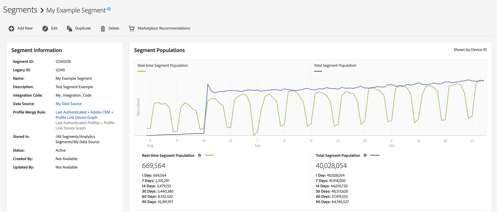
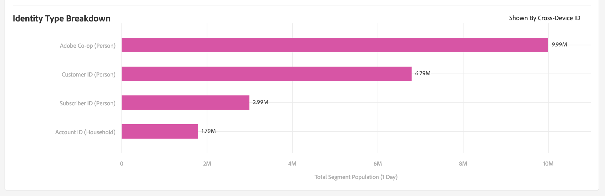

# Pagina Segmentdetails {#segment-summary-view}

De detailspagina voor een individueel segment verstrekt een overzicht van de segmentdetails, zoals de segmentnaam, identiteitskaart, prestatiesmetriek, regels die het segment, en de bestemmingstoewijzingen bepalen. Ga naar **[!UICONTROL Audience Data]** > **[!UICONTROL Segments]** en klik op de naam van het segment waarmee u wilt werken.

## Segmentbeheertools {#segment-management-tools}

De bovenkant van de pagina van de segmentdetails bewaart de hulpmiddelen die u kunt gebruiken om uw segmenten te beheren:

1. **[!UICONTROL Add New]**: Gebruik deze optie om de [!UICONTROL Segment Builder] en maakt u nieuwe segmenten.
2. **[!UICONTROL Edit]**: Gebruik deze optie om de configuratie van het huidige segment te wijzigen.
3. **[!UICONTROL Duplicate]**: Gebruik deze optie om een kopie van het huidige segment te maken.
4. **[!UICONTROL Delete]**: Gebruik deze optie om het huidige segment uit uw rekening van de Audience Manager te verwijderen.
5. **[!UICONTROL Marketplace Recommendations]**: Gebruik deze optie om vergelijkbare segmenten te zoeken als de segmenten die u bekijkt, van [!UICONTROL Audience Marketplace] gegevensfeeds waarop u geen abonnement hebt. Zie [Audience Marketplace voor gegevenskopers](../audience-marketplace/marketplace-data-buyers/marketplace-data-buyers.md) om te leren hoe te om de Marketplace te navigeren en gelijkaardige segmenten te vinden.

## Segmentinformatie {#basics}

Onder de hulpmiddelen van het segmentbeheer kunt u de volgende segmentinformatie vinden:

1. **[!UICONTROL Basic Information]:** Hiermee geeft u de vereiste en optionele details weer die bij het maken van het segment zijn opgegeven. Zie [Segment Builder](segment-builder.md) voor een gedetailleerd overzicht van wat deze velden betekenen.
2. **[!UICONTROL Segment Graph]:** Geeft prestatiegegevens grafisch weer en voor vaste intervallen van 1, 7, 14, 30, 60 en 90 dagen. We verklaren segmentpopulatieaantallen in een [afzonderlijk artikel](../../features/segments/segment-builder-data.md).

   

3. **[!UICONTROL Identity Type Breakdown ]:** Het rapport toont het aantal mensen of huishoudens die voor een segment in aanmerking komen door het aantal apparaat-id&#39;s en/of externe apparaat-grafiek-id&#39;s te tellen die zijn gekoppeld aan de apparaten die voor het segment in aanmerking kwamen (weergegeven door het [!UICONTROL Total Segment Population]). De apparaat-id&#39;s en externe apparaatgrafiek-id&#39;s die in dit rapport worden weergegeven, worden gebruikt om profielen samen te voegen met de regel voor het samenvoegen van profielen die het segment gebruikt. Dit rapport wordt alleen weergegeven als u een apparaatgegevensbron of een externe apparaatgrafiek hebt geselecteerd in de regel voor het samenvoegen van profielen die het segment gebruikt.

   

   >[!NOTE]
   >
   >Audience Manager geeft alleen de [!UICONTROL Identity Type Breakdown] rapporteren als u apparaat-id&#39;s hebt die zijn gekwalificeerd voor het segment.

   Bekijk de onderstaande video voor een overzicht van [!UICONTROL Identity Type Breakdown].
   >[!VIDEO](https://video.tv.adobe.com/v/27977/)

4. **[!UICONTROL Segment Rules]:** Maakt een lijst van eigenschappen in het segment samen met kwalificatieregels.
5. **[!UICONTROL Destination Mappings]:** Vermeldt bestemmingstoewijzingen voor het segment.
6. **[!UICONTROL Management Tools]:** Besturingselementen waarmee u segmenten kunt maken, bewerken, klonen en verwijderen.
