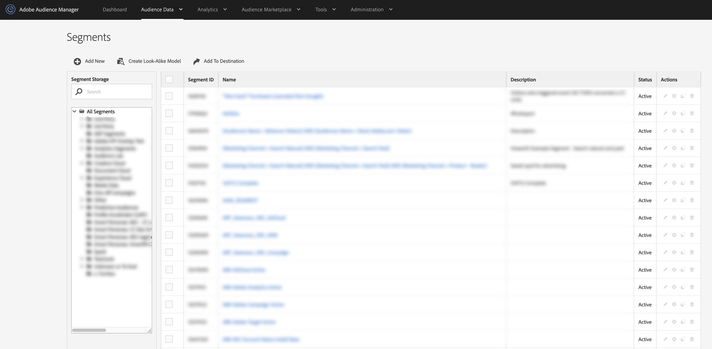

# Weergave Segmentenlijst {#segments-list-view}

De [!UICONTROL Segments dashboard] is een gecentraliseerde werkruimte voor het beheer van uw publiekssegmenten. U kunt de [!UICONTROL Segments] dashboard door naar **[!UICONTROL Audience Data]** > **[!UICONTROL Segments]**.

De [!UICONTROL Segments] Deze pagina bevat functies en gereedschappen die u helpen:

* Nieuwe segmenten maken;
* Segmenten bewerken en verwijderen;
* bestaande segmenten klonen (dupliceren);
* Alle segmenten in een tabel met sorteerbare kolommen bekijken.
* Segmentopslag beheren;
* Segmenten zoeken op naam.
