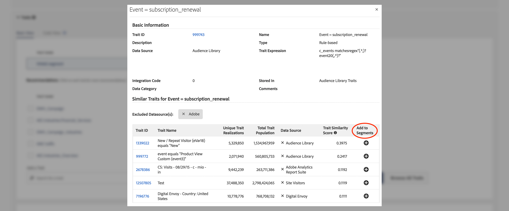
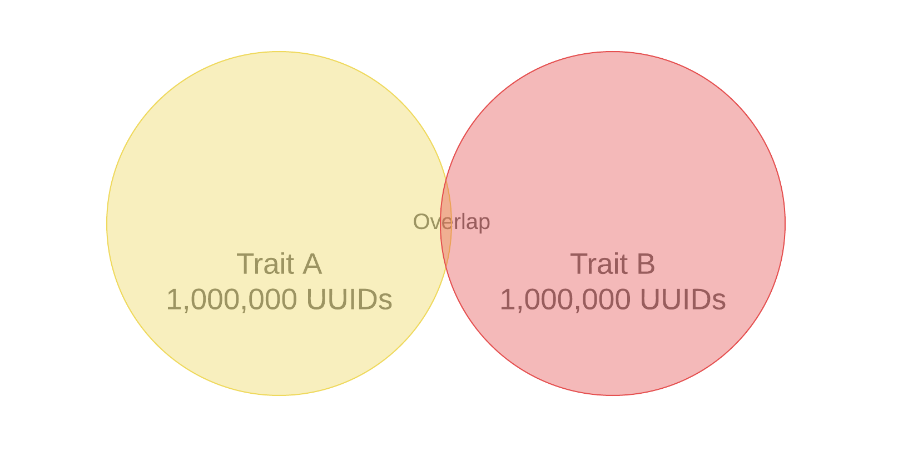

# Aanbevolen stappen

U krijgt aanbevelingen voor live gedrag wanneer u uw segmenten maakt, vanuit uw eigen traits van eerste bedrijven en [!UICONTROL Audience Marketplace] gegevensfeeds.

## Videodemonstratie

Bekijk eerst de onderstaande [!UICONTROL Trait Recommendations] video en lees vervolgens verder voor meer informatie. De videodemonstratie toont u hoe te met aanbevelingen van uw eigen eerstepartijeigenschappen te werken, evenals de aanbevelingen van de eigenschap van [!UICONTROL Audience Marketplace] gegevensvoer dat *u reeds aan* wordt ingetekend.

>[!VIDEO](https://video.tv.adobe.com/v/26228/)

In de volgende video wordt een overzicht gegeven van de workflow voor [!UICONTROL Marketplace Recommendations] en wordt uitgelegd hoe u op basis van aanbevelingen uit gegevensfeeds in [!UICONTROL Audience Marketplace] kenmerken aan uw segmenten kunt toevoegen. Deze aanbevelingen zijn gebaseerd op gegevensvoer dat *u niet aan* wordt ingetekend.

>[!VIDEO](https://video.tv.adobe.com/v/29363/)

## Overzicht

[!UICONTROL Trait Recommendations] , aangedreven door [!DNL Adobe Sensei] , geeft gegevenswetenschap door aan uw dagelijkse Audience Manager-workflows.
Met [!UICONTROL Trait Recommendations], wanneer u bouwt of een segment in [&#x200B; de Bouwer van het Segment &#x200B;](segment-builder.md) uitgeeft, krijgt u aanbevelingen op extra eigenschappen u kunt omvatten, die aan de eigenschappen in de segmentregel gelijkaardig zijn.

In Audience Manager worden aanbevelingen voor kenmerken weergegeven, zowel vanuit de sectie **[!UICONTROL Recommendations]** als vanuit de sectie **[!UICONTROL Audience Marketplace]** in de sectie **[!UICONTROL Recommendations from Marketplace]** .

Voeg de geadviseerde eigenschappen aan uw segment toe om uw doelpubliek te verhogen.

**in een notendop:**

* In Audience Manager worden de eigenschappen van de eerste partij weergegeven in de sectie [!UICONTROL Recommendations] . De aanbevelingen van de Marketplace van openbare en privé voer u niet aan wordt geabonneerd zijn zichtbaar in de [!UICONTROL Recommendations from Marketplace] sectie. Klik op de naam van de feed om naar [!UICONTROL Audience Marketplace] te gaan en u te abonneren.
* Audience Manager vertoont maximaal vijftig kenmerken die lijken op die in de segmentregel.
* U kunt de gegevensbronnen uit filteren waarvan u geen aanbevelingen wilt zien.
* Wanneer het berekenen van gelijkenissen, overweegt Audience Manager [&#x200B; UUIDs &#x200B;](../../reference/ids-in-aam.md) die voor het bezit tijdens de laatste 30 dagen kwalificeerde.
* Als het foutbericht &quot;Geen vergelijkbare kenmerken gevonden. Trait(s) kan(en) te nieuw zijn.&quot; betekent dit dat er in de afgelopen 30 dagen geen activiteit voor die eigenschap heeft plaatsgevonden, of dat Audience Manager de aanbevelingen voor die eigenschap nog niet heeft bijgewerkt. Probeer het over 24 uur opnieuw.

## Gevallen gebruiken

Met [!UICONTROL Trait Recommendations] kunt u uw workflows verbeteren, afhankelijk van hoe u Audience Manager gebruikt:

* Als marketeer, kunt u snel publiek vinden in complementaire producten met behulp van gelijkaardige eigenschappen, zodat u uw bereik kunt verhogen.
* Als u Audience Manager als uitgever gebruikt, kunt u met [!UICONTROL Trait Recommendations] het gedrag van het publiek begrijpen en betere segmenten voor advertentieverkoop of gebruikersverwerving bouwen.
* Als [!UICONTROL Audience Marketplace] gegevenskoper wil ik relevante gegevens van derden detecteren zonder door een groot aantal feeds te bladeren.
* Als [!UICONTROL Audience Marketplace] -gegevensaanbieder wil ik kopers relevante gegevens aanbevelen zodat ik gebruik kan maken van optimale en relevante abonnementen.

## Verschillen tussen Trait Recommendations en Algorithmic Models

### Algorithmic Models

[!UICONTROL Algorithmic Models] zoekt niet alleen de meest invloedrijke kenmerken, maar scoort gebruikers ook op basis van die kenmerken en wijst elke gebruiker een individuele score toe. Vervolgens maakt u algoritmische eigenschappen om uw gebruikers te targeten. Met nauwkeurigheid en bereikbesturingselementen in de [!UICONTROL Trait Builder] kunt u opgeven welke gebruikers behoren tot alle gebruikers die de invloedrijke kenmerken hebben waarop u zich wilt richten.

Met [!UICONTROL Algorithmic Models] kunt u gebruikers op verschillende nauwkeurigheidsniveaus selecteren en in [!UICONTROL Audience Lab] testen welke groep gebruikers het beste converteert. Zie het gedetailleerde gebruiksscenario in [Modellen vergelijken in Audience Lab](../../features/audience-lab/audience-lab-use-cases.md#compare-models).

In [!UICONTROL Algorithmic Models] wordt het model elke 8 dagen uitgevoerd en worden de gebruikers vernieuwd die zijn gekwalificeerd voor algoritmische kenmerken.

### Aanbevolen stappen

[!UICONTROL Trait Recommendations] is een snelle manier om inzicht te krijgen in andere eigenschappen die vergelijkbaar zijn met de eigenschappen die u in een segment gebruikt.

Gebruik [!UICONTROL Trait Recommendations] wanneer:

* U hebt snelle inzichten nodig tijdens het bouwen van een segment;
* U gebruikt de segmenten voor korte campagnes of wanneer u snelle suppressie wilt toepassen op een converterende doelgroep;
* U probeert het bereik te maximaliseren.

## Workflow

Wanneer het bouwen van of het uitgeven van een segment in [&#x200B; de Bouwer van het Segment &#x200B;](segment-builder.md), kunt u eigenschappen gelijkend op de eigenschappen in de segmentregel onderzoeken. Het [&#x200B; werkschema van de Bouwer van het Segment &#x200B;](segment-builder.md) is zeer gelijkaardig voor nieuwe en bestaande segmenten:

### Nieuwe segmenten

1. Ga naar **Gegevens van het publiek > Segmenten**, en klik **voeg Nieuw** toe.
1. In de **drop-down doos van Tonen**, voeg minstens één eigenschap aan de segmentregel toe.
1. In de sectie [!UICONTROL Audience Marketplace] ziet u aanbevolen artefacten van de eerste partij en **[!UICONTROL Recommendations]** aanbevelingen voor kenmerkeigenschappen van feeds waarop u bent geabonneerd. In de sectie **[!UICONTROL Recommendations from Marketplace]** ziet u aanbevelingen met kenmerken uit feeds waarop u zich niet hebt geabonneerd. Al deze aanbevelingen zijn gelijkaardig aan de eigenschappen u aan de segmentregel toevoegde. Schuif omlaag om alle aanbevolen kenmerken weer te geven.
1. (Facultatief) om geadviseerde eerderhandel van bepaalde gegevensbronnen uit te sluiten, klik het **X** symbool voor de gegevensbronnen u wilt uitsluiten.

   >[!NOTE]
   >
   >De uitgesloten gegevensbronnen worden net boven de lijst met aanbevolen kenmerken weergegeven. Klik **X** in de grijze doos om de uitsluitingen te verwijderen en resultaten uit de respectieve gegevensbronnen opnieuw te zien.
1. Klik op het symbool **+** om aanbevolen kenmerken aan de segmentregel toe te voegen.

>[!IMPORTANT]
>
>Wanneer u [!UICONTROL Marketplace] kenmerken aan een segment toevoegt, worden de kenmerken alleen gebruikt voor segmentschatting, totdat u zich abonneert op de corresponderende gegevensfeed. Traits die afkomstig zijn van gegevensfeeds waarop u zich niet hebt geabonneerd, worden gemarkeerd met een winkelwagentje in de lijst met handelsmerken. Klik op de naam van het kenmerk om naar de pagina met gegevensinvoer te gaan en u erop te abonneren.
>
>
>
>U kunt een segment alleen met externe kenmerken opslaan nadat u zich aan de bijbehorende gegevensfeeds hebt geabonneerd.

### Bestaande segmenten

1. Ga naar **[!UICONTROL Audience Data]>[!UICONTROL Segments]**, selecteer het segment u wilt uitgeven en  uit.
1. Schuif omlaag naar de vervolgkeuzelijst [!UICONTROL Traits] .
1. U kunt geadviseerde eigenschappen zien, die aan de eigenschappen reeds in de segmentregel gelijkaardig zijn. Schuif omlaag om alle aanbevolen kenmerken weer te geven.
1. (Facultatief) om geadviseerde eigenschappen van bepaalde gegevensbronnen uit te sluiten, klik het **X** symbool voor de gegevensbronnen u wilt uitsluiten.

   >[!NOTE]
   >
   >De uitgesloten gegevensbronnen worden net boven de lijst met aanbevolen kenmerken weergegeven. Klik **X** in de grijze doos om de uitsluitingen te verwijderen en resultaten uit de respectieve gegevensbronnen opnieuw te zien.
1. Klik op het symbool **+** om aanbevolen kenmerken aan de segmentregel toe te voegen.

Wanneer u een segment maakt of bewerkt en een kenmerk aan de segmentregel toevoegt, ziet u een maximum van vijftig aanbevolen kenmerken, vergelijkbaar met de eigenschap die u hebt toegevoegd. Als de segmentregel meer dan één eigenschap bevat, gebruikt Audience Manager een ronde robin methode om de beste gelijke voor elk bezit te tonen, dan de tweede-beste gelijke voor elk bezit, etc., voor de grootste vijftig eigenschappen door bevolking, in de segmentregel.

Bijvoorbeeld, wanneer er drie eigenschappen in de segmentregel zijn, zoals hieronder getoond, zijn de geadviseerde eigenschappen:

1. Beste overeenkomst voor kenmerk 3 (de eigenschap met de grootste populatie);
1. Beste overeenkomst voor kenmerk 1;
1. Beste overeenkomst voor kenmerk 2;
1. Tweede beste overeenkomst voor kenmerk 3;
1. De op één na beste overeenkomst voor eigenschap 1, etc. tot u aan vijftig eigenschappen krijgt.

Om aanbevelingen voor een specifiek bezit te krijgen, kunt u op de eigenschappen in de segmentregel (1) of in de geadviseerde mening van het Dienstverband (2) klikken.

Als u op een eersteklas kenmerk klikt, wordt een pop-upvenster geopend, zoals in de onderstaande afbeelding wordt getoond. Als de geadviseerde eigenschappen geen deel van het segment uitmaken, kunt u hen aan het segment toevoegen door **+** te drukken.

>[!TIP]
>
>De uitgesloten gegevensbronnen van de hoofdpagina worden overwogen terwijl het produceren van aanbevelingen binnen het pop-up venster van de eigenschapinformatie. En als u gegevensbronnen in deze weergave uitsluit, gelden de uitsluitingen voor de hoofdpagina.

>[!NOTE]
>
>Aanbevolen kenmerken kunnen de kenmerken van de eerste partij zijn of de eigenschappen van derden van gegevensfeeds waarop u zich hebt geabonneerd in [!UICONTROL Audience Marketplace] .

## Hoe het werkt

Om gedragsaanbevelingen te produceren, berekent Audience Manager de [&#x200B; gelijkenis van het Jaccard &#x200B;](https://en.wikipedia.org/wiki/Jaccard_index) tussen het doelbezit en elk ander bezit dat uw rekening toegang heeft tot, met inbegrip van derdegegevens. Audience Manager geeft vervolgens tot vijftig kenmerken weer die het meest op elkaar lijken.

## Gelijksoortige score volgen {#trait-similarity-score}

Audience Manager berekent de [!UICONTROL Trait Similarity Score] tussen twee eigenschappen door de doorsnede te berekenen en te verenigen in termen van het aantal [!UICONTROL UUID] s en dan de twee te verdelen. Voor twee kenmerken A en B ziet de berekening er als volgt uit:

Zie ook de twee onderstaande voorbeelden.

### Voorbeeld 1 - Gelijksoortige score bij laag overtrekken

Gezien twee eigenschappen A en B, laten wij zeggen elk van de eigenschappen een bevolking van 1.000.000 [!UICONTROL UUID] s heeft, 25.000 [!UICONTROL UUID] s waarvan voor beide eigenschappen in aanmerking komt.
Met bovenstaande formule resulteert dit in: 25.000 / 1.975.000 = 0,012. Dit is een lage waarde [!UICONTROL Trait Similarity Score] , de twee kenmerken lijken sterk op elkaar.

### Voorbeeld 2 - Score met gelijksoortige trajecten

Als dezelfde kenmerken A en B 400.000 [!UICONTROL UUID] hebben die voor beide kenmerken in aanmerking komen, is [!UICONTROL Trait Similarity Score] veel hoger:
400,000 / 1,600,000 = 0,25

### Hoe te om de Score van de Gelijksheid van het Beetje te interpreteren

Gebruik de onderstaande tabel als een ruwe richtlijn voor de gelijkenis van de afbeelding. Deze gids is gebaseerd op de gelijkenisscores die in de meeste kenmerken zijn waargenomen.

| [!UICONTROL Trait Similarity Score] | Significantie |
|---------|----------|
| 0.1 en hoger | Hoge overeenkomst tussen kenmerken |
| 0,03 - 0,1 | Medium-overeenkomst tussen kenmerken |
| 0,01 - 0,03 | Lage overeenkomst tussen kenmerken |
| 0 - 0,01 | Zeer lage overeenkomsten tussen eigenschappen |

## Rolgebaseerde toegangscontrole (RBAC)

Voor bedrijven die [!UICONTROL Role-Based Access Controls] gebruiken ([!UICONTROL RBAC]), moet u toestemming hebben om segmenten tot stand te brengen en uit te geven om geadviseerde eigenschappen te zien. De aanbevelingen voor kenmerken die u ziet, zijn alleen die van gegevensbronnen waartoe u via [!UICONTROL RBAC] toegang hebt.

>[!IMPORTANT]
>
>Als u [!UICONTROL Marketplace Recommendations] aan een segment wilt toevoegen, moeten gebruikers zich eerst abonneren op de bijbehorende gegevensfeeds. Alleen gebruikers met beheerdersrechten kunnen zich abonneren op [!UICONTROL Audience Marketplace] gegevensfeeds.

Lees meer over [!UICONTROL RBAC] controles [&#x200B; hier &#x200B;](../administration/administration-overview.md).

## Beperkingen

* Audience Manager geeft momenteel geen mapkenmerken weer zoals aanbevolen. Lees meer over omslageigenschappen [&#x200B; hier &#x200B;](../traits/manage-folder-traits.md).
* Bij het weergeven van Trait-aanbevelingen houdt Audience Manager geen rekening met [!DNL Boolean] -operatoren ( [!DNL AND] , [!DNL OR] , [!DNL NOT] ) in segmentregels.
