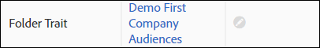

# Mapeigenschappen beheren {#manage-folder-traits}

Mapkenmerken maken, bewerken en verwijderen.

## Een maphandleiding maken {#create-folder-trait}

A [!UICONTROL folder trait] wordt automatisch gemaakt wanneer u een nieuwe map maakt in uw taxonomie.

<!-- create-folder-trait.xml -->

1. Ga naar **[!UICONTROL Audience Data > Traits]** om naar de **Treinen** dashboard.
1. In de [!UICONTROL Trait Storage] venster, aanwijzen boven:

   * Tekst Alle sporen om een nieuwe hoofdmap toe te voegen.
   * Een bestaande bovenliggende map om een nieuwe ondergeschikte map toe te voegen.

   

1. Klik op het pictogram + om de map te maken. U kunt maximaal 2000 mappen maken in uw taxonomie. Raadpleeg de documentatie over [gebruikslimieten](../../features/administration/usage-limits.md) voor meer informatie.
1. Geef de map een naam en klik op **Opslaan**. Een map met de naam Electronics heeft bijvoorbeeld een mapkenmerk met de naam &#39;Electronics Folder Trait&#39;. U kunt de nieuwe mapkenmerken weergeven en selecteren op het dashboard met kenmerken.
1. De nieuwe mapkenmerken worden automatisch toegewezen aan de [!DNL Audience Manager] gegenereerde gegevensbron. Uw gebruikers [!UICONTROL Role-Based Access Control] ([!DNL RBAC]) kunt u de gegevensbron wijzigen in de workflow voor het bewerken van de map. Zie [Een mappenset bewerken](../../features/traits/manage-folder-traits.md#edit-folder-trait).

## Een mappenset bewerken {#edit-folder-trait}

Hierin wordt beschreven hoe u een [!UICONTROL folder trait].

<!-- edit-folder-trait.xml -->

1. In de [!UICONTROL Traits] dashboard, aanwijzen boven de **[!UICONTROL Actions]** kolom voor het mapkenmerk dat u wilt bewerken.
1. Klik op het potlood om de eigenschap te bewerken.

   

1. De **[!UICONTROL Edit]** in de workflow kunt u de gegevensbron voor mapkenmerken wijzigen. Selecteer de gewenste gegevensbron en klik op **[!UICONTROL Save]**. Gegevensbronnen worden numeriek gesorteerd op [!DNL DPID]in de vervolgkeuzelijst.

   Als uw bedrijf [!UICONTROL Role-Based Access Rights (RBAC)], hebt u of uw gebruikers [toegangsmachtigingen](../../features/traits/about-folder-traits.md#role-based-access-controls) om gegevensbronnen met kenmerken te kunnen traceren.

>[!NOTE]
>
>U kunt de naam van een mapkenmerk niet rechtstreeks wijzigen. [De naam van de bijbehorende opslagmap wijzigen](../../features/traits/trait-storage.md#rename-delete-trait-storage-folder) om de naam van het mapkenmerk te wijzigen.

## Een mapmap verwijderen {#delete-folder-trait}

Verwijder een mapkenmerk door de opslagmap te verwijderen waartoe de eigenschap behoort.

<!-- delete-folder-trait.xml -->

1. **Poortgegevens > Verrichting** om naar de **Treinen** dashboard.
1. In de [!UICONTROL Trait Storage] , verwijdert u een map door de muisaanwijzer boven de map te houden en op het X-pictogram te klikken.

   

>[!NOTE]
>
>U kunt een mapkenmerk niet verwijderen als dit wordt gebruikt in een segmentexpressie. Ga naar de [weergave met kenmerken](../../features/traits/trait-details-page.md) om te zien in welke segmenten de mapkenmerken worden gebruikt. Klik vervolgens op de segmentnaam om het dialoogvenster [overzichtsweergave van segment](../../features/segments/segment-summary-view.md)Hiermee kunt u kenmerken uit segmentexpressies verwijderen.
