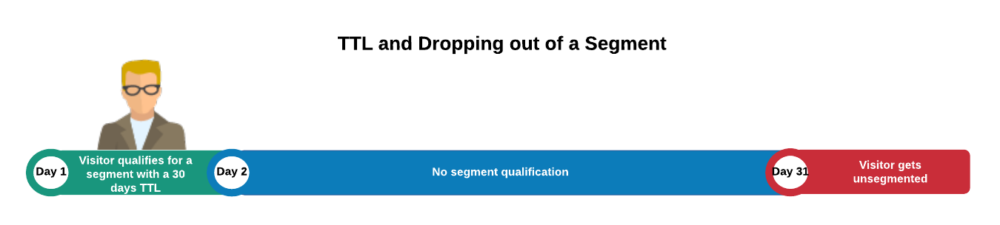

# De levensduur van segmenten en eigenschappen {#segment-time-to-live-explained}

Hoe het interval [!UICONTROL time-to-live] ([!DNL TTL]) segmentlidmaatschap beïnvloedt.

<!-- segment-ttl-explained.xml -->

## Tijd om te leven

[!DNL TTL] Hiermee bepaalt u hoe lang een sitebezoeker in een segment blijft na de laatste kwalificatiegebeurtenis. [!DNL TTL] wordt ingesteld op eigenschappen en niet op segmenten. Bezoekers vallen uit een segment als ze niet in aanmerking komen voor een eigenschap vóór het einde van het interval [!DNL TTL]. De standaard [!DNL TTL] voor nieuwe kenmerken is 120 dagen. Wanneer ingesteld op 0 dagen, verloopt de eigenschap nooit. [Stel de TTL-](../../features/traits/create-onboarded-rule-based-traits.md#set-expiration-interval) waarde in wanneer u een eigenschap maakt of bewerkt in het  [!UICONTROL Advanced Options] gedeelte van de interface voor het maken van de eigenschap.

### 1 dag TTL toegelicht

Wanneer het plaatsen van [!DNL TTL] aan 1 dag, begint de tijdopnemer van TTL de volgende dag na de verwezenlijking van het trekwerk, niet het tellen van de uren die in de dag van de spoorverwezenlijking resteren.

Audience Manager berekent [!DNL TTL] vervaldatum voor kenmerken met 1 dag [!DNL TTL] op basis van de volgende formule:

`24 + (24 - Hour of the day the trait was realized, in UTC)`

* **Voorbeeld 1**: Een eigenschap die om 1:00  [!DNL UTC]werd gerealiseerd, met een dag  [!DNL TTL]. [!DNL TTL] verloopt 24 + 24 - 1 = 47 uur later.
* **Voorbeeld 2**: Een eigenschap die om 23:00  [!DNL UTC]werd gerealiseerd, met een dag  [!DNL TTL]. [!DNL TTL] verloopt 24 + 24 - 23 = 25 uur later.

## [!DNL TTL] en uit een segment vallen

Een gebruiker valt uit een segment als zij niet voor om het even welk van zijn eigenschappen binnen het [!DNL TTL] interval kwalificeren. Als u bijvoorbeeld een 1-trait segment hebt met een periode van 30 dagen [!DNL TTL], zal de gebruiker uit dat segment vallen als hij of zij niet binnen 30 dagen opnieuw in aanmerking komt voor de eigenschap.

## [!DNL TTL] en Segmentverlenging

De [!DNL TTL] stelt terug, en de gebruiker blijft in een segment, als zij voor het bezit van dat segment binnen de [!DNL TTL] periode in aanmerking komen. Omdat de meeste segmenten meerdere kenmerken met hun eigen [!DNL TTL]-intervallen bevatten, kan een gebruiker ook in een segment blijven en het [!DNL TTL]-interval opnieuw instellen, zolang ze in aanmerking blijven komen voor alle kenmerken die aan het segment zijn gekoppeld.

Stel dat u Segment 1 hebt dat bestaat uit Trait A (30 dagen [!DNL TTL]) en Trait B (15 dagen [!DNL TTL]). Ervan uitgaande dat een bezoeker slechts eenmaal voor elk kenmerk in aanmerking komt, worden in de onderstaande illustratie het vernieuwingsproces [!DNL TTL] en de totale duur binnen het segment beschreven.

## [!DNL Audience Manager] TTLs is Onafhankelijk van de Montages van TTL van de derde

Onthoud dat de [!DNL TTL] die op uw [!DNL Audience Manager] pixel wordt ingesteld onafhankelijk werkt van de [!DNL TTL] die is ingesteld op andere pixels die door derden worden gebruikt ([!DNL DSP]s, ad networks, enz.).

>[!MORELIKETHIS]
>
>* [Een interval voor verlopen van sporen instellen](../../features/traits/create-onboarded-rule-based-traits.md#set-expiration-interval)

