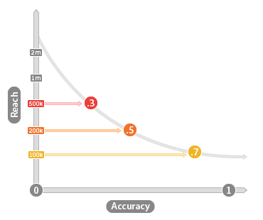

# Nauwkeurigheid en bereik {#accuracy-and-reach}

Beschrijft de verhouding tussen nauwkeurigheid en bereik in algoritmische eigenschappen.

<!-- c_accuracy_reach.xml -->

## Nauwkeurigheid versus Bereik: Info

Het is belangrijk om de relatie tussen nauwkeurigheid en bereik te begrijpen wanneer het werken met algoritmische eigenschappen. De nauwkeurigheid wordt vertegenwoordigd door een gegraveerde waarde die wijst op hoe gelijkaardig gebruikers aan uw basislijn zijn. De nauwkeurigheidsschaal loopt van 0 (minst nauwkeurig) tot en met 1 (meest nauwkeurig). Bereik is gewoon een waarde die het aantal unieke gebruikers vertegenwoordigt dat u in een eigenschap wilt opnemen. Bereik en nauwkeurigheid zijn omgekeerd. Nauwkeurige kenmerken bereiken minder gebruikers en kenmerken met een groter bereik zijn minder nauwkeurig. Dit concept wordt in de volgende afbeelding geïllustreerd.

## Nauwkeurigheid en Bereik hebben invloed op de grootte van het publiek

Uw bedrijfsdoelstellingen zouden u moeten helpen de juiste besluiten over nauwkeurigheid nemen en bereiken wanneer het werken met algoritmische eigenschappen. Als nauwkeurigheid uw doel is, merk op dat de bevolking van een eigenschap kan stijgen of verminderen over modellooppas. Bevolkingsveranderingen zijn de resultaten van het algoritme die besluiten tijdens elke evaluatieperiode neemt. Soms vindt het algoritme meer gekwalificeerde gebruikers tijdens een verwerkingscyclus en tijdens andere cycli kan het algoritme minder vinden. De resultaten worden bepaald door de basislijngegevens die worden gebruikt om het model te maken en nieuwe bezoekers en vakkwalificaties die sinds de vorige modellooppas zijn gekomen. Wanneer u echter met bereik werkt, blijft het aantal gebruikers constant. Als u bijvoorbeeld 10.000 gebruikers wilt bereiken, zorgt het algoritme ervoor dat het altijd dat nummer bereikt voor elke modeluitvoering.

## Algemene gebruiksscenario&#39;s voor nauwkeurigheid vs Bereik

De focus op nauwkeurigheid of bereik hangt af van wat u met een bepaald segment wilt bereiken. In de volgende tabel kunt u de nauwkeurigheid en het bereik evalueren wanneer u een eigenschap maakt.

| Trainingsbesluit begunstigt | Helpt zoeken |
|---|---|
| **Nauwkeurigheid** | Gebruikers die vergelijkbaar zijn met basislijnklanten in uw model. Nuttig voor gerichte campagnes wanneer u een specifiek publiek wilt bereiken. |
| **Reach** | Een specifiek aantal gebruikers voor elke gegevensuitvoering. Nuttig voor merkcampagnes wanneer u in het bereiken van een publiek van een specifieke grootte geinteresseerd bent. |
