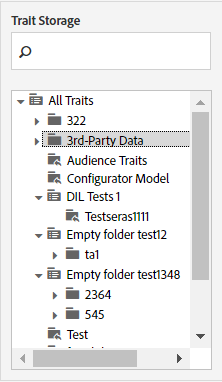

# Opslag van eigenschappen {#trait-storage}

Trait storage folders store and help you organize traits.

<!-- c_tb_storage.xml -->

## Doel van Trait Storage Mappen

In [!UICONTROL Trait Builder], zijn de opslagomslagen van de eigenschap folders die eigenschappen houden en organiseren in logische groepen die u creeert. De opslagmappen openen vanuit de [!UICONTROL Traits] dashboard of bij het maken van een nieuwe eigenschap. U kunt geen nieuwe eigenschap maken zonder deze aan een opslagmap toe te wijzen.

## Een Trait Storage-map maken {#create-trait-storage-folder}

In deze procedure wordt beschreven hoe u een opslagmap voor uw kenmerken kunt maken.

<!-- t_tb_create_storage.xml -->

U kunt een nieuwe opslagmap maken in het dialoogvenster [!UICONTROL Basic Information] als u een nieuwe eigenschap instelt. Mappen kunnen ook worden gemaakt in [!UICONTROL Trait Storage] van de belangrijkste [!UICONTROL Traits] lijstdashboard.

Een nieuwe opslagmap maken:

1. In de [!UICONTROL Trait Storage] venster, aanwijzen boven:
   * **[!UICONTROL All Traits]** om een nieuwe hoofdmap toe te voegen.
   * Een bestaande bovenliggende map om een nieuwe ondergeschikte map toe te voegen.
1. Klik op het pictogram + om de map te maken.
1. Geef de map een naam en klik op **[!UICONTROL Save]**.

## De naam van een Trait Storage-map wijzigen of deze verwijderen {#rename-delete-trait-storage-folder}

In deze procedure wordt beschreven hoe u de naam van een opslagmap kunt wijzigen of hoe u deze kunt verwijderen.

<!-- t_tb_rename_delete_storage.xml -->

U kunt de opslagmappen een andere naam geven of verwijderen in het dialoogvenster [!UICONTROL Trait Storage] van de belangrijkste [!UICONTROL Traits] lijstdashboard.

* Wijzig de naam van een map door de muisaanwijzer op de map te plaatsen en op het potloodpictogram te klikken.
* Een map verwijderen door de muis boven de map te houden en op de knop **X** pictogram.
