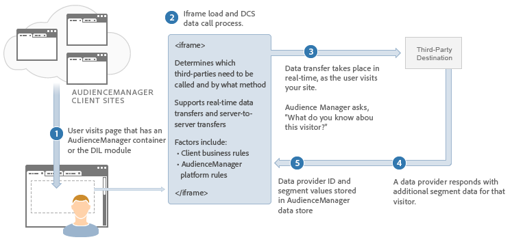

# Methoden voor gegevensintegratie {#data-integration-methods}

Een overzicht op hoog niveau van hoe de Manager van de Publiek informatie met andere gegevensleveranciers en systemen ruilt.

## Ondersteunde methoden voor gegevensintegratie: In real time en server-aan-server {#supported-methods}

Het kiezen van de juiste integratiemethode hangt van een combinatie bedrijfsvereisten en de technische mogelijkheden van uw gegevenspartner af. De Manager van de publiek wisselt bezoekersinformatie met andere gegevensleveranciers door één van beiden van de volgende methodes uit:

* **Real-time:** Hiermee worden gegevens direct overgedragen wanneer een gebruiker uw site bezoekt. Deze methode wordt ook wel *`synchronous`* integratie genoemd.
* **Batch (server-naar-server):** Hiermee worden gegevens tussen servers overgedragen volgens een ingestelde planning nadat een bezoeker de pagina heeft verlaten. Deze methode wordt ook wel een *`out-of-band`* of een *`asynchronous`* integratie genoemd.

## Vereisten: Een Trait Taxonomie maken {#prereqs}

Voordat het integratieproces begint, moet u [eigenschappen](../features/traits/create-onboarded-rule-based-traits.md) en een [mapstructuur](../features/traits/trait-storage.md#create-trait-storage-folder) in de [!DNL Audience Manager] gebruikersinterface maken. De taxonomie zal al uw eigenschappen bevatten die in een logische hiërarchie worden georganiseerd.

## Gebruiksscenario&#39;s voor integratie {#integration-use-cases}

Een gebruiksscenario van de methodes van de gegevensintegratie van de Manager van de Audience samen met de voor- en nadelen van elk.

### Real-Time Server-naar-server integratie

<!-- c_int_types_use_cases.xml -->

Een real-time server-aan-server gegevensintegratie synchroniseert snel gebruikersgegevens tussen de servers van de Manager van de Publiek en een ander gericht systeem. In de meeste gevallen vindt de gegevensuitwisseling plaats binnen seconden of minuten, afhankelijk van de vernieuwingsfrequentie van het doelsysteem. Nota, echter, bepaalt het gerichte systeem dit verfrist interval, niet de Manager van de Publiek. Bovendien kan de vernieuwingsfrequentie per systeem verschillen. Een integratie in real time, server-aan-server is het aangewezen integratietype voor gegevensuitwisseling. De Manager van het publiek gebruikt deze methode wanneer het richten van partners het kan steunen.

<table id="simpletable_5307DEC378E5486CB92A354287F33AD8"> 
 <tr class="strow">
  <td class="stentry"> 
Voordelen: 
</td>
  <td class="stentry"> 
   <ul id="ul_F251AFF8A2FA49D0849E36D7FAE87DE7"> 
    <li id="li_1737EBB1AD8844BD87E736BB4D8080EF">Hiermee kunt u gebruikers in aanmerking laten komen voor segmenten zonder deze opnieuw te zien op de pagina, in een videospeler, enz. </li>
    <li id="li_1C1F346CB7BD40508AA5A6918C6B8514"> Vermindert het aantal vraag van HTTP van de pagina. Minder vraag helpt de gebruikerservaring bewaren. </li>
    <li id="li_046BF4568B104F53A0E5372568C957CD">Hiermee kunt u sneller actie ondernemen bij een gekwalificeerde gebruiker. </li>
    <li id="li_70F7AB19AC5D4A9AB80216A2B05163B8">Nuttig bij de overgang naar een DSP voor offsite targeting. </li>
   </ul></td>
 </tr>
 <tr class="strow">
  <td class="stentry"> Nadelen:</td>
  <td class="stentry"> Minder nuttig voor onsite het richten wanneer u de gebruiker op de zelfde pagina, of de volgende pagina moet richten, die op het kwalificeren van een gebruiker voor dat segment wordt gebaseerd.</td>
 </tr>
</table>

### Server-naar-server batchintegratie

Een server-aan-server groeperen integratie bundelt gegevens en verzendt het naar andere systemen met vastgestelde intervallen eerder dan in dichtbij echt - tijd. De intervallen voor gegevensoverdracht beginnen na 24 uur. Sommige gegevensleveranciers steunen slechts dit integratietype. Maar we hebben een algemene trend gezien die afsteekt van batchintegratie naar realtime integratiemethodologieën.

<table id="simpletable_6878241639114DE68E61A251486C6317"> 
 <tr class="strow">
  <td class="stentry"> 
Voordelen: 
</td>
  <td class="stentry"> 
   <ul id="ul_1E9B48B06E764D3AB6F2D702EB4922DC"> 
    <li id="li_1CF0E018660347B3A5AF79160F74FBDB">Hiermee kunt u gebruikers in aanmerking laten komen voor segmenten zonder deze opnieuw te zien op de pagina, in een videospeler, enz. </li> 
    <li id="li_B6A9DF9C0D8B44A48F032F2FDB5B3956">Nuttig voor het richten dat niet tijdgevoelig is. </li>
   </ul></td>
 </tr>
 <tr class="strow">
  <td class="stentry"> Nadelen:</td>
  <td class="stentry"> Het synchronisatieinterval kan het richten tegen de huidigste gegevens vertragen.</td>
 </tr>
</table>

### Vraag in real time

In real time vraag uitwisselingsgegevens met de Manager van de Publiek onmiddellijk, aangezien een gebruiker uw plaats bezoekt of actie op de pagina neemt. Met deze methode, krijgen de het richten systemen de meest bijgewerkte gegevens van de segmentkwalificatie en kunnen die informatie in aanmerking nemen tijdens een inhoud of een leveringsbesluit. Dit proces werkt ook met uitgever en servers waar we gekwalificeerde segmenten bijwerken naar een cookie van de eerste partij die in een advertentie wordt gelezen als sleutelwaardeparen. Momenteel, gebruikt de Manager van de Publiek vraag in real time om met [!DNL Target] en andere systemen van het inhoudsbeheer te integreren.

<table> 
 <tr>
  <td> 
Voordelen: 
</td>
  <td> 
 Hiermee kunt u de volgende pagina, het inhoudsgebied of de advertentie als doel instellen op basis van de meest recente segmentkwalificatie. 
</td> 
 </tr> 
 <tr>
  <td> 
Nadelen: 
</td>
  <td> 
Voegt een vraag aan de Manager van de Publiek van de pagina toe.
</td>
 </tr> 
</table>

### Pixels Syncs to Targeing Systems

Pixelsynchronisatie wijst segmenten toe aan pixels op de pagina. De pixel brandt en brengt gegevens over wanneer een gebruiker voor een bepaald segment kwalificeert. Pixelsynchronisatie is een rudimentair en onbetrouwbaar mechanisme voor gegevensoverdracht. De belangrijkste gegevensleveranciers en -systemen gebruiken dit zelden.

<table id="simpletable_39E4CD139CCF4417842AA28CDFFB6EB1"> 
 <tr class="strow">
  <td class="stentry"> 
Voordelen: 
</td>
  <td class="stentry"> 
 Gegevensoverdracht in realtime. 
</td> 
 </tr> 
 <tr class="strow">
  <td class="stentry"> 
Nadelen: 
</td>
  <td class="stentry"> 
   <ul id="ul_5217EDC82434401493C2C96823C068E9"> 
    <li id="li_26EB0458CA1844908C005A47F55E50AC">Kan veel cliënt-zijvraag van de pagina toevoegen. </li>
    <li id="li_CD91F3DC92F2429293787D61506E5E04">Onbetrouwbaar voor gegevensoverdracht. 5% tot 20% verlies is normaal. </li>
   </ul></td>
 </tr> 
</table>

## Hoe te om een Methode van de Levering van Gegevens te kiezen {#data-delivery-choices}

Beschrijft technische en bedrijfsredenen om gegevens via synchrone (real time) of asynchrone (server-aan-server) methodologieën te verzenden.

<!-- c_int_delivery_choices.xml -->

### Een type gegevenslevering selecteren

* **Technische overwegingen:** De levering van gegevens hangt van de technische mogelijkheden van de gegevenspartner af. De Manager van het publiek kan gegevens in real time van browser of door partijupdates verzenden/ontvangen door off-line, server-aan-server communicatie processen.
* **Overwegingen voor bedrijven:** De bedrijfsredenen om één leveringsmethode of een andere te selecteren hangen van de technische mogelijkheden van uw bestemmingspartner af en hoe u deze gegevens wilt gebruiken. Over het algemeen zijn synchrone gegevensoverdrachten handig wanneer u onmiddellijk actie moet ondernemen met betrekking tot gebruikersgegevens. Asynchrone gegevensoverdrachten kunnen nuttig zijn wanneer de directe actie niet wordt vereist en wanneer u tijd hebt om diepere gebruikersprofielen voor later gebruik te bouwen.

## Real-time gegevensoverdrachtproces {#real-time-data-transfer-process}

Een algemeen overzicht van hoe de Manager van het Publiek een synchrone gegevensuitwisseling met een derdeverkoper uitvoert.

### Real-time gegevensoverdracht

<!-- c_int_overview_sync.xml -->

In real time gegevensoverdrachten verzenden en ontvangen segment IDs als gebruikersbezoeken of voeren actie op uw plaats. Over het algemeen zijn synchrone gegevensoverdrachten handig wanneer u gebruikers meteen moet kwalificeren of segmenteren terwijl ze door uw voorraad navigeren.

### Stappen voor realtime gegevensintegratie

Het integratieproces van gegevens in real time werkt als volgt:

1. Een gebruiker bezoekt de plaats van een klant die de code van de Manager van de Publiek bevat.
1. De Manager van de publiek laadt een Iframe en doet een vraag aan [!UICONTROL Data Collection Server] ([!UICONTROL DCS]).
1. De [!UICONTROL DCS] vraag de derdenserver (in echt - tijd) om te controleren of heeft de verkoper om het even welke segmentinformatie over de gebruiker.
1. De derde keert segmentinformatie over die gebruiker aan de Manager van het Publiek terug.
1. De Manager van de publiek neemt segmentinformatie op en stelt het ter beschikking voor het richten.

## Batchgegevensoverdrachtproces {#batch-data-transfer-process}

Een algemeen overzicht van hoe de Manager van de Publiek gegevens synchroon (in real time) met een derdeverkoper ruilt.

### Batchgegevensintegratie

<!-- c_int_overview_async.xml -->

Het batchproces (server-naar-server) voor gegevensintegratie volgt de meeste stappen die in het proces in real time van de gegevensoverdracht worden beschreven. In plaats van segment-id&#39;s direct te retourneren, worden gebruikersgegevens echter opgeslagen op onze servers en met regelmatige tussenpozen gesynchroniseerd met een externe gegevensaanbieder. Het asynchrone proces voor gegevensoverdracht is handig wanneer:

* Directe gegevensoverdracht is niet vereist.
* Gegevens verzamelen om een grote groep gesegmenteerde gebruikers samen te stellen.
* U wilt gegevensdiscrepanties en `HTTP` vraag van browser verminderen.

### Stappen voor integratie van batchgegevens

1. Een gebruiker bezoekt een klantsite.
1. Audience Manager en de externe gegevensaanbieder wijzen de bezoeker een unieke id toe (meestal met een cookie).
1. Audience Manager roept de gegevensaanbieder van derden aan om bezoeker-id&#39;s aan te passen.
1. Een gepland verzoek, gewoonlijk op een dagelijks interval, ruilt de gegevens van het bezoekerssegment tussen de Manager van het Publiek en uw derde gegevensleverancier.

Voor informatie beschrijvend de tijdkaders wanneer de Manager van de Publiek binnenkomende en uitgaande server-aan-server ([!UICONTROL S2S]) dossieroverdrachten verwerkt, zie het [Melden en de richtlijnen](../reference/reporting-file-transfer-timeframe.md)van de Tijd van de Overdracht van het Dossier.
