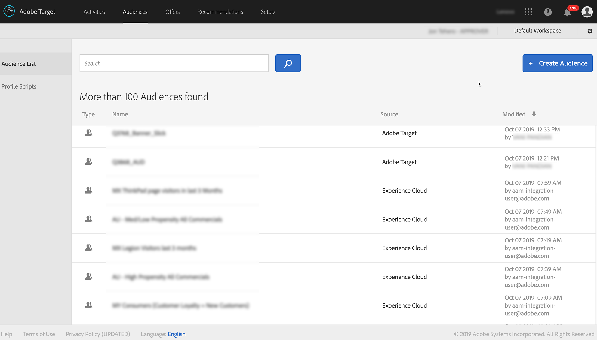

# Audience Manager integreren met [!DNL Target] {#integrate-audience-manager-with-target}

Dankzij deze integratie kunt u segmenten van Audience Managers naar Adobe verzenden [!DNL Target].

Een Audience Manager - [!DNL Target] integratie vereist:

* De [Experience Cloud-service](https://docs.adobe.com/content/help/en/id-service/using/home.html). Als u deze service niet gebruikt, raadpleegt u de [implementatiehandleidingen](https://docs.adobe.com/content/help/en/id-service/using/implementation/implementation-guides.html) om aan de slag te gaan.
* [!DNL Profiles and Audiences]. Als u niet bent voorzien voor [!DNL Profiles and Audiences], vult u het formulier in op de pagina [Integraties van](https://adobe.allegiancetech.com/cgi-bin/qwebcorporate.dll?idx=X8SVES) Experience Cloud of neemt u contact op met uw consultant om aan de slag te gaan.

Alle segmenten van uw Audience Manager worden weergegeven [!DNL Target] kort nadat u deze stappen in het implementatieproces hebt uitgevoerd. Kijk in **[!UICONTROL Audiences > Audience List]** om uw Audience Manager segmenten in te zien [!DNL Target]. Identificeer de segmenten van de Audience Manager door Experience Cloud in de **[!UICONTROL Source]** kolom en door `aam-integration-user@adobe.com` in de **[!UICONTROL Modified]** kolom.

