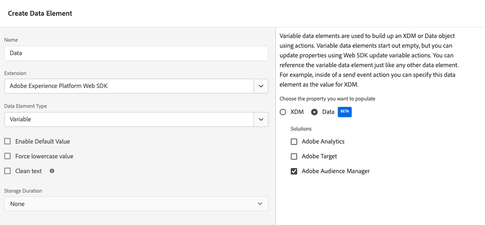

# Werk uw bibliotheek van de gegevensinzameling voor Audience Manager van de de markeringsuitbreiding van de Audience Manager aan de de markeringsuitbreiding van SDK van het Web bij

## Beoogd publiek

Deze pagina is bedoeld voor klanten van de Audience Manager die het [Audience Manager, tagextensie](https://experienceleague.adobe.com/en/docs/experience-platform/tags/extensions/client/audience-manager/overview) om gegevens van webverzamelingen in Audience Manager te brengen. Voor klanten die de AppMeasurement JavaScript bibliotheek gebruiken, gelieve de gids over hoe te om uw bibliotheek van de gegevensinzameling voor Audience Manager bij te werken [vanuit de JavaScript-bibliotheek van het AppMeasurement naar de JavaScript-bibliotheek van de Web SDK](appmeasurement-to-web-sdk.md).

## Voordelen en nadelen van dit implementatiepad

Het gebruik van deze migratiebenadering heeft zowel voor- als nadelen. Let zorgvuldig op elke optie om te bepalen welke benadering het beste is voor uw organisatie.

| Voordelen | Nadelen |
| --- | --- |
| <ul><li>**Geen code gewijzigd op uw site**: Aangezien voor uw implementatie al tags zijn geïnstalleerd, kunnen alle migratie-updates worden uitgevoerd in de taginterface.</li><li>**Gebruikt uw bestaande implementatie**: Voor deze aanpak is geen netto nieuwe implementatie nodig. Terwijl het nieuwe regelacties vereist, kunt u uw bestaande gegevenselementen en regelvoorwaarden met minimale veranderingen opnieuw gebruiken.</li><li>**Geen schema vereist**: Voor dit stadium van het migreren aan het Web SDK, hebt u geen schema XDM nodig. In plaats daarvan kunt u de `data` -object, dat gegevens rechtstreeks naar Adobe Audience Manager verzendt. Zodra de migratie naar SDK van het Web volledig is, dan kunt u een schema voor uw organisatie tot stand brengen en gegevensstroomafbeelding gebruiken om toepasselijke gebieden te bevolken XDM. Als een schema in dit stadium van het migratieproces werd vereist, zou uw organisatie worden gedwongen om een Adobe Audience Manager XDM schema te gebruiken. Het gebruik van dit schema maakt het voor uw organisatie moeilijker om uw eigen schema in de toekomst te gebruiken.</li></ul> | <ul><li>**Technische schuld implementeren**: Aangezien deze benadering een gewijzigde vorm van uw bestaande implementatie gebruikt, kan het moeilijker zijn om implementatielogica te volgen en veranderingen uit te voeren wanneer nodig. De code van de douane kan bijzonder moeilijk zijn om te zuiveren.</li><li>**Vereist toewijzing om gegevens naar Platform te verzenden**: Als uw organisatie klaar is om Real-Time CDP te gebruiken, moet u gegevens naar een gegevensset in Adobe Experience Platform verzenden. Deze handeling vereist dat elk veld in het dialoogvenster `data` -object is een item in het hulpprogramma voor gegevenstoewijzing dat het toewijst aan een XDM-schemaveld. Voor deze workflow hoeft u slechts één keer toewijzingen uit te voeren, en dit betekent niet dat u implementatiewijzigingen aanbrengt. Het is echter een extra stap die niet vereist is bij het verzenden van gegevens in een XDM-object.</li></ul> |

Adobe raadt u aan dit implementatiepad te volgen als u een bestaande implementatie hebt met de Adobe Audience Manager-tagextensie.

## Stappen vereist om naar SDK van het Web te migreren

De volgende stappen bevatten concrete doelstellingen die moeten worden nagestreefd. Selecteer elke stap voor gedetailleerde instructies over hoe te om het te verwezenlijken.

+++**1. Een gegevensstroom maken en configureren**

Volg de onderstaande instructies om een gegevensstroom te maken in de gegevensverzameling van Adobe Experience Platform. Wanneer u gegevens naar deze gegevensstroom verzendt, stuurt het gegevens door naar de Audience Manager. In de toekomst stuurt dezelfde gegevensstroom gegevens door naar Real-Time CDP.

1. Navigeren naar [experience.adobe.com](https://experience.adobe.com) en meld u aan met uw referenties.
1. Gebruik de homepage of productkiezer in de rechterbovenhoek om naar **[!UICONTROL Data Collection]**.
1. Selecteer in de linkernavigatie de optie **[!UICONTROL Datastreams]**.
1. Selecteren **[!UICONTROL New Datastream]**.
1. Voer de gewenste naam in en selecteer **[!UICONTROL Save]**.
1. Wanneer de gegevensstroom is gemaakt, selecteert u **[!UICONTROL Add Service]**.
1. Selecteer in het vervolgkeuzemenu Service de optie **[!UICONTROL Adobe Audience Manager]**.
1. Zorg ervoor dat de **[!UICONTROL Enable XDM Flattened Fields]** is uitgeschakeld.

    {style="border:1px solid lightslategray"}

Uw gegevensstroom is nu klaar om gegevens te ontvangen en door te geven aan Audience Manager.

+++

+++**2. Voeg de uitbreiding van SDK van het Web aan uw markeringsbezit toe**

Deze sectie bereidt uw markering voor het grootste deel van de migratieinspanning die in de volgende stap plaatsvindt.

1. Selecteer het hamburgerpictogram linksboven in de Adobe Experience Platform-interface en selecteer vervolgens **[!UICONTROL Tags]**.
1. Selecteer de gewenste eigenschap tag.
1. Selecteer in de linkernavigatie van de eigenschap tag de optie **[!UICONTROL Extensions]**.
1. Selecteren **[!UICONTROL Catalog]** boven aan het scherm ziet u een lijst met alle beschikbare extensies.
1. Zoeken naar en selecteren de **[!UICONTROL Adobe Experience Platform Web SDK]** extensie selecteert u vervolgens **[!UICONTROL Install]** aan de rechterkant.

    {style="border:1px solid lightslategray"}

1. De instellingen voor de extensieconfiguratie worden weergegeven. Zoek de **[!UICONTROL Datastreams]** en selecteert u de sandbox die u gebruikt en de gegevensstroom die u in de vorige stap hebt gemaakt.

    {style="border:1px solid lightslategray"}

1. Selecteren **[!UICONTROL Save]**.

Uw markeringsbezit heeft nu het Web SDK geïnstalleerd.

+++

+++**3. Een gegevenselement voor een gegevensobject maken**

Het gegevenselement van gegevensobjecten verstrekt een intuïtief kader om een nuttige lading te vormen die SDK van het Web gebruikt om naar een gegevensstroom te verzenden. De meeste regels die u in de volgende stap bijwerkt, beïnvloeden dit gegevenselement.

1. Selecteer in de linkernavigatie van de taginterface de optie **[!UICONTROL Data Elements]**.
1. Selecteren **[!UICONTROL Add Data Element]**
1. Geef het gegevenselement de volgende instellingen:
   * **[!UICONTROL Name]**: Alles wat u wilt, zoals &quot;Gegevenslaag&quot; of &quot;Gegevensobject&quot;
   * **[!UICONTROL Extension]**: [!UICONTROL Adobe Experience Platform Web SDK]
   * **[!UICONTROL Data Element Type]**: [!UICONTROL Variable]
   * Selectievakjes kunnen ongewijzigd blijven.
1. Selecteer de volgende instellingen aan de rechterkant:
   * Keuzerondje eigenschap: **[!UICONTROL Data]**
   * **[!UICONTROL Solution]**: [!UICONTROL Adobe Audience Manager]
1. Selecteren **[!UICONTROL Save]**.

    {style="border:1px solid lightslategray"}

Uw markeringsbezit heeft nu alles nodig om elke regel bij te werken.

+++

+++**4. De regels van de update om de uitbreiding van SDK van het Web in plaats van de uitbreiding van de Audience Manager te gebruiken**

Deze stap bevat het grootste deel van de inspanning die wordt vereist om aan het Web SDK te migreren, en vereist kennis van hoe uw implementatiewerk. Hieronder ziet u een voorbeeld van het bewerken van een standaardlabelregel. Werk alle markeringsregels in uw implementatie bij om alle verwijzingen naar de uitbreiding van de Audience Manager met de uitbreiding van SDK van het Web te vervangen.

1. Selecteer in de linkernavigatie van de taginterface de optie **[!UICONTROL Rules]**.
1. Selecteer een regel die u wilt bewerken.
1. Selecteer de handeling **[!UICONTROL Audience Manager - Set Variables]**
1. Noteer alle variabelen van de Audience Manager die in deze regel zijn ingesteld. Neem zowel variabelen op die zijn ingesteld in de vervolgkeuzemenu&#39;s als variabelen die zijn ingesteld in de aangepaste code.
1. Wijzig de [!UICONTROL Action Configuration] naar de volgende instellingen:
   * **[!UICONTROL Extension]**: [!UICONTROL Adobe Experience Platform Web SDK]
   * **[!UICONTROL Action type]**: variabele bijwerken
1. Zorg ervoor dat het gegevensobject dat u in stap 3 hebt gemaakt, is geselecteerd in het keuzemenu rechts in het dialoogvenster **[!UICONTROL Data element]** veld.
1. Plaats de sleutel-waardeparen van de Audience Manager aan hun zelfde respectieve waarden zoals zij in de uitbreiding van de Audience Manager werden gevormd.
1. Zodra alle regellogica gebruikend de uitbreiding van SDK van het Web wordt herhaald, uitgezocht **[!UICONTROL Keep Changes]**.
1. Herhaal deze stappen voor elke actieconfiguratie die de de markeringsuitbreiding van de Audience Manager gebruikt om waarden te plaatsen.

De bovenstaande stappen zijn alleen van toepassing op regels die waarden instellen. De volgende stappen vervangen alle acties die [!UICONTROL Action Configuration] [!UICONTROL Send Event].

1. Selecteer een regel die een Web SDK-gebeurtenis verzendt.
1. Het handelingstype selecteren **[!UICONTROL Send Event]**.
1. Wijzig de [!UICONTROL Action Configuration] naar de volgende instellingen:
   * **[!UICONTROL Extension]**: [!UICONTROL Adobe Experience Platform Web SDK]
   * **[!UICONTROL Action type]**: [!UICONTROL Send event]
1. Wijzig rechts de handelingsinstellingen in het volgende:
   * **[!UICONTROL Type]**: Gebruik **[!UICONTROL Web Webpagedetails Page Views]**.
   * **[!UICONTROL Data]**: Selecteer het gegevensobject dat u in stap 3 hebt gemaakt.
1. Selecteren **[!UICONTROL Keep Changes]**.
1. Herhaal deze stappen voor elke actieconfiguratie die Audience Manager gebruikt om een gebeurtenis te verzenden.

+++

+++**5. Bijgewerkte regels publiceren**

Het publiceren van bijgewerkte regels volgt de zelfde werkschema zoals om het even welke andere verandering in uw markeringsconfiguratie.

1. Selecteer in de linkernavigatie van de taginterface de optie **[!UICONTROL Publishing Flow]**.
1. Selecteren **[!UICONTROL Add Library]**.
1. Geef deze tag een naam, zoals &quot;Upgrade to Web SDK&quot;.
1. Selecteren **[!UICONTROL Add All Changed Resources]**.
1. Selecteren **[!UICONTROL Save]**.
1. In de publicatieworkflow wordt een oranje stip weergegeven die aangeeft dat deze aan het bouwen is. Als de punt groen wordt, zijn de wijzigingen beschikbaar in uw ontwikkelomgeving.
1. Test uw veranderingen in uw ontwikkelomgeving om ervoor te zorgen dat alle regels behoorlijk vuren, en dat het gegevensvoorwerp met verwachte waarden bevolkt is.
1. Als u klaar bent, dient u de bibliotheek ter goedkeuring in, bouwt u de bibliotheek naar de testfase, keurt u de bibliotheek goed en publiceert u de bibliotheek naar de productie.

    {style="border:1px solid lightslategray"}

+++

+++**6. Audience Manager-extensie uitschakelen**

Zodra uw markeringsimplementatie volledig aan het Web SDK wordt gemigreerd, kunt u de uitbreiding van de Audience Manager onbruikbaar maken.

1. Selecteer in de linkernavigatie van de taginterface de optie **[!UICONTROL Extensions]**.
1. Zoek en selecteer de [!UICONTROL Audience Manager] extensie. Selecteer rechts **[!UICONTROL Disable]**.
1. Volg dezelfde publicatieworkflow hierboven om het verwijderen van de [!UICONTROL Audience Manager] extensie.
1. Als de extensie eenmaal is uitgeschakeld in de productie, kunt u deze volledig verwijderen. Selecteer de extensie, selecteer het menu met drie punten rechts en selecteer vervolgens **[!UICONTROL Uninstall]**.
1. Volg dezelfde publicatieworkflow hierboven om deze wijzigingen in de productie te publiceren.

+++

Op dit punt, wordt uw implementatie van de Audience Manager volledig gemigreerd aan het Web SDK en is bereid om zich aan Real-Time CDP in de toekomst te bewegen.
