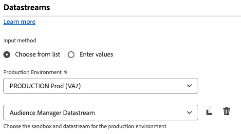

# De bibliotheek met gegevensverzamelingen voor Audience Manager bijwerken van de Audience Manager-tagextensie naar de Web SDK-tagextensie

## Beoogd publiek

Deze pagina is voorgenomen voor de klanten van Audience Manager die de [ de markeringsuitbreiding van Audience Manager ](https://experienceleague.adobe.com/nl/docs/experience-platform/tags/extensions/client/audience-manager/overview) gebruiken om de gegevens van de Webinzameling in Audience Manager te brengen. Voor klanten die de bibliotheek van AppMeasurement JavaScript gebruiken, te lezen gelieve de gids op hoe te om uw bibliotheek van de gegevensinzameling voor Audience Manager [ van de bibliotheek van AppMeasurement JavaScript aan de bibliotheek van SDK JavaScript van het Web bij te werken ](appmeasurement-to-web-sdk.md).

## Voordelen en nadelen van dit implementatiepad

Het gebruik van deze migratiebenadering heeft zowel voor- als nadelen. Let zorgvuldig op elke optie om te bepalen welke benadering het beste is voor uw organisatie.

| Voordelen | Nadelen |
| --- | --- |
| <ul><li>**Geen codeveranderingen op uw plaats**: Aangezien uw implementatie reeds geïnstalleerde markeringen heeft, kunnen alle migratieupdates in de markeringsinterface worden gemaakt.</li><li>**gebruikt uw bestaande implementatie**: Deze benadering vereist geen net-nieuwe implementatie. Terwijl het nieuwe regelacties vereist, kunt u uw bestaande gegevenselementen en regelvoorwaarden met minimale veranderingen opnieuw gebruiken.</li><li>**vereist geen schema**: voor dit stadium van het migreren aan het Web SDK, hebt u geen schema XDM nodig. In plaats daarvan kunt u het object `data` vullen, dat gegevens rechtstreeks naar Adobe Audience Manager verzendt. Zodra de migratie naar het Web SDK volledig is, dan kunt u een schema voor uw organisatie tot stand brengen en gegevensstroomafbeelding gebruiken om toepasselijke gebieden te bevolken XDM. Als een schema in dit stadium van het migratieproces werd vereist, zou uw organisatie worden gedwongen om een Adobe Audience Manager XDM schema te gebruiken. Het gebruik van dit schema maakt het voor uw organisatie moeilijker om uw eigen schema in de toekomst te gebruiken.</li></ul> | <ul><li>**Technische schuld van de Implementatie**: Aangezien deze benadering een gewijzigde vorm van uw bestaande implementatie gebruikt, kan het moeilijker zijn om implementatielogica te volgen en veranderingen uit te voeren wanneer nodig. De code van de douane kan bijzonder moeilijk zijn om te zuiveren.</li><li>**vereist afbeelding om gegevens naar Platform** te verzenden: Wanneer uw organisatie klaar is om Real-Time CDP te gebruiken, moet u gegevens naar een gegevensreeks in Adobe Experience Platform verzenden. Deze actie vereist dat elk gebied in het `data` voorwerp een ingang in het hulpmiddel is van de gegevenstoewijzing dat het aan een XDM schemagebied toewijst. Voor deze workflow hoeft u slechts één keer toewijzingen uit te voeren, en dit betekent niet dat u implementatiewijzigingen aanbrengt. Het is echter een extra stap die niet vereist is bij het verzenden van gegevens in een XDM-object.</li></ul> |

Adobe raadt u aan dit implementatiepad te volgen als u een bestaande implementatie hebt met de Adobe Audience Manager-tagextensie.

## Stappen die nodig zijn voor migratie naar de Web SDK

De volgende stappen bevatten concrete doelstellingen die moeten worden nagestreefd. Selecteer elke stap voor gedetailleerde instructies over hoe te om het te verwezenlijken.

+++**1. Creeer en vorm een gegevensstroom**

Volg de onderstaande instructies om een gegevensstroom te maken in de gegevensverzameling van Adobe Experience Platform. Wanneer u gegevens naar deze gegevensstroom verzendt, stuurt het gegevens door naar Audience Manager. In de toekomst stuurt dezelfde gegevensstroom gegevens door naar Real-Time CDP.

1. Navigeer aan [ experience.adobe.com ](https://experience.adobe.com) en login gebruikend uw geloofsbrieven.
1. Gebruik de startpagina of de productkiezer rechtsboven om naar **[!UICONTROL Data Collection]** te navigeren.
1. Selecteer **[!UICONTROL Datastreams]** in de linkernavigatie.
1. Selecteer **[!UICONTROL New Datastream]** .
1. Voer de gewenste naam in en selecteer vervolgens **[!UICONTROL Save]** .
1. Wanneer de gegevensstroom is gemaakt, selecteert u **[!UICONTROL Add Service]** .
1. Selecteer **[!UICONTROL Adobe Audience Manager]** in het vervolgkeuzemenu voor de service.
1. Controleer of de optie **[!UICONTROL Enable XDM Flattened Fields]** is uitgeschakeld.

    {style="border:1px solid lightslategray"} toe

Uw gegevensstroom is nu klaar om gegevens te ontvangen en door te geven aan Audience Manager.

+++

+++**2. Voeg de uitbreiding van SDK van het Web aan uw markeringsbezit toe**

Deze sectie bereidt uw markering voor het grootste deel van de migratieinspanning die in de volgende stap plaatsvindt.

1. Selecteer het hamburgerpictogram linksboven in de Adobe Experience Platform-interface en selecteer vervolgens **[!UICONTROL Tags]** .
1. Selecteer de gewenste eigenschap tag.
1. Selecteer **[!UICONTROL Extensions]** in de linkernavigatie van de eigenschap tag.
1. Selecteer **[!UICONTROL Catalog]** boven in het scherm om een lijst met alle beschikbare extensies weer te geven.
1. Zoek en selecteer de extensie **[!UICONTROL Adobe Experience Platform Web SDK]** en selecteer vervolgens **[!UICONTROL Install]** aan de rechterkant.

    {style="border:1px solid lightslategray"}

1. De instellingen voor de extensieconfiguratie worden weergegeven. Zoek de sectie **[!UICONTROL Datastreams]** en selecteer de sandbox die u gebruikt en de gegevensstroom die u in de vorige stap hebt gemaakt.

    {style="border:1px solid lightslategray"}

1. Selecteer **[!UICONTROL Save]** .

De Web SDK is nu geïnstalleerd op uw tag-eigenschap.

+++

+++**3. Creeer een gegevenselement van gegevensobjecten**

Het gegevenselement van gegevensobjecten verstrekt een intuïtief kader om een lading te vormen die het Web SDK gebruikt om naar een gegevensstroom te verzenden. De meeste regels die u in de volgende stap bijwerkt, beïnvloeden dit gegevenselement.

1. Selecteer **[!UICONTROL Data Elements]** in de linkernavigatie van de taginterface.
1. Selecteren **[!UICONTROL Add Data Element]**
1. Geef het gegevenselement de volgende instellingen:
   * **[!UICONTROL Name]**: Alles wat u wilt, zoals &quot;Gegevenslaag&quot; of &quot;Gegevensobject&quot;
   * **[!UICONTROL Extension]**: [!UICONTROL Adobe Experience Platform Web SDK]
   * **[!UICONTROL Data Element Type]**: [!UICONTROL Variable]
   * Selectievakjes kunnen ongewijzigd blijven.
1. Selecteer de volgende instellingen aan de rechterkant:
   * Keuzerondje voor eigenschap: **[!UICONTROL Data]**
   * **[!UICONTROL Solution]**: [!UICONTROL Adobe Audience Manager]
1. Selecteer **[!UICONTROL Save]** .

    {style="border:1px solid lightslategray"}

Uw markeringsbezit heeft nu alles nodig om elke regel bij te werken.

+++

+++**4. De regels van de update om de uitbreiding van SDK van het Web in plaats van de uitbreiding van Audience Manager te gebruiken**

Deze stap bevat het grootste deel van de inspanning die wordt vereist om aan het Web SDK te migreren, en vereist kennis van hoe uw implementatie werkt. Hieronder ziet u een voorbeeld van het bewerken van een standaardlabelregel. Werk alle markeringsregels in uw implementatie bij om alle verwijzingen naar de uitbreiding van Audience Manager met de uitbreiding van SDK van het Web te vervangen.

1. Selecteer **[!UICONTROL Rules]** in de linkernavigatie van de taginterface.
1. Selecteer een regel die u wilt bewerken.
1. De handeling selecteren **[!UICONTROL Audience Manager - Set Variables]**
1. Noteer alle Audience Manager-variabelen die in deze regel zijn ingesteld. Neem zowel variabelen op die zijn ingesteld in de vervolgkeuzemenu&#39;s als variabelen die zijn ingesteld in de aangepaste code.
1. Wijzig [!UICONTROL Action Configuration] in de volgende instellingen:
   * **[!UICONTROL Extension]**: [!UICONTROL Adobe Experience Platform Web SDK]
   * **[!UICONTROL Action type]**: variabele bijwerken
1. Controleer of het gegevensobject dat u in stap 3 hebt gemaakt, is geselecteerd in de vervolgkeuzelijst aan de rechterkant, in het veld **[!UICONTROL Data element]** .
1. Stel de sleutelwaardeparen van Audience Manager in op dezelfde respectieve waarden als die in de Audience Manager-extensie zijn geconfigureerd.
1. Wanneer alle regellogica is gerepliceerd met de extensie Web SDK, selecteert u **[!UICONTROL Keep Changes]** .
1. Herhaal deze stappen voor elke actieconfiguratie die de de markeringsuitbreiding van Audience Manager gebruikt om waarden te plaatsen.

De bovenstaande stappen zijn alleen van toepassing op regels die waarden instellen. De volgende stappen vervangen alle handelingen die [!UICONTROL Action Configuration] [!UICONTROL Send Event] gebruiken.

1. Selecteer een regel die een Web SDK-gebeurtenis verzendt.
1. Selecteer het handelingstype **[!UICONTROL Send Event]** .
1. Wijzig [!UICONTROL Action Configuration] in de volgende instellingen:
   * **[!UICONTROL Extension]**: [!UICONTROL Adobe Experience Platform Web SDK]
   * **[!UICONTROL Action type]**: [!UICONTROL Send event]
1. Wijzig rechts de handelingsinstellingen in het volgende:
   * **[!UICONTROL Type]**: gebruik **[!UICONTROL Web Webpagedetails Page Views]** .
   * **[!UICONTROL Data]**: selecteer het gegevensobject dat u in stap 3 hebt gemaakt.
1. Selecteer **[!UICONTROL Keep Changes]** .
1. Herhaal deze stappen voor elke actieconfiguratie die Audience Manager gebruikt om een gebeurtenis te verzenden.

+++

+++**5. Bijgewerkte regels publiceren**

Het publiceren van bijgewerkte regels volgt de zelfde werkschema zoals om het even welke andere verandering in uw markeringsconfiguratie.

1. Selecteer **[!UICONTROL Publishing Flow]** in de linkernavigatie van de taginterface.
1. Selecteer **[!UICONTROL Add Library]** .
1. Geef deze tag een naam, zoals &quot;Upgrade to Web SDK&quot;.
1. Selecteer **[!UICONTROL Add All Changed Resources]** .
1. Selecteer **[!UICONTROL Save]** .
1. In de publicatieworkflow wordt een oranje stip weergegeven die aangeeft dat deze aan het bouwen is. Als de punt groen wordt, zijn de wijzigingen beschikbaar in uw ontwikkelomgeving.
1. Test uw veranderingen in uw ontwikkelomgeving om ervoor te zorgen dat alle regels behoorlijk vuren, en dat het gegevensvoorwerp met verwachte waarden bevolkt is.
1. Als u klaar bent, dient u de bibliotheek ter goedkeuring in, bouwt u de bibliotheek naar de testfase, keurt u de bibliotheek goed en publiceert u de bibliotheek naar de productie.

    {style="border:1px solid lightslategray"}

+++

+++**6. Audience Manager-extensie uitschakelen**

Nadat de implementatie van uw tag volledig is gemigreerd naar de Web SDK, kunt u de Audience Manager-extensie uitschakelen.

1. Selecteer **[!UICONTROL Extensions]** in de linkernavigatie van de taginterface.
1. Zoek en selecteer de extensie [!UICONTROL Audience Manager] . Selecteer **[!UICONTROL Disable]** aan de rechterkant.
1. Volg dezelfde publicatieworkflow hierboven om de verwijdering van de extensie [!UICONTROL Audience Manager] te publiceren.
1. Als de extensie eenmaal is uitgeschakeld in de productie, kunt u deze volledig verwijderen. Selecteer de extensie, selecteer het menu met drie punten aan de rechterkant en selecteer vervolgens **[!UICONTROL Uninstall]** .
1. Volg dezelfde publicatieworkflow hierboven om deze wijzigingen in de productie te publiceren.

+++

Op dit moment is uw Audience Manager-implementatie volledig gemigreerd naar de Web SDK en is u bereid om in de toekomst naar Real-Time CDP te gaan.
