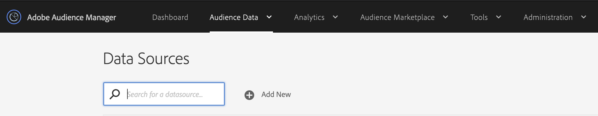

# Toegankelijkheid in Audience Manager {#accessibility}

## Overzicht {#overview}

Toegankelijkheid heeft betrekking op een reeks functies die een softwareproduct bruikbaar maken, met zo weinig mogelijk moeite van gebruikers met verschillende handicaps, zoals visuele, auditieve, cognitieve, motorische of andere handicaps.

Adobe is marktleider op het gebied van toegankelijkheid en ondersteunt het creëren van uitstekende webervaringen door ontwikkelaars aan te moedigen rijke, aantrekkelijke inhoud te produceren die voor alle gebruikers toegankelijk is. Voor meer details over Adobe toewijding aan toegankelijkheid, zie [ Toegankelijkheid van Adobe ](https://www.adobe.com/accessibility.html).

De meest voorkomende toegankelijkheidsfuncties in softwareproducten zijn: toetsenbordnavigatie, semantische structuur, voldoende contrast tussen voorgrondelementen en achtergrondelementen, ondersteuning voor ondersteunende hulpmiddelen, duidelijke elementlabels, enzovoort.

Om [!DNL Audience Manager] voor iedereen gemakkelijker te gebruiken, hebben wij steun voor veelvoudige toegankelijkheidseigenschappen ontwikkeld.

## Toetsenbordnavigatie {#keyboard-navigation}

[!DNL Audience Manager] ondersteunt volledige toetsenbordtoegankelijkheid:

* De `Tab` -toets en de pijlen bewegen tussen afzonderlijke elementen van de gebruikersinterface.

  

* Met de toetsen `Return` (`Enter` ) en `Space` activeert u het geselecteerde item.

## Toegankelijke tabelsortering {#table-sorting}

Tabelkoppen kunnen worden geselecteerd wanneer u navigeert via de `Tab` -toets. U kunt de sorteervolgorde wijzigen door op `Space` te drukken.

## Ondersteuning van ondersteunende hulpmiddelen {#assistive-technologies}

Door het gebruik van semantische code en [ ARIA ](https://www.w3.org/WAI/standards-guidelines/aria/), omvatten de interactieve elementen binnen het [!DNL Audience Manager] gebruikersinterface overeenkomstige etiketten, toegankelijke namen, en rollen die zowel hun doel als hun huidige staat identificeren.

Zo zorgt u ervoor dat ondersteunende hulpmiddelen, zoals schermlezers, de labels en andere informatie voor gebruikers kunnen lezen, zodat ze gemakkelijk met de besturingselementen van de toepassing kunnen werken.

Alle interactieve elementen in de Audience Manager-gebruikersinterface bevatten de bijbehorende labels. Zo weet u zeker dat ondersteunende hulpmiddelen, zoals schermlezers, de labels aan gebruikers kunnen voorlezen.

## Kleuren en contrast {#colors-contrast}

De gebruikersinterface van [!DNL Audience Manager] streeft ernaar voldoende contrast in de toepassing te bieden voor een toegankelijke kijkervaring voor gebruikers met een laag gezichtsvermogen of een laag kleurfalen.

Voorbeeld: laadschermen bevatten een spinner in een wit modaal vak, alles boven op een donkergrijze bedekking.

## Verdere lezing {#further-reading}

Met [!DNL Audience Manager] wordt ernaar gestreefd een steeds hogere mate van toegankelijkheid te bieden, waardoor het product voor iedereen gebruiksvriendelijk wordt.

Wij moedigen u aan om de [ Vorm van de Terugkoppeling van de Toegankelijkheid van Adobe ](https://www.adobe.com/accessibility/feedback.html) te gebruiken om ons verbeteringssuggesties en toegankelijkheidskwesties te verzenden die u in werking stelt. We zijn erg blij dat u rekening houdt met uw feedback en [!DNL Audience Manager] verbetert.
