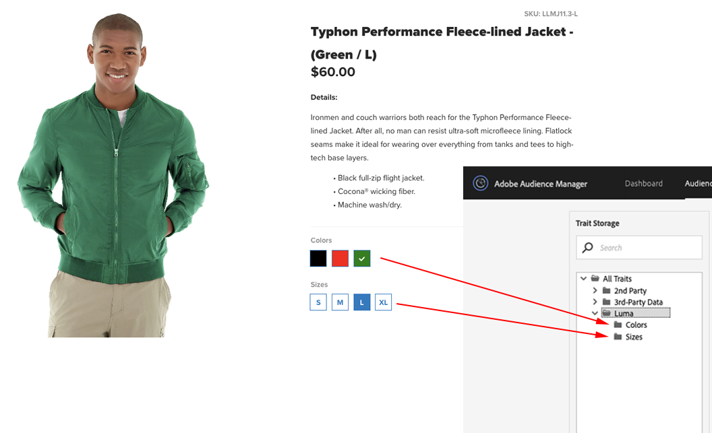

# Verzamelde datatypen {#types-of-data-collected}

Met [!DNL Audience Manager] kunt u gegevens van andere leveranciers, leveranciers en derden verzamelen en beheren.

Het ontgrendelen van klantinformatie-assets die zijn opgeslagen in meerdere silo’s, is één van de grootste uitdagingen voor data waarmee bedrijven tegenwoordig te maken hebben. Van [!DNL CRM] databases tot registratiesystemen, tot en met servers, enzovoort, hebben bedrijven hulpprogramma&#39;s nodig die waardevolle gegevens helpen centraliseren en de klant-/publieksinformatie als één strategisch gegevensmiddel beheren. Met [!DNL Audience Manager] kunt u geïsoleerde klantgegevens ontgrendelen en gegevensverzameling vanuit meerdere bronnen beheren. De verzamelde gegevens kunnen worden beheerd gebaseerd op tijd-aan-levende ([!DNL TTL]) waarden van het gegevenselement, die de gegevensvervalsing van de uitgeverscontrole over alle bronnen helpt. [!DNL Audience Manager] is ontworpen om u te helpen de volgende soorten gegevens beheren:

| Datatype | Waar dat vandaan komen |
|---|---|
| **Eerste partij** | Klanten. Data worden online verzameld (via interacties met consumenten op uw websites) of offline. |
| **Tweede partij** | Strategische partners en adverteerders. |
| **Derde partij** | Dataproviders en/of data-uitwisseling. Data kunnen informatie bevatten zoals intentie, demografie, sociale stijl/levensstijl, psychografie, en meer. |

## Gegevensverzameling van eerste partijen {#first-party-data}

Gegevensverzameling van de eerste partij is een hoofdfunctie van [!DNL Audience Manager] . Met deze kerncompetentie wordt tegemoetgekomen aan de behoeften van onze klanten (uitgevers of adverteerders) die bedrijfseigen data willen gebruiken als de hoeksteen van hun marketingprogramma’s, of die willen targeten en modelleren tegenover andere databronnen.

[!DNL Audience Manager] werkt met klanten om hun gegevensstrategie te begrijpen en wijst dan die strategie terug naar een douaneplan van de gegevensinzameling. Ons team voor partneroplossingen werkt met u samen om websites, onbewerkte datasignalen en andere gebruikersinteractie op uw websites te evalueren. Aan de hand van deze informatie helpen we u bij het maken van een aangepaste strategie voor dataverzameling die datasignalen op gebruikersniveau van diverse pagina’s in uw inventory vastlegt. Vastgelegde data worden opgeslagen en weer toegepast op een vooraf gedefinieerde taxonomie die op elk moment kan worden bijgewerkt, wanneer uw bedrijfsbehoeften veranderen.

In het volgende voorbeeld ziet u hoe mogelijke data-elementen kunnen worden vastgelegd van voorbeeldwinkelpagina.

| Item | Beschrijving |
|---|---|
| 1 | **Geslacht**. De voornaam van iemand die winkelt, geeft meestal het geslacht aan. In ons voorbeeld is de voornaam van de winkelende persoon Mary, dus we weten dat het een vrouw is. Namen worden nooit opgeslagen door Audience Manager. |
| 2 | **Interesses**. De artikelen in de winkelwagen kunnen op verschillende interesses wijzen. In ons voorbeeld besteedt Mary veel geld aan fitnessapparatuur. |
| 3 | **Type adres**. Op basis van het verzend- en/of factuuradres kunt u afleiden of Mary fitnessapparatuur koopt voor zichzelf of voor een bedrijf. |
| 4 | **Locatie**. [!DNL ZIP] -codes zijn betrouwbaarder dan [!DNL IP] -adressen wanneer het gaat om het aanwijzen van een locatie. |
| 5 | **Affiniteit met aanbiedingen**. Als iemand die winkelt, reclamecodes of cadeaukaarten gebruikt, is het waarschijnlijk een koopjesjager die de beste deals zoekt. |
| 6 | **Koopkracht**. Prijsgegevens die zijn gecorreleerd met [!DNL ZIP+4] -codes geven de bestedingskracht van een bepaalde locatie aan. |

Nadat de onbewerkte gegevens zijn verzameld, worden deze binnen het [!DNL Audience Manager] -platform teruggezet naar door de klant gedefinieerde kenmerken. Zowel de taxonomie als de datatoewijzingen kunnen op elk moment worden aangepast zonder de code voor dataverzameling te hoeven wijzigen.

## Gegevensverzameling van tweede partijen {#second-party-data}

De data van tweede partijen komen van strategische bedrijfspartners (het zijn geen uitgeversdata). Deze informatie wordt net zo verzameld en beheerd als de data van eerste partijen.

Een gebruiksscenario voor data van tweede partijen sturen adverteerders hun eigen data-assets naar uitgevers om die informatie te combineren met de data van de uitgever en vervolgens een beter getarget advertentieprogramma te kunnen uitvoeren. Bovendien kunnen uitgevers hun pool van doelgroepen uitbreiden door samen te werken met hun adverteerders. In de meeste gevallen gaat het bij deze overeenkomsten om contractuele relaties die beperkt zijn tot het plaatsen van de [!DNL Audience Manager] container-tag op de partnersite om het verzamelen en delen van gegevens te vergemakkelijken.

Een voorbeeld van het verzamelen en remarketen van data van tweede partijen is een kledinghandelaar die data verzamelt over zijn producten en deze informatie dan met belangrijke partners deelt. In dit geval kunnen detailhandelaars verschillende advertenties op een [!DNL Audience Manager] -partnersite leveren voor consumenten die verschillende jaskleuren en -grootten kiezen.

## Gegevensverzameling van derden {#third-party-data}

Gegevens van derden worden verzameld en gedeeld door leveranciers buiten [!DNL Audience Manager].

Gegevens van derden kunnen worden gebruikt om bestaande gegevens te kwalificeren [!UICONTROL segments] (bijvoorbeeld leeftijd, inkomen van huishoudens, enzovoort), om gegevens te verstrekken die in vraag zijn maar niet anderszins beschikbaar zijn, of om te worden gebruikt in normale modellering tegen een bekende gebruikersbasis van gegevens van eerste en tweede partij. [!DNL Audience Manager] werkt met veel externe gegevensleveranciers en helpt u het type gegevens te begrijpen dat deze gegevensleveranciers verzamelen, zodat u de juiste strategische deals met elke leverancier kunt maken.

>[!NOTE]
>
>Zie [Adobe Audience Finder](https://www.adobe-audience-finder.com/) voor een volledige lijst met derdepartijdataleveranciers die worden ondersteund door [!DNL Audience Manager].

[!DNL Audience Manager] integreert met andere gegevensleveranciers op basis van hun beschikbare [!DNL APIs] en gegevenssets. Dataverzameling werkt in real time, terwijl een gebruiker door uw website bladert, of via out-of-band methodes waar id’s worden gesynchroniseerd tussen partners en data worden overgedragen tussen servers nadat een gebruiker uw website heeft verlaten. In beide gevallen profiteren [!DNL Audience Manager] -clients van het voordeel dat gegevens van derden op ons platform worden gesynchroniseerd. Dit betekent dat elke client, of elk domein, geen eigen synchronisatie hoeft uit te voeren. Daardoor wordt het bereik groter en vermindert het aantal servercalls van de pagina.

## Identieke partners {#match-partners}

Veel klanten werken bij voorkeur met derdepartij-datamatchpartners. Deze entiteiten hebben relaties met websites die registratievereisten hanteren, en kunnen klantdata verwerken door deze (in real time) te matchen tegen hun registratienetwerk.

