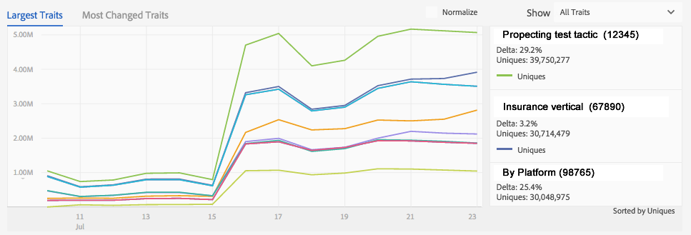

# Onderdelen voor dataverwerking{#data-processing-components}

De componenten van de gegevensverwerking omvatten Hadoop, Snowflake, SOLR, en Tableau.

<!-- 

c_comproc.xml

 -->

Audience Manager gebruikt de volgende componenten om gegevens te verwerken:

## Hadoop {#hadoop}

In [!DNL Audience Manager], is de Hadoop het belangrijkste gegevensbestand dat alles [!DNL Audience Manager] over een gebruiker kent bevat. Wanneer de [Profielcacheservers](../../reference/system-components/components-data-collection.md) bijvoorbeeld logbestanden maken die gegevens over uw gebruikers bevatten, worden die gegevens naar de Hadoop verzonden voor opslag. Andere belangrijke Hadopen zijn onder meer:

* **Hive:** een gegevensopslagplaats voor Hadoop. Hive beheert ad hoc vragen aan de gegevens die in Hadoop worden opgeslagen.

* **HBase:** Een zeer grote gegevensbestand van de Hadoop. Het verwerkt en beheert binnenkomende en uitgaande gegevens, kenmerkregels, algoritmische modelleringsinformatie, en voert vele andere functies met betrekking tot het opslaan en het bewegen van gegevens aan verschillende systemen uit.

Klanten hebben geen directe toegang tot deze systemen. Klanten werken echter indirect met hen samen, aangezien deze componenten belangrijke gegevens over hun sitebezoekers opslaan.

## Snowflake {#snowflake}

 Snowflakeis is een enorme clouddatabase. Deze tabel bevat gegevens voor veel van de dashboardgrafieken en de bijbehorende tekstvakken waarin de procentuele wijziging voor elk item in de grafiek wordt weergegeven. Als u [!DNL Audience Manager] gebruikt en de dashboardrapporten bekijkt, communiceert u met gegevens die door [!UICONTROL Snowflake] worden verstrekt.

Dit is geenszins een uitvoerige lijst, maar sommige gemeenschappelijke dashboard meldt dat [!UICONTROL Snowflake] verantwoordelijk is voor omvat:

* [Rapport Dagelijkse eigenschapvariatie](/help/using/reporting/audience-optimization-reports/daily-trait-variation-report.md)
* Alle overlappende rapporten (zie [Interactieve Rapporten](/help/using/reporting/dynamic-reports/dynamic-reports.md) sectie voor informatie over elk overlappend rapport).
* [Ongebruikte-signalenrapport](/help/using/reporting/dynamic-reports/unused-signals.md)

## SOLR {#solr}

SOLR is een open-source database en serversysteem van Apache. Het biedt robuuste en snelle zoekmogelijkheden voor onze grote gegevenssets. Als [!DNL Audience Manager] klant, kunt u SOLR in actie zien wanneer u segmenten bouwt. Het verstrekt gegevens aan het [!UICONTROL Estimated Historic Segment Size] rapport. SOLR is vanwege zijn snelheid ideaal voor deze rol. Zo kunt u met SOLR de historische gegevens over grootte bijwerken terwijl u regels maakt en nieuwe kenmerken aan een segment toevoegen.

## Tableau {#tableau}

[!DNL Audience Manager] gebruikt   Tabelauto vertoningsgegevens in de  [Interactieve ](../../reporting/dynamic-reports/dynamic-reports.md#interactive-and-overlap-reports) Rapporten en de Rapporten [ van ](../../reporting/audience-optimization-reports/audience-optimization-reports.md)Audience Optimization. De interactieve rapporten tonen prestaties en overlappen gegevens voor eigenschappen en segmenten. In plaats van getallen te gebruiken die in kolommen en rijen zijn gerangschikt, worden gegevens geretourneerd met verschillende vormen, kleuren en grootten. Bovendien, kunt u individueel of groepen gegevenspunten kiezen en neer in de rapportresultaten voor meer details boren. Deze visualisatietechnieken en de hulp van de rapportinteractiviteit maken grote hoeveelheden numerieke gegevens gemakkelijker te begrijpen.

