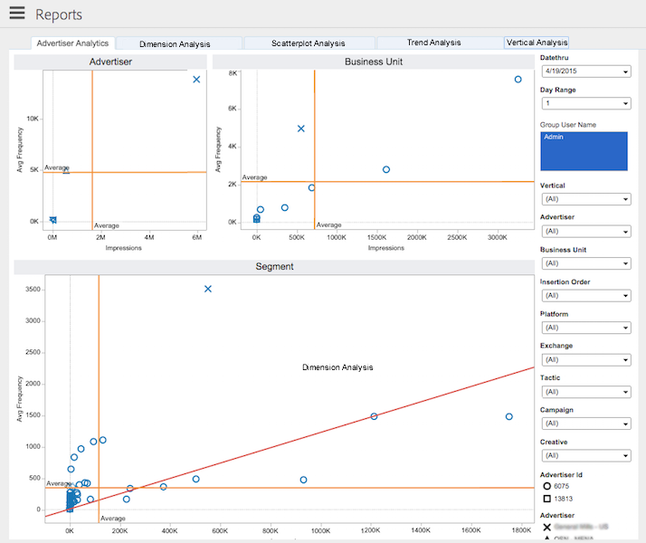

# Componenten gegevensverwerking{#data-processing-components}

De componenten van de gegevensverwerking omvatten Hadoop, Snowflake, SOLR, en Tableau.

<!-- 

c_comproc.xml

 -->

Audience Manager gebruikt de volgende componenten om gegevens te verwerken:

## Hadoop {#hadoop}

In [!DNL Audience Manager] is Hadoop de hoofddatabase die alles bevat wat [!DNL Audience Manager] weet over een gebruiker. Bijvoorbeeld, wanneer de [ Servers van het Geheime voorgeheugen van het Profiel ](../../reference/system-components/components-data-collection.md) logboekdossiers creëren die gegevens over uw gebruikers bevatten, verzendt het die gegevens naar Hadoop voor opslag. Andere belangrijke Hadoop-elementen zijn:

* **Bieg:** a- gegevenspakhuis voor Hadoop. Hive beheert ad-hocquery&#39;s voor de gegevens die in Hadoop zijn opgeslagen.

* **HBase:** Een zeer groot gegevensbestand van Hadoop. Het verwerkt en beheert binnenkomende en uitgaande gegevens, kenmerkregels, algoritmische modelleringsinformatie, en voert vele andere functies met betrekking tot het opslaan en het bewegen van gegevens aan verschillende systemen uit.

Klanten hebben geen directe toegang tot deze systemen. Klanten werken echter indirect met hen samen, aangezien deze componenten belangrijke gegevens over hun sitebezoekers opslaan.

## Snowflake {#snowflake}

[ Snowflake ](https://www.snowflake.net/) is een massaal wolkengegevensbestand. Deze tabel bevat gegevens voor veel van de dashboardgrafieken en de bijbehorende tekstvakken waarin de procentuele wijziging voor elk item in de grafiek wordt weergegeven. Als u [!DNL Audience Manager] gebruikt en de dashboardrapporten bekijkt, communiceert u met gegevens die door [!UICONTROL Snowflake] worden verstrekt.

Dit is geenszins een uitgebreide lijst, maar volgens een aantal algemene dashboardmeldingen is [!UICONTROL Snowflake] verantwoordelijk voor:

* [Rapport Dagelijkse eigenschapvariatie](/help/using/reporting/audience-optimization-reports/daily-trait-variation-report.md)
* Alle overlappende rapporten (zie de [ Interactieve sectie van Rapporten ](/help/using/reporting/dynamic-reports/dynamic-reports.md) voor informatie over elk overlappend rapport).
* [Rapport Ongebruikte signalen](/help/using/reporting/dynamic-reports/unused-signals.md)

## SOLR {#solr}

SOLR is een open-source database en serversysteem van Apache. Het biedt robuuste en snelle zoekmogelijkheden voor onze grote gegevenssets. Als klant van [!DNL Audience Manager], kunt u SOLR in actie zien wanneer u segmenten bouwt. Er worden gegevens naar het [!UICONTROL Estimated Historic Segment Size] -rapport verzonden. SOLR is vanwege zijn snelheid ideaal voor deze rol. Zo kunt u met SOLR de historische gegevens over grootte bijwerken terwijl u regels maakt en nieuwe kenmerken aan een segment toevoegen.

## Tableau {#tableau}

[!DNL Audience Manager] gebruikt [ Tableau ](https://www.tableausoftware.com/) om gegevens in de [ Interactieve Rapporten ](../../reporting/dynamic-reports/dynamic-reports.md#interactive-and-overlap-reports) en de [ Rapporten van Audience Optimization ](../../reporting/audience-optimization-reports/audience-optimization-reports.md) te tonen. De interactieve rapporten tonen prestaties en overlappen gegevens voor eigenschappen en segmenten. In plaats van getallen te gebruiken die in kolommen en rijen zijn gerangschikt, worden gegevens geretourneerd met verschillende vormen, kleuren en grootten. Bovendien, kunt u individueel of groepen gegevenspunten kiezen en neer in de rapportresultaten voor meer details boren. Deze visualisatietechnieken en de hulp van de rapportinteractiviteit maken grote hoeveelheden numerieke gegevens gemakkelijker te begrijpen.

