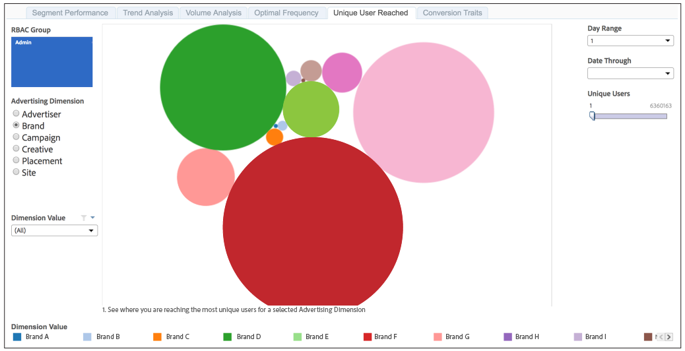

# Uniek gebruikersbereik{#unique-user-reach}

Het unieke rapport van het Bereik van de Gebruiker keert gegevens in een borrelgrafiek terug. Elke ballon wordt gerangschikt in direct verhouding tot het aantal unieke gebruikers voor uw geselecteerde afmeting. Een grotere bel wijst op groter bereik dan een kleinere bel.

Met het rapport Unieke gebruikersBereik kunt u de adverteerder, het merk, de campagne, de creatieve afdeling, de plaatsing of de site vinden die het breedst mogelijke bereik biedt tegen de beoogde gebruikers.

>[!NOTE]
>
>Houd er rekening mee dat:
>
>* Het [!UICONTROL Unique User Reach] rapport geeft alleen informatie weer voor gebruikers met [!UICONTROL Admin] machtigingsniveaus. Uw [!DNL Audience Manager] consultant of de klantenservice kan uw account [!UICONTROL Admin] machtigingen geven.
   >
   >
* De terugkijkperiodes van 7 dagen en 30 dagen zijn slechts beschikbaar voor Zondag.

## Voorbeeldrapport

Uw [!UICONTROL Unique User Reach] rapport kan er ongeveer zo uitzien als hieronder. Klik in uw rapport op een ballon om de onderliggende gegevens weer te geven.

