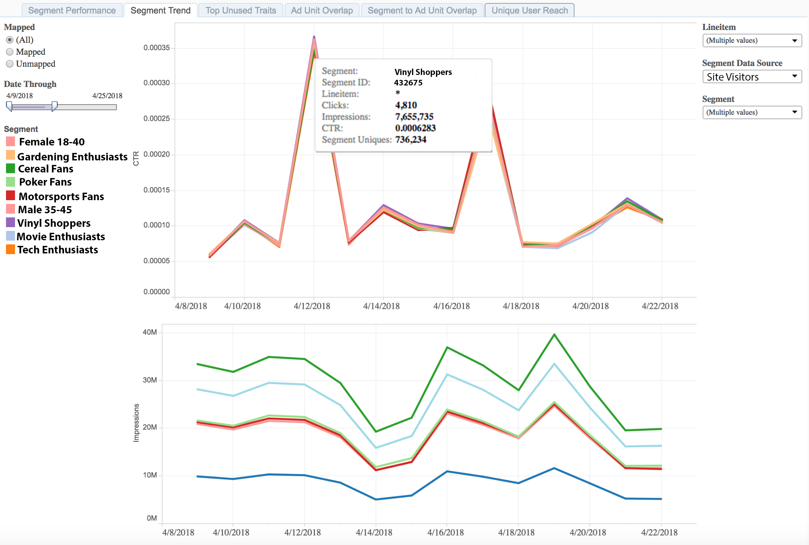

# Trend-rapport segment{#segment-trend-report}

Het rapport van de Trend van het Segment keert gegevens over indrukkingen en klikthrough tarieven van in kaart gebrachte en unmapped segmenten in tijd terug.

Een in kaart gebracht segment is een segment u creeert en naar een bestemming verzendt voor het richten. Een niet in kaart gebracht segment is een segment dat u hebt gecreeerd maar niet verzonden naar een bestemming voor het richten.

Vergelijk trends en volume voor de geselecteerde metriek om een beter beeld te krijgen van hoe uw publiek zich gedraagt in de loop van de tijd.

## Gebruiksscenario {#use-cases}

Gebruik het [!UICONTROL Segment Trend] -rapport om de prestaties van een segment in de loop der tijd te valideren en trends vast te stellen op basis van krachtige prestaties of schaal.

Met dit rapport, kunt u begrijpen welke van uw Web-eigenschappen een dip of defecte verhoging tonen en zonodig problemen oplossen. Dit rapport is de volgende stap nadat u hebt vastgesteld wat uw interesse is in het [!UICONTROL Segment Performance] -rapport, om ervoor te zorgen dat de sterke of slechte prestaties die u op het tabblad [!UICONTROL Segment Performance] hebt gezien, consistent zijn in de tijd.

## Het rapport Segment Trend gebruiken {#using-the-report}

Schakel tussen **[!UICONTROL Mapped]** en **[!UICONTROL Unmapped]** om segmenten te selecteren die wel of niet aan een doel zijn toegewezen. Selecteer **[!UICONTROL All]** om al uw segmenten in het rapport op te nemen.

Pas het terugblik venster met de **[!UICONTROL Date Through]** schuif aan.

Klik op een van de segmenten onder de schuifregelaar **[!UICONTROL Date Through]** om de optie voor alleen dat segment in het rapport op te nemen of uit te sluiten.

Gebruik het vervolgkeuzemenu **[!UICONTROL Line Item]** om de eigenschappen in uw portfolio te selecteren waarvoor u informatie wilt retourneren.

Selecteer in de vervolgkeuzelijst **[!UICONTROL Segment Data Source]** de gegevensbronnen met de segmenten die u in het rapport wilt zien.

Gebruik de drop-down doos **[!UICONTROL Segment]** om te selecteren welke segmenten u in het rapport wilt zien.

>[!IMPORTANT]
>
>Wanneer het toelaten van [!UICONTROL Audience Optimization for Publishers], moet u beschrijvende meta-gegevens voor [!UICONTROL Line Item] IDs omvatten, zoals die in Stap 3 van [ wordt beschreven de Dossiers van de Gegevens van Google Ad Manager van de Invoer (vroeger DFP) in Audience Manager ](../../../reporting/audience-optimization-reports/aor-publishers/import-dfp.md). Op deze manier zorgt u ervoor dat in het rapport de webeigenschap wordt weergegeven als [!UICONTROL Line Item] in plaats van de [!UICONTROL Line Item] ID.

## De resultaten interpreteren {#interpreting-results}

Het rapport [!UICONTROL Segment Trend] retourneert alleen gegevens in een lijngrafiek voor een interval van 14 dagen. In dit voorbeeld toont het rapport de indruk en doorkliktendensen voor een reeks in kaart gebrachte en unmapped segmenten.

Houd over om het even welke lijn om meer informatie over die bepaalde segmenttrend te verkrijgen. Zie beschrijvingen voor de aanvullende informatie in de tabel onder het voorbeeldrapport.

<table id="table_AFE2540583C34835B04584693ADFD26A"> 
 <thead> 
  <tr> 
   <th colname="col1" class="entry"> Item </th> 
   <th colname="col2" class="entry"> Beschrijving </th> 
  </tr>
 </thead>
 <tbody> 
  <tr> 
   <td colname="col1"> 
 Segment  
 </td> 
   <td colname="col2"> 
De alfanumerieke naam die u aan dit segment hebt toegewezen. 
 </td> 
  </tr> 
  <tr> 
   <td colname="col1"> 
 Segment-id  
 </td> 
   <td colname="col2"> 
De unieke id van dit segment. 
 </td> 
  </tr> 
  <tr> 
   <td colname="col1"> 
 Regelitem  
 </td> 
   <td colname="col2"> 
De webeigenschap waarvoor u dit rapport ziet. 
 </td> 
  </tr> 
  <tr> 
   <td colname="col1"> 
 Kliks  
 </td> 
   <td colname="col2"> 
Het aantal keren dat leden van deze eigenschap op items in uw webeigenschap hebben geklikt. 
 </td> 
  </tr> 
  <tr> 
   <td colname="col1"> 
 Impressies  
 </td> 
   <td colname="col2"> 
Het aantal keren dat leden van deze eigenschap aan uw voorraad zijn blootgesteld. 
 </td> 
  </tr> 
  <tr> 
   <td colname="col1"> 
 CTR  
 </td> 
   <td colname="col2"> 
Doorklikfrequentie. Met deze metrische waarde wordt het percentage van de afbeeldingen weergegeven dat wordt gevolgd door klikken. Verdeel kliks door impressies om dit metrisch te verkrijgen. 
 </td> 
  </tr> 
  <tr> 
   <td colname="col1"> 
 SegmentUniques  
 </td> 
   <td colname="col2"> 
Het aantal segmentleden, in de laatste 30 dagen. 
 </td> 
  </tr> 
 </tbody> 
</table>
