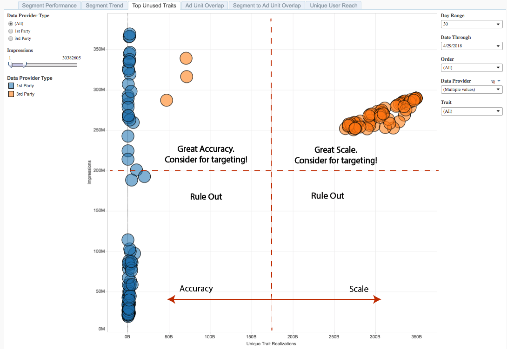

# Eerste ongebruikte eigenschappen{#top-unused-traits}

De hoogste Ongebruikte Beetjes worden vertegenwoordigd als verstrooiingsdiagram van eigenschappen die nog geen leden van een segment zijn, die op het type van eigenschap, gegevensbron, en prestaties worden gebaseerd.

## Gebruiksscenario {#use-cases}

Met het [!UICONTROL Top Unused Traits] rapport kunt u de prestaties analyseren en vergelijken van de kenmerken van de eerste en derde partij die momenteel niet aan een segment zijn toegewezen. Deze mening kan op de beste eigenschappen wijzen om in een publiekssegment voor of campagneroptimalisering of netto nieuwe kansen te gebruiken.

## Het bovenste rapport Ongebruikte sporen gebruiken {#using-the-report}

Met de **[!UICONTROL Data Provider Type]** besturingselementen kunt u schakelen tussen de kenmerken van de eerste en die van de derde. Selecteer **[!UICONTROL All]** om de eerste en derde eigenschap in het rapport te retourneren.

Met de **[!UICONTROL Impressions]** schuifregelaar kunt u een minimum- en maximumwaarde voor geretourneerde afbeeldingen selecteren. Eventuele kenmerken die voor minder of meer dan de ingestelde limieten verantwoordelijk zijn, worden niet in het rapport weergegeven.

Gebruik de besturingselementen **[!UICONTROL Day Range]** en **[!UICONTROL Date Through]** besturingselementen om het bereik van de terugblik aan te passen. Merk op dat slechts de periode van 30 dagen terugblik voor dit rapport beschikbaar is.

Gebruik het **[!UICONTROL Order]** drop-down vakje om de Web-eigenschappen in uw portefeuille te selecteren waarvoor u informatie wilt terugkeren.

In de **[!UICONTROL Data Provider]** drop-down doos, selecteer de gegevensbronnen die de eigenschappen bevatten u in het rapport wilt zien.

Gebruik de **[!UICONTROL Traits]** drop-down doos om te selecteren welke eigenschappen u in het rapport wilt zien.

>[!IMPORTANT]
>
>Wanneer u deze optie inschakelt, moet u beschrijvende metagegevens voor [!UICONTROL Audience Optimization for Publishers]de bestanden opnemen, zoals wordt beschreven in stap 3 van Google Ad Manager (voorheen DFP)-gegevensbestanden [!UICONTROL Order IDs]importeren in Audience Manager . Door dit te doen, verzekert u dat het rapport de Webbezit als [!UICONTROL Order] in plaats van het [!UICONTROL Order ID].

## De resultaten interpreteren {#interpreting-results}

**Voorbeeldrapport**

Uw [!UICONTROL Top Unused Traits] rapport kan er ongeveer zo uitzien als hieronder. Klik in uw rapport op een ballon om de onderliggende gegevens weer te geven.

Zie beschrijvingen voor de aanvullende informatie in de tabel onder het voorbeeldrapport.

<table id="table_AFE2540583C34835B04584693ADFD26A"> 
 <thead> 
  <tr> 
   <th colname="col1" class="entry"> Item </th> 
   <th colname="col2" class="entry"> Beschrijving </th> 
  </tr>
 </thead>
 <tbody> 
  <tr> 
   <td colname="col1"> 
 Type gegevensaanbieder 
 </td> 
   <td colname="col2"> 
Hiermee geeft u aan of de geselecteerde gegevensbron eigenschappen van derden of van derden bevat. 
 </td> 
  </tr> 
  <tr> 
   <td colname="col1"> 
 Gebruikersnaam 
 </td> 
   <td colname="col2"> 
De unieke id van deze eigenschap. 
 </td> 
  </tr> 
  <tr> 
   <td colname="col1"> 
 Naam dienblad 
 </td> 
   <td colname="col2"> 
De alfanumerieke naam die u of de gegevensaanbieder aan dit kenmerk hebt toegewezen. 
 </td> 
  </tr> 
  <tr> 
   <td colname="col1"> 
 Volgorde 
 </td> 
   <td colname="col2"> 
De webeigenschap waarvoor u dit rapport ziet. 
 </td> 
  </tr> 
  <tr> 
   <td colname="col1"> 
 Impressies 
 </td> 
   <td colname="col2"> 
Het aantal keren dat leden van deze eigenschap aan uw voorraad zijn blootgesteld. 
 </td> 
  </tr> 
  <tr> 
   <td colname="col1"> 
 Trait Uniques 
 </td> 
   <td colname="col2"> 
Het aantal leden met een kenmerk, in de laatste 30 dagen. 
 </td> 
  </tr> 
 </tbody> 
</table>

De positie van uw eigenschappen in een rapport kan u veel vertellen over welke eigenschappen u kon gebruiken om bestaande publiekssegmenten te optimaliseren.

De kenmerken die zich hoger op de impressieas bevinden, zijn de kenmerken die u in uw campagnes wilt gebruiken. Voor eigenschappen met een laag aantal indrukkingen, is het onwaarschijnlijk dat u dit publiek op uw Web-eigenschap, gebaseerd op uw [!DNL Google Ad Manager] gegevens bereikt.

Kijk links van de [!UICONTROL Unique Trait Realizations] as voor hoogst nauwkeurige eigenschappen en aan het recht voor eigenschappen die schaal kunnen drijven.

<table id="table_A29253B30DFA4CD7B3B7C320DE0BDEA4"> 
 <thead> 
  <tr> 
   <th colname="col1" class="entry"> Positie </th> 
   <th colname="col2" class="entry"> Plaatsing geeft aan </th> 
  </tr> 
 </thead>
 <tbody> 
  <tr> 
   <td colname="col1"> 
 <b>Linksboven</b> 
 </td> 
   <td colname="col2"> 
Veel impressies, weinig resultaten. 
 
Dit is een zeer nauwkeurig publiek dat nog geen lid van een segment is. Overweeg om te richten. 
 </td> 
  </tr> 
  <tr> 
   <td colname="col1"> 
 <b>Linksonder</b> 
 </td> 
   <td colname="col2"> 
Laag aantal indrukken, laag aantal realisaties. 
 
 Lijn deze kenmerken uit, omdat de leden niet bijdragen aan de afdruk op uw wegeigenschappen. 
 </td> 
  </tr> 
  <tr> 
   <td colname="col1"> 
 <b>Rechtsboven</b> 
 </td> 
   <td colname="col2"> 
Veel impressies, veel karakteristieken. 
 
Een hoog bereik tegen een publiek dat nog niet in een segment wordt aangeduid. Dit publiek is een van de belangrijkste kandidaten voor doelgerichte acties vanwege het grote aantal indrukken en de grote schaal. 
 </td> 
  </tr> 
  <tr> 
   <td colname="col1"> 
 <b>Rechtsonder</b> 
 </td> 
   <td colname="col2"> 
Laag aantal indrukken, hoog aantal karakteristieken. 
 
 U kunt deze kenmerken uitsluiten, omdat de leden niet bijdragen aan de indrukking van uw wegeigenschappen. 
 </td> 
  </tr> 
 </tbody> 
</table>
