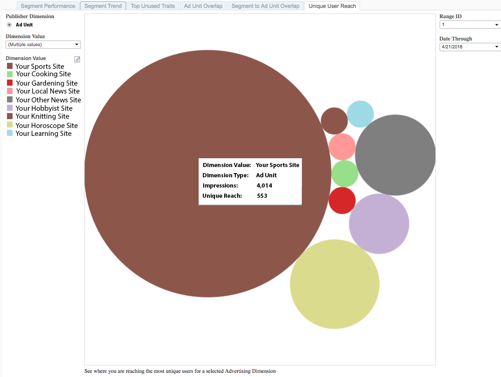

# Uniek gebruikersbereik{#unique-user-reach}

Het unieke rapport van het Bereik van de Gebruiker keert gegevens in een borrelgrafiek terug. De grootte van elke ballon wordt afgestemd op het aantal unieke gebruikers voor de geselecteerde advertentie-eenheden. Een grotere bel wijst op groter bereik dan een kleinere bel. Met het rapport Unieke gebruikersBereik kunt u de advertentie-eenheid vinden die het breedste bereik biedt ten opzichte van de beoogde gebruikers.

## Gebruiksscenario {#use-cases}

Met het [!UICONTROL Unique User Reach] rapport kunt u de eigenschappen in uw portfolio identificeren die een groot aantal unieke gebruikers aantrekken.

## Het unieke bereikrapport gebruiken {#using-the-report}

Gebruik het **[!UICONTROL Dimension Value]** vakje om de advertentie-eenheden te selecteren u in het rapport wilt tonen. Klik **[!UICONTROL All]** om al uw eigenschappen in de bel grafiek te tonen.

Gebruik de controles van de Waaier **van de** Dag en van de **Datum door** om uw blik-achterwaaier aan te passen.

## De resultaten interpreteren {#interpreting-results}

**Voorbeeldrapport**

Uw [!UICONTROL Unique User Reach] rapport kan er ongeveer zo uitzien als hieronder. Klik in uw rapport op een ballon om de onderliggende gegevens weer te geven. Zie de beschrijvingen voor de aanvullende informatie in de onderstaande tabel.

| Item | Beschrijving |
|--- |--- |
| Dimensiewaarde | De naam van uw webeigenschap. |
| Type dimensie | Het type uitgeversdimensie. We ondersteunen momenteel alleen Advertentietype als type dimensie. |
| Impressies | Het aantal indrukkingen die voor uw Webbezit binnen de gespecificeerde terugblik-achterwaaier werden gediend. |
| Uniek bereik | Het unieke aantal gebruikers dat is bereikt door de indrukkingen op uw wegeigenschappen. |