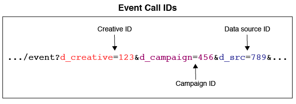

# Overzicht en toewijzingen voor metagegevensbestanden{#overview-and-mappings-for-metadata-files}

Een metagegevensbestand koppelt numerieke id&#39;s met namen die u kunt lezen en begrijpen. De rapporten van de Optimalisering van de Publiek tonen leesbare namen in de diverse menu&#39;s van rapportopties.

## Overzicht {#overview}

Een overzicht van metagegevens en hoe deze worden gebruikt. Een metagegevensbestand moet vergezeld gaan van een gegevensbestand. De inhoud van het meta-gegevensdossier past de informatie van het gegevensdossier aan verwante, mens-leesbare etiketten in de rapportmenu&#39;s aan. Voor meer informatie, zie de Dossiers van [Gegevens voor de Rapporten van de Optimalisering van het Publiek en de Acteerbare Dossiers](../../../reporting/audience-optimization-reports/metadata-files-intro/datafiles-intro.md)van het Logboek.

### Metagegevensbestanden bevatten gegevens over andere gegevens

Een metagegevensbestand bevat informatie over andere typen gegevens. Om u te helpen begrijpen hoe dit werkt, bekijken wij hoe [!DNL Audience Manager] ontvangt gegevens.

Tijdens een indruk of klikgebeurtenis, [!DNL Audience Manager] ontvangt gegevens in een koord URL dat als *gebeurtenisvraag* wordt bekend.

De gebeurtenisvraag organiseert informatie in reeksen bepaalde zeer belangrijk-waardeparen. De waarden in een sleutelwaardepaar bevatten numerieke gegevens. Het metagegevensbestand bevat namen en andere leesbare gegevens die overeenkomen met de id in elk sleutelwaardepaar.

### Metagegevenskoppelingen-id&#39;s naar leesbare namen

Het metagegevensbestand is vereist om een numerieke id aan een leesbare naam te koppelen. Stel dat een gebeurtenisaanroep een creatieve id bevat in een sleutelwaardepaar als deze: `d_creative:1234`. Zonder een metagegevensbestand zou dit creatieve bestand worden weergegeven als 1234 in een optiemenu.

Een metagegevensbestand met de juiste indeling kan dit creatieve bestand echter binden aan een echte naam zoals &quot;Advertiser Creative A&quot;, een naam die u in een rapport kunt lezen en herkennen.

### Wanneer hebt u een metagegevensbestand nodig

Eerst, worden een meta-gegevensdossier, en alle hieronder vermelde parameters, vereist in een gebeurtenisvraag wanneer u de Rapporten [van de Optimalisering van de](../../../reporting/audience-optimization-reports/audience-optimization-reports.md)Publiek wilt gebruiken.

Ten tweede hebt u een metagegevensbestand nodig als u uw eigen gegevens naar verzendt [!DNL Audience Manager] of als u gegevens wilt bekijken in de rapporten van andere providers waarmee u niet bent geïntegreerd. Bevat bijvoorbeeld [!DNL Audience Manager] een integratie met Google&#39;s [Dubbelklik op Campagne Manager](../../../reporting/audience-optimization-reports/aor-advertisers/import-dcm.md) (DCM). Wegens deze verhouding, [!DNL Audience Manager] kan identiteitskaarts met namen en beschrijvingen associëren die door de rapportopties worden gebruikt. Zonder integratie, kunnen wij nog gegevens opnemen, maar de rapportopties zullen numerieke IDs in plaats van beschrijvende naam tonen.

## Bestandstoewijzingen {#file-mappings}

De volgende lijst maakt een lijst van de zeer belangrijk-waardeparen die gegevens houden die door de [!UICONTROL Audience Optimization] rapporten worden gebruikt. Als u een metagegevensbestand moet gebruiken, bevat het leesbare informatie die overeenkomt met de waarden in deze sleutelwaardeparen. De waarden voor deze toetsen accepteren alleen gehele getallen (gegevenstype INT). Opmerking: *cursief* geeft een variabele plaatsaanduiding aan. Andere elementen zijn constanten of sleutels en veranderen niet.

>[!IMPORTANT]
>
>Als u de [!UICONTROL Audience Optimization] rapporten gebruikt, worden *al* deze waarden vereist in de gebeurtenisvraag.

<table id="table_B2C8C493080E449CA71C4EF07D9476BD"> 
 <thead> 
  <tr> 
   <th colname="col1" class="entry"> Rapportoptie </th> 
   <th colname="col2" class="entry"> Sleutelwaardeparen metagegevens </th> 
  </tr> 
 </thead>
 <tbody> 
  <tr> 
   <td colname="col1"> 
Adverteerder 
 </td> 
   <td colname="col2"> 
 <code>d_adsrc = <i>data source ID or integration code</i></code> 
 
Dit is de gegevensbronidentiteitskaart van de adverteerder of integratiecode die wanneer het creëren van een gegevensbron wordt verstrekt. Zie <a href="../../../features/manage-datasources.md#create-data-source"> Een gegevensbron</a>maken. 
 </td> 
  </tr> 
  <tr> 
   <td colname="col1"> 
Bedrijfseenheid (BU) 
 </td> 
   <td colname="col2"> 
 <code>d_bu = <i>business unit ID</i></code> 
 </td> 
  </tr> 
  <tr> 
   <td colname="col1"> 
Campagne 
 </td> 
   <td colname="col2"> 
 <code>d_campaign = <i>campaign ID</i></code> 
 </td> 
  </tr> 
  <tr> 
   <td colname="col1"> 
Creatief 
 </td> 
   <td colname="col2"> 
 <code>d_creative = <i>creative ID</i></code> 
 </td> 
  </tr> 
  <tr> 
   <td colname="col1"> 
Exchange 
 </td> 
   <td colname="col2"> 
Accepteert twee verschillende sleutel-waardeparen: 
 
    <ul id="ul_3B3B751A8A134096B0912E81A0983B9D"> 
     <li id="li_57BAC45A7B274AB695945E174A4D8A35"> <code>d_exchange = <i>ID for the exchange that served the ad</i></code> </li> 
     <li id="li_CCDF00DE59D3451C8EF590DD3E1A806D"> <code>d_site = <i>ID for the site an ad served on</i></code> </li> 
    </ul> </td> 
  </tr> 
  <tr> 
   <td colname="col1"> 
Invoegvolgorde (IO) 
 </td> 
   <td colname="col2"> 
 <code>d_io = <i>insertion order ID</i></code> 
 </td> 
  </tr> 
  <tr> 
   <td colname="col1"> 
Platform 
 </td> 
   <td colname="col2"> 
 <code>d_src = <i>data source ID</i></code> 
 
Dit is de <a href="../../../features/datasources-list-and-settings.md#data-sources-list-and-settings"> gegevensbron</a> -id voor het platform dat metagegevens verschaft (bijvoorbeeld DFA, Atlas, GBM, MediaMath, enz.). 
 </td> 
  </tr> 
  <tr> 
   <td colname="col1"> 
Tactisch 
 </td> 
   <td colname="col2"> 
 <code>d_tactic = <i>tactic ID</i></code> 
 </td> 
  </tr> 
  <tr> 
   <td colname="col1"> 
Verticaal 
 </td> 
   <td colname="col2"> 
 <code>d_vert = <i>vertical ID</i></code> 
 </td> 
  </tr> 
 </tbody> 
</table>

## Hoe ID&#39;s van gebeurtenisaanroepen de namen, inhoud en leveringspaden vormen {#how-ids-shape-file-names}

Met de id&#39;s die door deze sleutelwaardeparen worden doorgegeven, kunt u de naam en inhoud van het metagegevensbestand maken. De volgende secties en illustraties tonen hoe dit werkt. Deze voorbeelden bouwen een dossier dat de naam van creatief in een campagne bevat, maar andere combinaties zijn mogelijk.

### Gebeurtenisoproep

In dit voorbeeld maken we een metagegevensbestand dat creatieve namen aan een [!UICONTROL Audience Optimization] rapport toevoegt. Hiervoor moeten we creatieve id&#39;s, campagne- en gegevensbronid&#39;s ophalen uit een gebeurtenisaanroep.

### Bestandsnaam

De bestandsnaam is gebaseerd op de creatieve id&#39;s, de campagne- en de gegevensbron. In dit geval, vergelijk de verschillen hier tussen de zeer belangrijk-waardegegevens in een gebeurtenisvraag en hoe het in een dossier - naam wordt gebruikt.

In een bestandsnaam:

* De gegevensbronsleutel verandert in `dpid` van `d_src`.

* De creatieve id&#39;s en campagne-id&#39;s vertegenwoordigen een categorie in plaats van een werkelijke id.

Zie [Naamgevingsconventies voor metagegevensbestanden](../../../reporting/audience-optimization-reports/metadata-files-intro/metadata-file-names.md).

### Bestandsinhoud

In dit voorbeeld weerspiegelt de bestandsinhoud de creatieve id&#39;s en campagne-id&#39;s die zijn doorgegeven aan de gebeurtenisaanroep. Het nieuwe element hier is een leesbare naam. Na verwerking wordt de naam in dit bestand als een optie weergegeven in het menu Creatief van een [!UICONTROL Audience Optimization] rapport.

Zie [Indeling van inhoud voor metagegevensbestanden](../../../reporting/audience-optimization-reports/metadata-files-intro/metadata-file-contents.md).

### Bestandslevering

Nadat u de naam hebt gegeven en gegevens aan een bestand hebt toegevoegd, verzendt u het bestand naar de opslagmap van Amazon S3 die wordt geleverd door [!DNL Audience Manager]. Zie [Leveringsmethoden voor metagegevensbestanden](../../../reporting/audience-optimization-reports/metadata-files-intro/metadata-delivery-methods.md).

>[!MORELIKETHIS]
>
>* [Gegevensbestanden voor publiek optimalisatierapporten](../../../reporting/audience-optimization-reports/metadata-files-intro/datafiles-intro.md)
>* [Het vangen van Campagne klikt Gegevens via de Vraag van het Pixel](../../../integration/media-data-integration/click-data-pixels.md)
>* [Vastleggen van Campagne-indrukgegevens via pixelaanroepen](../../../integration/media-data-integration/impression-data-pixels.md)

