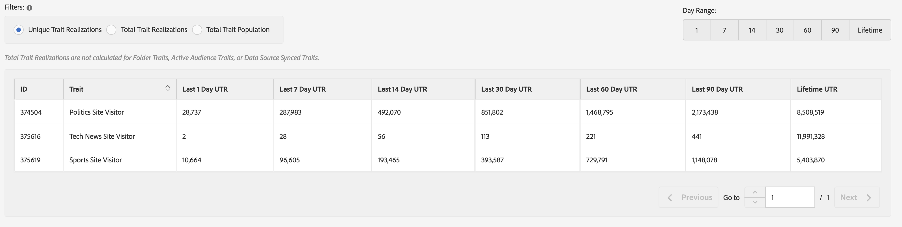

# Algemene rapporten{#general-reports}

Een [!UICONTROL General] rapport keert prestatiesgegevens over eigenschappen, segmenten, en bestemmingen terug.

## Overzicht {#general-reports-overview}

<!-- 

c_general_reports.xml

 -->

[!DNL Audience Manager] gebruikt  [!UICONTROL Role Based Access Control] ([!UICONTROL RBAC]) om gebruikers-groep toestemmingen tot de  [!UICONTROL General] rapporten uit te breiden. De gebruikers kunnen slechts die eigenschappen en segmenten in het melden zien dat zij toestemmingen aan mening hebben. [!UICONTROL RBAC] Met functionaliteit kunt u bepalen welke rapportgegevens interne teams kunnen weergeven. Bijvoorbeeld, kan een agentschap dat verschillende adverteerderrekeningen beheert gebruiker-groep toestemmingen vormen zodat een team dat de rekening van Advertiser A beheert niet de rapportgegevens van Advertiser B kan zien.

Voer een [!UICONTROL General]-rapport uit als u dat nodig hebt:

* De prestaties van het overzicht door eigenschap, segment, of bestemming.
* Houd afbeeldingen (totaal en uniek) bij intervallen van 1, 7, 14, 30, 60 en 90 dagen bij.
* Het totale en unieke aantal laden controleren.
* Vergelijk de prestaties van de kenmerken en segmenten.
* Identificeer sterke of slechte prestatieseigenschappen en segmenten, analyseer vraag, of vergelijk lading/brand gegevens met derderapporten.
* Gegevens (.csv-indeling) exporteren voor verdere analyse en uitwisseling.

De volgende illustratie verstrekt een overzicht op hoog niveau van zeer belangrijke elementen in het [!UICONTROL General] rapport.

1. Configureer de volgende opties:

   * **Rapporttype:** selecteer het gewenste rapporttype (Trait, Segment of Doel).

   * **Voor Datums door:** specificeer de datumwaaier voor het rapport.

2. Zoek naar een eigenschap, segment, of bestemming door naam of identiteitskaart
3. Sleep vanuit de mappenlijst de kenmerken, segmenten of doelen die u aan de rechterkant wilt melden naar het deelvenster [!UICONTROL Selections].
4. Genereer het rapport dat u wilt weergeven in een tabel die kan worden geëxporteerd.

## Algemeen rapport uitvoeren {#run-general-report}

In deze sectie wordt beschreven hoe u een [!UICONTROL General]-rapport uitvoert en tijd en andere prestatieopties instelt.

<!-- 

t_run_general_report.xml

 -->

1. Klik op **[!UICONTROL Analytics]** in het dashboard.**[!UICONTROL General Reports]**
1. Selecteer het gewenste type in de vervolgkeuzelijst **[!UICONTROL Report Type]**: Trait, Segment of Doel.
1. ** VoorwaardelijkKlik de datumdoos om een kalender te tonen, dan selecteer de beëindigende datum voor uw rapport als u een andere datum dan vandaag wilt specificeren.
1. Zoek naar een eigenschap, segment, of bestemming door naam of identiteitskaart
1. Sleep vanuit de mappenlijst de kenmerken, segmenten of doelen die u aan de rechterkant wilt melden naar het deelvenster [!UICONTROL Selections].
1. Klik op **[!UICONTROL Run Report]**.

   De resultaten worden weergegeven in een tabel die kan worden geëxporteerd. Klik op de kolomkoppen om de resultaten in oplopende of aflopende volgorde te sorteren.
1. Selecteer de gewenste optieknoop bij de bovenkant van het rapport aan filtergegevens door prestaties ( [!UICONTROL Unique Trait Realizations], [!UICONTROL Total Trait Realizations], of [!UICONTROL Total Trait Population]) of door tijd (1, 7, 14, 30, 60, of 90 dagwaaier).

   >[!NOTE]
   >
   >[!UICONTROL Total Trait Realizations] worden  [!UICONTROL Rule-based Traits] alleen berekend.

1. ** Optioneelklikken  **[!UICONTROL Export to CSV]**. Hiermee worden [!UICONTROL Unique Trait Realizations], [!UICONTROL Total Trait Realizations] en [!UICONTROL Total Trait Population] voor alle dagbereiken geëxporteerd.

## Algemene rapporten Uitgevoerde {#general-reports-explained}

De aantallen in [!UICONTROL General Reports] worden geproduceerd direct van [!UICONTROL User Profile Store]. De resultaten weerspiegelen het aantal gebruikers dat [!DNL Audience Manager] in het achtereind op het tijdstip bevatte deze rapportaantallen werden geproduceerd.

* Deze aantallen omvatten bezoeker geen IDs met bovenmatig verkeer. Het verkeer van bots wordt gefilterd alvorens ons achterste systeem te bereiken. Ook, wordt wat bot verkeer verworpen tijdens een wekelijkse schoonmaakbaan die in het achterste gedeelte wordt in werking gesteld.
* Als u gegevens aan boord hebt via binnenkomende verwerking die van [!DNL Audience Manager] UUID is afgestoten, en deze id&#39;s bevatten gebruikers die niet meer actief zijn in ons systeem, bereiken deze inactieve [!DNL Audience Manager] UUID&#39;s nooit [!UICONTROL User Profile Store] en worden deze niet gerapporteerd.
* [!UICONTROL Total Trait Realizations] worden  [!UICONTROL Rule-based Traits] alleen berekend.

## Algemene rapporten Resultaten voor sporen {#general-report-results-traits}

De filters hieronder zijn beschikbaar wanneer u een Algemeen rapport in werking stelt en **[!UICONTROL Trait]** als rapporttype selecteert.

Wanneer het filtreren van de resultaten door [!UICONTROL Device ID]:

* [!UICONTROL Unique Trait Realizations] Dit is het aantal anonieme apparaatbezoekers dat de eigenschap binnen het geselecteerde tijdbereik aan hun profiel heeft toegevoegd.
* [!UICONTROL Total Trait Realization] is het totale aantal anonieme eigenlijke realisaties binnen de geselecteerde tijdwaaier.
* [!UICONTROL Total Trait Population] Dit is het aantal anonieme apparaatbezoekers dat deze eigenschap in hun profiel heeft.

Wanneer het filtreren van de resultaten door [!UICONTROL Cross-Device ID]:

* [!UICONTROL Unique Trait Realizations] Dit is het aantal geverifieerde bezoekers dat de eigenschap heeft toegevoegd aan hun profiel, binnen het geselecteerde tijdbereik.
* [!UICONTROL Total Trait Realization] is het totale aantal geverifieerde resultaten binnen het geselecteerde tijdbereik.
* [!UICONTROL Total Trait Population] Dit is het aantal geverifieerde bezoekers dat deze eigenschap in hun profiel heeft.

<!-- 
### Unique Trait Realizations

This metric represents the unique number of [Audience Manager Unique User IDs (UUID)](../reference/ids-in-aam.md) that qualified for the trait in your selected time range. For example, if a user visited your homepage three times on 10/1, you would see one Unique Trait Realization.

### Total Trait Realizations

This metric represents the total amount of trait fires for the trait in your selected time range. For example, if a user visited your homepage, then navigated to your tech news and your sports news sections, they would appear in the General Report as three total trait realizations, and one unique trait realization.

### Total Trait Population

This metric represents the total amount of Audience Manager UUIDs that are currently qualified for the trait. Use this number to understand the total amount of users you could use for segmentation and targeting. Typically, users remain part of a trait for [120 days](../features/traits/create-onboarded-rule-based-traits.md#set-expiration-interval). For example, a user visiting your homepage three times today and never returning afterwards, would remain as a user in this population every day until 120 days from now. At the 120 day mark, they would be removed from the population. Read our [Trait and Segment Qualification Reference](../features/traits/trait-and-segment-qualification-reference.md) for more examples on the difference between Unique Trait Realizations and Total Trait Population.

The illustration below shows the results of running a general report for the Trait report type. -->
<!-- 
 -->

## Algemene rapporten Resultaten voor segmenten {#general-report-results-segments}

De hieronder metriek is beschikbaar wanneer u een Algemeen rapport in werking stelt en **[!UICONTROL Segment]** als rapporttype selecteert:

### Realtime segmentpopulatie

Deze metrisch vertegenwoordigt het daadwerkelijke aantal unieke bezoekers die in real time voor de gespecificeerde tijdwaaier worden gezien en die voor het segment op het ogenblik gekwalificeerd waren dat zij door Audience Manager werden gezien.

### Totale segmentpopulatie

Deze metrisch vertegenwoordigt het totale aantal Audience Manager UUIDs die voor het segment binnen de terugblik-achterperiode gekwalificeerd zijn u selecteerde. Uw 1 dag Totale Bevolking van het Segment vertegenwoordigt uw nauwkeurigste gebruikersbasis voor het richten.

>[!NOTE]
>
>Selecteer **[!UICONTROL Include Destination Mappings]** om een uitsplitsing van segmentpopulatie voor geactiveerde bestemmingen te zien.

In de onderstaande afbeelding ziet u de resultaten van het uitvoeren van een algemeen rapport voor het rapporttype Segment.

## Algemene rapporten Resultaten voor Doelen {#general-report-results-destinations}

De hieronder metriek is beschikbaar wanneer u een Algemeen rapport in werking stelt en **[!UICONTROL Destination]** als rapporttype selecteert:

**Realtime segmentpopulatie**

Deze metrisch vertegenwoordigt het daadwerkelijke aantal unieke bezoekers die in real time voor de gespecificeerde tijdwaaier worden gezien en die voor het segment op het ogenblik gekwalificeerd waren dat zij door Audience Manager werden gezien.

**Totale segmentpopulatie**

Deze metrisch vertegenwoordigt het totale aantal Audience Manager UUIDs die tot een segment binnen de terugkijkperiode behoren, die werden verzonden naar een bestemming.

In de onderstaande afbeelding ziet u de resultaten van het uitvoeren van een algemeen rapport voor het rapporttype Doelen.

