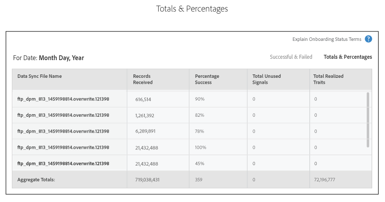

# Rapport over status aan boord{#onboarding-status-report-about}

Het rapport Status Aan boord van de instapkaart controleert succes en mislukkingen voor verwerkingsverslagen in uw binnenkomende gegevensbrondossiers. Dit rapport bevat gegevens in een interactief staafdiagram en een overzicht van de afmetingen in tabelvorm. En, omvat het een optie die dossiers voor een vast tijdinterval steekproeven en de gemeenschappelijkste fouten voor elk foutentype toont. U vindt dit rapport in Analytics > On-boarding Status Report. Dit rapport is ook beschikbaar wanneer u een binnenkomende gegevensbron creeert.

>[!NOTE]
>
>Alleen gebruikers met beheerdersrechten kunnen dit rapport zien in de gebruikersinterface van Audience Manager. U kunt niet-admin gebruikers op de hoogte stellen van de status van de geüploade binnenkomende bestanden door hun e-mails aan het rapport toe te voegen. Zie E-mailmeldingen ontvangen.

## Rapport over status aan boord: Info {#onboarding-status-about}

De [!UICONTROL Onboarding Status Report] controles succes en mislukkingen voor verwerkingsverslagen in uw binnenkomende gegevensbrondossiers. Dit rapport bevat gegevens in een interactief staafdiagram en een overzicht van de afmetingen in tabelvorm. En, omvat het een optie die dossiers voor een vast tijdinterval steekproeven en de gemeenschappelijkste fouten voor elk foutentype toont. U kunt dit rapport vinden in **[!UICONTROL Analytics > Onboarding Status Report]**. Dit rapport is ook beschikbaar wanneer u een binnenkomende gegevensbron creeert.

## Foutrapportage en foutsampling {#error-reporting-sampling}

Foutenrapportage en foutsampling zijn twee aparte kenmerken van het [!UICONTROL Onboarding Status] rapport.

<table id="table_4706D891D4C545E8BF9D8A0CC052CC48"> 
 <thead> 
  <tr> 
   <th colname="col1" class="entry"> Functie </th> 
   <th colname="col2" class="entry"> Beschrijving </th> 
  </tr> 
 </thead>
 <tbody> 
  <tr> 
   <td colname="col1"> 
 <b>Fout bij rapporteren</b> 
 </td>
   <td colname="col2"> 
De fout rapporteert toont u het succes en mislukkingen voor het aantal verslagen die in een binnenkomende gegevensbron worden verwerkt. Er worden gegevens geretourneerd in een interactieve, gestapelde staafgrafiek en als overzichtswaarden in tabellen onder de grafiek. 
 
Foutrapportage is automatisch. Het loopt onophoudelijk voor al uw binnenkomende gegevensbronnen. Er worden gegevens geretourneerd op basis van vooraf ingestelde tijdintervallen of een aangepast tijdinterval dat u instelt met een kalenderwidget. 
 </td> 
  </tr> 
  <tr> 
   <td colname="col1"> 
 <b>Foutsampling</b> 
 </td>
   <td colname="col2"> 
Fout bij het nemen van voorbeelden parseert de inhoud van de gegevensbestanden en retourneert de tien meest voorkomende fouten voor elk fouttype. De fouten in uw binnenkomende gegevensdossiers verhinderen individuele verslagen worden verwerkt. Gebruik dit rapport als een hulpprogramma voor het oplossen van problemen om het aantal bestandsfouten te verminderen en de verwerkingssnelheden te verbeteren. 
 
U moet foutafhandeling handmatig activeren. Het duurt 14 dagen vanaf de activeringsdag en wordt vervolgens uitgeschakeld. U kunt foutenbemonstering terug op zetten nadat het 14-daginterval verloopt. U activeert foutsampling wanneer u een binnenkomende gegevensbron  maakt of door het selectievakje <b> Foutsampling</b> in te schakelen in het gedeelte Instellingen  gegevensbron van een bestaande binnenkomende gegevensbron. 
 
Foutenbemonstering is een rekenkundig veeleisend proces. Hierdoor worden alleen de eerste 10 fouten voor elke foutcategorie geretourneerd. Het wordt ontworpen niet om elke fout terug te keren bevat in een binnenkomende gegevensbron. Deze fouten zijn een representatieve steekproef van een potentieel grotere groep gelijkaardige fouten. Controleer het gehele bestand op de fouttypen die in dit rapport worden gemarkeerd, pas de indeling van het bestand aan en verzend het opnieuw. 
 
Zie <a href="../integration/sending-audience-data/batch-data-transfer-explained/inbound-file-contents.md"> Inbound Data File Contents: Syntaxis, Variabelen, en Voorbeelden</a> voor meer informatie over hoe te om een gegevensdossier voor een binnenkomende gegevensbron behoorlijk te formatteren. 
 </td> 
  </tr> 
 </tbody> 
</table>

## Foutrapportbalkgrafiek {#error-report-bar-chart}

Het foutenrapport geeft een grafiek van het succes en de mislukkingen voor verslagverwerking in een gestapelde grafiek van de bar zoals aangetoond in het volgende voorbeeld. De grafiek is interactief. Wanneer u op een balk klikt, worden in een tabel onder de grafiek samenvattingsafmetingen voor die dag weergegeven.

## Foutrapporttabellen {#error-report-tables}

Het foutenrapport toont tabelgegevens onder de grafiek van de bar. De tabel toont de mate van succes en mislukking, samen met totalen en percentages.

**Geslaagde en mislukte records**

Deze standaardmening toont u een frequentietelling van de totale verslagen in uw rapport en omvat een onderverdeling van de fouten door foutentype.

**Totalen en percentages**

Klik **[!UICONTROL Totals & Percentages]** om te zien welk percentage van uw bestanden is verwerkt.

## Fout in samplingrapport voor 14 dagen {#error-reporting-14-days}

Als foutsampling actief is, ziet u in het rapport de beste 10 fouten voor elk fouttype. Klik op een knop voor fouttype boven aan het rapport om elke set met gesamplede gegevens weer te geven.

>[!NOTE]
>
>In het rapport worden geen recordfouten met deze huidige release gemarkeerd. Als u bestandsfouten wilt zoeken en corrigeren, controleert u de resultaten en vergelijkt u deze met de specificaties in de documentatie [Ingebonden gegevensbestanden](../integration/sending-audience-data/batch-data-transfer-explained/inbound-file-contents.md) .

## E-mailmeldingen ontvangen {#receive-email-notifications}

U kunt de e-mailadressen van ontvangers toevoegen die u op de hoogte wilt stellen van de status van de geüploade binnenkomende bestanden. U kunt verschillende ontvangers selecteren voor verschillende gegevensbronnen.

## Een statusrapport voor aan boord nemen maken {#create-onboard-status-report}

A [!UICONTROL Sample Error Report] keert de aantalverslagen in een gegevensbron terug met succes werden verwerkt en hoeveel ontbroken. Voer de volgende stappen uit om een [!UICONTROL Sample Error Report]bestand te genereren.

<!-- 

create-onboarding-status-report.xml

 -->

1. Ga naar **[!UICONTROL Analytics > Onboarding Status Report]**. Zoek naar een gegevensbron of kies één van de lijst.

2. Selecteer een datumbereik. De volgende opties zijn beschikbaar:

   * Een set vaste rapportintervallen.
   * Kalenderwidgets waarmee u een aangepast datumbereik kunt maken.

3. Klik op **[!UICONTROL OK]**.

## Voorwaarden en definities van het rapport betreffende de status van het aan boord nemen {#report-terms-conditions}

Een naslaggids voor de labels en termen die in dit rapport worden gebruikt.

<table id="table_1D44A2E6B4C847848B818190DD336841"> 
 <thead> 
  <tr> 
   <th colname="col1" class="entry"> Term </th> 
   <th colname="col2" class="entry"> Definitie </th> 
  </tr> 
 </thead>
 <tbody> 
  <tr> 
   <td colname="col1"> 
 <b>Bestandsnaam gegevenssynchronisatie</b> 
 </td> 
   <td colname="col2"> 
Hiermee geeft u bestanden weer die  Audience Manager heeft ontvangen en verwerkt van uw geselecteerde binnenkomende gegevensbron. 
 
Bestandsverwerking mislukt als de bestandsnaam onjuist is opgemaakt. De vereisten voor de bestandsnaam zijn afhankelijk van de manier waarop u deze gegevens naar  Audience Managerverzendt. Tot de leveringsmethoden behoren  Amazon S3 en FTP. Zie voor instructies over het benoemen van bestanden: 
 
 
     <ul id="ul_9A32906A14CA41C5AED0E13930DB31BA"> 
      <li id="li_A5A0E6ED711D4002B52092619F87C7D6"> <a href="../integration/sending-audience-data/batch-data-transfer-explained/inbound-s3-filenames.md"> Amazon S3-naamvereisten voor binnenkomende gegevensbestanden </a> </li> 
     </ul> 
 </td> 
  </tr> 
  <tr> 
   <td colname="col1"> 
 <b>Fouten opmaken</b> 
 </td> 
   <td colname="col2"> 
Hier wordt het aantal records weergegeven waarvoor de verwerking is mislukt omdat deze niet voldoen aan de syntaxis- of opmaakvereisten. Zie <a href="../integration/sending-audience-data/batch-data-transfer-explained/inbound-file-contents.md"> Inbound Data File Contents: Syntaxis, Variabelen en Voorbeelden</a> voor informatie over het opmaken van uw gegevens. 
 </td> 
  </tr> 
  <tr> 
   <td colname="col1"> 
 <b>Ongeldige AAM-id</b> 
 </td> 
   <td colname="col2"> 
Hier wordt het aantal niet correct opgemaakte gebruikers-id's (UUID) voor  Audience Manager weergegeven. Gewoonlijk geeft dit de id's aan: 
 
    <ul id="ul_8304250E8F0F44918A50CF9D8D8D1F83"> 
     <li id="li_B100B4C2623B4E099E022869A4978357">Komt niet overeen met de verwachte 38-cijferindeling. </li> 
     <li id="li_44E8A9AD13174A20A5742E56ED786634">Bevat alfabetische tekens. Id's mogen alleen cijfers zijn. </li> 
    </ul> </td> 
  </tr>

<tr> 
   <td colname="col1"> 
 <b>Ongeldige apparaat-id</b> 
 </td> 
   <td colname="col2"> 
Hier wordt het aantal onjuist opgemaakte algemene apparaat-id's weergegeven. Zie <a href="../reference/ids-in-aam.md">Index van IDs in de Manager</a> van de Audience en de <a href="../features/global-data-sources.md">Globale Gegevensbronnen</a> voor details op hoe apparaat IDs zou moeten worden geformatteerd en welke globale gegevensbronnen u, gebaseerd op het apparatentype zou moeten gebruiken.

  
Het gedeelte met foutmonsters van het rapport bevat gedetailleerde informatie over de ongeldige apparaat-id's, zoals:

   <ul>
    <li>De gegevensbron-id die overeenkomt met de ongeldige apparaat-id.</li>
    <li>De ongeldige apparaat-id;</li>
    <li>Het type van verwachte apparatenidentiteitskaart, die op de gegevensbron wordt gebaseerd.</li>
   </ul>
  </tr>

<tr> 
   <td colname="col1"> 
 <b>Geen overeenkomende AAM-id</b> 
 </td> 
   <td colname="col2"> 
Deze ID's worden niet opgenomen in Audience Manager  van het publiek en kunnen niet overeenkomen met een bestaande id. Id's aan boord kunnen deze status hebben als Audience Manager  nog geen id-synchronisatie heeft uitgevoerd of deze nog steeds niet met de id kan overeenkomen, zelfs niet nadat ze zijn gesynchroniseerd. 
 
In het geval van niet-overeenkomende mobiele id's zal  Audience Manager : 
 
    <ul id="ul_B0D6AF9EB27D4017B35E36824B403879"> 
     <li id="li_D141000A50D3463182CBA4571DCC5373">Sla deze id op en probeer deze te synchroniseren. </li> 
     <li id="li_2EFCEE716F254ABCBC5FBF749B7564E6">Registreer het als  Opgeslagen Verslag in het rapport als identiteitskaart niet kan worden gesynchroniseerd. </li> 
    </ul> 
Als uw opgenomen bestand mobiele id's bevat, kunt u deze nummers iets lichter behandelen dan de andere cijfers. Ze hebben geen invloed op het succes en de vergelijkingssnelheden van volgende bestanden. 
 </td> 
  </tr> 
  <tr> 
   <td colname="col1"> 
 <b>Geen spoor gereproduceerd</b> 
 </td> 
   <td colname="col2"> 
Hiermee geeft u een overzicht van de kenmerken die  Audience Manager niet kan aanpassen aan een niet-gecodeerd kenmerk. Dit kan het gevolg zijn van: 
 
    <ul id="ul_43619035AB6641B6949302FB50BDB5B1"> 
     <li id="li_D4C6306BF2B143198108702B309CE8CF">Onjuist opgemaakte kenmerken in het binnenkomende gegevensbestand. Voor hoe te om uw gegevensdossier te formatteren, zie de <a href="../integration/sending-audience-data/batch-data-transfer-explained/inbound-file-contents.md"> Binnenkomende Inhoud van het Dossier van Gegevens: Syntaxis, variabelen en voorbeelden</a>. </li> 
     <li id="li_A1C708A007D24EE09B7C629AFC6E43C3">De sporen die nog niet in de Manager  van dePubliek zijn bepaald. </li> 
    </ul> </td> 
  </tr> 
  <tr> 
   <td colname="col1"> 
 <b>Percentage geslaagd</b> 
 </td> 
   <td colname="col2"> 
Het percentage records in uw bestand dat is opgeslagen. Percentage succes = verwerkte verslagen/aantal verslagen in een dossier. 
 </td> 
  </tr> 
  <tr> 
   <td colname="col1"> 
 <b>Ontvangen records</b> 
 </td> 
   <td colname="col2"> 
Het totale aantal ontvangen records. In de meeste gevallen moet dit getal overeenkomen met het totale aantal records (regels) in het binnenkomende gegevensbestand. 
 </td> 
  </tr> 
  <tr> 
   <td colname="col1"> 
 <b>Opgeslagen records</b> 
 </td> 
   <td colname="col2"> 
Aantal records dat is opgeslagen. Vanwege fouten in de bestandsindeling worden sommige ontvangen records mogelijk niet opgeslagen door  Audience Manager. Het aantal opgeslagen records kan lager zijn dan het aantal ontvangen records. 
 </td> 
  </tr> 
  <tr> 
   <td colname="col1"> 
 <b>Totaal gerealiseerde transacties</b> 
 </td> 
   <td colname="col2"> 
Het aantal eigenschappen voor alle gebruikers over alle binnenkomende dossiers die in het platform van de Manager  van de Publiek worden opgeslagen. 
 </td> 
  </tr> 
  <tr> 
   <td colname="col1"> 
 <b>Totaal aantal ongebruikte signalen</b> 
 </td> 
   <td colname="col2"> 
Het totale aantal ongebruikte signalen die in het rapport worden ontvangen. Dit totaal is gebaseerd op het totale aantal succesvol opgeslagen records. 
 
Zie <a href="../reporting/dynamic-reports/unused-signals.md"> Niet-gebruikt signaalrapport</a> voor meer informatie. 
 </td> 
  </tr> 
 </tbody> 
</table>
