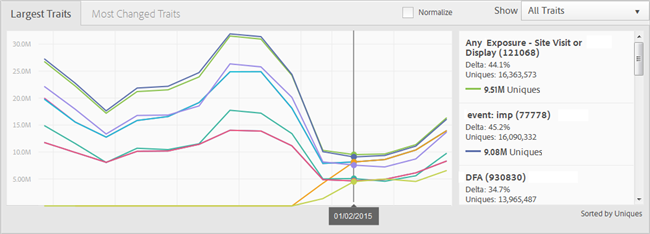

# Dashboard voor rapporten {#reports-dashboard}

Gebruik het dashboard om informatie over uw unieke bezoekerstellingen te bekijken die door trekkentypes en segmenten, voor een gespecificeerd tijdkader worden verdeeld.

<!-- 

c_dashboard.xml

 -->

[!DNL Audience Manager] gebruikt  [!UICONTROL Role Based Access Control] ([!UICONTROL RBAC]) om gebruikersgroepmachtigingen uit te breiden naar de  [!UICONTROL Dashboard]. Gebruikers kunnen alleen informatie op het dashboard zien die ze kunnen bekijken. [!UICONTROL RBAC] Met functionaliteit kunt u bepalen welke rapportgegevens interne teams kunnen weergeven.

Bijvoorbeeld, kan een agentschap dat verschillende adverteerderrekeningen beheert gebruiker-groep toestemmingen vormen zodat een team dat de rekening van Advertiser A beheert niet de rapportgegevens van Advertiser B kan zien. Dit dashboard kan worden gebruikt om problemen met de gegevenslevering op te lossen.

Bijvoorbeeld, als u een dip, of een spiek opmerkt, in totaal unieke gebruikers met de uitsplitsing van type van unieke gebruiker (regel-gebaseerd vs. op-borded), hebt u een beter uitgangspunt om een potentieel gegeven-levering probleem te volgen. Als u een dip in totaal unieke gebruikers en in aan boord genomen unieke gebruikers opmerkt, kunt u naar het [!UICONTROL On-boarding Status] rapport gaan om te zien of was er een kwestie met een binnenkomend dossier.

**Ga als volgt te werk om het dashboard te openen:**

1. Klik in het bovenste navigatiemenu op **[!UICONTROL Dashboard]**.
2. ** Optioneel: selecteer het gewenste tijdkader vanaf de laatste rapportdatum in de vervolgkeuzelijst (7 dagen, 14 dagen (standaardinstelling), 30 dagen of 60 dagen).

   Afhankelijk van de geselecteerde periode geeft de deltawijziging in de deelvensters [!UICONTROL Largest Traits] > [!UICONTROL Most Changed Traits] en [!UICONTROL Largest Segments] > [!UICONTROL Most Changed Segments] de wijziging in unieke bezoekers in de periode die vandaag eindigt ten opzichte van de voorgaande periode van dezelfde lengte weer. Als u bijvoorbeeld 7 dagen selecteert, vergelijkt de delta de unieke bezoekers van de afgelopen zeven dagen die vandaag eindigen met de unieke bezoekers van de zeven dagen die zeven dagen geleden eindigen.

   >[!NOTE]
   >
   >U kunt een deltaverandering onderzoeken die uit het gewone schijnt door een [!UICONTROL Trend] rapport in werking te stellen. Bijvoorbeeld, als u een ongebruikelijk grote deltaverandering tijdens de laatste zeven dagen ziet, kon u een [!UICONTROL Trend] rapport voor de laatste 14 dagen (2 x 7) in werking stellen om de aantallen beter te begrijpen.

   Afhankelijk van de machtigingen van de aangemelde gebruiker worden de volgende deelvensters weergegeven:

   * [Partner Uniques](../reporting/reports-dashboard.md#partner-uniques)
   * [Grootste overtrekken/Meest gewijzigde overgangen](../reporting/reports-dashboard.md#largest-traits)
   * [Grootste segmenten/Meest gewijzigde segmenten](../reporting/reports-dashboard.md#most-changed-segments)

3. ** OptioneelKlik  **[!UICONTROL Normalize]** boven een grafiek om alle gegevens op dezelfde schaal weer te geven. U kunt ook met de muis over elk gegevenspunt klikken om meer informatie weer te geven.

## Partner Uniques {#partner-uniques}

Toestemming vereist om te bekijken: [!UICONTROL View All Traits].

In dit deelvenster wordt het aantal unieke bezoekers tijdens de opgegeven tijdsperiode weergegeven. Afzonderlijke, kleurgecodeerde lijnen geven het totale aantal unieke bezoekers aan en het aantal unieke bezoekers dat wordt vastgelegd met behulp van algoritmische, op regels gebaseerde en ongeregistreerde kenmerken.

>[!NOTE]
>
>Het totale aantal unieke bezoekers vertegenwoordigt bezoekers die zijn vastgelegd via op regels gebaseerde of aan boord genomen kenmerken. Het totale aantal unieke bezoekers is echter niet gelijk aan de som van unieke bezoekers die zijn vastgelegd met de op regels gebaseerde en ongeregistreerde kenmerken. Dezelfde unieke gebruiker kan in een van deze twee typen kenmerken worden vertegenwoordigd.

## Grootste overtrekken/Meest gewijzigde overgangen {#largest-traits}

Toestemming vereist om te bekijken: [!UICONTROL View Traits].

In dit deelvenster wordt het aantal unieke bezoekers weergegeven dat door verschillende kenmerken is vastgelegd.

Gebruik de vervolgkeuzelijst **[!UICONTROL Show]** om informatie weer te geven over verschillende typen kenmerken: [!UICONTROL All Traits], [!UICONTROL Algorithmic], [!UICONTROL Onboarded] of [!UICONTROL Rule-Based].

Dit deelvenster bevat de volgende tabbladen:

<table id="table_DA48BDEB4E0143BEA4EB85AC26FF6AE3"> 
 <thead> 
  <tr> 
   <th colname="col1" class="entry"> Tab </th> 
   <th colname="col2" class="entry"> Beschrijving </th> 
  </tr> 
 </thead>
 <tbody> 
  <tr> 
   <td colname="col1"> 
 Grootste sporen 
 </td> 
   <td colname="col2"> 
Geeft informatie weer over het aantal unieke bezoekers dat op nummer is gesorteerd (hoogste naar laagste) en geeft ook de deltawijziging van unieke bezoekers tijdens het opgegeven tijdkader weer. 
 </td> 
  </tr> 
  <tr> 
   <td colname="col1"> 
 Meest gewijzigde overeenkomsten 
 </td> 
   <td colname="col2"> 
Hier wordt informatie weergegeven over het aantal unieke bezoekers dat is gesorteerd op de deltawijziging. 
 </td> 
  </tr> 
 </tbody> 
</table>

## Grootste segmenten/Meest gewijzigde segmenten {#most-changed-segments}

Toestemming vereist om te bekijken: [!UICONTROL View Segments].

In dit deelvenster wordt het aantal unieke bezoekers weergegeven dat door verschillende segmenten in realtime is vastgelegd.

Dit deelvenster bevat de volgende tabbladen:

<table id="table_8E22E0579FA74C5A86CC40B40B2548BE"> 
 <thead> 
  <tr> 
   <th colname="col1" class="entry"> Tab </th> 
   <th colname="col2" class="entry"> Beschrijving </th> 
  </tr> 
 </thead>
 <tbody> 
  <tr> 
   <td colname="col1"> 
 Grootste segmenten 
 </td> 
   <td colname="col2"> 
Geeft informatie weer over het aantal unieke bezoekers en de deltawijziging van unieke bezoekers tijdens het opgegeven tijdkader. 
 </td> 
  </tr> 
  <tr> 
   <td colname="col1"> 
 Meest gewijzigde segmenten 
 </td> 
   <td colname="col2"> 
Hier wordt informatie weergegeven over het aantal unieke bezoekers dat is gesorteerd op de deltawijziging. 
 </td> 
  </tr> 
 </tbody> 
</table>
